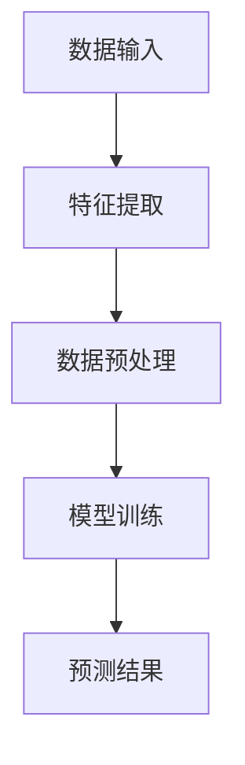
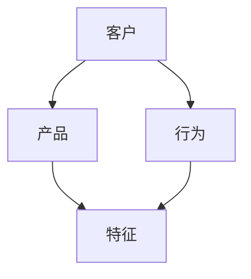
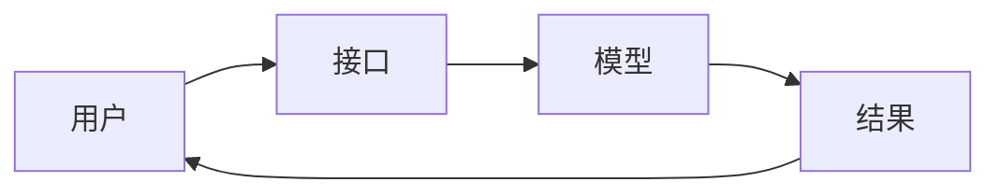

                 


# 智能商业银行存款流失预测

## 关键词：智能预测、商业银行、存款流失、机器学习、风险管理

## 摘要：  
商业银行存款流失预测是智能金融领域的重要课题，通过分析客户行为、市场环境和产品特征，利用机器学习和大数据技术，构建智能预测模型，有效识别潜在流失客户，优化风险管理策略，提升银行的客户留存和业务稳定性。

---

# 第一部分: 智能商业银行存款流失预测背景与概述

## 第1章: 商业银行存款流失问题背景

### 1.1 存款流失问题的背景与重要性  
商业银行的存款业务是其核心资产之一，但近年来客户流失问题日益严重。随着市场竞争加剧和客户需求多样化，银行需要通过智能预测提前识别和应对潜在流失客户。

#### 1.1.1 传统银行存款业务面临的挑战  
- 客户选择性增强，容易被竞争对手吸引。  
- 数据量大，传统分析方法难以捕捉复杂模式。  
- 风险管理滞后，导致客户流失后才采取补救措施。  

#### 1.1.2 存款流失对企业价值的影响  
- 流失的不仅仅是存款，还有客户信任和市场份额。  
- 高流失率可能导致银行收入下降和资本成本增加。  
- 客户流失的不确定性增加银行的经营风险。  

#### 1.1.3 智能预测在银行风险管理中的作用  
- 通过智能预测，银行可以提前采取措施留住客户。  
- 提高风险管理的效率和精度，降低运营成本。  
- 优化资源配置，提升客户满意度和忠诚度。  

### 1.2 智能预测的核心概念与目标  
智能预测通过机器学习和大数据技术，分析客户行为和市场变化，预测存款流失的可能性，从而帮助银行制定有效的风险管理策略。

#### 1.2.1 智能预测的定义  
智能预测是指利用人工智能技术，基于历史数据和实时信息，预测未来可能发生的情况，并提供相应的决策支持。

#### 1.2.2 存款流失预测的目标  
- 识别潜在流失客户。  
- 分析流失原因，制定针对性营销策略。  
- 提高客户留存率，降低流失风险。  

#### 1.2.3 智能预测与传统预测方法的区别  
- 数据来源：智能预测利用大数据和实时信息，传统预测依赖历史数据。  
- 分析方法：智能预测采用机器学习算法，传统预测多为统计分析。  
- 预测精度：智能预测更精准，传统预测误差较大。  

### 1.3 问题解决的边界与外延  
存款流失预测的边界在于预测的范围和精度，而外延则包括预测结果的应用场景和扩展。

#### 1.3.1 存款流失预测的边界  
- 数据范围：仅限于银行内部数据。  
- 预测范围：仅预测流失可能性，不涉及具体解决方案。  

#### 1.3.2 智能预测的外延与应用场景  
- 应用于客户流失预警、精准营销、风险管理等领域。  
- 可扩展至其他业务领域的预测，如贷款违约预测。  

#### 1.3.3 核心要素与组成结构  
- 数据：客户行为、产品特征、市场环境。  
- 算法：机器学习模型、特征工程。  
- 系统：预测模型、决策支持系统。  

### 1.4 本章小结  
本章介绍了商业银行存款流失预测的重要性和智能预测的核心概念，明确了问题解决的边界和外延，为后续分析奠定了基础。

---

## 第2章: 核心概念原理与特征对比  

### 2.1 数据特征分析  
存款流失预测的关键在于分析客户行为、产品特征和市场环境。

#### 2.1.1 客户行为数据特征  
- 操作频率：高、中、低。  
- 交易金额：大额交易频繁可能表明流失风险。  

#### 2.1.2 存款产品特征  
- 产品类型：活期、定期。  
- 利率：高利率产品更吸引客户。  

#### 2.1.3 市场环境特征  
- 经济状况：经济下行可能导致客户流失。  
- 竞争环境：竞争对手的营销活动影响客户留存。  

### 2.2 算法原理  
常用的算法包括逻辑回归、决策树和随机森林。

#### 2.2.1 逻辑回归原理  
逻辑回归通过概率模型预测客户流失的可能性。  

公式：  
$$ P(y=1) = \frac{e^{\beta x}}{1 + e^{\beta x}} $$  

#### 2.2.2 决策树原理  
决策树通过特征分裂构建分类模型。  

流程图：  


#### 2.2.3 随机森林原理  
随机森林通过集成学习提高预测准确性。  

公式：  
$$ y = \sum_{i=1}^{n} \text{Tree}_i(x) $$  

### 2.3 数据特征对比表  
| 特征类型 | 描述 | 示例 |
|----------|------|------|
| 客户特征 | 年龄、收入、职业 | 年龄：25-65岁 |
| 产品特征 | 存款类型、期限、利率 | 存款类型：活期、定期 |
| 行为特征 | 操作频率、交易金额 | 操作频率：高/中/低 |

### 2.4 ER实体关系图  


### 2.5 本章小结  
本章通过对比分析数据特征，解释了智能预测的核心算法原理，并通过图表展示了数据关系，为后续建模提供了基础。

---

## 第3章: 算法原理与流程图  

### 3.1 算法原理  
- 逻辑回归：适用于二分类问题，预测流失概率。  
- 决策树：适合处理复杂特征关系，易于解释。  
- 随机森林：通过集成学习提高模型鲁棒性。  

### 3.2 算法流程图  


### 3.3 代码实现  
以下是一个逻辑回归模型的代码示例：

```python
import pandas as pd
from sklearn.linear_model import LogisticRegression
from sklearn.metrics import accuracy_score

# 加载数据
data = pd.read_csv('deposit.csv')

# 特征工程
X = data.drop('label', axis=1)
y = data['label']

# 模型训练
model = LogisticRegression()
model.fit(X, y)

# 预测结果
y_pred = model.predict(X)
print("准确率:", accuracy_score(y, y_pred))
```

### 3.4 数学公式  
- 逻辑回归损失函数：  
$$ L = -\frac{1}{m} \sum_{i=1}^{m} [y_i \ln(h(x_i)) + (1 - y_i) \ln(1 - h(x_i))] $$  

### 3.5 本章小结  
本章详细讲解了算法原理，并通过代码和公式展示了逻辑回归的实现过程，帮助读者理解智能预测的核心技术。

---

## 第4章: 系统分析与架构设计  

### 4.1 系统功能设计  
- 数据采集：从数据库获取客户行为数据。  
- 数据预处理：清洗和特征工程。  
- 模型训练：构建智能预测模型。  
- 结果展示：可视化预测结果。  

### 4.2 系统架构设计  


### 4.3 系统接口设计  
- API接口：提供预测结果查询。  
- 数据接口：与银行系统对接，获取实时数据。  

### 4.4 系统交互流程图  


### 4.5 本章小结  
本章通过系统架构设计和交互流程图，展示了智能预测系统的整体结构和功能模块。

---

## 第5章: 项目实战  

### 5.1 环境安装  
- 安装Python和必要的库：  
  ```bash
  pip install pandas scikit-learn matplotlib
  ```

### 5.2 数据处理  
- 加载数据并进行预处理：  
  ```python
  import pandas as pd
  data = pd.read_csv('deposit.csv')
  data = data.dropna()
  ```

### 5.3 特征工程  
- 构建特征矩阵：  
  ```python
  X = data[['age', 'income', 'transaction_frequency']]
  ```

### 5.4 模型训练  
- 训练逻辑回归模型：  
  ```python
  from sklearn.linear_model import LogisticRegression
  model = LogisticRegression()
  model.fit(X, y)
  ```

### 5.5 结果分析  
- 可视化预测结果：  
  ```python
  import matplotlib.pyplot as plt
  plt.scatter(X, y, c=model.predict_proba(X)[:, 1])
  plt.colorbar()
  plt.show()
  ```

### 5.6 本章小结  
本章通过实际案例展示了智能预测系统的开发过程，从环境安装到结果分析，帮助读者掌握项目实施的步骤。

---

## 第6章: 总结与展望  

### 6.1 本章总结  
智能商业银行存款流失预测通过机器学习和大数据技术，帮助银行有效识别和应对客户流失问题，提升风险管理能力。

### 6.2 技术局限性  
- 数据隐私问题。  
- 模型解释性不足。  

### 6.3 未来展望  
- 更多应用场景：如贷款违约预测。  
- 新技术融合：如深度学习和强化学习。  

### 6.4 最佳实践 tips  
- 数据预处理是关键。  
- 选择合适的算法，确保模型解释性。  

### 6.5 本章小结  
本章总结了智能预测的重要性和技术局限性，展望了未来的发展方向，并提供了实际应用建议。

---

## 作者：AI天才研究院/AI Genius Institute & 禅与计算机程序设计艺术 /Zen And The Art of Computer Programming

---

感谢您的阅读！希望这篇文章能为您提供智能商业银行存款流失预测的深入见解和实际指导。

