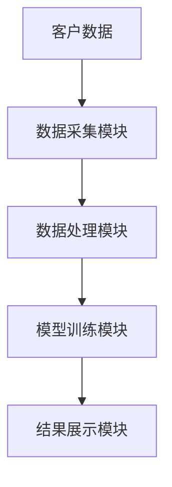

                 


```markdown
# 智能商业银行客户价值分析系统

## 关键词：智能银行、客户价值、数据分析、机器学习、系统架构

## 摘要：智能商业银行客户价值分析系统利用人工智能和大数据技术，通过客户行为分析、交易数据挖掘和预测模型构建，实现客户价值的精准评估和管理优化，帮助银行提升客户满意度和业务绩效。本文详细探讨了系统的核心算法、架构设计和项目实现，为商业银行的智能化转型提供指导。

---

# 第一部分: 系统概述

## 第1章: 系统背景与目标

### 1.1 客户价值分析的基本概念

客户价值分析是通过对客户的行为、交易数据和特征进行分析，评估客户对银行的贡献和潜在价值。商业银行通过客户价值分析，可以制定精准的营销策略，优化资源配置，提升客户满意度和忠诚度。

### 1.2 商业银行的业务场景

商业银行面临客户群体多样化、市场竞争激烈和客户需求变化快的挑战。传统的客户管理方式难以应对复杂多变的市场环境，因此需要借助智能技术提升客户价值分析的效率和精准度。

### 1.3 系统目标与意义

系统目标：构建智能化的客户价值分析平台，实现客户分层、价值预测和个性化服务推荐。

系统意义：提升客户满意度、优化资源配置、提高银行整体绩效。

---

# 第二部分: 核心算法与数据处理

## 第2章: 客户价值分析的核心算法

### 2.1 聚类分析

聚类分析用于将客户分成不同的群组，便于后续分析和管理。

- **K-means算法**：通过距离计算将客户分组。
- **层次聚类**：逐步合并客户群体，形成层次结构。

### 2.2 分类算法

分类算法用于预测客户的行为和价值。

- **支持向量机（SVM）**：适用于高维数据分类。
- **随机森林**：基于决策树的集成算法，适合特征较多的情况。
- **神经网络**：用于复杂的模式识别。

### 2.3 回归分析

回归分析用于预测客户的价值。

- **线性回归**：简单模型，适用于线性关系。
- **逻辑回归**：适用于二分类问题。

### 2.4 算法比较与选择

根据数据特征和业务需求选择合适的算法，可能需要进行多次实验和优化。

---

# 第三部分: 系统架构与设计

## 第3章: 系统架构设计

### 3.1 功能模块划分

- 数据采集模块：收集客户交易数据和行为数据。
- 数据处理模块：清洗、转换和预处理数据。
- 模型训练模块：训练和优化客户价值预测模型。
- 结果展示模块：可视化分析结果。

### 3.2 系统架构图



### 3.3 数据流设计

- 数据从数据库中提取，经过处理后输入模型，模型输出结果到前端展示。

---

# 第四部分: 项目实战

## 第4章: 项目实战

### 4.1 环境配置

安装必要的库，如Python的scikit-learn和pandas。

### 4.2 数据采集与处理

使用SQL提取数据，清洗数据并进行特征工程。

### 4.3 模型训练与部署

训练聚类模型，部署到生产环境。

### 4.4 系统监控

实时监控模型性能，及时调整和优化。

---

# 第五部分: 总结与展望

## 第5章: 总结与展望

### 5.1 项目总结

系统成功实现了客户价值分析，提升了银行的客户管理能力。

### 5.2 未来展望

未来可以引入更先进的算法，如深度学习，进一步提升分析的精准度。

---

作者：AI天才研究院/AI Genius Institute & 禅与计算机程序设计艺术 /Zen And The Art of Computer Programming
```

