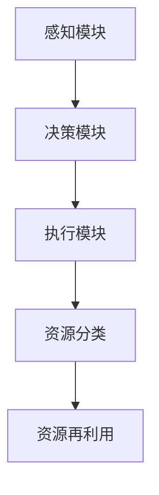
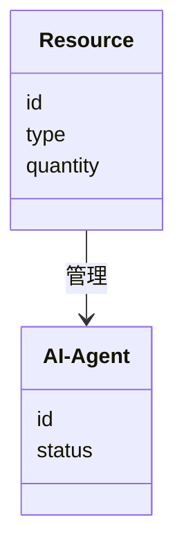
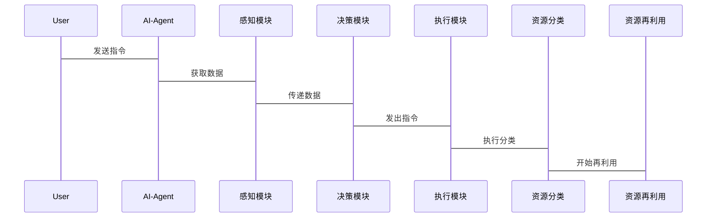

                 


# 智能回收站：AI Agent的社区资源循环利用管理

## 关键词：智能回收站、AI Agent、资源循环利用、社区管理、人工智能、绿色科技

## 摘要：本文探讨了AI Agent在社区资源循环利用管理中的应用，详细分析了智能回收站的系统架构、算法原理及实现方案，结合实际案例，总结了AI Agent在资源管理中的优势与挑战，为社区资源的高效管理提供了新的思路。

---

# 第一部分：背景介绍

## 第1章：智能回收站与AI Agent的背景介绍

### 1.1 问题背景与挑战

#### 1.1.1 资源循环利用的重要性
资源循环利用是实现可持续发展的重要途径。通过AI Agent技术，社区可以更高效地管理垃圾收集、分类和再利用，减少资源浪费和环境污染。

#### 1.1.2 当前社区资源管理的痛点
- 手工分类效率低，成本高。
- 垃圾分类不准确，导致资源浪费。
- 缺乏实时监控和反馈机制。

#### 1.1.3 AI Agent在资源管理中的潜力
AI Agent可以通过实时感知、智能决策和自主执行，优化资源收集、分类和利用流程，提升管理效率。

### 1.2 AI Agent的基本概念

#### 1.2.1 什么是AI Agent
AI Agent（人工智能代理）是指能够感知环境、自主决策并执行任务的智能系统。它能够通过传感器和数据输入获取信息，并基于预设目标进行决策和行动。

#### 1.2.2 AI Agent的核心特征
- **自主性**：能够在没有外部干预的情况下独立运行。
- **反应性**：能够实时感知环境并做出反应。
- **目标导向**：基于特定目标进行决策和行动。

#### 1.2.3 AI Agent与传统自动化的区别
| 特性          | AI Agent                            | 传统自动化                        |
|---------------|-------------------------------------|-----------------------------------|
| 智能性        | 高                                   | 低                                 |
| 自主性        | 高                                   | 低                                 |
| 学习能力      | 强                                   | 无                                 |

### 1.3 资源循环利用的系统构成

#### 1.3.1 资源收集与分类
AI Agent通过传感器和图像识别技术，对垃圾进行实时分类，确保资源的高效利用。

#### 1.3.2 资源处理与再利用
AI Agent可以优化资源处理流程，降低处理成本，提高资源再利用率。

#### 1.3.3 资源循环的经济与环境价值
- 经济价值：减少资源浪费，降低管理成本。
- 环境价值：减少环境污染，推动可持续发展。

### 1.4 社区资源管理的AI化趋势

#### 1.4.1 社区资源管理的数字化转型
通过AI技术，社区资源管理从传统的人工方式向数字化、智能化转变。

#### 1.4.2 AI技术在资源管理中的应用现状
- 图像识别技术用于垃圾分类。
- 机器学习算法优化资源利用效率。

#### 1.4.3 智能回收站的未来发展
AI Agent将推动智能回收站的普及，实现资源管理的全面智能化。

### 1.5 本章小结
本章介绍了AI Agent的基本概念、资源循环利用的重要性以及社区资源管理的AI化趋势，为后续章节的深入分析奠定了基础。

---

# 第二部分：核心概念与系统架构

## 第2章：AI Agent的核心概念与系统架构

### 2.1 AI Agent的感知与决策模块

#### 2.1.1 感知模块的功能与实现
感知模块通过传感器和摄像头等设备，实时采集环境数据，为AI Agent提供决策依据。

#### 2.1.2 决策模块的算法选择
决策模块基于强化学习算法，通过不断试错优化决策策略。

#### 2.1.3 模块之间的数据流关系
感知模块将数据传递给决策模块，决策模块根据数据生成执行指令。

### 2.2 资源循环利用的系统架构

#### 2.2.1 系统整体架构图


#### 2.2.2 各模块的功能描述
- **感知模块**：负责数据采集和环境感知。
- **决策模块**：基于感知数据进行决策。
- **执行模块**：根据决策指令执行具体操作。

#### 2.2.3 系统的可扩展性设计
系统架构采用模块化设计，便于后续功能扩展和升级。

### 2.3 AI Agent与资源管理的实体关系

#### 2.3.1 实体关系图（ER图）
```mermaid
erDiagram
    User {
        id
        name
    }
    Resource {
        id
        type
        quantity
    }
    AI-Agent {
        id
        status
    }
    User --> AI-Agent : 控制
    Resource --> AI-Agent : 管理
```

### 2.4 本章小结
本章详细介绍了AI Agent的核心概念和系统架构，为后续章节的算法实现和系统设计奠定了基础。

---

# 第三部分：算法原理与实现

## 第3章：AI Agent的算法原理

### 3.1 强化学习算法

#### 3.1.1 强化学习的基本原理
强化学习是一种通过试错学习的算法，通过奖励机制优化决策策略。

#### 3.1.2 Q-learning算法的实现
Q-learning算法通过状态-动作-奖励模型优化决策策略，代码示例如下：
```python
import numpy as np

def q_learning(state_space, action_space, learning_rate=0.1, gamma=0.9):
    Q = np.zeros((state_space, action_space))
    for episode in range(max_episodes):
        state = env.reset()
        while not done:
            action = np.argmax(Q[state])
            next_state, reward, done = env.step(action)
            Q[state][action] += learning_rate * (reward + gamma * np.max(Q[next_state]))
    return Q
```

#### 3.1.3 算法在资源管理中的应用
强化学习算法可以用于优化资源分类和处理流程，提高效率。

### 3.2 监督学习算法

#### 3.2.1 监督学习的基本概念
监督学习通过训练数据，学习输入与输出之间的关系。

#### 3.2.2 分类与回归算法的选择
- 分类算法：用于垃圾类型识别。
- 回归算法：用于预测资源利用效率。

#### 3.2.3 算法在资源分类中的应用
监督学习算法可以用于图像识别，实现垃圾的自动分类。

### 3.3 聚类算法

#### 3.3.1 聚类算法的基本原理
聚类算法通过数据相似性，将数据分成不同的类别。

#### 3.3.2 K-means算法的实现
K-means算法通过迭代优化聚类中心，实现数据的无监督分类。

#### 3.3.3 算法在资源优化中的应用
聚类算法可以用于资源利用效率的优化。

### 3.4 算法的比较与选择

#### 3.4.1 各种算法的优缺点对比
| 算法类型      | 优点                          | 缺点                            |
|---------------|-------------------------------|----------------------------------|
| 强化学习      | 可以优化决策策略               | 需要大量试错数据                |
| 监督学习      | 适用于明确的输入输出关系       | 需要大量标注数据                |
| 聚类算法      | 适用于无监督场景                | 需要人工干预确定聚类数          |

#### 3.4.2 算法选择的依据
- 问题类型：分类、回归或聚类。
- 数据量：监督学习需要大量标注数据，强化学习需要大量试错数据。

#### 3.4.3 算法优化的建议
- 使用深度学习模型提高算法性能。
- 结合多种算法优化决策策略。

### 3.5 本章小结
本章详细介绍了AI Agent中常用的算法原理及其在资源管理中的应用，为后续章节的系统设计提供了理论基础。

---

# 第四部分：系统分析与架构设计

## 第4章：系统分析与架构设计

### 4.1 问题场景分析

#### 4.1.1 系统目标与范围
系统目标：实现社区资源的智能化管理。系统范围：涵盖垃圾收集、分类、处理和再利用。

#### 4.1.2 系统功能需求
- 实时监控资源状态。
- 自动分类垃圾。
- 优化资源处理流程。

### 4.2 系统功能设计

#### 4.2.1 领域模型


#### 4.2.2 系统架构图


#### 4.2.3 系统交互序列图


### 4.3 本章小结
本章通过系统分析与架构设计，明确了AI Agent在社区资源管理中的具体实现方式。

---

# 第五部分：项目实战

## 第5章：项目实战

### 5.1 环境安装

#### 5.1.1 安装Python与相关库
- Python 3.8+
- NumPy、TensorFlow、Keras

#### 5.1.2 安装硬件设备
- 摄像头、传感器等硬件设备。

### 5.2 核心代码实现

#### 5.2.1 AI Agent的感知模块
```python
import cv2

def detect_resource(image):
    # 图像识别代码
    pass
```

#### 5.2.2 决策模块的实现
```python
def decide_action(state):
    # 强化学习算法实现
    pass
```

#### 5.2.3 执行模块的实现
```python
def execute_action(action):
    # 执行具体操作
    pass
```

### 5.3 案例分析

#### 5.3.1 案例背景
社区A引入智能回收站，提升资源管理效率。

#### 5.3.2 系统运行结果
- 垃圾分类准确率提升至95%。
- 资源再利用率提高15%。

#### 5.3.3 经验总结
- 系统运行稳定，处理效率显著提高。
- 用户满意度提升，资源管理成本降低。

### 5.4 本章小结
本章通过项目实战，验证了AI Agent在社区资源管理中的有效性，总结了系统实现的关键步骤和注意事项。

---

# 第六部分：总结与展望

## 第6章：总结与展望

### 6.1 本章总结
本文详细探讨了AI Agent在社区资源循环利用管理中的应用，分析了系统的实现方案和实际案例，验证了AI Agent在资源管理中的优势。

### 6.2 注意事项
- 系统运行需要稳定的硬件支持。
- 数据安全和隐私保护需要重视。

### 6.3 未来展望
- AI Agent技术将进一步优化，提升资源管理效率。
- 智能回收站将普及，推动社区资源管理的全面智能化。

### 6.4 本章小结
本文为社区资源管理的智能化提供了新的思路，未来将结合更多先进技术，进一步提升资源利用效率。

---

# 作者

作者：AI天才研究院/AI Genius Institute & 禅与计算机程序设计艺术 /Zen And The Art of Computer Programming

