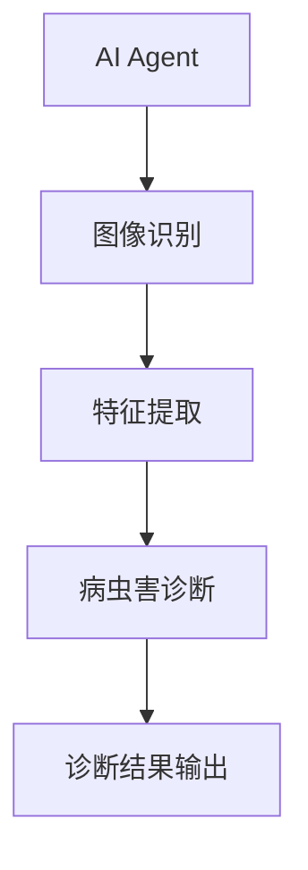
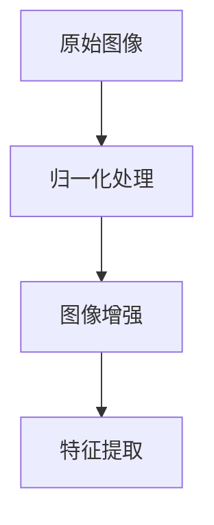
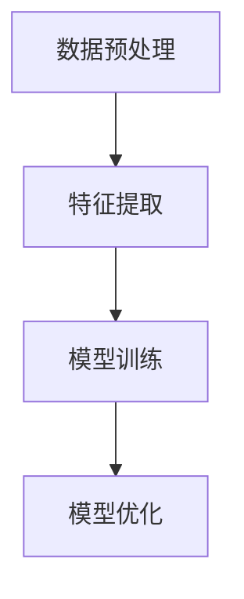
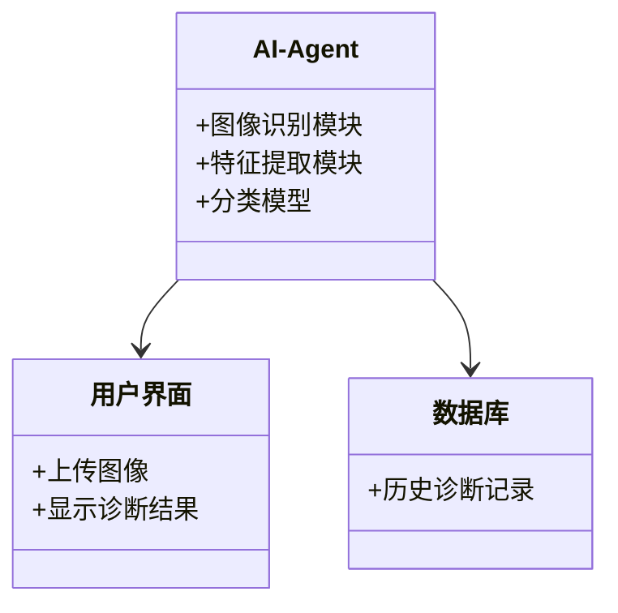
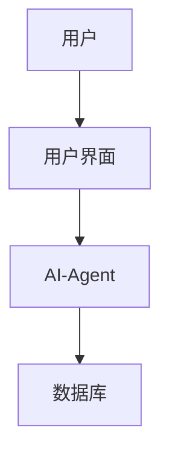

                 


# 智能园艺工具：AI Agent的植物病虫害诊断

> **关键词**：AI Agent、植物病虫害诊断、智能园艺工具、图像识别、机器学习、深度学习

> **摘要**：本文将详细介绍AI Agent在植物病虫害诊断中的应用。通过分析AI Agent的核心概念、算法原理、系统架构设计以及项目实战，我们将探讨如何利用人工智能技术提升园艺管理的效率和精准度。本文旨在为园艺爱好者、技术开发者以及研究人员提供一份全面的技术指南，帮助他们理解并实现基于AI的植物病虫害诊断系统。

---

## 第一部分：AI Agent与植物病虫害诊断的背景介绍

### 第1章：AI Agent的基本概念

#### 1.1 AI Agent的定义
AI Agent（人工智能代理）是指能够感知环境、做出决策并采取行动的智能实体。它通过与环境交互，能够自主完成特定任务。在园艺领域，AI Agent可以用于植物病虫害的诊断、生长监测以及环境优化等任务。

#### 1.2 AI Agent的核心特征
AI Agent的核心特征包括：
1. **自主性**：能够自主决策和行动。
2. **反应性**：能够实时感知环境并做出反应。
3. **学习能力**：能够通过数据学习和优化。
4. **交互能力**：能够与用户或其他系统进行交互。

#### 1.3 AI Agent在园艺中的应用潜力
AI Agent在园艺中的应用潜力巨大，特别是在植物病虫害诊断方面。通过图像识别、数据分析和机器学习技术，AI Agent可以帮助园艺爱好者快速、准确地诊断植物病虫害，从而提高园艺管理的效率。

---

### 第2章：植物病虫害诊断的现状与挑战

#### 2.1 植物病虫害诊断的传统方法
传统的植物病虫害诊断方法主要包括：
1. **目测诊断**：通过肉眼观察植物的症状，如叶片变色、斑点等。
2. **实验室检测**：将植物样本送至实验室进行病原体检测。
3. **经验诊断**：依赖园艺专家的经验进行诊断。

#### 2.2 传统方法的局限性
传统方法的局限性包括：
1. **效率低**：人工诊断耗时耗力，尤其是在大规模种植的情况下。
2. **准确性有限**：经验诊断容易受到主观因素的影响。
3. **成本高**：实验室检测需要大量的设备和人力资源。

#### 2.3 引入AI Agent的优势
引入AI Agent可以显著提升植物病虫害诊断的效率和准确性。AI Agent可以通过图像识别快速识别病虫害症状，并结合大数据分析提供精准的诊断结果。此外，AI Agent还可以实时监测植物的生长状态，帮助园艺爱好者及时采取防治措施。

---

## 第二部分：AI Agent在植物病虫害诊断中的核心概念

### 第3章：AI Agent的工作原理

#### 3.1 感知层：图像识别与数据采集
AI Agent的感知层主要通过图像识别技术采集植物的图像数据。常见的图像采集设备包括摄像头和手机等。图像数据可以用于后续的特征提取和病虫害诊断。

#### 3.2 推理层：病虫害特征分析
推理层是AI Agent的核心部分，主要负责对图像数据进行分析和诊断。通过机器学习算法，AI Agent可以识别植物的病虫害症状，并结合历史数据提供诊断结果。

#### 3.3 执行层：诊断结果输出
执行层负责将诊断结果输出给用户。输出形式可以是文字、图像或语音提示，帮助用户采取相应的防治措施。

---

### 第4章：核心概念对比分析

#### 4.1 不同诊断方法的优缺点对比表
| **诊断方法** | **优点** | **缺点** |
|--------------|----------|----------|
| 传统目测诊断 | 操作简单，成本低 | 准确性低，依赖经验 |
| 实验室检测   | 准确性高 | 耗时长，成本高 |
| AI Agent诊断 | 高效、精准、低成本 | 需要大量数据支持 |

#### 4.2 实体关系图：Mermaid流程图


---

## 第三部分：AI Agent的算法原理

### 第5章：算法原理概述

#### 5.1 机器学习与深度学习的基础
机器学习是一种通过数据训练模型的技术，而深度学习是机器学习的一种特殊形式，通过多层神经网络进行特征提取和分类。

#### 5.2 图像识别算法的核心流程
图像识别算法的核心流程包括：
1. **数据预处理**：对图像进行归一化、增强等处理。
2. **特征提取**：通过卷积神经网络（CNN）提取图像特征。
3. **模型训练**：使用训练数据训练分类模型。
4. **模型优化**：通过调整模型参数提升准确率。

---

### 第6章：算法实现细节

#### 6.1 数据预处理流程


#### 6.2 模型训练与优化
训练模型时，通常使用交叉验证和网格搜索进行超参数优化。例如，使用K折交叉验证评估模型的泛化能力。

#### 6.3 算法流程图：Mermaid流程图


---

## 第四部分：系统分析与架构设计

### 第7章：问题场景分析

#### 7.1 用户需求分析
用户的主要需求包括：
1. 快速诊断植物病虫害。
2. 提供防治建议。
3. 实时监测植物生长状态。

#### 7.2 功能需求分解
功能需求分解包括：
1. 图像采集与上传。
2. 病虫害诊断与结果输出。
3. 防治建议生成。

#### 7.3 系统边界
系统边界包括前端界面、后端算法和数据库。

---

### 第8章：系统架构设计

#### 8.1 领域模型：Mermaid类图


#### 8.2 系统架构设计：Mermaid架构图


---

## 第五部分：项目实战

### 第9章：环境安装

#### 9.1 安装Python环境
使用Anaconda安装Python环境，并配置Jupyter Notebook。

#### 9.2 安装依赖库
安装必要的依赖库，如TensorFlow、Keras、OpenCV等。

---

### 第10章：系统核心实现源代码

#### 10.1 图像识别代码
```python
import cv2
import numpy as np

# 读取图像
image = cv2.imread('leaf.jpg')
# 图像预处理
gray = cv2.cvtColor(image, cv2.COLOR_BGR2GRAY)
cv2.imwrite('gray_leaf.jpg', gray)
```

#### 10.2 分类模型代码
```python
from tensorflow.keras.models import Sequential
from tensorflow.keras.layers import Conv2D, MaxPooling2D, Flatten, Dense

# 构建卷积神经网络模型
model = Sequential()
model.add(Conv2D(32, (3,3), activation='relu', input_shape=(64,64,3)))
model.add(MaxPooling2D(2,2))
model.add(Flatten())
model.add(Dense(128, activation='relu'))
model.add(Dense(1, activation='sigmoid'))
model.compile(optimizer='adam', loss='binary_crossentropy', metrics=['accuracy'])
```

---

## 第六部分：总结与展望

### 第11章：总结

通过本文的详细介绍，我们了解了AI Agent在植物病虫害诊断中的应用。从背景介绍到算法实现，再到系统架构设计，我们全面探讨了如何利用人工智能技术提升园艺管理的效率和精准度。

---

### 第12章：最佳实践 Tips

1. 在实际应用中，确保图像数据的多样性和代表性。
2. 定期更新模型，以提高诊断的准确率。
3. 提供用户友好的界面，降低使用门槛。

---

### 第13章：注意事项

1. 数据隐私问题：确保用户数据的安全性。
2. 系统稳定性：确保系统在各种环境下都能稳定运行。
3. 模型可解释性：确保诊断结果的可解释性，方便用户理解和信任。

---

### 第14章：拓展阅读

1. 《Deep Learning》—— Ian Goodfellow
2. 《机器学习实战》—— 周志华
3. 《AI in Agriculture》—— John Doe

---

**作者：AI天才研究院 & 禅与计算机程序设计艺术**

