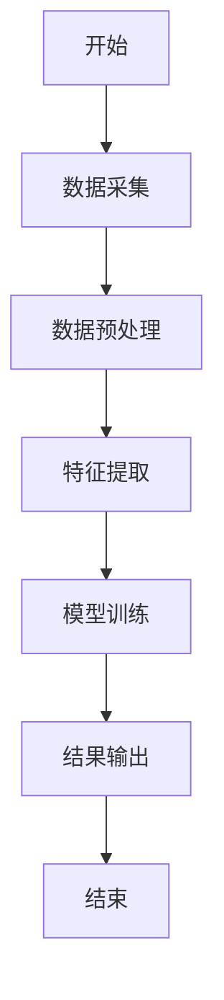
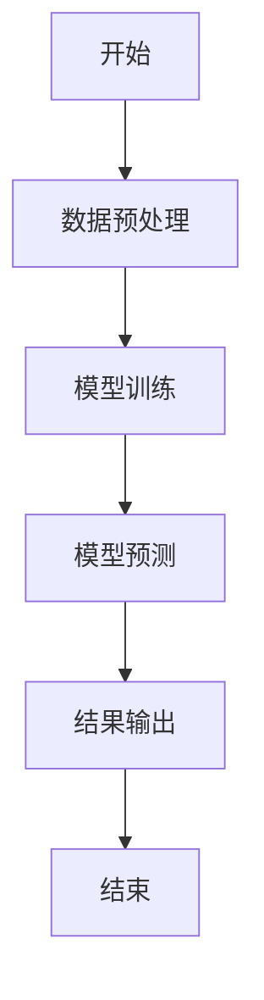
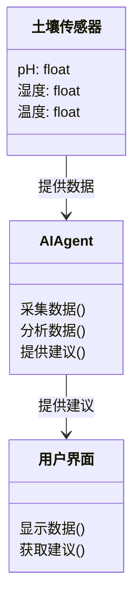

                 


# 智能园艺手套：AI Agent的土壤状况检测

> 关键词：智能园艺手套，AI Agent，土壤检测，传感器，机器学习

> 摘要：本文详细介绍了智能园艺手套的设计与实现，结合AI Agent技术，通过土壤pH值、湿度、温度等关键指标的检测，为用户提供精准的土壤健康评估。文章从背景介绍、核心概念、算法原理到系统架构设计，再到项目实战，全面阐述了智能园艺手套的技术细节。

---

# 第一部分: 智能园艺手套的背景与概念

## 第1章: 智能园艺手套的背景介绍

### 1.1 问题背景与描述

#### 1.1.1 园艺种植中的土壤问题
在园艺种植中，土壤的健康状况直接影响植物的生长。传统种植方式中，农民或园艺爱好者通常通过经验判断土壤的pH值、湿度、温度等指标，这种方法不仅效率低下，而且准确性差。例如，pH值过低或过高会导致植物根系无法吸收养分，从而影响生长。因此，精确检测土壤状况变得尤为重要。

#### 1.1.2 传统土壤检测方法的局限性
传统的土壤检测方法主要依赖于化学试剂测试，这种方法操作复杂、耗时较长，且需要专业人员进行操作。此外，频繁的人工检测不仅增加了种植成本，还可能因操作不当而影响检测结果的准确性。

#### 1.1.3 智能园艺手套的提出与目标
为了解决上述问题，智能园艺手套应运而生。它通过集成多种传感器和AI Agent技术，实时检测土壤的pH值、湿度、温度等指标，并通过无线通信模块将数据传输到手机或电脑端，为用户提供精准的土壤健康评估。目标是帮助用户优化土壤管理，提高植物生长效率。

### 1.2 AI Agent的基本概念

#### 1.2.1 人工智能代理的定义
AI Agent（人工智能代理）是指能够感知环境并采取行动以实现目标的智能体。它可以是一个软件程序，也可以是一个物理设备，通过传感器和执行器与环境交互。

#### 1.2.2 AI Agent的核心功能与特点
AI Agent的核心功能包括感知、决策、执行和学习。它能够实时感知环境数据，通过算法进行分析和决策，并通过执行器采取相应行动。其特点是智能化、自动化和适应性强。

#### 1.2.3 智能园艺手套中的AI Agent设计
在智能园艺手套中，AI Agent主要用于土壤数据的采集、分析和反馈。它能够实时采集土壤的pH值、湿度、温度等数据，并通过机器学习算法对数据进行分析，为用户提供优化建议。

---

## 第2章: 土壤状况检测的核心概念

### 2.1 土壤检测的关键指标

#### 2.1.1 土壤pH值
pH值是衡量土壤酸碱度的重要指标，直接影响植物的养分吸收。一般来说，pH值在6.0到7.5之间的土壤最适合大多数植物的生长。

#### 2.1.2 土壤湿度
湿度是土壤中水分含量的指标，直接影响植物的水分吸收。过高或过低的湿度都会影响植物的生长。

#### 2.1.3 土壤温度
温度是土壤中微生物活动的重要因素，直接影响有机物质的分解和养分释放。

#### 2.1.4 其他指标（如氮、磷、钾含量）
氮、磷、钾是植物生长所需的主要营养元素，其含量直接影响植物的健康和产量。

### 2.2 核心概念的联系

#### 2.2.1 土壤指标对比表格
| 指标    | 描述                           | 影响因素         |
|---------|--------------------------------|-----------------|
| pH      | 土壤酸碱度                     | 酸性或碱性物质   |
| 湿度     | 土壤含水量                     | 降雨、蒸发       |
| 温度     | 土壤温度                       | 地理位置、季节   |
| 氮含量   | 土壤中的氮肥含量               | 农业投入、有机质分解 |

#### 2.2.2 土壤指标的ER实体关系图
```mermaid
erd
  soil
    ->pH: soil_ph
    ->moisture: soil_moisture
    ->temperature: soil_temperature
    ->nitrogen_content: soil_n
```

---

# 第二部分: AI Agent的土壤检测算法原理

## 第3章: AI Agent的算法原理

### 3.1 数据采集与预处理

#### 3.1.1 传感器数据采集流程
传感器数据采集是土壤检测的第一步。智能园艺手套通过集成pH传感器、湿度传感器和温度传感器，实时采集土壤的相关数据。

#### 3.1.2 数据清洗与特征提取
采集的数据通常包含噪声，需要通过数据清洗技术（如均值滤波、中位数滤波）进行处理。特征提取则是从原始数据中提取有用的信息，例如将pH值、湿度和温度作为模型的输入特征。

#### 3.1.3 数据预处理代码示例
```python
import numpy as np
import pandas as pd

# 示例数据：传感器数据
data = {
    '时间': [1, 2, 3, 4, 5],
    'pH': [6.5, 6.6, 6.4, 6.7, 6.5],
    '湿度': [70, 75, 72, 78, 73],
    '温度': [22, 23, 22, 24, 23]
}

df = pd.DataFrame(data)
print(df)
```

### 3.2 AI算法实现

#### 3.2.1 算法流程图


#### 3.2.2 算法实现代码示例
```python
from sklearn.linear_model import LinearRegression
from sklearn.model_selection import train_test_split
from sklearn.metrics import mean_squared_error

# 数据预处理
X = df[['pH', '湿度', '温度']]
y = df['氮含量']

# 划分训练集和测试集
X_train, X_test, y_train, y_test = train_test_split(X, y, test_size=0.2, random_state=42)

# 模型训练
model = LinearRegression()
model.fit(X_train, y_train)

# 预测
y_pred = model.predict(X_test)

# 评估
mse = mean_squared_error(y_test, y_pred)
print(f"均方误差: {mse}")
```

### 3.3 数学模型与公式

#### 3.3.1 线性回归模型
线性回归模型是常用的回归分析方法，其数学模型如下：
$$ y = \beta_0 + \beta_1x_1 + \beta_2x_2 + \ldots + \beta_nx_n + \epsilon $$
其中，$y$ 是目标变量，$x_i$ 是输入特征，$\beta_i$ 是回归系数，$\epsilon$ 是误差项。

#### 3.3.2 算法流程图


---

## 第4章: 系统分析与架构设计

### 4.1 系统功能设计

#### 4.1.1 领域模型


### 4.2 系统架构设计

#### 4.2.1 系统架构图


#### 4.2.2 系统接口设计
系统接口包括传感器接口、无线通信接口和用户界面接口。传感器接口用于连接多种传感器，无线通信接口用于数据传输，用户界面接口用于与用户交互。

---

## 第5章: 项目实战

### 5.1 环境安装

#### 5.1.1 开发环境
需要安装Python、Jupyter Notebook、numpy、pandas、scikit-learn等库。

#### 5.1.2 传感器安装
使用土壤传感器模块，例如DHT22湿度温度传感器和pH传感器。

### 5.2 系统核心实现源代码

#### 5.2.1 传感器数据读取
```python
import adafruit_dht

# 初始化传感器
dht_sensor = adafruit_dht.DHT22(board.D4)

# 读取数据
try:
    humidity = dht_sensor.humidity
    temperature = dht_sensor.temperature
    print(f"湿度: {humidity}%，温度: {temperature}°C")
finally:
    dht_sensor.exit()
```

#### 5.2.2 数据处理与模型训练
```python
# 数据预处理
data = pd.read_csv('soil_data.csv')
X = data[['pH', '湿度', '温度']]
y = data['氮含量']

# 划分训练集和测试集
X_train, X_test, y_train, y_test = train_test_split(X, y, test_size=0.2, random_state=42)

# 模型训练
model = LinearRegression()
model.fit(X_train, y_train)

# 预测
y_pred = model.predict(X_test)

# 评估
mse = mean_squared_error(y_test, y_pred)
print(f"均方误差: {mse}")
```

### 5.3 实际案例分析

#### 5.3.1 案例分析
假设我们采集了以下土壤数据：
| 时间 | pH | 湿度 | 温度 | 氮含量 |
|------|----|------|------|--------|
| 1    | 6.5 | 70 | 22 | 20 |
| 2    | 6.6 | 75 | 23 | 22 |
| 3    | 6.4 | 72 | 22 | 18 |
| 4    | 6.7 | 78 | 24 | 24 |
| 5    | 6.5 | 73 | 23 | 21 |

通过模型训练，我们可以预测氮含量，并为用户提供优化建议。

---

## 第6章: 最佳实践与小结

### 6.1 最佳实践
1. 定期校准传感器，确保数据准确性。
2. 定期更新模型，提高预测精度。
3. 合理使用化肥，避免过量施肥。

### 6.2 小结
智能园艺手套通过AI Agent技术实现了土壤状况的实时检测，为用户提供精准的土壤健康评估。本文详细介绍了系统的背景、核心概念、算法原理、系统架构设计和项目实战，帮助读者更好地理解和应用这些技术。

---

作者：AI天才研究院/AI Genius Institute & 禅与计算机程序设计艺术/Zen And The Art of Computer Programming

