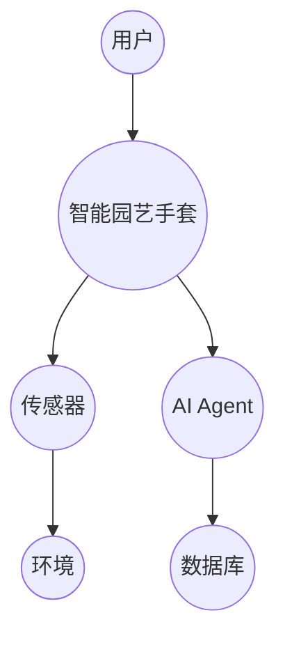
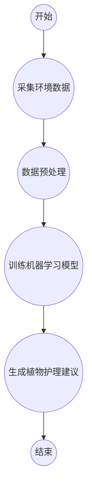
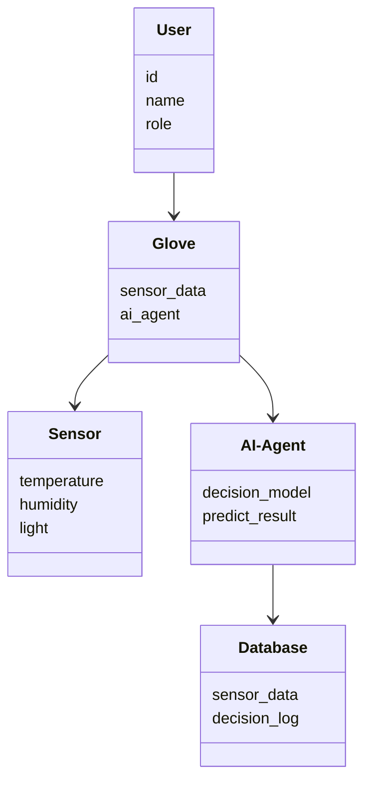
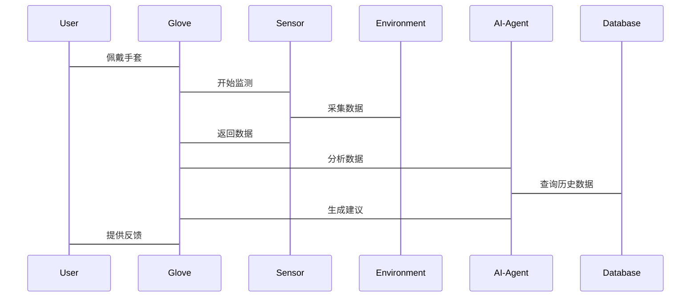

                 


# 智能园艺手套：AI Agent的植物护理指导

> 关键词：智能园艺手套，AI Agent，植物护理，传感器技术，机器学习，物联网

> 摘要：本文详细探讨了智能园艺手套的设计与实现，通过AI Agent技术实现植物护理的智能化。文章从背景介绍、核心概念、算法原理、系统架构到项目实战，全面解析了智能园艺手套的开发过程。

---

# 第1章: 智能园艺手套概述

## 1.1 问题背景与描述

### 1.1.1 园艺护理中的常见问题
现代园艺护理面临诸多挑战，包括：
- **环境监测困难**：植物生长受温度、湿度、光照等多种因素影响，传统方法难以实时监测。
- **人工成本高**：需要频繁检查植物状态，耗费大量时间和人力资源。
- **决策依据不足**：缺乏科学的数据支持，难以精准判断植物需求。

### 1.1.2 智能园艺手套的提出与目标
智能园艺手套通过集成传感器和AI Agent技术，实时监测植物生长环境，提供个性化护理建议，降低人工成本，提高植物生长效率。

### 1.1.3 智能园艺手套的功能定位
智能园艺手套具备以下核心功能：
- 实时监测植物环境数据（温度、湿度、光照等）。
- 分析数据，生成植物护理建议。
- 提供交互式反馈，指导用户进行精准操作。

---

## 1.2 问题解决与技术实现

### 1.2.1 AI Agent的基本原理
AI Agent（智能体）通过感知环境、分析数据并采取行动，帮助用户完成特定任务。在智能园艺手套中，AI Agent负责数据处理和决策生成。

### 1.2.2 核心概念与结构
智能园艺手套的核心要素包括：
- **传感器模块**：采集环境数据。
- **数据处理模块**：分析传感器数据，生成护理建议。
- **交互界面**：用户与系统交互的界面。

---

# 第2章: AI Agent的核心概念与原理

## 2.1 AI Agent的基本原理

### 2.1.1 AI Agent的定义与分类
AI Agent是一种能够感知环境并采取行动以实现目标的智能系统。根据应用场景的不同，AI Agent可分为：
- **简单反射型**：基于预设规则响应输入。
- **基于模型的反应型**：利用环境模型进行决策。
- **目标驱动型**：以目标为导向采取行动。

### 2.1.2 智能园艺手套中的AI Agent设计
在智能园艺手套中，AI Agent主要负责：
- 数据采集与预处理。
- 数据分析与决策生成。
- 用户交互与反馈。

---

## 2.2 AI Agent与传统传感器的区别

### 2.2.1 传统传感器的工作原理
传统传感器仅能采集环境数据，无法进行分析和决策。

### 2.2.2 AI Agent的智能决策机制
AI Agent能够结合历史数据和环境变化，预测植物需求，提供个性化建议。

### 2.2.3 两者在功能与性能上的对比

| 对比维度       | 传统传感器                | AI Agent                 |
|----------------|--------------------------|--------------------------|
| 功能           | 数据采集                 | 数据采集 + 智能决策      |
| 性能           | 无智能性                 | 具备智能性                |
| 适用场景       | 单一环境监测             | 多场景、复杂环境          |

---

## 2.3 AI Agent的实体关系与系统架构

### 2.3.1 实体关系图（ER图）
以下是智能园艺手套的ER图：

```mermaid
erDiagram
    user} +---{glove
    glove} +---{sensor
    sensor} +---{environment
    glove} +---{AI-Agent
    AI-Agent} +---{database
```

### 2.3.2 系统架构图
以下是系统架构图：



---

# 第3章: AI Agent的算法原理与流程

## 3.1 数据采集与处理

### 3.1.1 传感器数据的采集
传感器负责采集植物生长环境中的关键数据，如温度、湿度、光照强度等。

### 3.1.2 数据预处理与特征提取
数据预处理包括去噪、归一化等步骤，特征提取则从数据中提取有用的信息。

### 3.1.3 数据分析与可视化
通过数据分析工具（如Python的Matplotlib库）对数据进行可视化，便于观察植物生长趋势。

---

## 3.2 AI Agent的决策算法

### 3.2.1 机器学习模型的选择
常用模型包括决策树、随机森林和神经网络等。根据具体需求选择最优模型。

### 3.2.2 算法流程图
以下是决策算法流程图：



### 3.2.3 算法实现代码
以下是Python代码示例：

```python
import numpy as np
from sklearn.tree import DecisionTreeClassifier

# 示例数据
X = np.array([[25, 60], [28, 55], [22, 70], [24, 65]])
y = np.array([0, 1, 0, 1])

# 训练模型
model = DecisionTreeClassifier()
model.fit(X, y)

# 生成建议
new_data = np.array([[26, 60]])
prediction = model.predict(new_data)
print("预测结果：", prediction)
```

---

## 3.3 数学模型与公式

### 3.3.1 植物健康评估模型
健康评估模型如下：

$$健康度 = 0.3 \times 温度 + 0.4 \times 湿度 + 0.3 \times 光照$$

### 3.3.2 决策树算法的数学公式
决策树算法通过构建树状结构，对数据进行分类或回归。

---

# 第4章: 智能园艺手套的系统架构设计

## 4.1 系统功能设计

### 4.1.1 领域模型
以下是领域模型：



### 4.1.2 系统架构图
以下是系统架构图：


### 4.1.3 系统交互流程图
以下是系统交互流程图：



---

## 4.2 项目实战

### 4.2.1 环境安装
安装必要的库：

```bash
pip install numpy scikit-learn matplotlib
```

### 4.2.2 核心代码实现
以下是核心代码：

```python
import numpy as np
from sklearn.tree import DecisionTreeClassifier
import matplotlib.pyplot as plt

# 数据采集
def collect_data(n_samples=100):
    # 示例数据
    np.random.seed(42)
    temperature = np.random.uniform(20, 30, n_samples)
    humidity = np.random.uniform(30, 80, n_samples)
    light = np.random.uniform(500, 1500, n_samples)
    return np.column_stack((temperature, humidity, light))

# 数据可视化
def visualize_data(data):
    plt.figure(figsize=(10, 6))
    plt.scatter(data[:, 0], data[:, 1], c=data[:, 2], cmap='viridis')
    plt.xlabel('Temperature')
    plt.ylabel('Humidity')
    plt.colorbar(label='Light')
    plt.show()

# 训练模型
def train_model(data, labels):
    model = DecisionTreeClassifier()
    model.fit(data, labels)
    return model

# 生成建议
def generate_recommendations(model, new_data):
    prediction = model.predict(new_data)
    return prediction

# 主程序
if __name__ == "__main__":
    data = collect_data()
    visualize_data(data)
    labels = np.random.randint(0, 2, data.shape[0])
    model = train_model(data, labels)
    new_data = np.array([[25, 60, 1000]])
    recommendations = generate_recommendations(model, new_data)
    print("推荐结果：", recommendations)
```

### 4.2.3 案例分析与解读
通过上述代码，我们可以看到：
- 数据采集和可视化帮助我们更好地理解环境数据。
- 机器学习模型能够根据数据生成可靠的护理建议。

---

## 4.3 小结

智能园艺手套通过AI Agent技术实现了植物护理的智能化，减少了人工成本，提高了植物生长效率。本文通过详细分析智能园艺手套的设计与实现，为读者提供了完整的开发思路。

---

# 第5章: 最佳实践与总结

## 5.1 小结
智能园艺手套通过AI Agent技术实现了植物护理的智能化，减少了人工成本，提高了植物生长效率。

## 5.2 注意事项
- 数据采集的准确性直接影响模型的性能。
- 模型的选择应根据具体场景进行调整。

## 5.3 拓展阅读
建议读者进一步学习机器学习和物联网相关知识，以更好地理解智能园艺手套的实现细节。

---

# 作者

作者：AI天才研究院/AI Genius Institute & 禅与计算机程序设计艺术 /Zen And The Art of Computer Programming

--- 

通过以上思考和详细分析，我们可以看到智能园艺手套的设计与实现是一个复杂但极具价值的项目。

