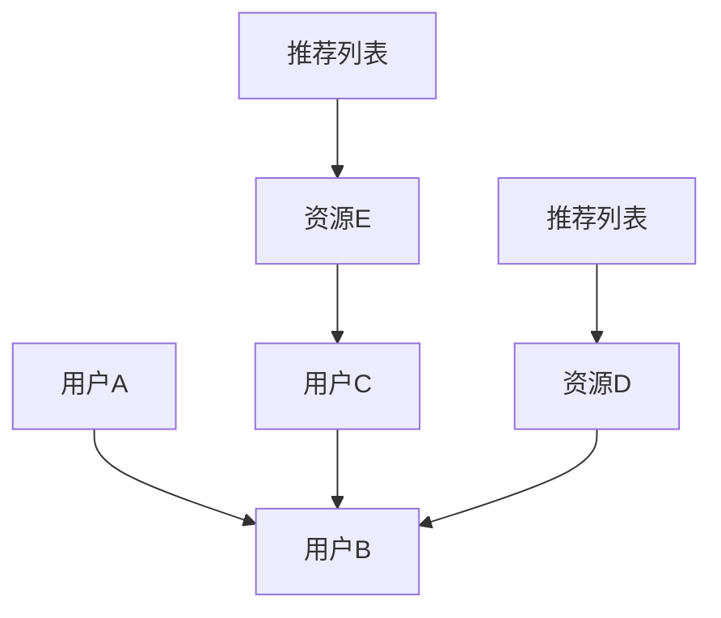
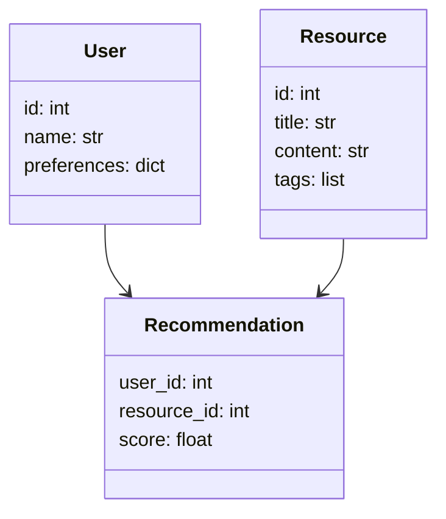
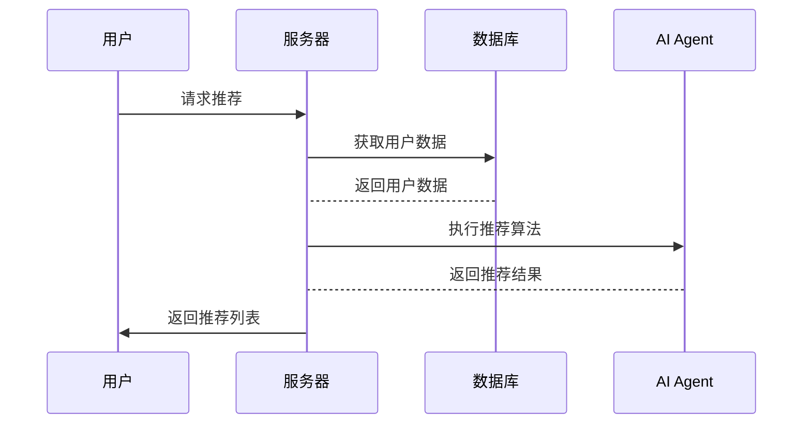

                 


# 智能图书馆：AI Agent的资源推荐系统

## 关键词：智能图书馆，AI Agent，资源推荐系统，自然语言处理，机器学习，协同过滤

## 摘要：本文探讨如何利用AI Agent实现智能图书馆的资源推荐系统。通过分析用户需求、系统架构、算法原理和项目实战，详细介绍基于协同过滤的推荐算法，并展示如何通过Python代码实现推荐系统。文章最后总结了关键点和未来发展方向。

## 第一部分: 智能图书馆与AI Agent的背景介绍

### 第1章: 智能图书馆的背景与问题背景

#### 1.1 智能图书馆的背景
- 1.1.1 图书馆的数字化转型：从传统馆藏管理到数字化资源管理的转变，提升用户体验。
- 1.1.2 AI技术在图书馆中的应用：利用自然语言处理和机器学习技术，优化资源管理和推荐服务。
- 1.1.3 智能图书馆的核心目标：提高资源利用率，满足用户个性化需求，提供高效便捷的服务。

#### 1.2 资源推荐系统的问题背景
- 1.2.1 用户信息需求的多样性：用户需求复杂多样，传统推荐系统难以满足。
- 1.2.2 传统推荐系统的局限性：基于规则的推荐方法存在推荐效果差、实时性低等问题。
- 1.2.3 AI Agent在推荐系统中的优势：通过智能代理实现个性化推荐，提升推荐效果。

#### 1.3 AI Agent的定义与特点
- 1.3.1 AI Agent的基本定义：智能代理，能够在环境中感知、交互并执行任务的智能体。
- 1.3.2 AI Agent的核心特点：自主性、反应性、目标导向、社交能力。
- 1.3.3 AI Agent与传统推荐系统的区别：智能化、个性化、实时性。

#### 1.4 问题解决方法
- 1.4.1 AI Agent在资源推荐中的作用：通过用户行为分析、内容理解和社交网络分析，实现精准推荐。

---

## 第二部分: 核心概念与联系

### 第2章: AI Agent与推荐系统的原理

#### 2.1 AI Agent的核心原理
- 感知环境：通过传感器或数据接口获取环境信息。
- 决策与规划：基于感知信息，制定行动计划。
- 执行任务：通过执行动作与环境交互，实现目标。

#### 2.2 推荐系统的原理
- 用户建模：分析用户行为、偏好和需求。
- 特征提取：从用户行为数据中提取有用的特征信息。
- 推荐生成：基于用户特征和资源信息，生成推荐列表。

#### 2.3 AI Agent与推荐系统的结合
- AI Agent通过分析用户行为和偏好，生成推荐列表。
- 推荐系统为AI Agent提供决策支持，实现个性化推荐。

#### 2.4 核心概念对比
| 概念 | AI Agent | 推荐系统 |
|------|-----------|----------|
| 核心目标 | 自动化决策与执行 | 提供个性化推荐 |
| 输入 | 用户行为、环境数据 | 用户需求、行为数据 |
| 输出 | 行动计划 | 推荐列表 |
| 技术基础 | 机器学习、自然语言处理 | 协同过滤、矩阵分解 |

#### 2.5 ER实体关系图
```mermaid
erd
  user
  resource
  recommendation
  -- User关联Recommendation：1对多
  -- Resource关联Recommendation：1对多
  -- User关联Resource：0对多
```

---

## 第三部分: 算法原理讲解

### 第3章: 协同过滤算法

#### 3.1 协同过滤算法的基本原理
- 基于用户相似度或资源相似度进行推荐。
- 相似度计算：使用余弦相似度、皮尔逊相关系数等方法。
- 推荐生成：基于相似用户的行为或相似资源的特征，生成推荐列表。

#### 3.2 协同过滤算法的流程


#### 3.3 协同过滤算法的实现
- 代码示例：
  ```python
  def calculate_similarity(user_matrix):
      similarity = np.zeros(shape=(num_users, num_users))
      for i in range(num_users):
          for j in range(num_users):
              similarity[i][j] = np.corrcoef(user_matrix[i], user_matrix[j])[0, 1]
      return similarity

  def collaborative_filtering(user_matrix, user_id, top_n=5):
      similarity = calculate_similarity(user_matrix)
      weighted_ratings = user_matrix[user_id] * similarity[user_id]
      total_ratings = np.sum(weighted_ratings, axis=1)
      normalized_ratings = total_ratings / (np.sum(similarity[user_id]) - 1)
      recommendations = np.argsort(normalized_ratings)[::-1][:top_n]
      return recommendations
  ```

#### 3.4 协同过滤算法的数学模型
- 相似度计算公式：
  $$\text{similarity}(u_i, u_j) = \frac{\sum_{k} (r_{ui} - \bar{r}_i)(r_{uj} - \bar{r}_j)}{\sqrt{\sum_{k} (r_{ui} - \bar{r}_i)^2} \sqrt{\sum_{k} (r_{uj} - \bar{r}_j)^2}}}$$
- 推荐评分预测公式：
  $$\hat{r}_{uj} = \bar{r}_j + \sum_{k} w_{jk}(r_{uk} - \bar{r}_k)$$

---

## 第四部分: 系统分析与架构设计

### 第4章: 问题场景介绍

#### 4.1 系统功能需求
- 用户注册与登录
- 资源查询与浏览
- 个性化推荐
- 推荐结果展示

#### 4.2 系统功能设计
- 用户模块：用户信息管理、偏好设置。
- 资源模块：资源信息管理、资源推荐。
- 推荐模块：协同过滤、基于内容的推荐。
- 系统管理模块：系统配置、日志管理。

#### 4.3 领域模型设计


#### 4.4 系统架构设计


#### 4.5 系统接口设计
- API接口：RESTful API，用于用户认证、资源查询、推荐请求。
- 数据接口：与数据库交互，获取用户行为数据和资源信息。

#### 4.6 系统交互流程


---

## 第五部分: 项目实战

### 第5章: 环境安装与核心实现

#### 5.1 环境安装
- Python 3.8+
- NumPy、Scikit-learn、Flask

#### 5.2 核心功能实现
- 用户行为数据预处理：
  ```python
  import numpy as np
  from sklearn.metrics import pairwise

  user_matrix = np.array([[4, 3, 2, 5],
                           [2, 4, 5, 3],
                           [3, 5, 4, 2]])

  def calculate_cosine_similarity(matrix):
      return pairwise.cosine_similarity(matrix)

  similarity_matrix = calculate_cosine_similarity(user_matrix)
  ```

- 协同过滤实现：
  ```python
  def get_recommendations(user_id, similarity_matrix, user_ratings, top_n=3):
      similar_users = np.argsort(similarity_matrix[user_id])[::-1]
      similar_users = similar_users[1:]  # 排除自己
      weighted_ratings = np.zeros(len(user_ratings))
      for u in similar_users[:top_n]:
          weighted_ratings += user_ratings[u]
      normalized_ratings = weighted_ratings / top_n
      return np.argsort(normalized_ratings)[::-1]

  recommendations = get_recommendations(0, similarity_matrix, user_matrix, 3)
  ```

#### 5.3 实际案例分析
- 案例1：用户A偏好科技类书籍，推荐列表中应包含科技类资源。
- 案例2：用户B喜欢历史类书籍，推荐系统基于用户行为和资源标签进行推荐。

---

## 第六部分: 总结与展望

### 第6章: 总结与展望

#### 6.1 核心总结
- AI Agent在智能图书馆中的应用提升了资源推荐的精准度和实时性。
- 基于协同过滤的推荐算法能够有效满足用户个性化需求。

#### 6.2 注意事项
- 数据隐私保护：确保用户数据的安全性和隐私性。
- 系统性能优化：提升推荐算法的效率和准确性。
- 多模态推荐：结合文本、图像等多种数据源，实现更精准的推荐。

#### 6.3 未来展望
- 结合深度学习技术，如BERT，进行更复杂的文本分析和推荐。
- 引入实时反馈机制，动态调整推荐策略。
- 探索联邦学习，实现跨图书馆资源协同推荐。

---

## 作者：AI天才研究院/AI Genius Institute & 禅与计算机程序设计艺术 /Zen And The Art of Computer Programming

---

感谢您的阅读！如果对智能图书馆或AI Agent的资源推荐系统感兴趣，欢迎留言交流或关注我们的公众号获取更多技术干货！

