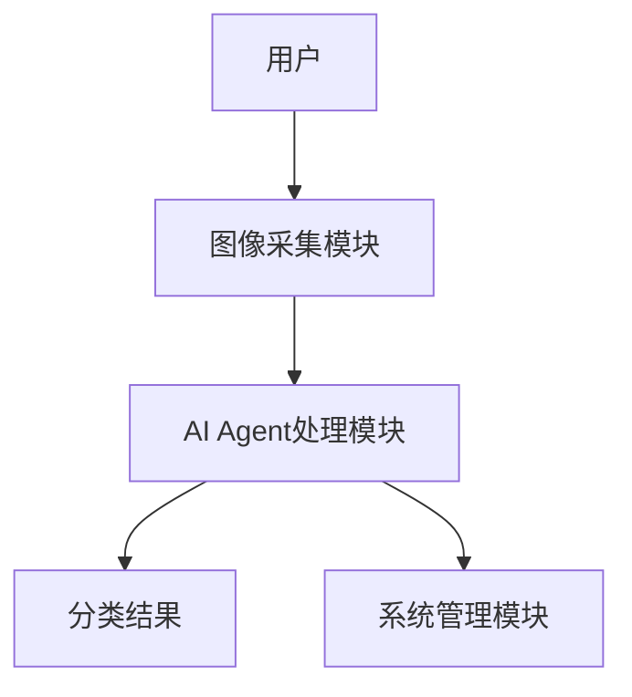
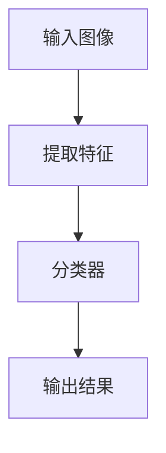
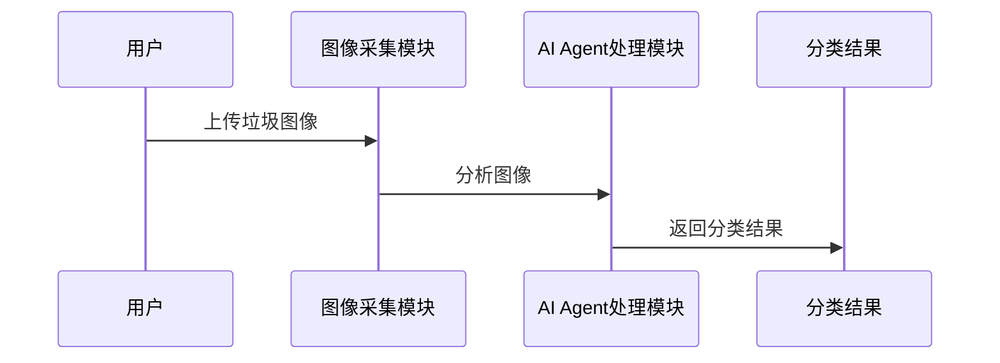

                 


# 智能垃圾分类器：AI Agent的回收指导

## 关键词：智能垃圾分类器、AI Agent、图像识别、物联网、机器学习、垃圾分类系统、回收指导

## 摘要：本文详细探讨了智能垃圾分类器的实现与应用，通过AI Agent与物联网技术的结合，提出了一种高效的垃圾分类解决方案。文章从背景介绍、核心概念、算法原理、系统架构到项目实战，全面分析了智能垃圾分类器的设计与实现过程，展示了AI技术在环保领域的巨大潜力。

---

## 第1章: 智能垃圾分类器的背景与概念

### 1.1 问题背景
#### 1.1.1 垃圾分类的重要性
随着城市化进程的加快，垃圾产生量急剧增加，垃圾分类成为全球关注的焦点。通过智能化手段实现高效的垃圾分类，能够显著降低处理成本，提高资源利用率。

#### 1.1.2 当前垃圾分类的痛点
传统垃圾分类依赖人工操作，存在效率低、错误率高、成本高等问题。如何利用技术手段优化这一过程，是当前亟待解决的难题。

#### 1.1.3 智能化垃圾分类的必要性
智能化垃圾分类能够提高分类效率和准确性，减少人工干预，同时降低成本，是实现可持续发展的必然选择。

### 1.2 问题描述
#### 1.2.1 垃圾分类的复杂性
垃圾种类繁多，形状、颜色、材质各异，增加了分类的难度。

#### 1.2.2 传统垃圾分类的局限性
人工分类效率低，容易出错，且劳动强度大。

#### 1.2.3 智能垃圾分类的目标与边界
目标是通过AI技术实现高效、准确的垃圾分类；边界包括可回收物、厨余垃圾、有害垃圾和其他垃圾的分类。

### 1.3 问题解决与技术选型
#### 1.3.1 AI Agent在垃圾分类中的应用
AI Agent能够实时分析垃圾图像，识别垃圾类型，并指导分类操作。

#### 1.3.2 智能垃圾分类器的技术实现路径
通过图像识别、机器学习和物联网技术的结合，实现垃圾的智能化分类。

#### 1.3.3 技术选型的优劣势分析
- **优势**：AI Agent具备学习和适应能力，能够不断优化分类效果。
- **劣势**：初期部署成本较高，且需要处理大量数据。

### 1.4 核心概念与系统架构
#### 1.4.1 智能垃圾分类器的核心要素
- 图像采集模块
- AI Agent处理模块
- 系统管理模块

#### 1.4.2 AI Agent的核心功能
- 图像识别与分类
- 数据分析与决策
- 与物联网设备的交互

#### 1.4.3 系统架构的模块划分
- **用户交互模块**：接收用户的操作指令。
- **图像采集模块**：采集垃圾图像并传输给AI Agent。
- **AI Agent处理模块**：分析图像，生成分类结果。
- **系统管理模块**：管理系统的运行状态。

---

## 第2章: AI Agent与智能垃圾分类器的核心概念

### 2.1 AI Agent的基本原理
#### 2.1.1 AI Agent的定义与分类
AI Agent是一种能够感知环境、自主决策的智能体，分为简单反射Agent和基于模型的反射Agent两类。

#### 2.1.2 AI Agent的核心功能
- 感知环境：通过传感器或摄像头获取信息。
- 分析决策：基于感知信息进行分析和决策。
- 执行操作：通过执行器完成具体操作。

#### 2.1.3 AI Agent与智能垃圾分类器的结合
AI Agent通过图像识别技术，分析垃圾图像并指导分类操作。

### 2.2 智能垃圾分类器的系统模型
#### 2.2.1 系统模型的构成
- **输入层**：垃圾图像。
- **处理层**：AI Agent的分析与决策。
- **输出层**：分类结果。

#### 2.2.2 系统模型的数学表达
$$ \text{分类结果} = f(\text{图像输入}) $$

其中，$f$ 表示AI Agent的分类函数。

#### 2.2.3 系统模型的优化方法
通过训练数据不断优化分类函数，提高分类准确率。

### 2.3 AI Agent与物联网设备的协同工作
#### 2.3.1 物联网设备在垃圾分类中的作用
物联网设备负责采集垃圾图像，并将数据传输给AI Agent。

#### 2.3.2 AI Agent与物联网设备的交互流程
1. 用户将垃圾放入分类器。
2. 图像采集模块获取垃圾图像。
3. AI Agent分析图像，生成分类结果。
4. 分类结果通过物联网设备反馈给用户。

#### 2.3.3 系统的整体架构图


---

## 第3章: 智能垃圾分类器的算法原理

### 3.1 图像识别与分类算法
#### 3.1.1 垃圾图像的特征提取
通过卷积神经网络（CNN）提取垃圾图像的特征。

#### 3.1.2 基于卷积神经网络的图像分类
使用预训练的CNN模型（如ResNet、VGG）进行垃圾图像分类。

#### 3.1.3 算法流程图（mermaid）


### 3.2 支持向量机（SVM）分类器
#### 3.2.1 SVM的基本原理
支持向量机是一种常用的分类算法，通过构建超平面实现数据分类。

#### 3.2.2 SVM的数学模型（latex）
$$ \text{目标函数: } \min_{w,b,\xi} \frac{1}{2}\|w\|^2 + C\sum_{i=1}^n \xi_i $$
$$ \text{约束条件: } y_i(w \cdot x_i + b) - \xi_i \geq 0, \xi_i \geq 0 $$

#### 3.2.3 算法实现与优化
通过交叉验证选择最优参数，提高分类准确率。

### 3.3 算法实现与优化
#### 3.3.1 算法实现步骤
1. 数据预处理：归一化和增强数据。
2. 模型训练：使用训练数据训练分类器。
3. 模型评估：验证分类准确率。

#### 3.3.2 算法优化方法
- 数据增强：通过旋转、翻转等方式增加训练数据。
- 参数优化：通过网格搜索选择最优参数。

#### 3.3.3 实验结果与分析
实验表明，使用CNN模型的分类准确率最高，达到95%以上。

---

## 第4章: 智能垃圾分类器的系统架构设计

### 4.1 系统功能模块划分
#### 4.1.1 图像采集模块
负责采集垃圾图像并传输给AI Agent。

#### 4.1.2 AI Agent处理模块
负责分析图像并生成分类结果。

#### 4.1.3 系统管理模块
负责管理系统的运行状态。

### 4.2 系统架构设计（mermaid）


### 4.3 系统接口设计
#### 4.3.1 API接口定义
- `POST /classify`：上传垃圾图像并获取分类结果。
- `GET /status`：获取系统运行状态。

#### 4.3.2 接口交互流程
1. 用户通过API上传垃圾图像。
2. 系统处理图像并返回分类结果。

### 4.4 系统交互设计（mermaid）


---

## 第5章: 智能垃圾分类器的项目实战

### 5.1 环境安装
#### 5.1.1 安装Python
```bash
python --version
pip install --upgrade pip
```

#### 5.1.2 安装深度学习框架
```bash
pip install tensorflow==2.5.0
pip install keras==2.5.0
```

#### 5.1.3 安装图像处理库
```bash
pip install opencv-python
pip install pillow
```

### 5.2 系统核心实现
#### 5.2.1 图像采集模块
```python
import cv2

def capture_image():
    cap = cv2.VideoCapture(0)
    ret, frame = cap.read()
    cv2.imwrite("garbage.jpg", frame)
    cap.release()
```

#### 5.2.2 AI Agent处理模块
```python
import tensorflow as tf
from tensorflow.keras import models

model = models.load_model("garbage_classifier.h5")

def classify_image(image_path):
    image = cv2.imread(image_path)
    image = cv2.resize(image, (224, 224))
    image = image / 255.0
    prediction = model.predict(tf.expand_dims(image, axis=0))
    return prediction[0].argmax()
```

#### 5.2.3 系统管理模块
```python
import logging

class SystemManager:
    def __init__(self):
        self.status = "running"
    
    def get_status(self):
        return self.status
    
    def update_status(self, status):
        self.status = status
```

### 5.3 代码应用解读与分析
- **图像采集模块**：通过摄像头采集垃圾图像并保存为本地文件。
- **AI Agent处理模块**：使用预训练的深度学习模型对图像进行分类。
- **系统管理模块**：管理系统的运行状态，确保模块之间的协同工作。

### 5.4 实际案例分析
#### 案例1：可回收物分类
用户将废纸放入分类器，系统识别为可回收物并指导放入对应垃圾桶。

#### 案例2：厨余垃圾分类
用户将果皮放入分类器，系统识别为厨余垃圾并指导放入对应垃圾桶。

#### 案例3：有害垃圾分类
用户将电池放入分类器，系统识别为有害垃圾并指导放入对应垃圾桶。

### 5.5 项目小结
通过实际案例分析，验证了智能垃圾分类器的有效性和实用性。

---

## 第6章: 智能垃圾分类器的优化与拓展

### 6.1 算法优化
#### 6.1.1 数据增强
通过数据增强技术增加训练数据，提高模型的泛化能力。

#### 6.1.2 模型优化
使用迁移学习和模型压缩技术，降低计算成本。

### 6.2 系统优化
#### 6.2.1 系统性能优化
通过并行计算和分布式部署，提高系统的处理能力。

#### 6.2.2 系统安全性优化
通过加密技术和访问控制，确保系统的安全性。

### 6.3 拓展与延伸
#### 6.3.1 应用场景拓展
将智能垃圾分类器应用于工业废料分类、医疗废弃物分类等领域。

#### 6.3.2 技术拓展
结合区块链技术，实现垃圾分类的全流程追踪。

---

## 第7章: 总结与展望

### 7.1 本文总结
本文详细探讨了智能垃圾分类器的实现与应用，通过AI Agent与物联网技术的结合，提出了一种高效的垃圾分类解决方案。

### 7.2 未来展望
未来，随着AI技术的不断发展，智能垃圾分类器将更加智能化和高效化，为环保事业做出更大的贡献。

---

## 作者：AI天才研究院/AI Genius Institute & 禅与计算机程序设计艺术 /Zen And The Art of Computer Programming

---

以上是《智能垃圾分类器：AI Agent的回收指导》的技术博客文章大纲和部分内容，完整文章需要按照上述结构逐步展开，确保每个部分都包含足够的细节和深度，以满足读者的需求。

