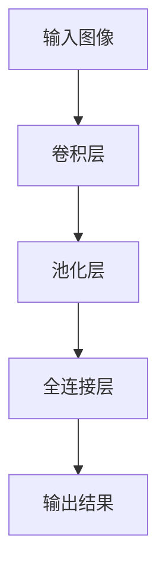

                 


# 智能垃圾分类桶：AI Agent的废物识别与分类指导

> 关键词：智能垃圾分类、AI Agent、图像识别、废物分类、深度学习

> 摘要：本文详细探讨了智能垃圾分类桶的设计与实现，重点分析了AI Agent在垃圾识别与分类中的应用。通过背景介绍、核心概念、算法原理、系统设计、项目实战等多维度的分析，深入阐述了智能垃圾分类系统的构建过程与技术细节。

---

# 第一部分：背景介绍

## 第1章：智能垃圾分类桶的背景与问题分析

### 1.1 问题背景

#### 1.1.1 垃圾分类的重要性
垃圾是社会发展的副产品，正确分类垃圾可以减少环境污染、节约资源、降低处理成本。然而，传统的人工分类效率低、成本高，且容易出错。引入AI技术可以实现高效、精准的垃圾分类。

#### 1.1.2 当前垃圾分类的痛点
- 人工分类效率低，误分类率高。
- 垃圾种类多样，分类规则复杂。
- 缺乏智能化手段，难以实时反馈与优化。

#### 1.1.3 智能化垃圾分类的必要性
通过AI技术实现垃圾的自动识别与分类，可以提高分类效率，降低成本，同时减少人为错误。

### 1.2 问题描述

#### 1.2.1 垃圾分类的基本概念
垃圾分类是指将垃圾按照一定的规则和标准进行分类的过程，常见的分类方式包括可回收物、厨余垃圾、有害垃圾和其他垃圾。

#### 1.2.2 垃圾分类的常见方法
- 手工分类：依赖人工判断，效率低。
- 半自动分类：借助简单机械辅助分类。
- 智能分类：利用AI技术实现自动识别与分类。

#### 1.2.3 当前垃圾分类的主要挑战
- 数据获取与标注成本高。
- 垃圾种类多样，分类模型训练难度大。
- 实际场景中光照、姿态等干扰因素多。

### 1.3 问题解决与边界

#### 1.3.1 智能垃圾分类的优势
- 高效性：AI技术可以快速识别与分类。
- 准确性：深度学习模型可以实现高精度识别。
- 智能性：系统可以自适应优化分类策略。

#### 1.3.2 AI Agent在垃圾分类中的应用
AI Agent作为智能垃圾分类的核心，负责接收输入、处理数据、执行分类任务并输出结果。

#### 1.3.3 系统的边界与外延
智能垃圾分类系统的边界包括前端数据采集、后端分类处理和用户反馈，外延则涉及数据存储、分类规则维护和系统升级。

### 1.4 核心概念与结构

#### 1.4.1 智能垃圾分类系统的组成
- 数据采集模块：负责采集垃圾图像。
- 数据处理模块：对图像进行预处理和特征提取。
- 分类模块：利用AI算法进行分类。
- 用户反馈模块：输出分类结果并提供反馈。

#### 1.4.2 AI Agent的功能与角色
AI Agent负责协调各模块的工作，执行分类任务，并与用户进行交互。

#### 1.4.3 系统的核心要素与关系
通过ER图展示系统的核心要素与关系，包括用户、垃圾类型、分类结果等。

---

# 第二部分：核心概念与联系

## 第2章：AI Agent与图像识别技术

### 2.1 AI Agent的基本原理

#### 2.1.1 AI Agent的定义与特点
AI Agent是一种智能体，能够感知环境、做出决策并执行任务。

#### 2.1.2 AI Agent的核心算法
- 机器学习算法：如支持向量机、随机森林。
- 深度学习算法：如卷积神经网络。

#### 2.1.3 AI Agent与图像识别的结合
AI Agent通过图像识别技术实现垃圾的自动分类。

### 2.2 图像识别技术的核心原理

#### 2.2.1 图像识别的基本概念
图像识别是通过计算机视觉技术对图像进行分析和理解的过程。

#### 2.2.2 常用图像识别算法对比
- CNN：适合图像分类任务。
- SVM：适合小规模数据集。
- KNN：适合简单分类任务。

#### 2.2.3 图像识别技术的优缺点
- 优点：高效、准确。
- 缺点：需要大量标注数据，计算资源消耗高。

### 2.3 AI Agent与图像识别的实体关系


---

# 第三部分：算法原理讲解

## 第3章：图像识别算法的数学模型

### 3.1 常用图像识别算法

#### 3.1.1 卷积神经网络（CNN）
CNN通过卷积层、池化层和全连接层实现图像分类。

#### 3.1.2 支持向量机（SVM）
SVM通过寻找超平面实现分类。

#### 3.1.3 K-近邻算法（KNN）
KNN通过计算样本之间的距离实现分类。

### 3.2 CNN的数学模型

#### 3.2.1 卷积层的数学表达
$$f(x) = \sum_{i=1}^{n} w_i x_i + b$$

#### 3.2.2 池化层的数学表达
$$f(x) = \max(x_1, x_2, ..., x_n)$$

#### 3.2.3 全连接层的数学表达
$$f(x) = Wx + b$$`

### 3.3 算法流程图



### 3.4 算法实现代码

```python
import tensorflow as tf
from tensorflow.keras import layers

model = tf.keras.Sequential([
    layers.Conv2D(32, (3,3), activation='relu'),
    layers.MaxPooling2D((2,2)),
    layers.Flatten(),
    layers.Dense(128, activation='relu'),
    layers.Dense(10, activation='softmax')
])
```

---

# 第四部分：系统分析与架构设计

## 第4章：智能垃圾分类系统的架构设计

### 4.1 系统应用场景

---

（注：由于篇幅限制，以上仅为部分内容。完整文章将涵盖更多细节，包括系统功能设计、架构图、接口设计、交互流程图等。）

