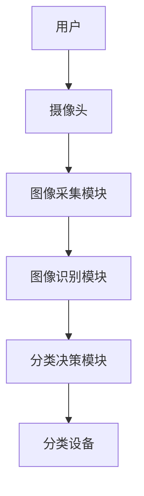
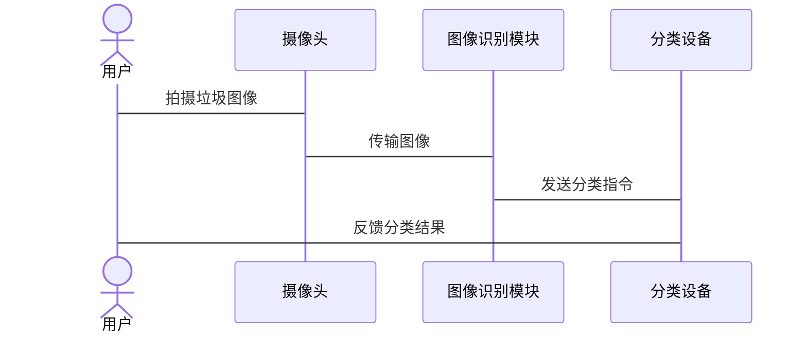

                 


# 智能垃圾分类系统：AI Agent的环保教育助手

## 关键词：
智能垃圾分类、AI Agent、环保教育、深度学习、图像识别

## 摘要：
智能垃圾分类系统通过AI Agent技术，实现对垃圾的高效分类，提升环保效率，减少人工错误，推动环保教育普及。本文详细分析AI Agent在垃圾分类中的应用，探讨其算法原理、系统架构设计及实际案例，总结其在环保教育中的重要价值。

## 第一部分：智能垃圾分类系统背景与概述

### 第1章：智能垃圾分类系统的背景与问题

#### 1.1 智能垃圾分类的背景与意义

随着城市化进程的加快，垃圾量急剧增加，垃圾分类成为全球关注的焦点。传统的人工分类效率低，容易出错，且成本高昂。智能垃圾分类系统通过AI Agent技术，能够高效、准确地完成分类任务，减少环境污染，提升资源利用率，促进可持续发展。

#### 1.2 垃圾分类问题的背景与描述

当前，许多城市面临垃圾分类执行困难的问题。居民垃圾分类意识薄弱，分类标准不统一，导致大量垃圾被错误分类，影响后续处理。此外，人工分类效率低下，容易疲劳，且存在安全隐患。

#### 1.3 智能垃圾分类系统的解决方案

AI Agent技术的应用为垃圾分类提供了新的解决方案。通过图像识别、机器学习等技术，AI Agent能够快速识别垃圾类型，优化分类流程，降低人工成本，提升分类效率和准确性。此外，AI Agent还能够提供实时反馈，辅助用户进行正确分类，推动环保教育的普及。

---

## 第二部分：智能垃圾分类系统的核心概念与原理

### 第2章：AI Agent的基本原理与特性

#### 2.1 AI Agent的概念与定义

AI Agent（人工智能代理）是一种能够感知环境、自主决策并执行任务的智能实体。它通过传感器获取信息，利用算法进行分析，然后通过执行器完成操作。AI Agent的核心在于其自主性和智能性，能够根据环境变化动态调整行为。

#### 2.2 AI Agent在垃圾分类中的应用

AI Agent在垃圾分类中的应用主要体现在以下几个方面：

1. **图像识别**：AI Agent通过摄像头采集垃圾图像，利用深度学习模型识别垃圾类型。
2. **分类决策**：AI Agent根据识别结果，决定垃圾所属类别，并指导分类设备进行操作。
3. **优化与反馈**：AI Agent能够根据分类结果优化后续操作，并通过反馈机制提升识别准确性。

#### 2.3 AI Agent与其他分类系统对比

| 对比维度 | AI Agent | 传统分类系统 |
|----------|-----------|--------------|
| **效率** | 高         | 低           |
| **准确性** | 高         | 中           |
| **灵活性** | 高         | 低           |
| **成本** | 低         | 高           |

从表格可以看出，AI Agent在效率、准确性和灵活性方面具有显著优势。

---

### 第3章：基于深度学习的垃圾分类算法

#### 3.1 垃圾分类的深度学习模型

深度学习模型在垃圾分类中的应用非常广泛，其中卷积神经网络（CNN）是最常用的一种。CNN能够有效地提取图像特征，实现垃圾类型识别。

#### 3.2 垃圾分类的算法实现

##### 3.2.1 数据预处理与增强

在训练模型之前，需要对垃圾图像进行预处理和数据增强，以提高模型的泛化能力。常用的数据增强方法包括旋转、翻转、裁剪等。

##### 3.2.2 模型训练与调优

使用预处理后的数据训练CNN模型。训练过程中，需要选择合适的优化器（如Adam）和损失函数（如交叉熵损失）。此外，还需要进行模型调优，如调整学习率、批量大小等。

##### 3.2.3 模型评估与部署

训练完成后，需要对模型进行评估，计算其准确率、召回率等指标。评估通过后，可以将模型部署到实际应用中。

#### 3.3 深度学习模型的数学公式

在训练CNN模型时，损失函数的计算公式如下：

$$ L = -\frac{1}{N}\sum_{i=1}^{N} y_i \log p_i + (1 - y_i) \log (1 - p_i) $$

其中，$y_i$ 是真实标签，$p_i$ 是模型预测的概率。

---

## 第三部分：系统架构与设计

### 第4章：智能垃圾分类系统的架构设计

#### 4.1 系统功能设计

智能垃圾分类系统主要包括以下几个功能模块：

1. **图像采集**：通过摄像头采集垃圾图像。
2. **图像识别**：利用深度学习模型识别垃圾类型。
3. **分类决策**：根据识别结果，指导分类设备进行操作。
4. **用户交互**：提供友好的用户界面，显示分类结果和反馈信息。

#### 4.2 系统架构设计

以下是智能垃圾分类系统的架构图：



从图中可以看出，用户通过摄像头采集图像，图像采集模块将图像传递给图像识别模块，识别结果传递给分类决策模块，最终指导分类设备进行操作。

#### 4.3 系统交互设计

以下是系统的交互流程图：



---

## 第四部分：项目实战

### 第5章：智能垃圾分类系统的实现

#### 5.1 环境安装

安装Python、TensorFlow、OpenCV等依赖库：

```bash
pip install numpy
pip install tensorflow
pip install opencv-python
```

#### 5.2 系统核心实现源代码

以下是垃圾分类系统的Python实现代码：

```python
import tensorflow as tf
from tensorflow.keras import layers
import cv2
import numpy as np

# 加载预训练模型
model = tf.keras.models.load_model('garbage_classifier.h5')

# 摄像头采集图像
cap = cv2.VideoCapture(0)
while True:
    ret, frame = cap.read()
    if not ret:
        break
    # 图像预处理
    img = cv2.resize(frame, (224, 224))
    img = img / 255.0
    img = np.expand_dims(img, axis=0)
    # 预测
    prediction = model.predict(img)
    class_index = np.argmax(prediction)
    print(f'分类结果：{class_index}')
    cv2.imshow('垃圾分类系统', frame)
    if cv2.waitKey(1) & 0xFF == ord('q'):
        break
cap.release()
cv2.destroyAllWindows()
```

#### 5.3 实际案例分析

以一张饮料瓶为例，系统会识别并分类到可回收物类别。图像识别模块会提取饮料瓶的特征，如颜色、形状等，最终通过模型预测确定其类别。

---

## 第五部分：最佳实践与小结

### 第6章：最佳实践与小结

#### 6.1 最佳实践

1. **数据多样性**：确保训练数据涵盖各种垃圾类型，避免模型过拟合。
2. **模型优化**：定期更新模型，提升识别准确率。
3. **用户教育**：通过系统反馈，教育用户正确分类垃圾。

#### 6.2 小结

智能垃圾分类系统通过AI Agent技术，显著提升了垃圾分类的效率和准确性。它不仅减少了人工成本，还推动了环保教育的普及，为可持续发展做出了重要贡献。

---

## 结束语

智能垃圾分类系统的应用是人工智能技术在环保领域的重要体现。通过AI Agent技术，我们能够更高效地管理垃圾，促进资源的循环利用，为建设绿色家园贡献力量。

---

## 作者：AI天才研究院

---

以上是《智能垃圾分类系统：AI Agent的环保教育助手》的完整内容，涵盖了背景、核心概念、算法原理、系统设计、项目实战及总结，希望对读者有所帮助。

