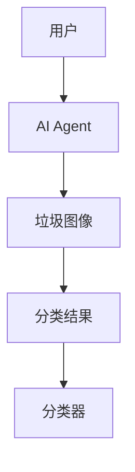
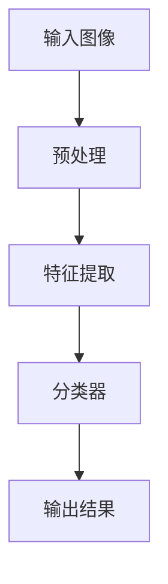
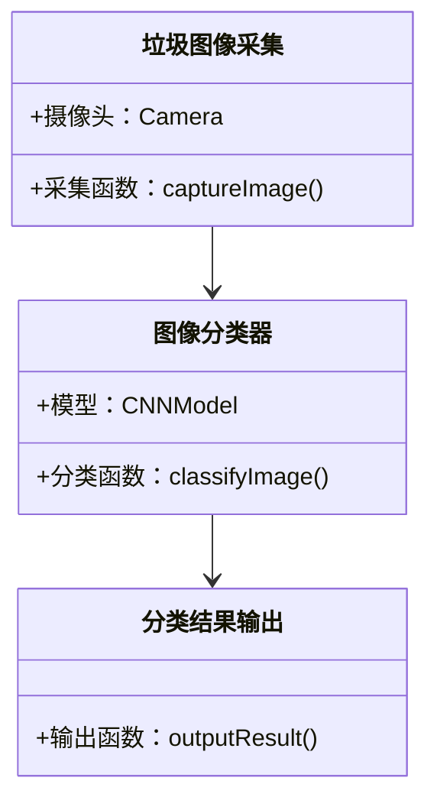
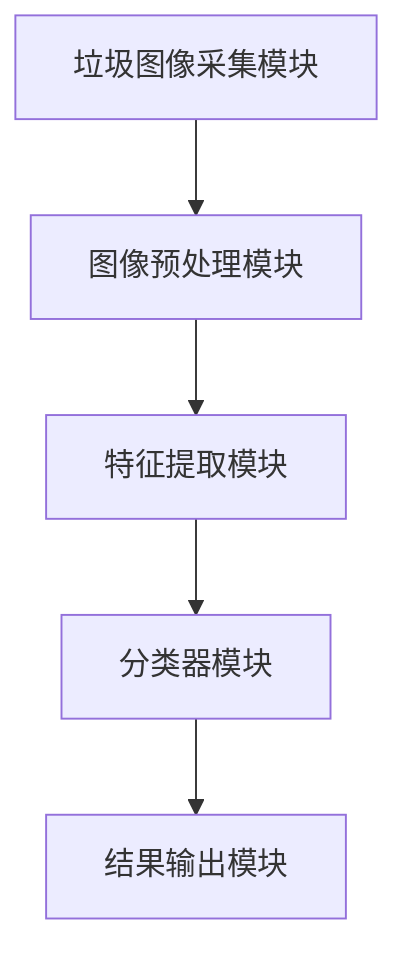
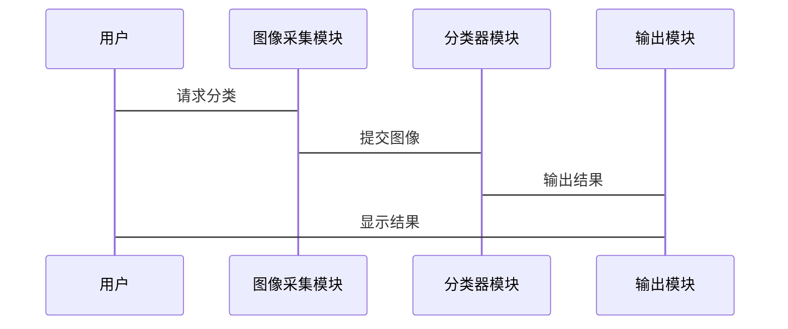

                 


# 智能垃圾分类：AI Agent的识别系统

## 关键词：AI Agent，智能垃圾分类，图像识别，机器学习，系统架构

## 摘要：本文探讨了如何利用AI Agent技术实现智能垃圾分类。首先分析了传统垃圾分类的挑战，然后介绍了AI Agent的核心概念和工作原理。接着详细讲解了基于卷积神经网络的图像分类算法，并通过系统架构设计展示了如何构建一个高效的垃圾分类系统。最后通过项目实战和最佳实践，提供了实际应用的指导和优化建议。

---

# 第1章: 智能垃圾分类的背景与问题概述

## 1.1 智能垃圾分类的背景

### 1.1.1 垃圾分类的必要性
随着城市化进程的加快，垃圾产生量急剧增加。垃圾分类是资源回收和环境保护的重要手段，能够减少环境污染，提高资源利用率。然而，传统的人工分类效率低、成本高，且容易出错。

### 1.1.2 垃圾分类的描述
垃圾分类是指将生活垃圾按照一定的分类标准进行分类，通常包括可回收物、厨余垃圾、有害垃圾和其他垃圾四类。准确的分类需要依赖专业知识和经验，这对人工分类提出了较高要求。

### 1.1.3 AI技术在垃圾分类中的应用
人工智能技术，尤其是计算机视觉和机器学习，为垃圾分类提供了新的解决方案。通过图像识别技术，AI能够快速、准确地识别垃圾种类，显著提高分类效率和准确性。

### 1.1.4 问题解决
AI Agent（智能体）通过实时图像识别和分类算法，能够自动将垃圾分门别类，减少人工干预，提高分类效率。

### 1.1.5 概念结构与外延
智能垃圾分类系统是一个结合AI技术的复杂系统，涉及图像采集、特征提取、分类算法等多个模块。其外延包括硬件设备（如摄像头）和软件算法（如深度学习模型）。

---

## 1.2 智能垃圾分类的核心问题

### 1.2.1 垃圾图像识别的挑战
垃圾种类繁多，形态多样，图像可能存在光照变化、遮挡等问题，增加了识别的难度。

### 1.2.2 数据获取与处理的难点
高质量的标注数据是训练分类模型的基础。获取大量标注数据需要投入大量时间和资源，且数据质量直接影响模型性能。

### 1.2.3 系统设计与实现的复杂性
智能垃圾分类系统需要考虑硬件与软件的协同工作，包括图像采集、数据传输、模型推理等多个环节。

---

## 1.3 本章小结

本章介绍了智能垃圾分类的背景和必要性，分析了传统分类的局限性，并提出了AI Agent在垃圾分类中的应用潜力。明确了垃圾分类的核心问题，为后续章节的深入分析奠定了基础。

---

# 第2章: AI Agent的基本原理与特征

## 2.1 AI Agent的定义与分类

### 2.1.1 AI Agent的定义
AI Agent是一种智能实体，能够感知环境、自主决策并执行任务。在垃圾分类中，AI Agent负责图像识别和分类。

### 2.1.2 AI Agent的分类
AI Agent可以分为简单反射型、基于模型的反应型、目标驱动型和实用驱动型。在垃圾分类中，通常采用目标驱动型AI Agent，能够根据目标执行分类任务。

### 2.1.3 AI Agent的核心特征
| 特征 | 描述 |
|------|------|
| 感知能力 | 能够感知环境输入（如图像） |
| 决策能力 | 基于感知信息做出分类决策 |
| 学习能力 | 通过反馈不断优化分类模型 |

---

## 2.2 智能垃圾分类中的AI Agent架构

### 2.2.1 基于AI Agent的系统架构
AI Agent在垃圾分类系统中承担核心任务，包括图像采集、特征提取、分类推理和结果输出。

### 2.2.2 实体关系图（ER图）分析


---

## 2.3 本章小结

本章详细介绍了AI Agent的基本原理和特征，分析了其在智能垃圾分类系统中的架构和作用。通过ER图展示了系统的核心关系，为后续章节的算法设计和系统实现奠定了基础。

---

# 第3章: 垃圾分类AI Agent的算法原理

## 3.1 垃圾图像分类算法概述

### 3.1.1 基于CNN的图像分类
卷积神经网络（CNN）是图像分类的核心算法，通过卷积层提取图像特征，全连接层进行分类。

### 3.1.2 基于迁移学习的分类算法
利用预训练模型（如ResNet、VGG）进行迁移学习，可以快速提升分类性能，减少数据需求。

### 3.1.3 基于目标检测的分类方法
目标检测技术（如YOLO、Faster R-CNN）可以更精确地识别垃圾的位置和类别。

---

## 3.2 垃圾图像分类算法流程图



---

## 3.3 垃圾图像分类的数学模型

### 3.3.1 卷积神经网络（CNN）模型
$$\text{损失函数} = -\sum_{i=1}^{n} y_i \log p_i + (1 - y_i)\log(1 - p_i)$$
其中，$y_i$是真实标签，$p_i$是预测概率。

### 3.3.2 模型优化与训练
$$\text{优化器} = \text{Adam}(\alpha=0.001, \beta_1=0.9, \beta_2=0.999)$$
Adam优化器结合了动量和自适应学习率，能够加速训练过程。

---

## 3.4 本章小结

本章详细讲解了垃圾图像分类的核心算法，包括CNN、迁移学习和目标检测。通过流程图和数学公式，清晰地展示了算法的工作原理和优化方法。

---

# 第4章: 智能垃圾分类系统的架构设计

## 4.1 系统功能设计

### 4.1.1 领域模型类图


---

## 4.2 系统架构设计

### 4.2.1 系统架构图


---

## 4.3 系统接口设计

### 4.3.1 接口设计
- 图像采集模块提供`captureImage`接口，返回垃圾图像。
- 分类器模块提供`classifyImage`接口，接收图像并返回分类结果。
- 输出模块提供`outputResult`接口，显示分类结果。

### 4.3.2 交互序列图


---

## 4.4 本章小结

本章设计了一个完整的智能垃圾分类系统架构，包括功能模块、数据流和交互过程。通过类图和架构图展示了系统的整体结构，确保各模块协同工作。

---

# 第5章: 项目实战与实现

## 5.1 环境安装

### 5.1.1 安装Python与依赖库
```bash
pip install numpy
pip install tensorflow
pip install matplotlib
pip install scikit-learn
```

---

## 5.2 系统核心实现

### 5.2.1 图像预处理代码
```python
import cv2
import numpy as np

def preprocess_image(image_path):
    image = cv2.imread(image_path)
    image = cv2.resize(image, (224, 224))
    image = image / 255.0  # Normalization
    return image
```

### 5.2.2 分类器实现代码
```python
import tensorflow as tf
from tensorflow.keras.models import load_model

model = load_model('garbage_classifier.h5')
def classify_image(image):
    prediction = model.predict(tf.expand_dims(image, axis=0))
    return np.argmax(prediction, axis=1)[0]
```

---

## 5.3 代码应用解读与分析

### 5.3.1 代码功能分析
- `preprocess_image`函数：对图像进行预处理，包括读取、缩放和归一化。
- `classify_image`函数：使用预训练模型进行图像分类，返回分类结果。

---

## 5.4 实际案例分析

### 5.4.1 案例分析
假设有一张塑料瓶的图像，预处理后输入模型，分类器返回结果为“可回收物”。

### 5.4.2 模型优化
通过数据增强和学习率调整，进一步优化模型性能。

---

## 5.5 本章小结

本章通过实际项目展示了智能垃圾分类系统的实现过程，包括环境配置、代码编写和案例分析。通过代码示例帮助读者理解系统实现的细节。

---

# 第6章: 最佳实践与总结

## 6.1 小结

智能垃圾分类系统通过AI Agent技术实现了高效、准确的垃圾分类。本文详细讲解了系统架构、算法原理和实现过程，为实际应用提供了参考。

---

## 6.2 注意事项

- 数据质量直接影响分类性能，需确保数据标注的准确性。
- 模型优化需要结合实际场景，选择合适的超参数。
- 系统部署需考虑硬件性能和稳定性。

---

## 6.3 拓展阅读

- 《深度学习入门：基于Python和TensorFlow》
- 《计算机视觉：算法与应用》
- 《垃圾智能分类系统的设计与实现》

---

# 作者：AI天才研究院 & 禅与计算机程序设计艺术

---

以上是《智能垃圾分类：AI Agent的识别系统》的技术博客文章的完整目录和内容框架，确保逻辑清晰、结构紧凑、内容详实。希望这篇文章能够为读者提供关于智能垃圾分类系统的深入理解和实践指导。

