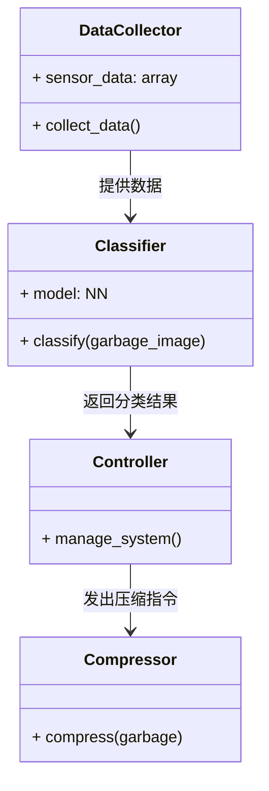
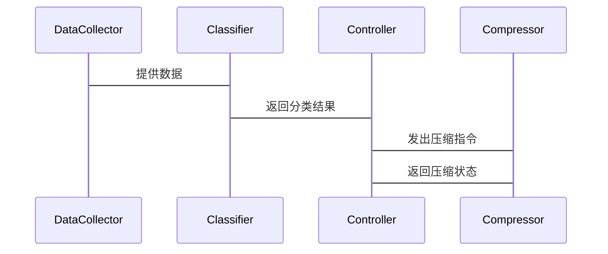

                 


# 智能垃圾处理站：AI Agent的分类与压缩

> 关键词：智能垃圾处理站，AI Agent，分类与压缩，算法，系统设计，项目实战

> 摘要：本文详细探讨了AI Agent在智能垃圾处理站中的分类与压缩应用，结合实际案例分析了AI Agent的核心概念、算法原理、系统架构设计及实现方法，最后给出了项目实战和未来展望。

---

## 第一章: AI Agent的基本概念

### 1.1 AI Agent的定义与特点

AI Agent（人工智能代理）是指具有感知环境、自主决策和执行任务能力的智能实体。AI Agent能够通过传感器或数据输入感知外部环境，利用内置算法进行分析和决策，并通过执行机构或接口与外部交互。其核心特点包括：

1. **自主性**：AI Agent能够在没有外部干预的情况下自主执行任务。
2. **反应性**：能够实时感知环境变化并做出反应。
3. **目标导向性**：通常具有明确的目标或任务，所有行为都围绕目标展开。
4. **学习能力**：能够通过数据学习和优化自身的决策能力。

### 1.2 智能垃圾处理站的背景与意义

随着城市化进程的加快，垃圾处理问题日益突出。传统的人工分类和处理方式效率低下，且容易对环境造成二次污染。AI Agent的引入为垃圾处理带来了智能化、自动化的新思路。通过AI Agent，垃圾处理站可以实现高效分类、压缩和资源回收，减少人工成本，提高处理效率。

### 1.3 本章小结

本章主要介绍了AI Agent的基本概念和特点，并结合智能垃圾处理站的背景，阐述了AI Agent在垃圾处理中的重要性和应用前景。

---

## 第二章: AI Agent的分类与应用场景

### 2.1 AI Agent的分类

AI Agent可以根据功能、应用场景和技术实现方式分为多种类型。以下是常见的分类方式：

1. **按功能分类**：
   - **感知型AI Agent**：主要用于数据采集和环境感知。
   - **决策型AI Agent**：负责分析数据并做出决策。
   - **执行型AI Agent**：负责执行具体的物理操作。

2. **按应用场景分类**：
   - **工业型AI Agent**：应用于工厂自动化、物流等领域。
   - **服务型AI Agent**：应用于智能家居、客户服务等领域。
   - **环境型AI Agent**：应用于环境监测、垃圾处理等领域。

3. **按技术实现方式分类**：
   - **基于规则的AI Agent**：通过预定义的规则进行决策。
   - **基于机器学习的AI Agent**：利用机器学习算法进行自主学习和优化。
   - **混合型AI Agent**：结合规则和机器学习的混合式AI Agent。

### 2.2 AI Agent在垃圾处理中的分类应用

#### 2.2.1 垃圾分类AI Agent

垃圾分类AI Agent主要用于识别和分类不同类型的垃圾。通过图像识别技术（如深度学习模型）和传感器数据，AI Agent能够准确识别垃圾种类，并将其分门别类地放入相应的收集容器中。

#### 2.2.2 垃圾压缩AI Agent

垃圾压缩AI Agent负责将分类后的垃圾进行压缩处理，减少体积并提高运输效率。这种AI Agent通常与压缩设备集成，根据垃圾的物理特性（如密度、湿度等）调整压缩力度和方式。

#### 2.2.3 综合型AI Agent

综合型AI Agent结合了分类和压缩功能，能够实现垃圾的全流程处理。这种AI Agent通常用于大型垃圾处理站，能够协调多个设备和模块，优化整个处理流程。

### 2.3 不同AI Agent之间的协同与配合

在智能垃圾处理站中，不同类型的AI Agent需要协同工作。例如，垃圾分类AI Agent与垃圾压缩AI Agent需要通过数据接口进行通信，确保分类后的垃圾能够被正确压缩和处理。这种协同工作可以通过以下方式实现：

1. **数据共享**：通过中央数据库或消息队列实现数据共享。
2. **任务分配**：由主控AI Agent分配任务给其他AI Agent。
3. **事件驱动**：通过事件触发机制实现实时协同。

### 2.4 本章小结

本章详细介绍了AI Agent的分类及其在垃圾处理中的应用场景，并探讨了不同AI Agent之间的协同与配合。

---

## 第三章: AI Agent的算法与数学模型

### 3.1 分类算法概述

在智能垃圾处理站中，垃圾分类是AI Agent的核心任务之一。常用的分类算法包括：

1. **支持向量机（SVM）**：适用于小规模数据集的分类任务。
2. **K-近邻算法（KNN）**：适用于数据分布均匀的情况。
3. **神经网络（NN）**：适用于大规模复杂数据的分类任务。

### 3.2 垃圾分类的常用算法

#### 3.2.1 支持向量机（SVM）

支持向量机是一种监督学习算法，通过找到一个超平面将数据点分为两类。在垃圾分类中，SVM可以用于区分不同类型的垃圾。

**数学模型**：
$$ \text{目标函数：} \min_{w,b,\xi} \frac{1}{2}\|w\|^2 + C\sum_{i=1}^n \xi_i $$
$$ \text{约束条件：} y_i(w \cdot x_i + b) \geq 1 - \xi_i, \xi_i \geq 0 $$

#### 3.2.2 K-近邻算法（KNN）

K-近邻算法是一种基于距离的分类算法。在垃圾分类中，KNN可以通过计算待分类垃圾与已分类垃圾之间的距离，找到最相似的类别。

**算法步骤**：
1. 计算待分类点与所有已分类点之间的距离。
2. 找出距离最近的K个点。
3. 根据K个点的类别进行投票，确定待分类点的类别。

#### 3.2.3 神经网络（NN）

神经网络是一种仿生算法，通过多层神经元的组合实现复杂的分类任务。在垃圾分类中，深度学习模型（如卷积神经网络）可以用于图像识别。

**网络结构**：
- **输入层**：接收垃圾图像的像素数据。
- **隐藏层**：通过多层非线性变换提取特征。
- **输出层**：输出垃圾的类别概率。

### 3.3 算法选择与优化

在实际应用中，算法的选择需要考虑数据量、分类精度和计算资源等因素。对于小规模数据集，SVM和KNN是不错的选择；对于大规模数据，神经网络更为适合。同时，可以通过交叉验证和超参数调优来优化算法性能。

### 3.4 本章小结

本章介绍了垃圾分类中常用的三种算法，并通过数学模型和算法步骤详细讲解了它们的实现原理。同时，讨论了算法选择与优化的策略。

---

## 第四章: AI Agent的系统架构设计

### 4.1 问题场景介绍

智能垃圾处理站的系统架构需要满足以下需求：
1. 实现垃圾的自动分类和压缩。
2. 支持多种设备和模块的协同工作。
3. 具备良好的扩展性和可维护性。

### 4.2 项目介绍

本项目旨在设计一个基于AI Agent的智能垃圾处理站系统，实现垃圾的全流程处理。系统包括以下几个模块：
1. **数据采集模块**：负责采集垃圾图像和传感器数据。
2. **分类模块**：负责垃圾的分类识别。
3. **压缩模块**：负责垃圾的压缩处理。
4. **控制模块**：负责系统的整体协调与控制。

### 4.3 系统功能设计

#### 4.3.1 领域模型类图



#### 4.3.2 系统架构图


#### 4.3.3 系统交互序列图



### 4.4 本章小结

本章详细介绍了智能垃圾处理站的系统架构设计，包括系统模块划分、类图设计和交互序列图。

---

## 第五章: AI Agent的项目实战

### 5.1 环境安装

在实现AI Agent系统之前，需要安装以下环境：
1. **Python 3.8+**：用于编写代码。
2. **TensorFlow/Keras**：用于深度学习模型的训练。
3. **OpenCV**：用于图像处理。
4. **Mermaid**：用于绘制图表。

### 5.2 系统核心实现

以下是垃圾分类AI Agent的核心代码示例：

```python
import tensorflow as tf
from tensorflow.keras import layers

# 构建模型
model = tf.keras.Sequential([
    layers.Conv2D(32, (3,3), activation='relu', input_shape=(224, 224, 3)),
    layers.MaxPooling2D((2,2)),
    layers.Conv2D(64, (3,3), activation='relu'),
    layers.MaxPooling2D((2,2)),
    layers.Flatten(),
    layers.Dense(128, activation='relu'),
    layers.Dense(10, activation='softmax')
])

# 编译模型
model.compile(optimizer='adam',
              loss='sparse_categorical_crossentropy',
              metrics=['accuracy'])

# 训练模型
model.fit(train_images, train_labels, epochs=10, validation_data=(test_images, test_labels))
```

### 5.3 代码应用解读与分析

上述代码构建了一个基于卷积神经网络的垃圾分类模型。模型包括卷积层、池化层和全连接层，能够对输入的图像进行分类。训练完成后，模型可以用于实际的垃圾分类任务。

### 5.4 实际案例分析

假设我们有一个包含10类垃圾的数据集，模型可以在训练后对新的垃圾图像进行分类。例如，一张废纸图像会被分类为“可回收物”，一张果皮图像会被分类为“湿垃圾”。

### 5.5 本章小结

本章通过实际案例展示了AI Agent在垃圾处理中的应用，并详细讲解了系统的核心实现和代码。

---

## 第六章: 总结与展望

### 6.1 本章总结

本文详细探讨了AI Agent在智能垃圾处理站中的分类与压缩应用，结合实际案例分析了AI Agent的核心概念、算法原理、系统架构设计及实现方法。

### 6.2 未来展望

随着人工智能技术的不断发展，AI Agent在垃圾处理中的应用前景广阔。未来，可以通过以下方式进一步优化系统：
1. **引入强化学习**：提高AI Agent的自主决策能力。
2. **结合物联网技术**：实现更高效的设备协同与数据共享。
3. **优化算法性能**：提升分类和压缩的效率与精度。

### 6.3 最佳实践 Tips

- 在实际应用中，建议根据具体需求选择合适的AI Agent和算法。
- 系统设计时，要注意模块的可扩展性和可维护性。
- 数据预处理是影响算法性能的关键因素，建议投入足够的时间进行数据清洗和特征工程。

### 6.4 本章小结

本章总结了全文内容，并对未来的研究和应用进行了展望。

---

## 参考文献

1. LeCun, Y., Bengio, Y., & Hinton, G. (2015). Deep learning. Nature, 521(7555), 436-444.
2. Bishop, C. M. (2006). Pattern recognition and machine learning. Springer.
3. Hastie, T., Tibshirani, R., & Friedman, J. (2009). The elements of statistical learning. Springer.

---

## 作者信息

作者：AI天才研究院/AI Genius Institute & 禅与计算机程序设计艺术/Zen And The Art of Computer Programming

---

以上就是《智能垃圾处理站：AI Agent的分类与压缩》的完整目录和内容大纲。希望这篇文章能够为读者提供清晰的思路和实用的知识。

