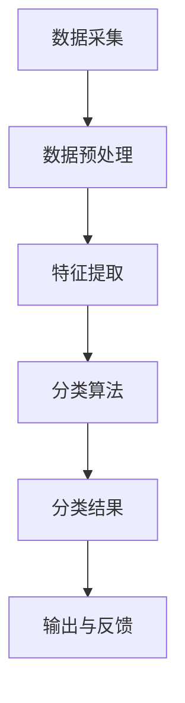
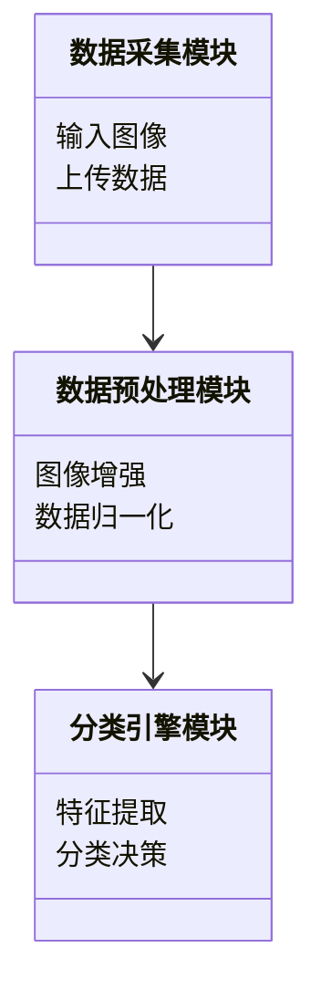
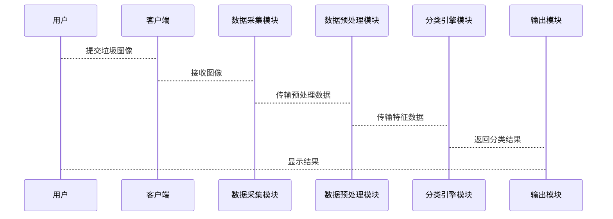
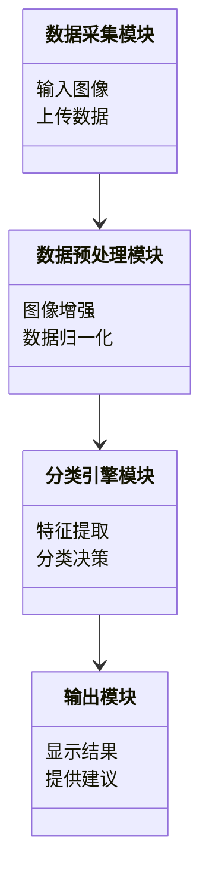

                 


# 第三章: AI Agent的分类与实现原理

## 3.1 AI Agent的分类

### 3.1.1 基于规则的AI Agent

- **定义**: 基于规则的AI Agent是通过预定义的规则和逻辑来进行决策的智能体。
- **特点**: 
  - 简单易懂，规则明确。
  - 适用于规则明确且变化较小的场景。
  - 无法处理复杂或未知的情况。

### 3.1.2 基于机器学习的AI Agent

- **定义**: 通过机器学习算法（如支持向量机、随机森林）进行训练，学习数据中的模式和特征，从而进行分类或预测。
- **特点**:
  - 能够处理复杂的数据和模式。
  - 需要大量数据进行训练。
  - 具有较高的准确性和适应性。

### 3.1.3 基于深度学习的AI Agent

- **定义**: 使用深度神经网络（如卷积神经网络、循环神经网络）进行特征提取和分类。
- **特点**:
  - 能够处理高维数据，如图像、语音。
  - 需要大量数据和计算资源。
  - 具备更高的准确性和鲁棒性。

## 3.2 垃圾分类AI Agent的实现原理

### 3.2.1 数据采集与预处理

- **数据采集**: 通过摄像头、传感器等设备采集垃圾图像或特征数据。
- **数据预处理**:
  - 图像增强：旋转、缩放、裁剪等。
  - 标注数据：为每个垃圾样本打上标签（可回收物、厨余垃圾等）。
  - 数据归一化：将数据标准化，便于模型训练。

### 3.2.2 特征提取与分类算法

- **特征提取**: 使用CNN（卷积神经网络）提取图像的深层特征。
- **分类算法**: 使用训练好的模型进行垃圾类型预测。
  - 示例算法：支持向量机（SVM）、随机森林、K-近邻（KNN）。

### 3.2.3 分类结果的输出与反馈

- **结果输出**: 返回垃圾的分类结果，并提供回收建议。
- **反馈机制**: 根据分类结果优化模型，提高准确率。

### 3.2.4 实现流程图



## 第四章: AI Agent的算法实现

## 4.1 分类算法的选择与实现

### 4.1.1 支持向量机（SVM）

- **原理**: 找到一个超平面，使得不同类别的数据点尽可能分开。
- **数学公式**:
  $$ \text{目标函数: } \max_{w,b} \min_{i} y_i(w \cdot x_i + b) - 1 $$
  $$ \text{约束条件: } y_i (w \cdot x_i + b) \geq 1 $$
- **优点**: 分离能力强，适合小规模数据。

### 4.1.2 决策树

- **原理**: 基于特征进行递归划分，构建决策树。
- **数学公式**:
  $$ Gini指数: G = \sum_{i=1}^{n} p_i (1 - p_i) $$
  $$ 信息增益: IG = H(Y) - H(Y|X) $$
- **优点**: 易于理解和实现。

### 4.1.3 K-近邻（KNN）

- **原理**: 根据距离度量，找到最近的K个样本，进行投票分类。
- **数学公式**:
  $$ 距离度量: d(x_i, x_j) = \sqrt{\sum_{k=1}^{n}(x_{ik} - x_{jk})^2} $$
- **优点**: 简单，适用于小规模数据。

## 4.2 算法实现流程

### 4.2.1 数据集准备

- **样本数量**: 至少1000张图片，每类至少100张。
- **数据增强**: 随机旋转、翻转、缩放等。

### 4.2.2 模型训练

- **训练数据**: 80%用于训练，20%用于验证。
- **训练参数**: 学习率、批次大小、 epochs。

### 4.2.3 模型评估

- **评估指标**: 准确率、精确率、召回率、F1分数。
- **评估流程**:
  1. 预测结果。
  2. 计算各项指标。

### 4.2.4 模型优化

- **超参数调优**: 学习率、正则化参数。
- **集成方法**: 集成多个模型（投票、加权）。

## 第五章: 系统分析与架构设计

## 5.1 系统需求分析

- **用户需求**:
  - 快速分类垃圾。
  - 提供回收建议。
  - 界面友好，操作简单。
- **系统功能**:
  - 数据采集与处理。
  - 分类算法实现。
  - 结果输出与反馈。

## 5.2 系统功能设计

### 5.2.1 领域模型



### 5.2.2 系统架构设计


### 5.2.3 接口设计

- **API接口**:
  - POST /classify 提交垃圾图像。
  - GET /result 获取分类结果。
  - PUT /train 更新模型参数。

### 5.2.4 交互流程



## 第六章: 项目实战

## 6.1 环境安装

- **Python 3.8+**
- **安装依赖**:
  ```bash
  pip install numpy scikit-learn tensorflow matplotlib
  ```

## 6.2 系统核心实现

### 6.2.1 数据预处理

```python
import numpy as np
from sklearn.datasets import make_classification

# 生成示例数据
X, y = make_classification(n_samples=1000, n_features=2, n_classes=4, random_state=42)
```

### 6.2.2 分类模型实现

```python
from sklearn.svm import SVC
from sklearn.metrics import accuracy_score

# 训练SVM模型
model = SVC()
model.fit(X_train, y_train)

# 预测
y_pred = model.predict(X_test)
print("Accuracy:", accuracy_score(y_test, y_pred))
```

### 6.2.3 系统交互

```python
import cv2
from keras.models import load_model

# 加载预训练模型
model = load_model('garbage_classifier.h5')

# 处理图像
image = cv2.imread('garbage.jpg')
image = cv2.resize(image, (150, 150))
image = np.expand_dims(image, axis=0)
image = image / 255.0

# 预测
prediction = model.predict(image)
print("Predicted class:", prediction.argmax())
```

## 6.3 案例分析

### 6.3.1 数据集准备

- **训练数据**: 1000张图片，4种垃圾类型。
- **验证数据**: 200张图片。

### 6.3.2 模型训练

```python
# 训练过程
model.compile(optimizer='adam', loss='sparse_categorical_crossentropy', metrics=['accuracy'])
model.fit(X_train, y_train, epochs=10, batch_size=32, validation_data=(X_val, y_val))
```

### 6.3.3 模型评估

```python
# 验证结果
loss, accuracy = model.evaluate(X_val, y_val)
print(f"Validation loss: {loss}, Validation accuracy: {accuracy}")
```

## 6.4 项目小结

- **实现功能**:
  - 数据采集与预处理。
  - 多种分类算法实现。
  - 系统交互与结果输出。
- **优化方向**:
  - 引入边缘计算，减少延迟。
  - 增加实时反馈机制，提高用户体验。

## 第七章: 总结与展望

## 7.1 总结

- **核心内容**:
  - AI Agent在垃圾处理中的重要作用。
  - 分类算法的选择与实现。
  - 系统架构设计与实现。
- **主要收获**:
  - 掌握了AI Agent的基本概念与分类方法。
  - 熟悉了垃圾分类系统的实现流程。
  - 理解了系统架构设计的核心要素。

## 7.2 未来展望

- **技术发展**:
  - 引入边缘计算，实现低延迟的实时分类。
  - 结合物联网技术，构建智能垃圾处理生态系统。
- **应用场景**:
  - 智慧城市中的智能垃圾桶。
  - 工业废料的智能分类与处理。
  - 普及垃圾分类知识，提升公众环保意识。

## 附录

### 附录A: 垃圾分类标准

- **可回收物**: 纸张、塑料、金属、玻璃。
- **厨余垃圾**: 食物残渣、果皮、菜叶。
- **有害垃圾**: 电池、药品、灯管。
- **其他垃圾**: 破损陶瓷、卫生纸、烟蒂。

### 附录B: 算法实现代码

```python
# 支持向量机分类器实现
from sklearn import svm

# 训练模型
model = svm.SVC()
model.fit(X_train, y_train)

# 预测
y_pred = model.predict(X_test)
print("SVM Accuracy:", accuracy_score(y_test, y_pred))

# 决策树分类器实现
from sklearn.tree import DecisionTreeClassifier

model = DecisionTreeClassifier()
model.fit(X_train, y_train)

y_pred = model.predict(X_test)
print("Decision Tree Accuracy:", accuracy_score(y_test, y_pred))

# K-近邻分类器实现
from sklearn.neighbors import KNeighborsClassifier

model = KNeighborsClassifier(n_neighbors=3)
model.fit(X_train, y_train)

y_pred = model.predict(X_test)
print("KNN Accuracy:", accuracy_score(y_test, y_pred))
```

## 附录C: 系统架构图



## 参考文献

- [1] 周志华. 机器学习. 清华大学出版社, 2016.
- [2] LeCun Y, Bengio Y, Hinton G. Deep learning. Nature, 2015.
- [3] 环境保护部. 中国垃圾分类标准. 2020.

## 作者

作者：AI天才研究院/AI Genius Institute & 禅与计算机程序设计艺术 /Zen And The Art of Computer Programming

---

以上是《智能垃圾处理：AI Agent的分类与回收系统》的完整目录和部分章节内容，您可以根据需要调整具体的章节内容和细节。如果有其他需求，请随时告诉我！

