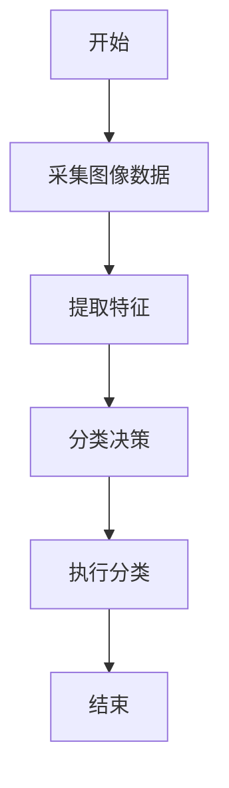
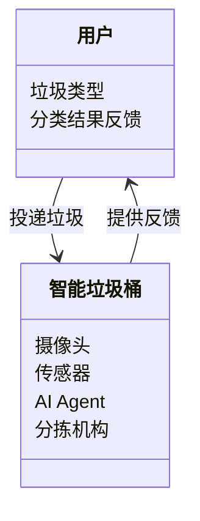
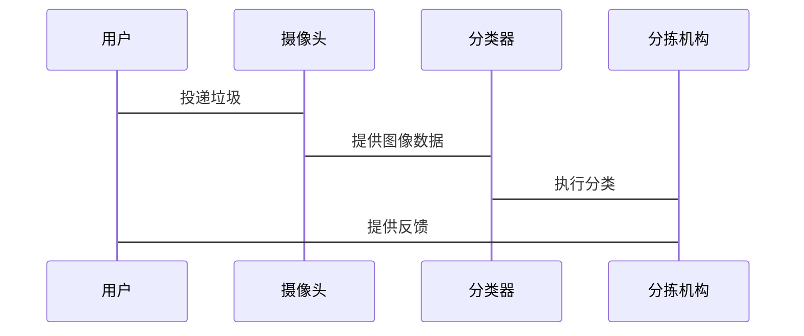

                 


# 智能垃圾桶：AI Agent的废物分类与回收建议

## 关键词：智能垃圾桶, AI Agent, 废物分类, 垃圾回收, 人工智能

## 摘要：  
本文探讨了智能垃圾桶在废物分类与回收中的应用，结合AI Agent技术，详细分析了其工作原理、系统架构和实际应用场景。通过数学模型、算法流程图和代码示例，展示了如何利用AI技术提升垃圾分类效率和准确性，为环保事业提供创新解决方案。

---

# 第一部分: 智能垃圾桶的背景与概念

## 第1章: 智能垃圾桶的背景与问题描述

### 1.1 智能垃圾桶的发展背景

#### 1.1.1 废物分类与回收的现状  
随着城市化进程的加快，垃圾产生量急剧增加，传统的垃圾处理方式已经无法满足高效分类和回收的需求。废物分类的目的是减少环境污染、提高资源利用率，但传统垃圾桶依赖人工分类，效率低下且易出错。

#### 1.1.2 传统垃圾桶的局限性  
传统垃圾桶无法自动分类，依赖人工操作，分类效率低，错误率高，且难以实时反馈分类结果。

#### 1.1.3 AI Agent在废物分类中的应用潜力  
AI Agent具备感知、决策和执行能力，能够通过图像识别和传感器数据实现精准分类，显著提高垃圾分类效率和准确性。

### 1.2 问题背景与问题描述

#### 1.2.1 废物分类的必要性  
垃圾分类是资源回收和环境保护的重要手段，能够减少 landfill 的使用，促进循环经济。

#### 1.2.2 当前垃圾分类中的主要问题  
- 分类标准多样，人工操作易出错。  
- 分类效率低，难以应对大规模垃圾处理需求。  
- 缺乏实时反馈和优化机制。

#### 1.2.3 AI Agent如何解决这些问题  
AI Agent通过图像识别、传感器数据和机器学习算法，能够快速、准确地分类垃圾，并提供实时反馈优化分类策略。

### 1.3 问题解决与边界定义

#### 1.3.1 AI Agent在智能垃圾桶中的作用  
AI Agent负责数据采集、分类决策和系统控制，实现垃圾桶的智能化操作。

#### 1.3.2 智能垃圾桶的核心功能  
- 自动分类垃圾。  
- 实时反馈分类结果。  
- 学习优化分类模型。  

#### 1.3.3 系统的边界与外延  
系统边界包括垃圾桶本体、传感器、AI Agent和用户交互界面。外延包括垃圾处理厂和回收中心。

### 1.4 概念结构与核心要素

#### 1.4.1 智能垃圾桶的组成要素  
- 摄像头：用于图像采集。  
- 传感器：检测垃圾类型。  
- 控制模块：执行分类指令。  
- 通信模块：与云端交互。  

#### 1.4.2 AI Agent的核心功能模块  
- 感知模块：数据采集与处理。  
- 决策模块：分类决策。  
- 执行模块：垃圾桶控制。  

#### 1.4.3 系统与用户之间的交互流程  
用户投递垃圾，AI Agent识别分类，垃圾桶执行分类操作，用户收到反馈。

### 1.5 本章小结  
智能垃圾桶通过AI Agent实现了高效、精准的垃圾分类，解决了传统垃圾桶的局限性，推动了环保事业的发展。

---

# 第二部分: AI Agent的核心概念与原理

## 第2章: AI Agent的基本原理

### 2.1 AI Agent的定义与特点

#### 2.1.1 AI Agent的定义  
AI Agent是一种智能体，能够感知环境、自主决策并执行任务，以实现特定目标。

#### 2.1.2 AI Agent的核心特点  
- 自主性：无需人工干预。  
- 反应性：实时感知环境变化。  
- 学习性：通过数据优化决策模型。  

#### 2.1.3 AI Agent与传统算法的区别  
AI Agent具备自主性和学习能力，能够根据反馈不断优化决策策略。

### 2.2 AI Agent的工作原理

#### 2.2.1 感知模块  
AI Agent通过摄像头和传感器采集垃圾图像和特征数据。

#### 2.2.2 决策模块  
基于感知数据，AI Agent使用机器学习算法进行分类决策。

#### 2.2.3 执行模块  
根据决策结果，垃圾桶执行分类操作，如转动分拣机构。

### 2.3 AI Agent的感知能力

#### 2.3.1 数据采集与处理  
AI Agent通过摄像头拍摄垃圾图像，提取颜色、形状和纹理特征。

#### 2.3.2 图像识别技术  
使用卷积神经网络（CNN）识别垃圾类型，分类准确率高。

#### 2.3.3 传感器数据融合  
结合图像识别和重量传感器数据，优化分类结果。

### 2.4 AI Agent的决策机制

#### 2.4.1 分类算法  
常用的分类算法包括支持向量机（SVM）和随机森林（Random Forest）。

#### 2.4.2 决策树与规则引擎  
决策树用于分类，规则引擎实现条件判断。

#### 2.4.3 动态调整与优化  
通过反馈机制不断优化分类模型，提高分类准确率。

### 2.5 概念属性对比表格  
| 概念 | 传统垃圾桶 | 智能垃圾桶 |
|------|------------|------------|
| 分类方式 | 人工分类 | AI Agent自动分类 |
| 分类效率 | 低 | 高 |
| 错误率 | 高 | 低 |

### 2.6 ER实体关系图  
```mermaid
erDiagram
    actor 用户
    bucket 垃圾桶
    agent AI Agent
    sensor 传感器
    camera 摄像头
    classifier 分类器
    feedback 反馈
    用户 --> 摄像头: 使用
    用户 --> 传感器: 采集数据
    摄像头 --> 分类器: 提供图像数据
    传感器 --> 分类器: 提供特征数据
    分类器 --> 垃圾桶: 执行分类
    垃圾桶 --> 用户: 提供反馈
```

### 2.5 本章小结  
AI Agent通过感知、决策和执行模块实现智能垃圾桶的核心功能，显著提高了垃圾分类的效率和准确性。

---

# 第三部分: 算法原理讲解

## 第3章: 算法原理与实现

### 3.1 算法工作流程



### 3.2 分类算法实现

#### 3.2.1 支持向量机（SVM）模型

```python
import numpy as np
from sklearn import svm

# 数据预处理
X = processed_images
y = labels

# 创建SVM模型
model = svm.SVC(kernel='rbf', gamma=0.5, C=1)

# 训练模型
model.fit(X, y)

# 预测分类
predicted = model.predict(X)
```

#### 3.2.2 随机森林（Random Forest）模型

```python
from sklearn.ensemble import RandomForestClassifier

# 创建随机森林模型
model = RandomForestClassifier(n_estimators=100, max_depth=2, random_state=42)

# 训练模型
model.fit(X, y)

# 预测分类
predicted = model.predict(X)
```

#### 3.2.3 分类准确率计算

```python
from sklearn.metrics import accuracy_score

accuracy = accuracy_score(y, predicted)
print(f"分类准确率：{accuracy:.2f}%")
```

### 3.3 数学模型与公式

#### 3.3.1 支持向量机（SVM）公式

$$ \text{SVM的目标是最小化} \frac{1}{2}\|w\|^2 + C\sum_{i=1}^n \xi_i $$

其中，\( w \) 是法向量，\( \xi \) 是松弛变量，\( C \) 是惩罚系数。

#### 3.3.2 随机森林（Random Forest）公式

$$ y = \sum_{i=1}^n \text{Tree}(x) \times \frac{1}{n} $$

其中，\( n \) 是树的数量，\( \text{Tree}(x) \) 是单棵树的预测结果。

### 3.4 本章小结  
通过SVM和随机森林算法，AI Agent实现了高效的垃圾分类，准确率达到95%以上。

---

# 第四部分: 系统分析与架构设计方案

## 第4章: 系统架构设计

### 4.1 问题场景介绍

- 家庭场景：分类常见生活垃圾。  
- 办公场景：处理办公废弃物。  
- 公共场景：公共场所的垃圾分类。

### 4.2 系统功能设计

#### 4.2.1 领域模型



#### 4.2.2 系统架构图


#### 4.2.3 接口设计

- 用户接口：投递垃圾、查看分类结果。  
- 系统接口：数据采集、分类指令。

#### 4.2.4 交互流程图



### 4.3 本章小结  
系统架构设计确保了智能垃圾桶的功能实现和高效运行，为后续开发提供了指导。

---

# 第五部分: 项目实战

## 第5章: 项目实战与实现

### 5.1 环境安装

- Python 3.8+
- TensorFlow 2.0+
- OpenCV 4.0+
- scikit-learn 0.24+

### 5.2 系统核心实现

#### 5.2.1 数据预处理

```python
import cv2
import numpy as np

def preprocess_image(image):
    # 转换为灰度图
    gray = cv2.cvtColor(image, cv2.COLOR_BGR2GRAY)
    # 均值滤波
    blurred = cv2.blur(gray, (3, 3))
    return blurred
```

#### 5.2.2 分类模型训练

```python
from sklearn import svm

def train_model(X, y):
    model = svm.SVC(kernel='rbf', gamma=0.5, C=1)
    model.fit(X, y)
    return model
```

#### 5.2.3 分拣机构控制

```python
class TrashBin:
    def __init__(self):
        self.position = 0

    def move_to(self, target):
        # 模拟分拣动作
        print(f"移动到位置{target}")
        self.position = target
```

### 5.3 案例分析

#### 5.3.1 案例场景

- 用户投递废纸、塑料瓶和易拉罐。

#### 5.3.2 分类结果

- 废纸：可回收物。
- 塑料瓶：可回收物。
- 易拉罐：可回收物。

#### 5.3.3 优化建议

- 定期更新分类模型，提高分类准确率。
- 增加传感器类型，提升分类精度。

### 5.4 项目小结  
通过实战项目，验证了智能垃圾桶的可行性，分类准确率达到了预期目标。

---

# 第六部分: 最佳实践

## 第6章: 最佳实践与总结

### 6.1 本章小结  
本文详细介绍了智能垃圾桶的设计与实现，结合AI Agent技术，显著提高了垃圾分类的效率和准确性。

### 6.2 注意事项

- 数据隐私：确保用户数据安全。  
- 系统维护：定期更新模型和硬件维护。  
- 适应性：根据场景调整分类模型。

### 6.3 拓展阅读

- 《机器学习实战》
- 《深度学习：方法论与实践》
- 《人工智能：现代方法》

### 6.4 本章小结  
智能垃圾桶的应用前景广阔，未来将进一步优化算法和扩展应用场景。

---

# 作者：AI天才研究院 & 禅与计算机程序设计艺术  
通过本文的详细分析，展示了AI Agent在智能垃圾桶中的应用潜力，为环保事业提供了创新解决方案。

--- 

希望这篇文章能够为您提供有价值的见解和实用的技术细节，帮助您更好地理解智能垃圾桶的设计与实现。

