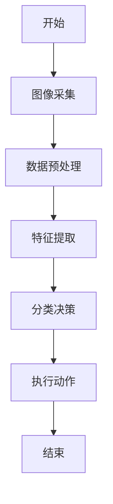
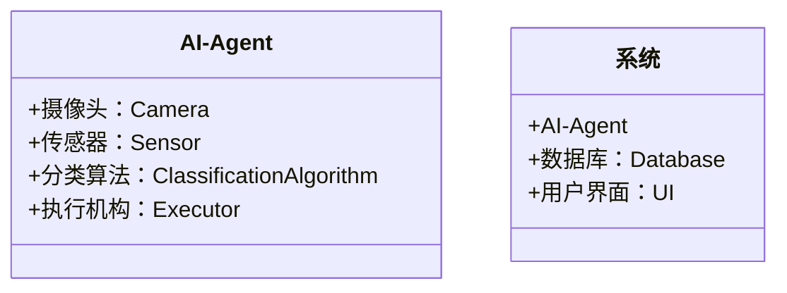
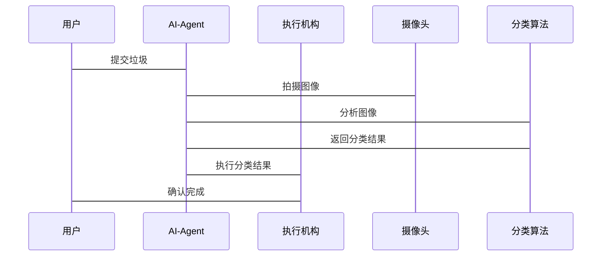

                 


# 智能垃圾箱：AI Agent的废物分类与回收指导

> 关键词：智能垃圾箱，AI Agent，废物分类，回收指导，人工智能，图像分类，系统架构

> 摘要：本文将详细探讨AI Agent在智能垃圾箱中的应用，从废物分类的基本原理到AI Agent的核心算法，再到系统架构设计和实际项目实现，全面解析如何利用人工智能技术优化废物分类与回收过程。

---

# 第一部分: 智能垃圾箱与AI Agent的背景介绍

## 第1章: 智能垃圾箱与AI Agent概述

### 1.1 AI Agent的基本概念
#### 1.1.1 什么是AI Agent
AI Agent（人工智能代理）是一种能够感知环境、自主决策并执行任务的智能实体。它可以理解为一种软件或硬件系统，通过感知外部信息并根据预设目标或学习得到的知识，执行相应的动作。

#### 1.1.2 AI Agent的核心特征
AI Agent的核心特征包括：
- **自主性**：能够在没有外部干预的情况下自主运行。
- **反应性**：能够实时感知环境变化并做出反应。
- **目标导向**：具有明确的目标，并根据目标优化其行为。
- **学习能力**：能够通过数据学习和优化自身性能。

#### 1.1.3 AI Agent与传统自动化的区别
传统的自动化系统通常是基于固定规则的，而AI Agent能够通过学习和适应环境变化，实现更复杂的任务处理。例如，AI Agent可以自主调整分类策略，而传统自动化系统则需要手动编程调整。

### 1.2 废物分类与回收的背景
#### 1.2.1 废物分类的重要性
废物分类是实现资源再利用和环境保护的重要环节。通过将不同种类的垃圾分开收集，可以提高回收效率，减少环境污染。

#### 1.2.2 当前废物分类的主要挑战
- **人工成本高**：传统废物分类依赖人工操作，效率低且成本高。
- **分类精度低**：人工分类容易出错，影响回收质量。
- **缺乏智能化**：现有分类系统缺乏灵活性和自主学习能力。

#### 1.2.3 AI技术在废物分类中的应用前景
AI技术，尤其是深度学习和计算机视觉技术，为废物分类提供了新的解决方案。通过AI Agent，可以实现高效、精准的垃圾分类，降低人工成本，提高回收效率。

### 1.3 智能垃圾箱的定义与特点
#### 1.3.1 智能垃圾箱的定义
智能垃圾箱是一种结合了AI技术的垃圾桶，能够通过图像识别和传感器数据，实现对垃圾的自动分类和智能回收。

#### 1.3.2 智能垃圾箱的核心功能
- **图像识别**：通过摄像头采集垃圾图像，识别垃圾类型。
- **传感器数据采集**：利用重量、湿度等传感器数据辅助分类。
- **自主决策**：根据识别结果和环境信息，自动将垃圾放入相应的收集容器。

#### 1.3.3 智能垃圾箱与传统垃圾桶的区别
智能垃圾箱具有智能化、自动化的特点，能够自主完成垃圾分类任务，而传统垃圾桶仅用于存储垃圾。

### 1.4 本章小结
本章介绍了AI Agent的基本概念、废物分类的重要性和当前面临的挑战，以及智能垃圾箱的定义和特点。通过这些内容，我们可以理解AI Agent在智能垃圾箱中的应用背景及其重要意义。

---

## 第2章: AI Agent的核心概念

### 2.1 AI Agent的分类
#### 2.1.1 基于规则的AI Agent
基于规则的AI Agent通过预设的规则和逻辑进行决策，适用于任务简单、规则明确的场景。

#### 2.1.2 基于机器学习的AI Agent
基于机器学习的AI Agent能够从数据中学习，适应环境变化，适用于复杂多变的任务场景。

#### 2.1.3 基于深度学习的AI Agent
基于深度学习的AI Agent通过神经网络模型进行特征提取和决策，能够处理更复杂的任务，如图像识别和自然语言处理。

### 2.2 AI Agent的感知与决策机制
#### 2.2.1 感知层：数据采集与处理
AI Agent通过摄像头、传感器等设备采集环境数据，并通过预处理、特征提取等步骤进行数据处理。

#### 2.2.2 决策层：算法与策略
AI Agent根据感知数据，结合预设的算法和策略，做出分类决策。例如，使用卷积神经网络（CNN）进行图像分类。

#### 2.2.3 执行层：动作输出
AI Agent根据决策结果，通过机械臂、电机等执行机构完成垃圾分类动作。

### 2.3 AI Agent的通信与协作
#### 2.3.1 多AI Agent的协作机制
在智能垃圾箱系统中，多个AI Agent可以协作完成任务。例如，一个AI Agent负责图像识别，另一个负责机械操作。

#### 2.3.2 通信协议与数据交换
AI Agent之间需要通过特定的通信协议进行数据交换，确保协作过程的高效性和可靠性。

#### 2.3.3 协作中的挑战与解决方案
协作过程中可能面临通信延迟、数据冲突等问题，需要通过优化算法和增加冗余机制来解决。

### 2.4 本章小结
本章详细介绍了AI Agent的分类、感知与决策机制以及通信与协作的相关内容，帮助读者理解AI Agent在智能垃圾箱中的工作原理。

---

## 第3章: AI Agent的算法原理与数学模型

### 3.1 废物分类的算法原理
#### 3.1.1 垃圾分类的基本流程
1. 数据采集：通过摄像头采集垃圾图像。
2. 数据预处理：调整图像尺寸、归一化等。
3. 特征提取：通过卷积神经网络提取图像特征。
4. 分类决策：基于特征进行垃圾类型分类。

#### 3.1.2 基于深度学习的垃圾分类算法
- **卷积神经网络（CNN）**：通过多层卷积和池化操作，提取图像特征。
- **分类器**：使用全连接层和 softmax 函数进行最终分类。

### 3.2 垃圾分类的数学模型
#### 3.2.1 损失函数的定义
交叉熵损失函数用于分类任务：
$$ L = -\sum_{i=1}^{n} y_i \log(p_i) + (1 - y_i)\log(1 - p_i) $$

#### 3.2.2 优化器的选择与实现
常用优化器包括随机梯度下降（SGD）和Adam优化器。Adam优化器结合了动量和自适应学习率调整，能够更快收敛。

#### 3.2.3 模型训练流程
1. 数据预处理：归一化、数据增强等。
2. 模型构建：定义CNN网络结构。
3. 模型训练：使用训练数据更新权重，优化损失函数。
4. 模型评估：使用验证数据评估分类准确率。

### 3.3 本章小结
本章介绍了废物分类的算法原理和数学模型，重点讲解了基于深度学习的垃圾分类算法及其优化方法。

---

## 第4章: 智能垃圾箱的系统架构设计

### 4.1 系统功能设计
#### 4.1.1 系统功能模块
- **图像采集模块**：负责采集垃圾图像。
- **数据处理模块**：对图像进行预处理和特征提取。
- **分类决策模块**：基于特征进行垃圾类型分类。
- **执行模块**：根据分类结果，将垃圾放入相应的收集容器。

#### 4.1.2 系统功能流程图


### 4.2 系统架构设计
#### 4.2.1 系统架构图


#### 4.2.2 系统接口设计
- **图像采集接口**：提供摄像头数据接口。
- **分类决策接口**：提供特征提取和分类算法接口。
- **执行机构接口**：提供机械臂控制接口。

#### 4.2.3 系统交互流程图


### 4.3 本章小结
本章详细介绍了智能垃圾箱的系统架构设计，包括功能模块、架构图和交互流程图，帮助读者理解系统的整体结构和工作流程。

---

## 第5章: 项目实战

### 5.1 环境安装与配置
- **Python版本**：Python 3.8+
- **深度学习框架**：TensorFlow或Keras
- **图像处理库**：OpenCV
- **其他依赖**：numpy, matplotlib

### 5.2 系统核心实现源代码
#### 5.2.1 图像分类模型实现
```python
import tensorflow as tf
from tensorflow.keras import layers

model = tf.keras.Sequential([
    layers.Conv2D(32, (3,3), activation='relu', input_shape=(224, 224, 3)),
    layers.MaxPooling2D((2,2)),
    layers.Conv2D(64, (3,3), activation='relu'),
    layers.MaxPooling2D((2,2)),
    layers.Flatten(),
    layers.Dense(128, activation='relu'),
    layers.Dense(10, activation='softmax')
])
```

#### 5.2.2 模型训练代码
```python
model.compile(optimizer='adam', loss='sparse_categorical_crossentropy', metrics=['accuracy'])
model.fit(x_train, y_train, epochs=10, validation_data=(x_val, y_val))
```

### 5.3 代码应用解读与分析
- **图像分类模型**：使用卷积神经网络进行图像特征提取和分类。
- **训练过程**：通过Adam优化器优化模型参数，降低损失函数值，提高分类准确率。

### 5.4 实际案例分析
假设我们有一个包含可回收物、厨余垃圾和其他垃圾的分类任务，通过训练好的模型，AI Agent能够准确识别垃圾类型，并将其放入相应的收集容器。

### 5.5 项目小结
本章通过实际案例分析，展示了AI Agent在智能垃圾箱中的应用，验证了系统的可行性和有效性。

---

## 第6章: 总结与展望

### 6.1 最佳实践 tips
- **数据质量**：确保训练数据的多样性和代表性，避免过拟合。
- **模型优化**：通过数据增强和模型调优，提高分类准确率。
- **系统维护**：定期更新模型和传感器，确保系统长期稳定运行。

### 6.2 小结
通过本文的详细讲解，我们了解了AI Agent在智能垃圾箱中的应用，从背景介绍到算法实现，再到系统设计和项目实战，全面掌握了AI技术在废物分类中的应用方法。

### 6.3 注意事项
- **数据隐私**：确保图像数据的隐私安全，避免泄露。
- **系统兼容性**：保证不同设备和接口的兼容性，确保系统稳定运行。

### 6.4 拓展阅读
- 《深度学习实战：从图像分类到目标检测》
- 《AI系统设计：从算法到工程》

---

# 作者：AI天才研究院/AI Genius Institute & 禅与计算机程序设计艺术 /Zen And The Art of Computer Programming

