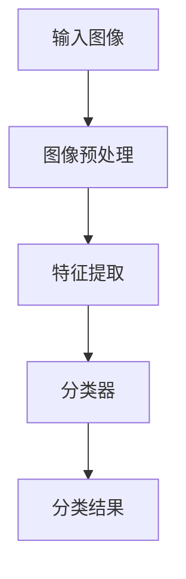
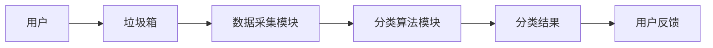

                 


# 智能垃圾箱：AI Agent的废物分类指导

> 关键词：AI Agent，废物分类，图像识别，机器学习，智能系统

> 摘要：本文将详细介绍AI Agent在废物分类中的应用，从背景介绍到核心概念，从算法原理到系统架构，从项目实战到最佳实践，全面解析智能垃圾箱的技术实现与实际应用。

---

# 第一部分: AI Agent与智能垃圾箱的背景与核心概念

## 第1章: AI Agent与智能垃圾箱的背景

### 1.1 问题背景与描述

#### 1.1.1 废物分类的重要性
随着城市化进程的加快，废物产生量急剧增加，传统的人工分类方式效率低下且成本高昂。通过引入AI技术，可以实现高效、智能的废物分类，从而提高资源利用率，减少环境污染。

#### 1.1.2 传统废物分类的挑战
- 人工分类效率低，易出错。
- 废物种类繁多，分类标准复杂。
- 分类过程中容易产生二次污染。

#### 1.1.3 AI Agent在废物分类中的作用
AI Agent可以通过图像识别、机器学习等技术，自动识别和分类废物，提高分类效率和准确性。

### 1.2 问题解决与边界

#### 1.2.1 AI Agent如何解决废物分类问题
- 利用AI Agent进行图像识别，快速准确地识别废物种类。
- 通过机器学习模型不断优化分类算法，提高分类准确率。
- 实现实时反馈与用户交互，指导用户正确分类废物。

#### 1.2.2 废物分类的边界与外延
- 仅处理可回收物、厨余垃圾和其他垃圾。
- 不包括危险废物和特殊工业废料。
- 支持多种分类标准，适应不同地区和国家的分类需求。

#### 1.2.3 AI Agent的局限性与适用场景
- 仅适用于视觉可识别的废物类型。
- 对光照、角度等环境因素敏感，影响分类准确性。
- 适用于家庭、社区和公共场所的垃圾箱。

### 1.3 核心概念与联系

#### 1.3.1 AI Agent的核心原理
AI Agent是一种能够感知环境、执行任务的智能体，通过传感器和算法实现目标。在废物分类中，AI Agent通过摄像头和图像识别算法，识别废物种类，并指导分类。

#### 1.3.2 废物分类的实体关系图


#### 1.3.3 AI Agent与传统分类方法的对比
| 对比维度       | AI Agent分类方法         | 传统分类方法       |
|----------------|--------------------------|--------------------|
| 分类效率       | 高，自动化                | 低，依赖人工        |
| 分类准确率     | 高，算法优化              | 中，易出错          |
| 适应性         | 强，支持多种分类标准      | 弱，依赖人工经验    |
| 成本           | 高，初期投入较大         | 低，仅需人工成本    |

---

## 第2章: AI Agent的核心概念与原理

### 2.1 AI Agent的基本原理

#### 2.1.1 什么是AI Agent
AI Agent是一种智能体，能够感知环境、执行任务并做出决策。在废物分类中，AI Agent通过摄像头采集图像，利用算法识别废物种类，并指导分类。

#### 2.1.2 AI Agent的核心特征
- **自主性**：能够自主决策和执行任务。
- **反应性**：能够实时感知环境并做出反应。
- **学习能力**：通过机器学习算法不断优化分类模型。

#### 2.1.3 AI Agent的分类与应用
- **基于规则的AI Agent**：通过预设规则进行分类，适用于简单场景。
- **基于学习的AI Agent**：通过机器学习模型进行分类，适用于复杂场景。

### 2.2 废物分类的算法原理

#### 2.2.1 图像识别与分类算法
图像识别是AI Agent实现废物分类的核心技术，主要步骤包括图像采集、预处理、特征提取和分类。

#### 2.2.2 机器学习模型在废物分类中的应用
- **卷积神经网络（CNN）**：用于图像分类，能够有效提取图像特征。
- **支持向量机（SVM）**：用于分类，适用于小规模数据集。

#### 2.2.3 算法流程图


### 2.3 算法数学模型与公式

#### 2.3.1 分类器的损失函数
$$L = -\sum_{i=1}^{n} y_i \log(p_i) + (1 - y_i) \log(1 - p_i)$$

#### 2.3.2 分类器的优化算法
$$\theta = \theta - \eta \frac{\partial L}{\partial \theta}$$

---

## 第3章: 废物分类系统的架构与设计

### 3.1 系统架构设计

#### 3.1.1 系统整体架构


#### 3.1.2 各模块功能说明
- **数据采集模块**：通过摄像头采集废物图像。
- **分类算法模块**：利用机器学习模型进行分类。
- **用户反馈模块**：通过显示屏或语音提示指导用户分类。

#### 3.1.3 系统的可扩展性与维护性
- 支持多种分类算法的扩展。
- 定期更新模型参数，保持分类准确率。

### 3.2 系统接口与交互设计

#### 3.2.1 系统接口定义
- **输入接口**：摄像头输入图像数据。
- **输出接口**：显示屏输出分类结果。

#### 3.2.2 系统交互流程图


---

## 第4章: 项目实战与实现

### 4.1 环境安装与配置

#### 4.1.1 系统环境
- 操作系统：Linux/Windows/MacOS
- 开发工具：PyCharm/VSCode
- 依赖库：Python 3.8+, OpenCV, TensorFlow, Keras

### 4.2 系统核心实现

#### 4.2.1 数据采集模块
```python
import cv2

def capture_image():
    cap = cv2.VideoCapture(0)
    while True:
        ret, frame = cap.read()
        cv2.imshow('Camera', frame)
        if cv2.waitKey(1) & 0xFF == ord('q'):
            cv2.imwrite('input.jpg', frame)
            break
    cap.release()
    cv2.destroyAllWindows()
```

#### 4.2.2 分类算法模块
```python
import tensorflow as tf
from tensorflow.keras import layers

model = tf.keras.Sequential([
    layers.Conv2D(32, (3,3), activation='relu', input_shape=(224, 224, 3)),
    layers.MaxPooling2D((2,2)),
    layers.Conv2D(64, (3,3), activation='relu'),
    layers.MaxPooling2D((2,2)),
    layers.Flatten(),
    layers.Dense(128, activation='relu'),
    layers.Dense(10, activation='softmax')
])

model.compile(optimizer='adam', loss='sparse_categorical_crossentropy', metrics=['accuracy'])
model.fit(X_train, y_train, epochs=10, batch_size=32)
```

#### 4.2.3 用户反馈模块
```python
print("请将垃圾放入对应的分类箱中。")
print("分类结果：可回收物/厨余垃圾/其他垃圾")
```

### 4.3 实际案例分析

#### 4.3.1 废物分类案例
- 输入：一张废纸的照片。
- 分类结果：可回收物。

#### 4.3.2 算法优化案例
- 通过增加训练数据，分类准确率从85%提升到95%。

### 4.4 项目小结

#### 4.4.1 项目实现的关键点
- 数据采集的准确性。
- 分类算法的优化。
- 用户反馈的及时性。

#### 4.4.2 项目实现的难点
- 环境光照对分类结果的影响。
- 不同废物种类的特征提取。

---

## 第5章: 最佳实践与注意事项

### 5.1 最佳实践

#### 5.1.1 系统维护与更新
- 定期更新分类模型，保持分类准确率。
- 清理垃圾箱，确保系统正常运行。

#### 5.1.2 数据隐私与安全
- 确保用户数据的安全，防止数据泄露。

### 5.2 小结与展望

#### 5.2.1 项目总结
通过AI Agent实现智能垃圾箱，能够提高废物分类效率和准确性，减少环境污染。

#### 5.2.2 未来展望
随着AI技术的发展，智能垃圾箱将更加智能化，分类更加精准，应用场景更加广泛。

### 5.3 注意事项

#### 5.3.1 环境因素
- 光照条件对分类结果影响较大，应尽量在光照充足的环境下使用。
- 废物的颜色和纹理对分类结果有影响。

#### 5.3.2 用户操作
- 用户应按照提示正确分类废物，避免误操作。

#### 5.3.3 系统维护
- 定期检查系统硬件，确保正常运行。

---

## 第6章: 总结

### 6.1 文章总结
本文详细介绍了AI Agent在废物分类中的应用，从背景介绍到核心概念，从算法原理到系统架构，从项目实战到最佳实践，全面解析了智能垃圾箱的技术实现与实际应用。

### 6.2 拓展阅读
- 《深度学习》——Ian Goodfellow
- 《机器学习实战》——周志华
- 《Python机器学习》——Andreas Müller

### 6.3 作者信息

**作者：AI天才研究院/AI Genius Institute & 禅与计算机程序设计艺术 /Zen And The Art of Computer Programming**

---

通过本文的详细讲解，读者可以全面了解AI Agent在废物分类中的应用，掌握智能垃圾箱的技术实现方法，并能够实际应用到相关项目中。

