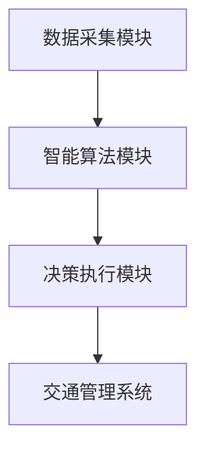

                 


# 智能城市规划中的AI Agent决策支持

## 关键词：
智能城市, AI Agent, 决策支持, 多智能体协作, 强化学习, 城市规划

## 摘要：
随着城市化进程的加快，传统城市规划模式面临着诸多挑战，如资源浪费、环境污染和交通拥堵等。AI Agent作为一种智能决策支持工具，能够通过数据驱动和智能算法优化城市规划过程，提高决策的科学性和效率。本文从AI Agent的基本原理出发，结合实际案例，详细探讨其在智能城市规划中的应用，包括算法实现、系统架构设计和项目实战等方面，为未来智能城市的建设提供理论和实践参考。

---

# 第1章 智能城市规划与AI Agent的背景介绍

## 1.1 智慧城市的定义与特征

### 1.1.1 智慧城市的定义
智慧城市建设是现代城市发展的重要方向，旨在通过信息技术和智能技术的融合，构建高效、环保、宜居的城市环境。智慧城市的本质是利用数据驱动的方法优化资源配置，提升城市运行效率。

### 1.1.2 智慧城市的核心特征
- **数据驱动**：依赖传感器、摄像头等设备实时采集城市数据。
- **智能化**：通过AI、大数据等技术实现城市系统的智能决策。
- **协作性**：不同部门和系统协同工作，实现城市资源的优化配置。
- **动态适应性**：能够根据城市运行状态实时调整决策策略。

### 1.1.3 智慧城市的发展现状与趋势
目前，全球许多城市已经开始智慧化转型，如交通管理、能源优化等领域。未来，智慧城市建设将更加注重人机协作，AI Agent将在城市规划中发挥越来越重要的作用。

---

## 1.2 传统城市规划的局限性

### 1.2.1 传统城市规划的模式与问题
传统城市规划依赖人工经验和静态数据，存在以下问题：
- **决策滞后**：缺乏实时数据支持，决策不够及时。
- **资源浪费**：资源分配不均，导致城市运行效率低下。
- **缺乏动态调整**：无法根据实际情况灵活调整规划方案。

### 1.2.2 城市化进程中面临的挑战
- 人口增长导致城市资源紧张。
- 环境问题日益突出，如空气污染、水污染等。
- 交通拥堵问题加剧。

### 1.2.3 传统决策支持系统的局限性
传统决策支持系统依赖专家经验，缺乏智能化和数据驱动能力，难以应对复杂的城市问题。

---

## 1.3 AI Agent在智能城市规划中的作用

### 1.3.1 AI Agent的基本概念
AI Agent是一种能够感知环境、自主决策并执行任务的智能体。在智能城市中，AI Agent可以用于交通优化、资源分配等领域。

### 1.3.2 AI Agent在城市规划中的应用价值
- **提高决策效率**：通过实时数据和智能算法优化资源配置。
- **增强系统灵活性**：能够根据城市运行状态动态调整决策策略。
- **降低人为错误**：通过智能化决策减少人为失误。

### 1.3.3 智能城市规划中的AI Agent决策支持的必要性
AI Agent能够通过数据驱动的方式优化城市规划，提升城市运行效率，是智慧城市建设的重要工具。

---

# 第2章 AI Agent决策支持的核心概念与联系

## 2.1 AI Agent的基本原理

### 2.1.1 AI Agent的定义与分类
AI Agent可以分为简单反射Agent和基于模型的反射Agent。简单反射Agent基于规则做出决策，而基于模型的反射Agent能够学习和优化决策策略。

### 2.1.2 AI Agent的核心特征
- **自主性**：能够自主决策。
- **反应性**：能够感知环境并实时调整行为。
- **协作性**：能够与其他Agent协同工作。

### 2.1.3 AI Agent与传统决策支持系统的区别
AI Agent具有自主性和学习能力，能够动态调整决策策略，而传统决策支持系统依赖人工干预。

---

## 2.2 智能城市规划中的AI Agent决策支持系统架构

### 2.2.1 系统架构的组成与功能
AI Agent决策支持系统包括数据采集模块、智能算法模块和决策执行模块。

### 2.2.2 系统各模块之间的关系
数据采集模块提供实时数据，智能算法模块进行数据处理和决策优化，决策执行模块将决策结果反馈到城市系统中。

### 2.2.3 系统的输入输出流程
- 输入：城市运行数据、用户需求。
- 输出：优化后的决策方案。

---

## 2.3 AI Agent决策支持的核心要素

### 2.3.1 数据源与数据处理
AI Agent需要实时采集城市运行数据，并进行清洗、融合和分析。

### 2.3.2 智能算法与模型
AI Agent通过强化学习和多智能体协作算法优化决策策略。

### 2.3.3 系统交互与反馈机制
AI Agent与城市系统进行实时交互，并根据反馈结果动态调整决策策略。

---

# 第3章 AI Agent决策支持的算法原理

## 3.1 强化学习算法

### 3.1.1 强化学习的基本原理
强化学习通过智能体与环境的交互，学习最优决策策略。核心概念包括状态、动作、奖励和策略。

### 3.1.2 Q-learning算法的数学模型
Q-learning算法通过更新Q值表来优化决策策略：
$$ Q(s,a) = Q(s,a) + \alpha (r + \gamma \max Q(s',a') - Q(s,a)) $$

### 3.1.3 算法的实现步骤与代码示例
```python
import numpy as np

# 初始化Q表
Q = np.zeros((state_space, action_space))

# 定义Q-learning算法
def q_learning():
    for episode in range(episodes):
        state = env.reset()
        for _ in range(max_steps):
            action = np.argmax(Q[state])
            new_state, reward, done = env.step(action)
            Q[state][action] += alpha * (reward + gamma * np.max(Q[new_state]) - Q[state][action])
            state = new_state
            if done:
                break

q_learning()
```

---

## 3.2 多智能体协作算法

### 3.2.1 多智能体协作的基本原理
多智能体协作通过多个AI Agent协同工作，实现复杂任务的优化决策。

### 3.2.2 多智能体协作的数学模型
多智能体协作可以通过分布式强化学习实现，每个智能体独立学习并共享经验。

### 3.2.3 算法的实现步骤与代码示例
```python
import numpy as np

# 初始化多个智能体
agents = [Agent() for _ in range(num_agents)]

# 定义多智能体协作算法
def multi_agent Collaboration():
    for agent in agents:
        state = env.reset()
        while not done:
            action = agent.decide(state)
            new_state, reward, done = env.step(action)
            agent.learn(state, action, reward, new_state)
            state = new_state

multi_agent Collaboration()
```

---

## 3.3 算法在智能城市规划中的应用

### 3.3.1 算法在城市交通优化中的应用
通过强化学习优化交通信号灯控制，缓解交通拥堵问题。

### 3.3.2 算法在资源分配中的应用
通过多智能体协作优化能源分配，降低资源浪费。

---

# 第4章 系统分析与架构设计方案

## 4.1 问题场景介绍
本文设计的AI Agent决策支持系统用于优化城市交通流量，减少拥堵问题。

## 4.2 系统功能设计
- 数据采集模块：实时采集交通流量数据。
- 智能算法模块：通过强化学习优化交通信号灯控制。
- 决策执行模块：将优化后的控制策略发送到交通管理系统。

## 4.3 系统架构设计


## 4.4 系统接口设计
- 数据接口：与交通传感器连接，获取实时数据。
- 控制接口：与交通信号灯连接，执行控制策略。

---

## 4.5 系统交互流程
1. 数据采集模块获取交通流量数据。
2. 智能算法模块进行数据处理和决策优化。
3. 决策执行模块将优化结果发送到交通管理系统。

---

# 第5章 项目实战

## 5.1 环境安装
- 安装Python和相关库（如numpy、keras）。
- 安装交通管理系统的API接口。

## 5.2 系统核心实现源代码
```python
import numpy as np
import keras

# 定义神经网络模型
model = keras.Sequential([
    keras.layers.Dense(128, activation='relu'),
    keras.layers.Dense(10, activation='softmax')
])

# 编译模型
model.compile(optimizer='adam', loss='sparse_categorical_crossentropy', metrics=['accuracy'])

# 训练模型
model.fit(X_train, y_train, epochs=10, batch_size=32)
```

---

## 5.3 代码应用解读与分析
训练好的神经网络模型可以用于分类交通流量数据，优化交通信号灯控制策略。

---

## 5.4 实际案例分析
通过实际案例分析，验证AI Agent决策支持系统在城市交通优化中的效果。

---

## 5.5 项目小结
本项目展示了AI Agent在智能城市规划中的应用潜力，为未来智慧城市建设提供了参考。

---

# 第6章 最佳实践与总结

## 6.1 最佳实践 tips
- 数据质量是AI Agent决策支持系统的核心，确保数据的实时性和准确性。
- 在实际应用中，需要结合城市特点调整算法参数。
- 定期更新系统模型，以应对城市运行状态的变化。

## 6.2 小结
本文详细探讨了AI Agent在智能城市规划中的应用，包括算法实现和系统设计等方面。

## 6.3 注意事项
- 确保系统安全性和稳定性。
- 遵守相关法律法规，保护用户隐私。

## 6.4 拓展阅读
推荐阅读《强化学习入门》和《分布式系统设计》等书籍，深入理解AI Agent和多智能体协作的原理。

---

# 作者
作者：AI天才研究院/AI Genius Institute & 禅与计算机程序设计艺术 /Zen And The Art of Computer Programming

---

通过以上思考步骤，我们可以逐步构建一篇关于《智能城市规划中的AI Agent决策支持》的技术博客文章。

