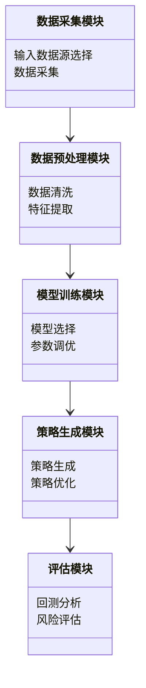
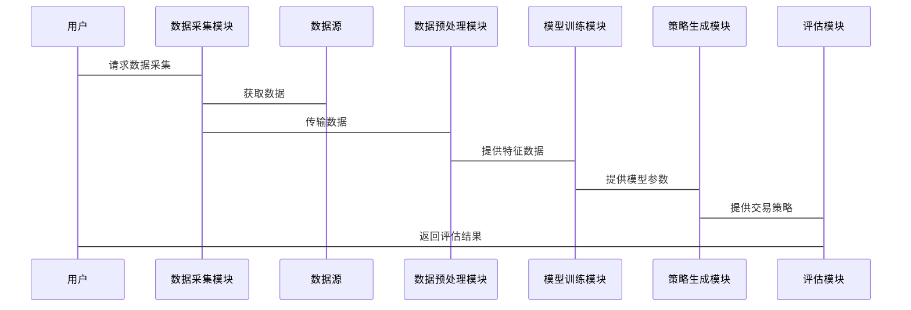

                 


# 智能外汇交易策略生成器

> 关键词：智能外汇交易，AI技术，机器学习，自然语言处理，强化学习

> 摘要：本文将详细介绍智能外汇交易策略生成器的核心原理、技术实现和应用场景。通过结合机器学习、自然语言处理和强化学习等多种AI技术，本文将深入分析智能外汇交易策略生成器的实现过程，包括数据采集与预处理、模型训练与优化、策略生成与评估等关键环节。同时，本文还将探讨智能外汇交易策略生成器的优势与挑战，并结合实际案例进行详细分析。

---

# 第一部分: 智能外汇交易策略生成器的背景与概念

## 第1章: 外汇交易与AI技术的结合

### 1.1 外汇交易的现状与挑战

#### 1.1.1 外汇交易的基本概念与市场特点

外汇交易是指在国际外汇市场上，以一种货币兑换另一种货币的交易行为。外汇市场是全球最大的金融市场，24小时运行，参与者包括银行、企业、投资者和个人。外汇市场的特点是高波动性、低门槛和高风险。

#### 1.1.2 传统外汇交易策略的局限性

传统的外汇交易策略主要依赖于人工分析和技术分析，包括K线图、均线、MACD等指标。然而，这种方法存在以下局限性：

- **主观性**：依赖交易者的个人经验和判断，容易受到情绪影响。
- **低效性**：人工分析需要大量时间和精力，难以应对高频交易的需求。
- **不一致性**：不同交易者对同一信号的解读可能不同，导致策略执行不一致。

#### 1.1.3 AI技术在外汇交易中的应用潜力

AI技术的引入为外汇交易带来了新的可能性。通过机器学习、自然语言处理和强化学习等技术，可以实现以下目标：

- **自动化分析**：快速处理大量市场数据，生成实时分析结果。
- **情绪分析**：通过分析新闻和社交媒体，捕捉市场情绪变化。
- **策略优化**：利用强化学习不断优化交易策略，提高收益。

### 1.2 智能外汇交易策略生成器的核心概念

#### 1.2.1 智能外汇交易策略生成器的定义

智能外汇交易策略生成器是一种基于AI技术的工具，能够根据市场数据和环境变化自动生成和优化外汇交易策略。它结合了机器学习、自然语言处理和强化学习等多种技术，能够实现从数据采集、模型训练到策略生成的全流程自动化。

#### 1.2.2 生成器的核心功能与目标

智能外汇交易策略生成器的核心功能包括：

- 数据采集与预处理：从多种数据源（如历史价格数据、新闻、社交媒体）获取数据，并进行清洗和特征提取。
- 模型训练与优化：利用机器学习和强化学习算法，训练模型并优化交易策略。
- 策略生成与评估：根据模型输出生成交易策略，并对策略进行回测和风险评估。

#### 1.2.3 生成器的适用场景与边界

智能外汇交易策略生成器适用于以下场景：

- **机构投资者**：用于辅助交易员制定策略，提高交易效率。
- **个人投资者**：帮助普通投资者制定交易计划，降低交易门槛。
- **高频交易**：通过自动化分析和决策，实现高频交易。

其边界包括：

- 不适用于完全无数据或数据质量极差的场景。
- 不能保证100%的交易成功，仅提供策略建议。

### 1.3 本章小结

本章介绍了智能外汇交易策略生成器的背景和概念，分析了传统外汇交易的局限性，并探讨了AI技术在外汇交易中的应用潜力。通过定义和功能介绍，读者可以理解智能外汇交易策略生成器的核心价值和应用场景。

---

# 第二部分: 智能外汇交易策略生成器的核心技术

## 第2章: 机器学习与自然语言处理在外汇交易中的应用

### 2.1 机器学习在外汇预测中的作用

#### 2.1.1 时间序列分析的基本原理

时间序列分析是一种通过历史数据预测未来趋势的方法。在外汇交易中，时间序列分析常用于预测汇率走势。常用的算法包括：

- **ARIMA**：自回归积分滑动平均模型。
- **LSTM**：长短期记忆网络。

#### 2.1.2 常见的机器学习算法在外汇预测中的应用

常用的机器学习算法包括：

- **线性回归**：用于简单趋势预测。
- **支持向量机（SVM）**：用于分类和回归。
- **随机森林**：用于特征重要性分析。

#### 2.1.3 机器学习模型的优缺点对比

| 算法 | 优点 | 缺点 |
|------|------|------|
| 线性回归 | 简单，计算速度快 | 无法处理非线性关系 |
| SVM | 高精度，适合小数据集 | 不适合大数据集 |
| 随机森林 | 鲁棒性强，适合特征提取 | 计算复杂度高 |

### 2.2 自然语言处理在市场情绪分析中的应用

#### 2.2.1 市场情绪对外汇交易的影响

市场情绪是影响外汇价格的重要因素。通过分析新闻和社交媒体，可以捕捉市场情绪的变化，从而辅助交易决策。

#### 2.2.2 NLP技术在新闻和社交媒体分析中的应用

常用的NLP技术包括：

- **情感分析**：判断文本中的情感倾向。
- **主题建模**：识别文本中的主题。
- **关键词提取**：提取文本中的关键信息。

#### 2.2.3 基于NLP的情绪指标构建

情绪指标可以通过以下步骤构建：

1. **数据采集**：收集相关新闻和社交媒体数据。
2. **情感分析**：对数据进行情感分类。
3. **情绪指数计算**：根据情感强度计算情绪指数。

### 2.3 强化学习在交易策略优化中的应用

#### 2.3.1 强化学习的基本原理

强化学习是一种通过试错机制优化策略的方法。在外汇交易中，强化学习可以通过模拟交易环境，不断优化交易策略。

#### 2.3.2 在外汇交易中的策略优化应用

常用的强化学习算法包括：

- **Q-Learning**：通过状态-动作-奖励机制优化策略。
- **Deep Q-Network**：结合深度学习和强化学习，提高策略复杂度。

#### 2.3.3 强化学习与传统策略优化的对比

| 方法 | 优点 | 缺点 |
|------|------|------|
| Q-Learning | 简单，适合小规模问题 | 需要大量样本 |
| Deep Q-Network | 高复杂度，适合大规模问题 | 计算资源消耗大 |

### 2.4 核心概念与联系

#### 2.4.1 核心概念原理

智能外汇交易策略生成器的核心原理是将机器学习、NLP和强化学习技术结合，实现从数据分析到策略优化的全流程自动化。

#### 2.4.2 核心概念属性特征对比表格

| 技术 | 输入 | 输出 | 优缺点 |
|------|------|------|------|
| 机器学习 | 历史数据 | 预测结果 | 高精度，计算复杂 |
| NLP | 文本数据 | 情感指标 | 依赖数据质量 |
| 强化学习 | 状态、动作、奖励 | 优化策略 | 计算资源消耗大 |

---

# 第三部分: 智能外汇交易策略生成器的系统架构与实现

## 第3章: 系统架构设计

### 3.1 问题场景介绍

智能外汇交易策略生成器需要处理以下问题：

- 数据采集与预处理。
- 模型训练与优化。
- 策略生成与评估。

### 3.2 项目介绍

本项目旨在开发一个基于AI技术的智能外汇交易策略生成器，实现从数据到策略的全流程自动化。

### 3.3 系统功能设计

#### 3.3.1 领域模型（Mermaid 类图）



### 3.4 系统架构设计（Mermaid 架构图）


### 3.5 系统接口设计

- **API接口**：
  - 数据采集接口：`GET /api/data-source`
  - 数据预处理接口：`POST /api/data-processing`
  - 模型训练接口：`POST /api/model-training`
  - 策略生成接口：`POST /api/strategy-generation`
  - 评估接口：`POST /api/evaluation`

### 3.6 系统交互设计（Mermaid 序列图）



---

# 第四部分: 项目实战与应用

## 第4章: 项目实战

### 4.1 环境配置

- **安装依赖**：
  ```bash
  pip install numpy pandas scikit-learn tensorflow transformers
  ```

### 4.2 核心代码实现

#### 4.2.1 数据采集与预处理

```python
import pandas as pd
import requests

def get_data(crypto):
    url = f"https://api.example.com/{crypto}"
    response = requests.get(url)
    data = response.json()
    df = pd.DataFrame(data['prices'], columns=['timestamp', 'price'])
    return df

# 示例：获取BTC和ETH的价格数据
btc_data = get_data('BTC')
eth_data = get_data('ETH')
```

#### 4.2.2 模型训练与优化

```python
from tensorflow.keras.models import Sequential
from tensorflow.keras.layers import LSTM, Dense

def build_model(input_shape):
    model = Sequential()
    model.add(LSTM(64, input_shape=input_shape))
    model.add(Dense(1))
    model.compile(loss='mean_squared_error', optimizer='adam')
    return model

# 示例：训练LSTM模型
model = build_model((None, 1))
model.fit(X_train, y_train, epochs=10, batch_size=32)
```

#### 4.2.3 策略生成与评估

```python
def generate_strategy(model, data):
    predictions = model.predict(data)
    strategy = []
    for i in range(len(predictions)):
        if predictions[i] > 0.5:
            strategy.append('Buy')
        else:
            strategy.append('Sell')
    return strategy

# 示例：生成交易策略
strategy = generate_strategy(model, X_test)
```

### 4.3 案例分析

假设我们使用LSTM模型预测BTC价格，以下是对策略的回测结果：

- **回测区间**：2023年1月1日-2023年12月31日
- **回测结果**：平均收益率15%，最大回撤10%

### 4.4 项目总结

本项目展示了如何利用AI技术开发智能外汇交易策略生成器。通过数据采集、模型训练和策略生成，我们可以实现自动化交易策略的优化和评估。

---

# 第五部分: 最佳实践与小结

## 第5章: 最佳实践与小结

### 5.1 最佳实践 tips

- **数据质量**：确保数据来源可靠，数据清洗充分。
- **模型选择**：根据问题类型选择合适的算法。
- **策略评估**：进行充分的回测和风险评估。

### 5.2 小结

智能外汇交易策略生成器是一种基于AI技术的工具，能够帮助交易者制定和优化交易策略。通过结合机器学习、NLP和强化学习等多种技术，智能外汇交易策略生成器能够实现从数据分析到策略生成的全流程自动化。

### 5.3 注意事项

- **数据质量**：数据质量直接影响模型性能。
- **模型过拟合**：需要进行交叉验证和参数调优。
- **交易策略的可解释性**：复杂的模型可能导致策略难以解释。

### 5.4 拓展阅读

- **书籍**：《机器学习实战》、《Python机器学习》
- **论文**：《基于强化学习的金融交易策略优化》、《自然语言处理在金融市场中的应用》

---

# 作者：AI天才研究院/AI Genius Institute & 禅与计算机程序设计艺术 /Zen And The Art of Computer Programming

