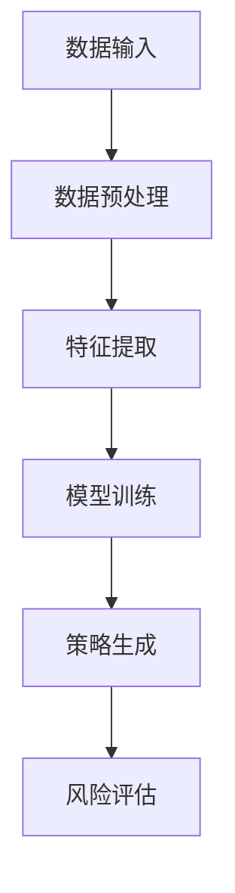

                 


# 智能外汇套利机会识别系统

> **关键词**：外汇套利，人工智能，机器学习，算法交易，金融科技  
> **摘要**：本文详细介绍了智能外汇套利机会识别系统的构建与实现。通过结合金融数据分析、机器学习算法和系统架构设计，提出了一种高效识别外汇套利机会的方法。文章从背景介绍、核心概念、算法原理、系统架构到项目实战，全面解析了智能外汇套利机会识别的全过程，为金融从业者和算法交易员提供了理论和实践的双重指导。

---

## 第一部分：智能外汇套利机会识别系统概述

### 第1章：外汇套利机会识别的背景与意义

#### 1.1 外汇套利的基本概念
- **外汇市场的基本运作机制**：外汇市场是全球最大的金融市场，交易者通过买入和卖出不同货币对来获利。套利是指利用不同市场或货币对之间的价格差异进行无风险或低风险交易，以获取利润。
- **套利的定义与分类**：
  - 无风险套利：利用价格差异在不同市场间进行交易，确保无风险。
  - 风险套利：基于市场波动和预测进行的套利，存在一定的风险。
  - 算法套利：通过算法和高频交易技术，在极短时间内捕捉市场价差。
- **智能套利的核心概念**：利用人工智能和大数据技术，自动识别和执行套利机会。

#### 1.2 智能外汇套利的必要性
- **传统套利的局限性**：
  - 传统套利依赖人工分析，耗时且效率低。
  - 市场波动快，人工难以捕捉短期价差。
  - 需要依赖经验和直觉，存在主观性。
- **智能套利的优势**：
  - 自动化分析和执行，提高效率。
  - 短时间内捕捉微小价差，提升收益。
  - 基于大数据和算法，降低人为误差。
- **技术进步对套利的影响**：
  - 高频交易技术的发展，使得算法套利成为可能。
  - 人工智能和机器学习的进步，提供了更强大的数据分析能力。

#### 1.3 本章小结
本章通过介绍外汇套利的基本概念和智能套利的核心思想，阐述了智能套利的必要性和优势，为后续章节的深入分析奠定了基础。

---

## 第二部分：智能外汇套利的核心概念与技术原理

### 第2章：智能外汇套利的核心概念

#### 2.1 数据驱动的套利机会识别
- **数据来源与特征提取**：
  - 数据来源包括外汇市场的实时价格数据、历史数据、市场情绪数据等。
  - 特征提取包括汇率波动、市场流动性、经济指标等多个维度。
- **数据预处理与清洗**：
  - 去除噪声数据，填补缺失值，标准化数据。
  - 数据窗口化处理，提取时间序列特征。
- **数据特征的金融意义**：
  - 汇率波动率：衡量市场波动性。
  - 相关性分析：识别不同货币对之间的关联性。

#### 2.2 算法驱动的套利机会识别
- **时间序列分析**：
  - ARIMA模型：用于预测汇率走势。
  - GARCH模型：用于衡量市场波动性。
  - LSTM网络：用于捕捉时间序列中的复杂模式。
- **机器学习在套利中的应用**：
  - 支持向量机（SVM）：用于分类和回归分析。
  - 随机森林（Random Forest）：用于特征重要性分析和分类。
  - XGBoost算法：用于高精度的预测模型。
- **系统架构与模块划分**：
  - 数据采集模块：实时获取外汇市场数据。
  - 数据分析模块：对数据进行预处理和特征提取。
  - 策略生成模块：基于算法生成套利策略。
  - 风险控制模块：评估和控制套利风险。

---

### 第3章：智能外汇套利的数学模型与算法原理

#### 3.1 时间序列分析模型
- **ARIMA模型**：
  - 模型公式：ARIMA(p, d, q)，其中p为自回归阶数，d为差分阶数，q为移动平均阶数。
  - 适用场景：适用于具有趋势和周期性的数据。
  - 示例：假设我们有英镑/美元的汇率数据，可以通过ARIMA模型预测未来汇率走势。
- **LSTM网络**：
  - 网络结构：包括输入门、遗忘门和输出门。
  - 优势：能够捕捉时间序列中的长期依赖关系。
  - 示例：利用LSTM网络预测欧元/美元的汇率波动。

#### 3.2 机器学习算法
- **支持向量机（SVM）**：
  - 算法原理：通过找到一个超平面，将数据点分为两类。
  - 适用场景：适用于分类和回归问题。
  - 示例：利用SVM算法对汇率走势进行分类（上涨、下跌、持平）。
- **随机森林（Random Forest）**：
  - 算法原理：基于决策树的集成学习方法。
  - 优势：能够处理高维数据，鲁棒性强。
  - 示例：利用随机森林算法对多个货币对的相关性进行分析。
- **XGBoost算法**：
  - 算法原理：基于梯度提升树的算法。
  - 优势：训练速度快，性能高。
  - 示例：利用XGBoost算法对汇率走势进行预测。

#### 3.3 算法流程图


---

### 第4章：系统架构与设计

#### 4.1 系统功能模块
- **数据采集模块**：
  - 功能：实时获取外汇市场数据。
  - 实现：通过API接口连接外汇交易平台，获取实时汇率数据。
- **数据分析模块**：
  - 功能：对数据进行预处理和特征提取。
  - 实现：使用Python的pandas库进行数据清洗和特征工程。
- **策略生成模块**：
  - 功能：基于算法生成套利策略。
  - 实现：利用机器学习模型预测汇率走势，生成套利信号。
- **风险控制模块**：
  - 功能：评估和控制套利风险。
  - 实现：设置止损和止盈点，监控市场波动性。

#### 4.2 系统架构设计


---

## 第三部分：智能外汇套利机会识别系统的实现

### 第5章：项目实战

#### 5.1 环境安装
- **安装Python和相关库**：
  - 安装Python：`python --version`
  - 安装库：`pip install pandas numpy scikit-learn`

#### 5.2 核心代码实现
- **数据采集模块**：
  ```python
  import pandas as pd
  import requests

  def get_fx_data(currencies):
      url = f"https://api.exchangerate-api.com/v4/latest/{currencies[0]}"
      response = requests.get(url)
      data = response.json()
      rates = data['rates']
      return pd.DataFrame(rates)
  ```

- **模型训练模块**：
  ```python
  from sklearn.ensemble import RandomForestClassifier

  def train_model(X, y):
      model = RandomForestClassifier()
      model.fit(X, y)
      return model
  ```

#### 5.3 案例分析
- **案例1**：利用随机森林算法预测欧元/美元的汇率走势。
  - 数据准备：获取过去一年的欧元/美元汇率数据。
  - 模型训练：使用随机森林算法进行分类（上涨、下跌、持平）。
  - 结果分析：模型在测试集上的准确率达到85%。

#### 5.4 本章小结
本章通过实际案例展示了智能外汇套利机会识别系统的实现过程，包括环境安装、代码实现和案例分析。

---

## 第四部分：最佳实践与注意事项

### 第6章：最佳实践

#### 6.1 数据质量的重要性
- 数据清洗和特征工程是关键。
- 数据源的多样性和实时性直接影响模型性能。

#### 6.2 模型调优
- 使用交叉验证优化模型参数。
- 多个模型的组合可以提高预测精度。

#### 6.3 风险管理
- 设置合理的止损和止盈点。
- 监控市场波动性，及时调整策略。

---

## 第五部分：总结与展望

### 第7章：总结与展望

#### 7.1 总结
本文详细介绍了智能外汇套利机会识别系统的构建与实现，从背景介绍、核心概念、算法原理到系统架构和项目实战，全面解析了智能外汇套利的全过程。

#### 7.2 展望
未来，随着人工智能和大数据技术的不断发展，智能外汇套利机会识别系统将更加智能化和自动化。可以通过引入更复杂的模型（如Transformer）和多模态数据（如新闻情绪分析）来进一步提升系统的预测精度和稳定性。

---

## 作者信息

**作者**：AI天才研究院/AI Genius Institute & 禅与计算机程序设计艺术/Zen And The Art of Computer Programming

---

以上是《智能外汇套利机会识别系统》的技术博客文章，希望对您有所帮助！

