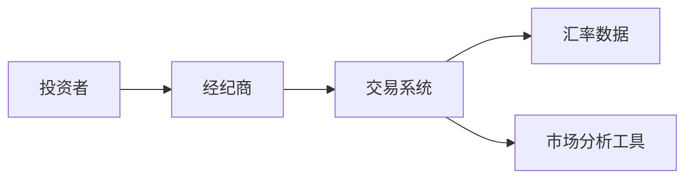
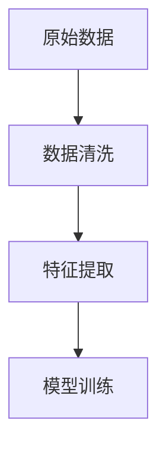
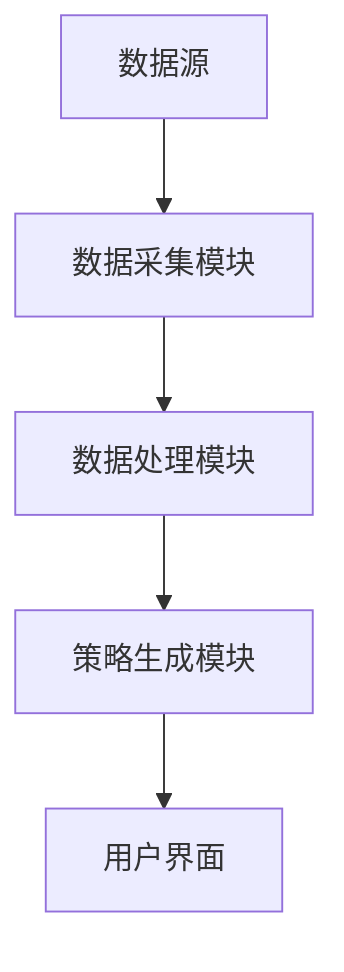

                 


# 智能外汇风险对冲策略生成器

> **关键词**：智能外汇、风险对冲、机器学习、时间序列分析、系统架构

> **摘要**：本文详细介绍了智能外汇风险对冲策略生成器的设计与实现，涵盖外汇市场的背景、智能对冲的核心概念、算法原理、系统架构、项目实战以及未来展望。通过结合机器学习和时间序列分析，提出了一种高效的智能对冲策略生成方法，并通过实际案例展示了其应用效果。

---

## 第1章：外汇市场与风险对冲概述

### 1.1 外汇市场的基本概念

外汇市场是全球最大的金融市场，参与者包括银行、企业和个人。交易货币对的汇率受多种因素影响，如经济指标、政治事件和市场情绪。

#### 1.1.1 外汇市场的结构

| 组织形式 | 特点 | 主要参与者 |
|----------|------|------------|
| 场外交易 | 分散、无固定场所 | 银行、企业、个人 |
| 场内交易 | 集中、有固定场所 | 交易所、经纪商 |

**Mermaid图：外汇市场实体关系**



### 1.2 风险对冲的必要性

外汇交易中的主要风险包括市场风险、信用风险和流动性风险。传统对冲策略依赖人工判断，存在滞后性和局限性。

#### 1.2.1 风险对冲的基本原理

通过建立相反头寸来抵消风险，常用工具包括期货和期权。

### 1.3 智能对冲策略的引入

智能对冲利用AI和大数据分析，动态调整对冲策略，提高效率和准确性。

---

## 第2章：智能对冲策略的核心概念

### 2.1 数据驱动的对冲策略

#### 2.1.1 数据采集与处理

从实时数据源获取汇率数据，清洗和预处理数据。

#### 2.1.2 数据特征提取

提取关键特征，如波动率和趋势，使用统计方法或机器学习模型。

**Mermaid图：数据流**



### 2.2 机器学习在对冲中的应用

#### 2.2.1 机器学习算法

- **监督学习**：回归和分类模型。
- **无监督学习**：聚类分析。

---

## 第3章：基于机器学习的对冲算法

### 3.1 时间序列预测算法

#### 3.1.1 ARIMA模型

ARIMA（自回归积分滑动平均模型）用于预测时间序列数据。

$$ ARIMA(p, d, q) $$

其中，p为自回归阶数，d为差分阶数，q为移动平均阶数。

#### 3.1.2 LSTM网络

LSTM（长短期记忆网络）适用于捕捉长期依赖关系。

**代码示例：LSTM实现**

```python
import keras
from keras.layers import LSTM, Dense
model = Sequential()
model.add(LSTM(64, input_shape=(timesteps, features)))
model.add(Dense(1))
model.compile(loss='mean_squared_error', optimizer='adam')
```

### 3.2 风险评估与优化

#### 3.2.1 VaR模型

风险价值模型用于估计潜在损失。

$$ VaR = \alpha \cdot \sigma $$

其中，α为置信水平，σ为标准差。

#### 3.2.2 最小二乘法优化

使用最小二乘法优化对冲组合。

**代码示例：最小二乘法**

```python
import numpy as np
X = np.array([...])
y = np.array([...])
model = LinearRegression().fit(X, y)
```

---

## 第4章：系统架构与设计

### 4.1 系统功能模块

- **数据采集模块**：实时获取汇率数据。
- **数据处理模块**：清洗和特征提取。
- **策略生成模块**：训练模型并生成策略。

#### 4.1.2 系统架构设计

**Mermaid图：系统架构**



---

## 第5章：项目实战与案例分析

### 5.1 环境配置与安装

- **开发环境**：Python 3.8+，Jupyter Notebook。
- **依赖库**：pandas、numpy、keras、matplotlib。

### 5.2 核心功能实现

#### 5.2.1 数据采集与预处理

```python
import pandas as pd
data = pd.read_csv('exchange_rates.csv')
data = data.dropna()
```

#### 5.2.2 策略生成与优化

```python
from sklearn.linear_model import LinearRegression
model = LinearRegression().fit(X, y)
predictions = model.predict(X_test)
```

### 5.3 案例分析

通过实际数据训练模型，验证策略的有效性，分析结果并优化参数。

---

## 第6章：总结与展望

智能外汇风险对冲策略生成器结合AI和大数据分析，显著提高了对冲效率。未来，随着技术进步，策略将更加智能化和个性化。

### 注意事项

- 数据质量影响模型性能。
- 模型需定期更新以适应市场变化。
- 风险管理是策略成功的关键。

### 作者

作者：AI天才研究院 & 禅与计算机程序设计艺术

