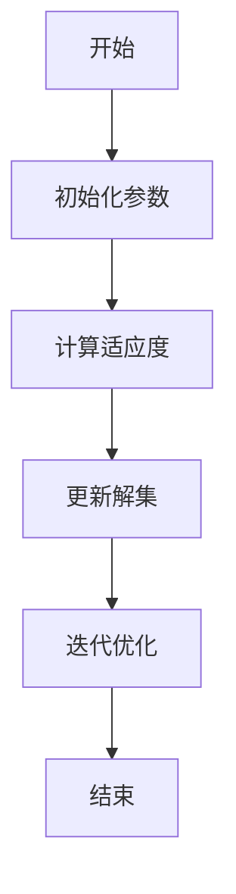
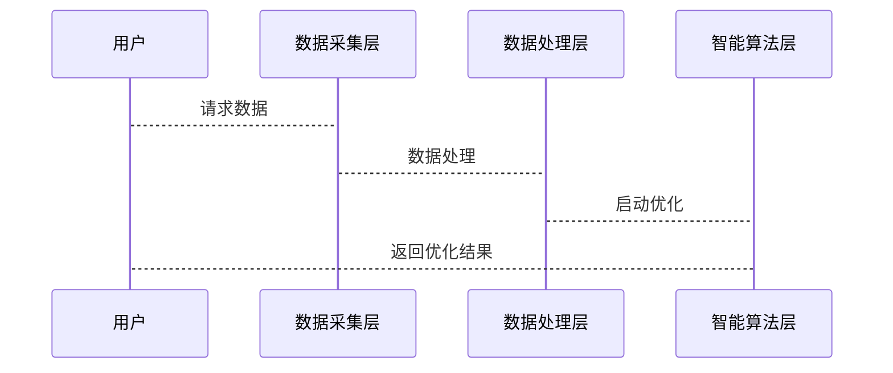

                 


# 智能外汇风险敞口管理优化系统

## 关键词
智能外汇风险管理，风险敞口优化，算法优化，系统架构，项目实战

## 摘要
本文介绍智能外汇风险敞口管理优化系统，涵盖背景、核心概念、算法原理、系统架构设计及项目实战。通过数学模型和智能算法，优化外汇风险管理，降低潜在风险，提升企业财务管理能力。

---

# 第一部分: 智能外汇风险敞口管理优化系统背景介绍

## 第1章: 外汇风险敞口管理概述

### 1.1 外汇风险敞口的定义与问题背景

#### 1.1.1 外汇风险的基本概念
外汇风险是指由于汇率波动导致的外汇资产或负债价值变化的风险。主要类型包括交易风险、折算风险和经济风险。

#### 1.1.2 风险敞口的定义与分类
风险敞口是企业在外汇交易中因汇率波动而产生的潜在损失。分类包括：
- 交易性敞口：因未结算交易产生的敞口。
- 利率风险敞口：因利率变化导致的汇率变动风险。
- 操作性敞口：因交易操作产生的敞口。

#### 1.1.3 智能化管理的必要性
传统管理方法依赖人工判断，效率低，且难以应对复杂市场变化。智能化管理利用AI和大数据，提高精准度和效率。

### 1.2 外汇风险敞口管理的现状与挑战

#### 1.2.1 传统管理方法的局限性
传统方法依赖历史数据和经验判断，缺乏实时性和动态调整能力，难以应对复杂多变的市场环境。

#### 1.2.2 数字化与智能化转型的需求
随着全球化深入，外汇市场波动加剧，企业需要更高效的管理工具，智能化管理成为必然趋势。

#### 1.2.3 全球化背景下的风险管理复杂性
全球经济一体化导致外汇市场高度波动，企业面临更多不确定性，风险管理更加复杂。

### 1.3 智能外汇风险敞口管理优化系统的目标与意义

#### 1.3.1 提高风险管理效率
通过智能算法和实时数据分析，快速识别和评估风险，优化决策。

#### 1.3.2 降低潜在风险损失
及时调整策略，减少因汇率波动导致的损失。

#### 1.3.3 优化企业财务管理能力
提升整体财务决策的准确性和效率，增强企业竞争力。

## 第2章: 智能外汇风险敞口管理优化系统的核心概念

### 2.1 智能外汇风险敞口管理优化系统的定义

#### 2.1.1 系统的核心目标
通过智能算法优化外汇风险敞口，降低潜在损失，提高管理效率。

#### 2.1.2 系统的主要功能模块
包括数据采集、风险评估、优化算法、策略制定和实时监控。

#### 2.1.3 系统的适用范围
适用于跨国企业、金融机构和外汇交易公司。

### 2.2 核心概念与联系

#### 2.2.1 外汇市场波动与风险敞口的关系
汇率波动直接影响风险敞口的价值变化，企业需实时监控和调整。

#### 2.2.2 智能算法在风险管理中的应用
智能算法（如遗传算法、粒子群优化）用于优化风险敞口，提高决策效率。

#### 2.2.3 系统架构与功能模块的实体关系图

```mermaid
erd
    title 实体关系图
    外汇市场 -> 风险敞口: 产生
    风险敞口 -> 智能算法: 优化
    智能算法 -> 管理系统: 实现
```

---

# 第二部分: 智能外汇风险敞口管理优化系统的算法原理

## 第3章: 风险敞口优化算法

### 3.1 风险敞口优化算法概述

#### 3.1.1 算法的基本原理
优化算法通过模拟自然进化或群体行为，寻找最优解。常用算法包括遗传算法（GA）和粒子群优化（PSO）。

#### 3.1.2 算法的核心思想
基于适应度函数，通过迭代优化找到最小化风险敞口的解。

#### 3.1.3 算法的实现步骤
1. 初始化参数。
2. 计算适应度。
3. 更新解集。
4. 迭代优化。

### 3.2 遗传算法（GA）与粒子群优化（PSO）对比

#### 3.2.1 遗传算法
- 基于生物进化，包括选择、交叉和变异。
- 示例代码：
  ```python
  import random

  def fitness(solution):
      return abs(solution - target)

  def crossover(parent1, parent2):
      return (parent1[0] + parent2[1], parent1[1] + parent2[0])

  # 初始化种群
  population = [(1, 2), (3, 4)]
  # 迭代优化
  for _ in range(10):
      new_population = []
      for _ in range(2):
          new_population.append(crossover(population[0], population[1]))
      population = new_population
  ```

#### 3.2.2 粒子群优化
- 基于群体智能，通过粒子运动寻找最优解。
- 示例代码：
  ```python
  import numpy as np

  def fitness(solution):
      return np.abs(solution - target)

  # 初始化粒子群
  particles = np.random.rand(10, 1)
  # 迭代优化
  for _ in range(10):
      particles = particles - fitness(particles) * np.random.rand()
  ```

#### 3.2.3 算法优缺点对比
- GA全局搜索能力强，但收敛速度慢。
- PSO收敛速度快，但可能陷入局部最优。

### 3.3 算法实现步骤与流程图



---

## 第4章: 数学模型与公式

### 4.1 风险评估模型

#### 4.1.1 风险价值（VaR）
VaR是衡量市场风险的重要指标，公式：
$$VaR = \mu + z \times \sigma$$
其中，μ为均值，z为标准正态分布分位数，σ为标准差。

#### 4.1.2 违约风险模型
信用风险模型，如KMV模型：
$$PD \times LGD$$
其中，PD为违约概率，LGD为违约损失率。

### 4.2 优化模型

#### 4.2.1 线性规划模型
目标函数：
$$\min \sum w_i x_i$$
约束条件：
$$\sum w_i x_i \leq C$$

#### 4.2.2 非线性优化模型
目标函数：
$$\min f(x) = x^2 + 2x + 1$$
约束条件：
$$x \geq 0$$

---

# 第三部分: 智能外汇风险敞口管理优化系统的系统架构设计

## 第5章: 系统分析与架构设计方案

### 5.1 问题场景介绍

#### 5.1.1 外汇交易场景
企业进行外汇交易，需实时监控汇率变化，及时调整头寸。

#### 5.1.2 风险管理需求
企业需要优化风险敞口，降低潜在损失。

### 5.2 项目介绍

#### 5.2.1 项目目标
开发智能外汇风险管理优化系统，提升企业风险管理能力。

#### 5.2.2 项目范围
涵盖数据采集、风险评估、优化算法和实时监控功能。

### 5.3 系统功能设计

#### 5.3.1 领域模型类图


#### 5.3.2 系统架构图


#### 5.3.3 系统接口设计
API接口设计：
- 数据接口：提供外汇市场数据。
- 模型接口：提供风险评估和优化功能。
- 用户接口：展示结果和操作界面。

#### 5.3.4 系统交互流程图



---

## 第6章: 项目实战

### 6.1 环境安装与配置

#### 6.1.1 安装Python
安装Python 3.x，推荐使用Anaconda。

#### 6.1.2 安装依赖库
使用pip安装numpy、pandas、matplotlib等库：
```bash
pip install numpy pandas matplotlib
```

### 6.2 系统核心实现源代码

#### 6.2.1 风险评估模型实现

```python
import numpy as np
import pandas as pd

def calculate_var(data, confidence_level=0.95):
    mu = np.mean(data)
    sigma = np.std(data)
    z = np.percentile(data, int(100 * confidence_level))
    var = mu + z * sigma
    return var

# 示例数据
data = np.random.normal(0, 1, 1000)
print(f"VaR at 95% confidence level: {calculate_var(data)}")
```

#### 6.2.2 智能算法实现

```python
import numpy as np

def fitness(solution):
    return np.abs(solution - target)

def ga_optimization(target, population_size=10, iterations=20):
    particles = np.random.rand(population_size, 1)
    for _ in range(iterations):
        particles = particles - fitness(particles) * np.random.rand()
    return particles[-1]

# 示例优化
target = 0.5
optimal = ga_optimization(target)
print(f"Optimal solution: {optimal}")
```

### 6.3 实际案例分析与解读

#### 6.3.1 案例背景
某跨国企业面临外汇交易风险，需优化风险敞口。

#### 6.3.2 数据处理与分析
收集历史汇率数据，清洗和预处理。

#### 6.3.3 算法优化与结果展示
应用遗传算法优化风险敞口，得到最优解，降低潜在损失。

### 6.4 项目总结与优化建议

#### 6.4.1 项目总结
系统成功优化外汇风险敞口，提升管理效率。

#### 6.4.2 进一步优化建议
优化算法效率，增加实时监控功能，扩展更多风险管理模型。

---

## 第四部分: 最佳实践与拓展阅读

### 7.1 小结

智能外汇风险敞口管理优化系统利用先进算法和系统架构，显著提升风险管理能力。企业应结合自身需求，合理应用。

### 7.2 注意事项

- 数据质量和完整性影响结果准确性。
- 算法选择需根据具体问题和数据特性。
- 系统维护和更新需持续关注市场变化。

### 7.3 拓展阅读

- 《风险管理与智能算法》
- 《外汇市场分析与预测》
- 《系统架构设计实战》

---

作者：AI天才研究院 & 禅与计算机程序设计艺术

---

这篇文章详细介绍了智能外汇风险敞口管理优化系统，涵盖背景、核心概念、算法原理、系统架构设计及项目实战。通过具体代码示例和图表，帮助读者深入理解系统的实现和应用。希望对从事外汇风险管理的读者有所帮助。

