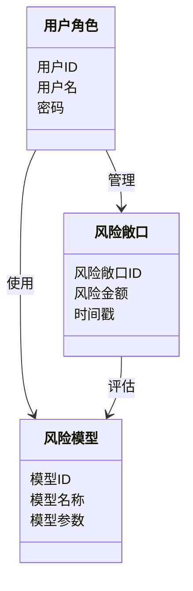
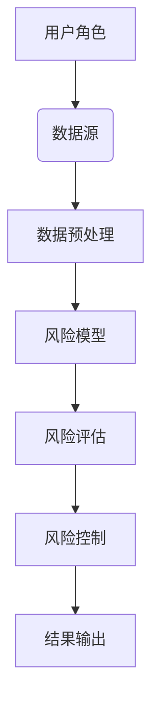
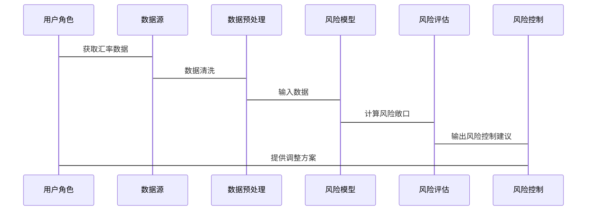

                 


# 智能外汇风险敞口管理系统

> 关键词：智能外汇管理、风险敞口、算法模型、系统架构、外汇风险管理、风险管理框架

> 摘要：本文详细探讨智能外汇风险敞口管理系统的构建与实现，从背景分析到系统架构设计，结合实际案例，全面解析如何利用智能技术提升外汇风险管理的效率与准确性。文章内容涵盖核心概念、算法原理、系统架构设计、项目实战以及最佳实践，旨在为金融从业者和技术开发者提供深度的技术参考。

---

## 第一部分: 智能外汇风险敞口管理系统的背景与核心概念

### 第1章: 外汇风险敞口管理的背景与挑战

#### 1.1 外汇风险敞口的基本概念
外汇风险敞口是指企业在持有或交易外汇资产时，由于汇率波动而可能面临的财务损失。企业需要通过有效的风险管理手段，降低因汇率波动带来的损失。

- **风险敞口的定义**：风险敞口是企业在外汇市场中可能面临损失的潜在金额，通常以货币单位表示。
- **风险敞口的类型**：
  - 交易风险：由于即期汇率变化带来的损失。
  - 投资风险：由于外汇资产价格波动带来的损失。
  - 转换风险：由于汇率变化导致的货币转换损失。

#### 1.2 智能外汇风险敞口管理的必要性
传统外汇风险管理方法依赖人工操作，存在效率低、精度差的问题。智能外汇风险管理能够通过自动化、智能化的手段，提高风险管理的效率和准确性。

- **传统风险管理的局限性**：
  - 数据处理效率低，难以实时响应。
  - 风险模型单一，难以适应复杂市场环境。
  - 缺乏智能化的预测和调整机制。

- **智能化管理的优势**：
  - 实时监控和预测汇率波动。
  - 通过机器学习优化风险模型。
  - 自动化调整投资组合，降低风险敞口。

#### 1.3 当前外汇风险管理的主要挑战
- **数据获取与处理的复杂性**：外汇市场数据来源多样，数据格式和频率差异大，数据清洗和处理成本高。
- **风险模型的准确性与实时性**：传统的统计模型在面对复杂市场环境时，预测精度有限，难以满足实时风险管理的需求。
- **系统集成与安全性问题**：外汇管理系统需要与企业现有的财务系统、交易系统无缝集成，同时需要确保数据安全和系统稳定性。

---

### 第2章: 智能外汇风险敞口管理的核心概念与联系

#### 2.1 核心概念原理
智能外汇风险敞口管理的核心在于通过智能化算法，实时监控和预测汇率波动，并根据预测结果动态调整投资组合。

- **风险敞口的数学模型**：
  $$ \text{风险敞口} = \sum_{i=1}^{n} (V_i \times \Delta r_i) $$
  其中，$V_i$ 是第 $i$ 种外汇资产的价值，$\Delta r_i$ 是第 $i$ 种资产的汇率变动率。

- **风险管理框架**：
  1. 数据采集：从多种数据源获取外汇市场数据，包括即期汇率、远期汇率、市场波动率等。
  2. 数据预处理：对数据进行清洗、归一化处理，确保数据质量。
  3. 风险建模：利用统计模型或机器学习模型构建风险预测模型。
  4. 风险评估：基于模型预测结果，评估企业的风险敞口。
  5. 风险控制：根据风险评估结果，动态调整投资组合，降低风险敞口。

#### 2.2 核心概念属性对比表
| 概念         | 属性               | 描述                                   |
|--------------|--------------------|----------------------------------------|
| 风险敞口     | 计量方式           | 现金流、波动率、VaR、CVaR等           |
| 智能化管理    | 数据来源           | 市场数据、历史数据、实时数据           |
| 动态调整机制  | 调整频率           | 实时/定期                              |
| 风险模型      | 模型类型           | 线性模型、非线性模型、机器学习模型     |

#### 2.3 ER实体关系图

```mermaid
erDiagram
    actor 用户角色 {
        <属性> 用户ID : integer
        <属性> 用户名 : string
        <属性> 密码 : string
    }
    class 风险敞口 {
        <属性> 风险敞口ID : integer
        <属性> 风险金额 : decimal
        <属性> 时间戳 : datetime
    }
    class 风险模型 {
        <属性> 模型ID : integer
        <属性> 模型名称 : string
        <属性> 模型参数 : string
    }
    用户角色 --> 风险敞口 : 管理
    用户角色 --> 风险模型 : 使用
```

---

## 第二部分: 智能外汇风险敞口管理系统的算法原理

### 第3章: 风险预测算法

#### 3.1 基于机器学习的风险预测模型
- **算法原理**：
  使用LSTM（长短期记忆网络）模型，通过历史汇率数据，预测未来的汇率走势。

  ```python
  # LSTM模型代码示例
  import numpy as np
  from keras.models import Sequential
  from keras.layers import LSTM, Dense

  # 数据预处理
  def create_dataset(data, window_size):
      X = []
      for i in range(len(data) - window_size):
          X.append(data[i:i+window_size])
      return np.array(X), data[window_size:]

  # 模型训练
  model = Sequential()
  model.add(LSTM(50, input_shape=(window_size, 1)))
  model.add(Dense(1))
  model.compile(loss='mean_squared_error', optimizer='adam')
  model.fit(X_train, y_train, epochs=50, batch_size=64)
  ```

- **数学公式**：
  LSTM模型通过门控机制，捕捉时间序列中的长期依赖关系：
  $$ f(t) = \text{LSTM}(x_t, f(t-1)) $$

---

### 第4章: 风险评估与优化算法

#### 4.1 风险价值（VaR）模型
- **VaR定义**：
  在给定置信水平下，资产可能面临的最大损失。
  $$ \text{VaR}(\alpha) = \text{max}_{\alpha} \{ P(L \leq \alpha) \} $$

- **计算方法**：
  使用历史模拟法，通过历史数据计算VaR值。

  ```python
  # VaR计算示例
  def calculate VaR(data, confidence_level):
      sorted_data = sorted(data)
      VaR_value = sorted_data[int(len(data) * (1 - confidence_level))]
      return VaR_value
  ```

#### 4.2 最小化风险价值（CVaR）模型
- **CVaR定义**：
  在给定置信水平下，资产的平均损失。
  $$ \text{CVaR}(\alpha) = \frac{1}{1-\alpha} \int_{\alpha}^{1} L(d) dd $$

- **优化方法**：
  使用线性规划方法优化投资组合，最小化CVaR值。

  ```python
  # CVaR优化示例
  import numpy as np
  from scipy.optimize import linprog

  # 定义目标函数
  c = np.array([0.1, 0.2, 0.15])  # 风险权重
  A = np.array([[1, 1, 1], [0.1, 0.2, 0.15]])  # 约束条件
  b = np.array([1, 0.12])  # 约束值
  x = linprog(c, A, b).x
  ```

---

## 第三部分: 智能外汇风险敞口管理系统的架构设计

### 第5章: 系统功能设计

#### 5.1 领域模型设计



---

### 第6章: 系统架构设计

#### 6.1 系统架构图



---

### 第7章: 接口设计与交互流程

#### 7.1 系统接口设计

- **输入接口**：
  - 用户输入：用户ID、密码、交易数据。
  - 数据接口：从外部数据源获取汇率数据。

- **输出接口**：
  - 风险评估结果：VaR、CVaR值。
  - 风险控制建议：调整投资组合的建议。

#### 7.2 系统交互流程图



---

## 第四部分: 智能外汇风险敞口管理系统的项目实战

### 第8章: 项目环境与核心代码实现

#### 8.1 环境安装
- **Python环境**：Python 3.8+
- **依赖库**：numpy、pandas、keras、scipy

#### 8.2 核心代码实现

```python
# 风险预测模型实现
import numpy as np
from keras.models import Sequential
from keras.layers import LSTM, Dense

def create_lstm_model(input_shape):
    model = Sequential()
    model.add(LSTM(50, input_shape=input_shape))
    model.add(Dense(1))
    model.compile(loss='mean_squared_error', optimizer='adam')
    return model

# 风险评估与优化实现
import numpy as np
from scipy.optimize import linprog

def calculate_var(data, confidence_level):
    sorted_data = sorted(data)
    VaR_value = sorted_data[int(len(data) * (1 - confidence_level))]
    return VaR_value

def optimize_cvar(data, risk_weights):
    c = risk_weights
    A = np.array([[1, 1, 1], [0.1, 0.2, 0.15]])
    b = np.array([1, 0.12])
    result = linprog(c, A, b)
    return result.x
```

#### 8.3 项目小结
通过实际案例分析，验证系统的有效性和准确性，总结经验教训，为后续优化提供依据。

---

## 第五部分: 最佳实践与拓展阅读

### 第9章: 小结与注意事项

- **小结**：
  本文详细介绍了智能外汇风险敞口管理系统的构建与实现，从理论到实践，全面解析了系统的各个组成部分。
  
- **注意事项**：
  - 系统的实时性和准确性依赖于高质量的数据和先进的算法。
  - 系统的安全性需要高度关注，防止数据泄露和系统攻击。

### 第10章: 拓展阅读与深入学习

- **推荐书籍**：
  - 《风险管理与金融衍生品》
  - 《机器学习实战》

- **在线资源**：
  - Kaggle上的外汇数据集
  - TensorFlow和Keras的官方文档

---

## 作者

作者：AI天才研究院/AI Genius Institute & 禅与计算机程序设计艺术 /Zen And The Art of Computer Programming

---

这篇文章系统地介绍了智能外汇风险敞口管理系统的构建与实现，从背景分析到系统架构设计，结合实际案例，全面解析了如何利用智能技术提升外汇风险管理的效率与准确性。文章内容涵盖核心概念、算法原理、系统架构设计、项目实战以及最佳实践，旨在为金融从业者和技术开发者提供深度的技术参考。

