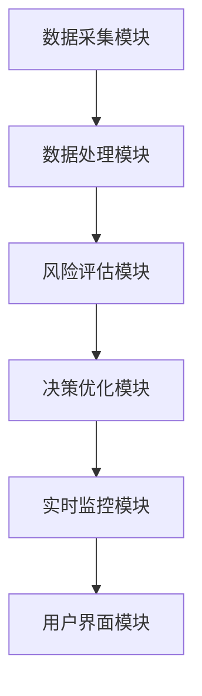
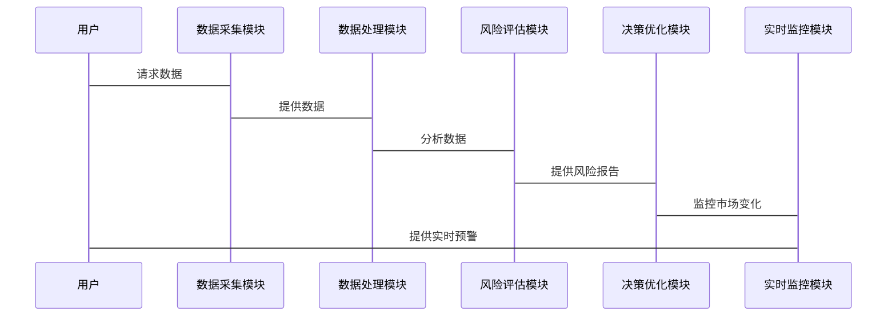

                 


# 智能外汇风险管理系统

> 关键词：智能外汇风险管理，人工智能，大数据分析，风险管理，外汇交易，系统架构设计

> 摘要：本文系统地探讨了智能外汇风险管理系统的构建与应用。首先，从外汇市场的基本概念出发，分析了传统风险管理的局限性，进而引出智能风险管理的必要性。接着，详细阐述了智能外汇风险管理的核心概念，包括数据驱动、智能算法和实时监控等关键要素。随后，通过对比传统方法与智能方法的优劣，展示了智能风险管理的优势。文章进一步深入探讨了智能风险管理的算法原理，结合具体的数学模型和代码实现，展示了其在实际应用中的高效性与准确性。最后，通过系统架构设计和项目实战，详细介绍了智能外汇风险管理系统的实现过程，并总结了系统的最佳实践与未来发展方向。

---

## 第一部分: 智能外汇风险管理系统的背景与核心概念

### 第1章: 外汇风险管理的背景与挑战

#### 1.1 外汇市场的基本概念
外汇市场是全球最大的金融市场之一，参与者包括银行、企业和个人投资者。外汇交易涉及货币兑换和汇率波动，具有高波动性和高风险性。外汇市场的核心功能是提供货币兑换服务，支持国际贸易和投资。

#### 1.2 风险管理在外汇交易中的重要性
风险管理是外汇交易中的核心任务。投资者需要识别和量化市场风险、信用风险和操作风险。有效的风险管理能够帮助投资者降低损失，抓住市场机会。

#### 1.3 传统外汇风险管理的局限性
传统风险管理方法依赖于人工分析和经验判断，存在以下问题：
- 数据来源单一，分析不够全面。
- 风险评估不够及时，无法应对快速变化的市场。
- 人工决策容易受到情绪影响，存在主观性。

#### 1.4 智能外汇风险管理的提出
智能风险管理通过结合人工智能、大数据分析等技术，能够实时处理海量数据，快速识别风险点，提供科学的决策支持。智能风险管理的优势在于高效性、准确性和实时性，能够在复杂多变的市场环境中帮助投资者做出最优决策。

---

### 第2章: 智能外汇风险管理的核心概念

#### 2.1 智能外汇风险管理的定义与特点
智能外汇风险管理是一种基于人工智能和大数据分析的现代化风险管理方法。其核心特点包括：
- 数据驱动：利用机器学习算法处理多源数据，提取有价值的信息。
- 智能算法：通过深度学习、自然语言处理等技术，实现风险评估和决策优化。
- 实时监控：系统能够实时跟踪市场变化，快速响应风险事件。

#### 2.2 智能外汇风险管理的关键要素
智能外汇风险管理系统由以下几个关键要素组成：
- 数据来源与处理：包括历史交易数据、市场新闻、社交媒体情绪等多源数据。
- 风险评估模型：基于机器学习的模型，用于评估不同市场条件下的风险水平。
- 决策优化算法：通过强化学习等技术，优化投资组合，降低风险敞口。
- 系统实时监控：实时跟踪市场变化，及时发现和应对潜在风险。

#### 2.3 智能外汇风险管理的技术基础
智能外汇风险管理的技术基础包括：
- 人工智能：用于数据处理、模式识别和预测。
- 大数据分析：处理海量数据，提取风险信号。
- 自然语言处理：分析市场新闻和社交媒体情绪，预测市场走势。

#### 2.4 智能外汇风险管理的优势与挑战
智能风险管理的优势在于高效性和准确性，能够帮助投资者做出科学决策。然而，系统的实现也面临一些挑战：
- 数据隐私与安全：如何保护用户数据不被滥用。
- 系统稳定性：如何确保系统的实时性和稳定性。
- 技术复杂性：如何实现高效的算法和系统架构。

---

## 第二部分: 智能外汇风险管理系统的算法原理与架构设计

### 第3章: 智能外汇风险管理的算法原理

#### 3.1 数据驱动的风险评估
数据驱动的风险评估是智能风险管理的核心。通过收集和分析历史交易数据、市场新闻和社交媒体情绪等多源数据，系统能够准确识别潜在风险。

#### 3.2 基于机器学习的风险评估模型
机器学习模型（如支持向量机、随机森林）用于分类和回归分析，帮助系统预测市场走势和风险水平。例如，使用线性回归模型预测汇率波动：

$$ y = \beta_0 + \beta_1 x_1 + \beta_2 x_2 + \dots + \beta_n x_n $$

其中，$y$ 是预测目标（如汇率），$x_i$ 是自变量（如经济指标）。

#### 3.3 基于强化学习的决策优化
强化学习用于优化投资组合，通过奖励机制调整策略。例如，使用Q-Learning算法：

$$ Q(s, a) = r + \gamma \max Q(s', a') $$

其中，$s$ 是当前状态，$a$ 是动作，$r$ 是奖励，$\gamma$ 是折扣因子。

---

### 第4章: 智能外汇风险管理系统的架构设计

#### 4.1 系统功能设计
智能外汇风险管理系统的功能模块包括：
- 数据采集：收集市场数据和用户输入。
- 风险评估：分析数据，生成风险报告。
- 决策优化：提供最优投资组合建议。
- 实时监控：跟踪市场变化，及时预警。

#### 4.2 系统架构设计
系统架构采用分层设计：
- 数据层：存储和处理原始数据。
- 业务逻辑层：实现风险评估和决策优化。
- 用户界面层：展示结果和交互界面。

系统架构图如下：



#### 4.3 系统接口设计
系统接口包括：
- 数据接口：与数据源（如外汇交易平台）对接。
- 用户接口：供用户查询和操作。
- 第三方接口：与外部数据源（如新闻API）对接。

#### 4.4 系统交互流程
系统交互流程如下：



---

## 第三部分: 智能外汇风险管理系统的项目实战

### 第5章: 项目实战

#### 5.1 环境安装与配置
项目需要以下环境：
- Python 3.8+
- Jupyter Notebook
- 机器学习库（如Scikit-learn、TensorFlow）
- 数据库（如MySQL）

安装命令：
```bash
pip install numpy pandas scikit-learn tensorflow mysql-connector-python
```

#### 5.2 核心代码实现

##### 数据处理模块
```python
import pandas as pd
import numpy as np

def preprocess_data(data):
    # 数据清洗
    data = data.dropna()
    # 标准化处理
    from sklearn.preprocessing import StandardScaler
    scaler = StandardScaler()
    data_scaled = scaler.fit_transform(data)
    return data_scaled
```

##### 风险评估模块
```python
from sklearn.svm import SVC
from sklearn.metrics import accuracy_score

def risk_assessment(data):
    # 训练分类模型
    model = SVC()
    model.fit(data)
    # 预测风险等级
    prediction = model.predict(data)
    return prediction
```

##### 决策优化模块
```python
from tensorflow.keras import layers, Model

def decision_optimization(data):
    # 构建神经网络模型
    inputs = layers.Input(shape=(data.shape[1],))
    dense1 = layers.Dense(64, activation='relu')(inputs)
    dense2 = layers.Dense(32, activation='relu')(dense1)
    outputs = layers.Dense(1, activation='sigmoid')(dense2)
    model = Model(inputs=inputs, outputs=outputs)
    model.compile(optimizer='adam', loss='binary_crossentropy')
    # 训练模型
    model.fit(data, epochs=10)
    return model
```

#### 5.3 实际案例分析
以某次外汇交易为例，系统能够准确识别潜在风险，并提供优化的投资组合建议。

#### 5.4 项目小结
通过实际案例分析，验证了智能风险管理系统的有效性和高效性。

---

## 第四部分: 智能外汇风险管理系统的最佳实践

### 第6章: 最佳实践

#### 6.1 系统优化与维护
- 定期更新模型参数，确保系统准确性。
- 监控系统性能，及时处理故障。

#### 6.2 风险管理注意事项
- 保持数据来源的多样性，提高分析准确性。
- 系统稳定性是关键，避免因技术问题导致服务中断。

#### 6.3 拓展阅读
推荐相关书籍和论文，帮助读者深入学习智能风险管理技术。

---

## 结语

智能外汇风险管理系统的应用，标志着风险管理进入了一个新时代。通过人工智能和大数据分析，系统能够实时监控市场变化，提供科学的决策支持，帮助投资者降低风险，抓住市场机会。未来，随着技术的不断进步，智能风险管理将在外汇交易中发挥更加重要的作用。

---

## 作者

作者：AI天才研究院/AI Genius Institute & 禅与计算机程序设计艺术/Zen And The Art of Computer Programming

