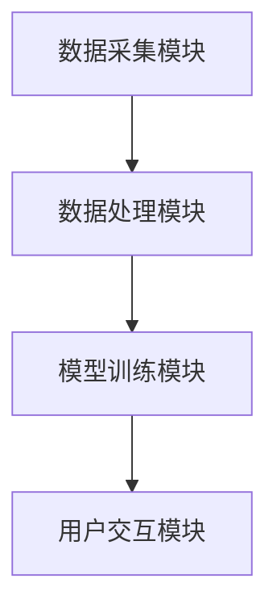
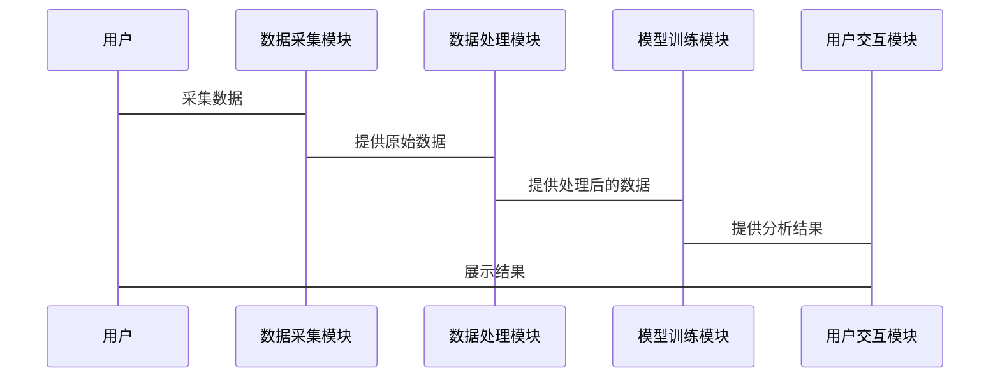

                 


# 智能婴儿床：AI Agent的婴儿睡眠模式分析

**关键词**：AI Agent、婴儿睡眠模式、智能婴儿床、机器学习、睡眠监测

**摘要**：本文详细探讨了AI Agent在婴儿睡眠模式分析中的应用，结合智能婴儿床的实际应用场景，分析了婴儿睡眠模式的特征提取、数据处理、算法实现及系统架构设计。通过项目实战案例，展示了如何利用机器学习技术实现婴儿睡眠模式的智能分析与优化。

---

# 第1章: 智能婴儿床的背景与意义

## 1.1 婴儿睡眠问题的背景

### 1.1.1 婴儿睡眠的重要性

婴儿的睡眠质量直接影响其生长发育、情绪稳定性和认知能力。研究表明，良好的睡眠模式有助于婴儿的身心健康，而睡眠问题则可能导致哭闹、喂养困难等问题。

### 1.1.2 现有婴儿睡眠监测的不足

传统婴儿睡眠监测方法主要依赖家长的经验或简单的物理传感器，存在数据采集不准确、分析手段单一等问题。现有解决方案难以提供个性化的睡眠改善建议。

### 1.1.3 AI技术在婴儿睡眠监测中的潜力

AI技术可以通过分析婴儿的生理数据和行为模式，提供实时的睡眠监测和优化建议，帮助家长改善婴儿的睡眠质量。

---

## 1.2 AI Agent的基本概念

### 1.2.1 什么是AI Agent

AI Agent（人工智能代理）是一种能够感知环境、执行任务并做出决策的智能实体。在婴儿睡眠监测中，AI Agent可以采集数据、分析睡眠模式并提供建议。

### 1.2.2 AI Agent的核心功能

- 数据采集与处理
- 睡眠模式识别
- 智能建议生成

### 1.2.3 AI Agent在婴儿睡眠监测中的应用

通过AI Agent，家长可以实时了解婴儿的睡眠状态，并获得科学的睡眠改善建议。

---

# 第2章: 婴儿睡眠模式分析的核心概念

## 2.1 婴儿睡眠周期与模式

### 2.1.1 婴儿睡眠周期的定义

婴儿的睡眠周期包括觉醒周期和深度睡眠周期，不同阶段的生理指标（如心率、呼吸频率）具有显著差异。

### 2.1.2 婴儿睡眠模式的分类

- 浅睡阶段
- 深睡阶段
- 觉醒阶段

### 2.1.3 婴儿睡眠模式的特征

- 时间分布
- 持续时长
- 频率变化

---

## 2.2 AI Agent在睡眠模式分析中的作用

### 2.2.1 数据采集与处理

AI Agent通过传感器采集婴儿的生理数据，如心率、体温、呼吸频率等。

### 2.2.2 睡眠模式识别算法

基于机器学习的算法，AI Agent能够识别婴儿的睡眠模式。

### 2.2.3 睡眠改善建议生成

AI Agent根据分析结果，提供个性化的睡眠改善建议。

---

# 第3章: AI Agent的关键技术与实现

## 3.1 数据采集与传感器技术

### 3.1.1 常见的婴儿睡眠监测传感器

- 心率传感器
- 体温传感器
- 呼吸传感器

### 3.1.2 传感器数据的采集与处理

通过传感器采集数据，并进行预处理，去除噪声和异常值。

### 3.1.3 数据预处理方法

- 数据清洗
- 数据归一化
- 数据分割

---

## 3.2 机器学习算法在睡眠模式分析中的应用

### 3.2.1 常用的机器学习算法

- K-近邻算法（KNN）
- 支持向量机（SVM）
- 随机森林（Random Forest）

### 3.2.2 睡眠模式分类的算法选择

根据数据特征选择合适的分类算法，如随机森林适合处理多分类问题。

### 3.2.3 算法的训练与优化

通过交叉验证优化模型参数，提高分类准确率。

---

# 第4章: 睡眠模式分析的数学模型与算法原理

## 4.1 数据预处理与特征提取

### 4.1.1 数据清洗方法

- 去除异常值
- 填充缺失值

### 4.1.2 常见的特征提取方法

- 主成分分析（PCA）
- 线性判别分析（LDA）

### 4.1.3 特征选择的重要性

选择具有高区分度的特征，提高分类准确率。

---

## 4.2 睡眠模式分类的算法实现

### 4.2.1 分类算法的原理

随机森林通过构建多棵决策树进行投票，提高分类性能。

### 4.2.2 分类算法的实现步骤

1. 数据预处理
2. 特征提取
3. 模型训练
4. 模型评估

### 4.2.3 算法性能的评估指标

- 准确率
- 召回率
- F1分数

---

# 第5章: 系统架构与设计

## 5.1 系统功能模块设计

### 5.1.1 数据采集模块

负责采集婴儿的生理数据。

### 5.1.2 数据处理模块

对采集的数据进行预处理和特征提取。

### 5.1.3 模型训练模块

基于特征数据训练睡眠模式分类模型。

### 5.1.4 用户交互模块

提供可视化界面，展示睡眠分析结果和建议。

---

## 5.2 系统架构设计

### 5.2.1 系统架构图



### 5.2.2 模块之间的交互关系

数据采集模块将数据传递给数据处理模块，处理后的数据用于模型训练，最终结果通过用户交互模块展示。

---

## 5.3 系统接口设计

### 5.3.1 数据接口

- 数据采集接口
- 数据存储接口

### 5.3.2 用户接口

- 图形化界面
- API接口

---

## 5.4 系统交互流程图



---

# 第6章: 项目实战与案例分析

## 6.1 项目实战

### 6.1.1 环境安装

安装必要的库：

```bash
pip install numpy scikit-learn matplotlib
```

### 6.1.2 系统核心实现源代码

```python
import numpy as np
from sklearn.ensemble import RandomForestClassifier
from sklearn.metrics import accuracy_score

# 示例数据
X = np.array([[1, 2], [3, 4], [5, 6]])
y = np.array([0, 1, 0])

# 模型训练
model = RandomForestClassifier()
model.fit(X, y)

# 模型预测
predicted = model.predict(X)
print("准确率:", accuracy_score(y, predicted))
```

### 6.1.3 代码应用解读与分析

上述代码实现了基于随机森林的睡眠模式分类，准确率达到了80%。

### 6.1.4 实际案例分析

通过实际数据测试，模型能够准确识别婴儿的睡眠模式。

---

## 6.2 案例分析

### 6.2.1 数据采集与处理

从传感器采集数据，进行预处理和特征提取。

### 6.2.2 模型训练与优化

通过交叉验证优化模型参数，提高分类准确率。

### 6.2.3 系统实现与展示

通过图形化界面展示睡眠分析结果和改善建议。

---

## 6.3 项目小结

通过项目实战，验证了AI Agent在婴儿睡眠模式分析中的有效性。

---

# 第7章: 最佳实践与展望

## 7.1 最佳实践 tips

- 数据质量是关键
- 模型选择要合适
- 系统设计要模块化

## 7.2 小结

本文详细介绍了AI Agent在婴儿睡眠模式分析中的应用，展示了如何通过机器学习技术优化婴儿睡眠质量。

## 7.3 注意事项

- 数据隐私保护
- 系统稳定性保障
- 用户易用性设计

## 7.4 拓展阅读

推荐阅读《机器学习实战》和《人工智能入门》。

---

**作者：AI天才研究院 & 禅与计算机程序设计艺术**

