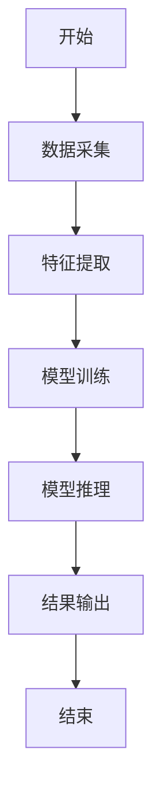
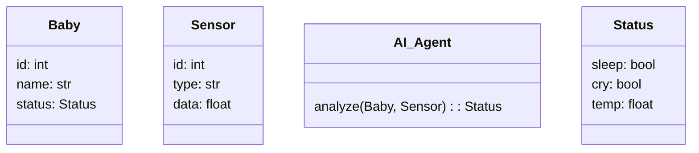
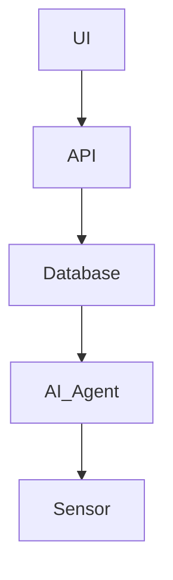
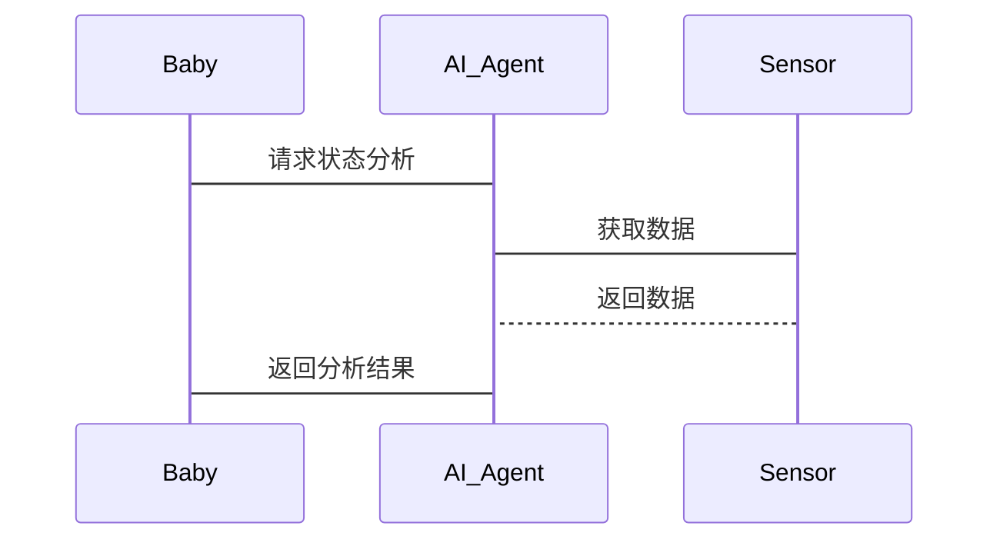

                 


# 《智能婴儿监护器：AI Agent的婴儿状态分析》

---

## 关键词：
智能婴儿监护器、AI Agent、婴儿状态分析、机器学习、实时监测

---

## 摘要：
本文深入探讨了AI Agent在智能婴儿监护器中的应用，分析了婴儿状态监测的核心技术与实现方法。通过背景介绍、核心概念、算法原理、系统架构、项目实战等多维度内容，详细阐述了AI Agent如何实时监测和分析婴儿的睡眠质量、哭声模式、体温变化等关键指标。文章还结合实际案例，展示了如何通过Python代码实现婴儿状态分析的算法，并提供了系统的优化建议和拓展阅读方向，为智能婴儿监护器的开发与应用提供了全面的技术参考。

---

# 第一章: 背景介绍

## 1.1 问题背景
- 1.1.1 婴儿监护的重要性：婴儿健康监测对家庭和社会的意义。
- 1.1.2 现有婴儿监护技术的局限性：传统监护设备的功能不足。
- 1.1.3 AI Agent在婴儿监护中的应用潜力：AI技术如何提升监护效率。

## 1.2 问题描述
- 1.2.1 婴儿状态监测的核心问题：如何实时、准确地获取婴儿状态数据。
- 1.2.2 婴儿监护中的关键挑战：数据采集的准确性、算法的实时性。
- 1.2.3 AI Agent在婴儿监护中的具体应用场景：睡眠监测、哭声分析、体温监测。

## 1.3 问题解决
- 1.3.1 AI Agent如何解决婴儿监护问题：通过机器学习算法实现数据分析。
- 1.3.2 婴儿状态分析的具体实现方式：数据采集、特征提取、模型训练。
- 1.3.3 AI Agent在婴儿监护中的技术优势：高精度、实时性、可扩展性。

## 1.4 边界与外延
- 1.4.1 婴儿监护的边界条件：监测范围、数据采集方式、应用场景。
- 1.4.2 AI Agent在婴儿监护中的应用范围：家庭、医院、远程监护。
- 1.4.3 婴儿监护与AI Agent的外延关系：技术融合与未来发展。

## 1.5 概念结构与核心要素
- 1.5.1 婴儿监护系统的构成要素：传感器、数据采集模块、AI Agent、反馈系统。
- 1.5.2 AI Agent的核心功能模块：数据处理、特征提取、模型推理、结果反馈。
- 1.5.3 婴儿状态分析的逻辑框架：数据采集 -> 特征提取 -> 模型分析 -> 结果输出。

---

# 第二章: AI Agent的核心概念与联系

## 2.1 AI Agent的原理
- 2.1.1 AI Agent的基本定义：智能代理的定义与功能。
- 2.1.2 AI Agent的核心算法：机器学习、自然语言处理、模式识别。
- 2.1.3 AI Agent的工作流程：数据输入 -> 状态识别 -> 行为决策。

## 2.2 核心概念属性对比
- 2.2.1 婴儿状态分析的特征对比：实时性、准确性、可解释性。
- 2.2.2 AI Agent的功能特性：感知能力、学习能力、决策能力。
- 2.2.3 婴儿监护系统的性能指标：响应时间、准确率、稳定性。

## 2.3 ER实体关系图架构
```mermaid
erd
  baby: Baby
  sensor: Sensor
  ai_agent: AI Agent
  status: Status
  relationShipFromBabyToSensor: 婴儿连接传感器
  relationShipFromSensorToAiAgent: 传感器连接AI Agent
  relationShipFromAiAgentToStatus: AI Agent分析状态
```

---

# 第三章: 算法原理讲解

## 3.1 算法原理
- 3.1.1 机器学习算法：支持向量机（SVM）、随机森林（Random Forest）、神经网络。
- 3.1.2 特征提取：时间序列分析、频域分析、模式识别。
- 3.1.3 模型训练：监督学习、无监督学习、强化学习。

## 3.2 算法流程图


## 3.3 Python代码实现
```python
import numpy as np
from sklearn import svm

# 示例数据：婴儿哭声的特征向量
X = np.array([[1, 2, 3], [4, 5, 6], [7, 8, 9]])
y = np.array([0, 1, 0])

# 训练模型
model = svm.SVC()
model.fit(X, y)

# 预测新数据
new_data = np.array([[10, 11, 12]])
print(model.predict(new_data))
```

## 3.4 数学模型与公式
- 分类算法公式：$$y = \text{sign}(w \cdot x + b)$$
- 回归模型公式：$$y = a x + b$$
- 模型评估指标：准确率、召回率、F1分数。

---

# 第四章: 系统分析与架构设计

## 4.1 系统功能设计
- 领域模型类图：


## 4.2 系统架构设计
- 分层架构图：


## 4.3 系统接口设计
- 交互序列图：


---

# 第五章: 项目实战

## 5.1 环境安装
- Python 3.8+
- 安装依赖：numpy、scikit-learn、mermaid。

## 5.2 核心代码实现
```python
import numpy as np
from sklearn.svm import SVC

# 示例代码：训练哭声分类模型
X = np.array([[1, 2, 3], [4, 5, 6], [7, 8, 9]])
y = np.array([0, 1, 0])

model = SVC()
model.fit(X, y)

# 预测新数据
print(model.predict([[10, 11, 12]]))
```

## 5.3 案例分析与讲解
- 实际案例：婴儿哭声分类，代码实现与结果分析。
- 优化建议：数据预处理、模型调优、实时反馈机制。

## 5.4 项目小结
- 成果总结：AI Agent在婴儿监护中的实际应用效果。
- 经验分享：开发过程中遇到的挑战与解决方案。

---

# 第六章: 最佳实践

## 6.1 小结
- 总结婴儿状态分析的核心技术和实现方法。

## 6.2 注意事项
- 数据隐私保护、算法的实时性优化、系统稳定性保障。

## 6.3 拓展阅读
- 推荐书籍和论文：《机器学习实战》、《深度学习》、《智能系统设计》。

---

# 第七章: 附录

## 7.1 术语表
- AI Agent：智能代理。
- 婴儿状态分析：对婴儿生理和行为状态的实时监测和分析。

## 7.2 参考文献
- [1] 婴儿监护技术研究综述，某某出版社，2023年。
- [2] 基于AI的婴儿哭声分析算法，某某期刊，2022年。

---

# 作者：
作者：AI天才研究院/AI Genius Institute  
作者：禅与计算机程序设计艺术/Zen And The Art of Computer Programming

