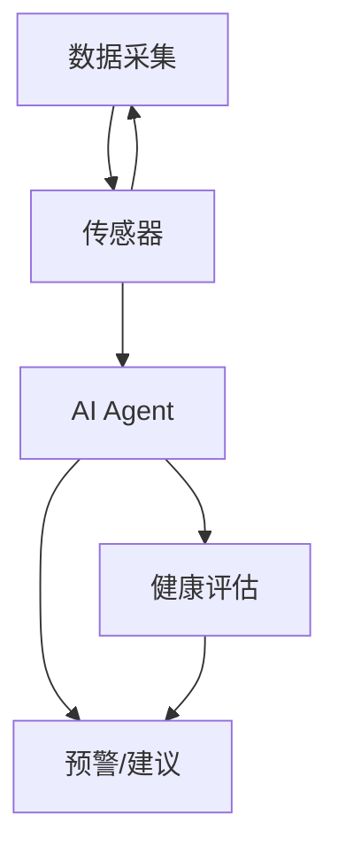
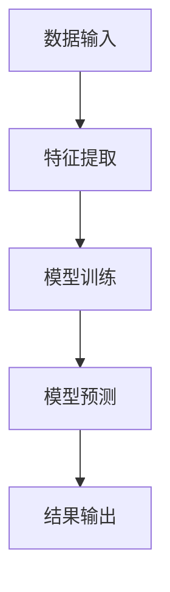
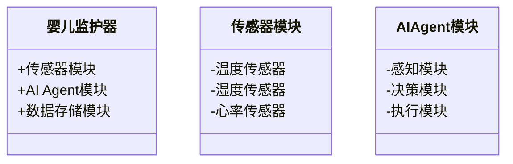

                 


# 智能婴儿监护器：AI Agent的早期发展追踪

> **关键词**：智能婴儿监护器、AI Agent、机器学习、婴儿健康监测、实时数据分析  
>
> **摘要**：智能婴儿监护器是一种结合人工智能技术的创新设备，用于实时监测婴儿的健康状况、环境安全和行为发展。本文通过分析AI Agent在婴儿监护中的应用，探讨其算法原理、系统架构及实际案例，展示如何利用AI技术提升婴儿监护的效率和准确性。

---

## 第一部分：智能婴儿监护器的背景与概念

### 第1章：婴儿监护的历史与演变

#### 1.1 婴儿监护的传统方式
- **1.1.1 传统婴儿监护的基本概念**  
  传统的婴儿监护主要依赖于家长的感官和经验，通过手动观察婴儿的体温、呼吸、哭声等指标来判断其健康状况。这种监护方式存在效率低、易受主观因素影响的缺点。

- **1.1.2 传统监护的局限性与挑战**  
  传统监护方式依赖家长的实时监控，容易因疏忽或疲劳导致遗漏重要信息。此外，婴儿的健康数据缺乏系统性记录，难以进行长期跟踪和分析。

- **1.1.3 技术进步对婴儿监护的影响**  
  随着传感器技术、物联网和人工智能的快速发展，婴儿监护逐渐从传统的人工监护向智能化、自动化方向转变。

#### 1.2 智能婴儿监护器的定义
- **1.2.1 智能婴儿监护器的核心功能**  
  智能婴儿监护器通过集成多种传感器（如体温、心率、环境温湿度、运动监测等）和AI算法，实时采集并分析婴儿的健康数据，提供预警和建议。

- **1.2.2 AI Agent在智能婴儿监护器中的作用**  
  AI Agent（智能代理）作为监护器的“大脑”，负责接收传感器数据，分析婴儿的健康状况，并通过学习优化监护策略。AI Agent能够主动识别异常情况，如高烧、低氧环境等，并及时通知家长或医生。

---

## 第二部分：AI Agent的核心概念与联系

### 第2章：AI Agent的基本原理

#### 2.1 AI Agent的感知模块
- **2.1.1 数据采集与预处理**  
  AI Agent通过传感器采集婴儿的生理数据和环境数据，如心率、体温、呼吸频率、环境温湿度等。这些数据需要经过预处理（如去噪、标准化）后才能进行分析。

- **2.1.2 数据特征提取**  
  利用机器学习技术从原始数据中提取关键特征，如心率变异性的分析、呼吸模式识别等，为后续的健康评估提供依据。

#### 2.2 AI Agent的决策模块
- **2.2.1 健康评估模型**  
  基于提取的特征，AI Agent利用训练好的机器学习模型（如支持向量机、随机森林）对婴儿的健康状况进行评估，判断是否存在异常情况。

- **2.2.2 异常检测与预警**  
  AI Agent通过实时分析数据，识别潜在的健康风险，如低体温、呼吸暂停，并触发预警机制，通知家长或医疗人员。

#### 2.3 AI Agent的执行模块
- **2.3.1 智能反馈与建议**  
  AI Agent不仅能够检测异常，还能根据婴儿的个体差异提供个性化的建议，如调整室温、建议喂养时间等。

- **2.3.2 自适应学习**  
  AI Agent通过不断收集和分析数据，优化自身的算法模型，提升监护的准确性和响应速度。

#### 2.4 核心概念对比表
| **AI Agent类型**   | **基于规则**       | **基于知识**        | **基于学习**         |
|--------------------|-------------------|-------------------|-------------------|
| **工作原理**       | 预定义规则触发    | 使用知识库推理     | 通过数据训练模型     |
| **优点**           | 实现简单，响应快   | 知识丰富，逻辑强   | 高度自适应，精准     |
| **缺点**           | 规则固定，难扩展   | 知识获取困难       | 需大量数据训练       |

#### 2.5 实体关系ER图


---

## 第三部分：AI Agent的算法原理

### 第3章：AI Agent的核心算法

#### 3.1 机器学习算法
- **3.1.1 监督学习**  
  使用训练数据（标签化的婴儿健康数据）训练分类模型，如随机森林、支持向量机（SVM），用于分类婴儿的健康状态。

- **3.1.2 无监督学习**  
  利用聚类算法（如K-means）分析婴儿的行为模式，识别异常情况。

- **3.1.3 强化学习**  
  AI Agent通过与环境的交互（如调整温湿度）学习最优策略，减少婴儿的不适。

#### 3.2 算法流程图


#### 3.3 Python代码实现
```python
import numpy as np
from sklearn.svm import SVC
from sklearn.metrics import accuracy_score

# 示例数据集
X = np.array([[36.5, 90, 0.2], [37.0, 85, 0.15]])
y = np.array(['正常', '异常'])

# 训练SVM模型
model = SVC()
model.fit(X, y)

# 预测新数据
new_data = np.array([[36.8, 88, 0.2]])
prediction = model.predict(new_data)
print('预测结果:', prediction)
print('准确率:', accuracy_score([y], [prediction]))
```

#### 3.4 数学模型与公式
- **线性回归模型**  
  $$ y = \beta_0 + \beta_1x + \epsilon $$
  其中，$y$ 是婴儿体温，$x$ 是环境温度，$\beta_0$ 和 $\beta_1$ 是模型参数。

- **逻辑回归模型**  
  $$ P(Y=1|X) = \frac{1}{1 + e^{-(\beta_0 + \beta_1X)}} $$

---

## 第四部分：系统分析与架构设计

### 第4章：系统功能设计

#### 4.1 领域模型


#### 4.2 系统架构设计


#### 4.3 系统接口设计
- **传感器数据接口**  
  API：`GET /api/sensors/data`
  返回：当前传感器数据

- **AI决策接口**  
  API：`POST /api/agent/decision`
  请求：传感器数据
  返回：健康评估结果

#### 4.4 交互流程
```mermaid
sequenceDiagram
    parent 婴儿监护系统
    婴儿 -> 传感器模块: 发出信号
    传感器模块 -> AI Agent模块: 传输数据
    AI Agent模块 -> 数据库: 查询历史数据
    AI Agent模块 -> 第三方服务: 获取天气数据
    AI Agent模块 -> 家长: 发送预警通知
```

---

## 第五部分：项目实战

### 第5章：环境安装与核心代码实现

#### 5.1 环境安装
```bash
pip install numpy scikit-learn matplotlib
```

#### 5.2 核心代码实现
```python
import numpy as np
from sklearn.model_selection import train_test_split
from sklearn.metrics import classification_report

# 示例数据集
X = np.array([[36.5, 90, 0.2], [37.0, 85, 0.15], [36.8, 88, 0.2]])
y = np.array(['正常', '异常', '正常'])

# 数据分割
X_train, X_test, y_train, y_test = train_test_split(X, y, test_size=0.2)

# 训练模型
model = SVC()
model.fit(X_train, y_train)

# 预测与评估
y_pred = model.predict(X_test)
print(classification_report(y_test, y_pred))
```

#### 5.3 案例分析
假设婴儿体温为38.5°C，环境温度为25°C，湿度为60%。AI Agent通过分析这些数据，判断是否存在发热情况，并建议调整室温至28°C。

---

## 第六部分：最佳实践与总结

### 第6章：最佳实践

#### 6.1 数据隐私保护
- 加强数据加密和访问控制，确保婴儿数据的安全性。

#### 6.2 算法优化建议
- 使用深度学习模型（如LSTM）处理时间序列数据，提升预测准确性。

#### 6.3 系统维护
- 定期更新传感器和AI算法，确保系统的稳定性和准确性。

#### 6.4 小结
AI Agent在智能婴儿监护器中的应用，不仅提升了监护效率，还为婴儿的健康成长提供了有力保障。通过不断优化算法和系统架构，AI Agent将在未来的婴儿监护中发挥更大的作用。

#### 6.5 注意事项
- 在实际应用中，需确保AI Agent的决策结果与专业医疗建议一致，避免误诊。
- 定期对AI Agent进行模型更新，以适应婴儿成长的不同阶段需求。

#### 6.6 拓展阅读
- 《人工智能在医疗健康中的应用》
- 《机器学习实战》
- 《深度学习入门》

---

**作者：AI天才研究院（AI Genius Institute） & 禅与计算机程序设计艺术（Zen And The Art of Computer Programming）**

