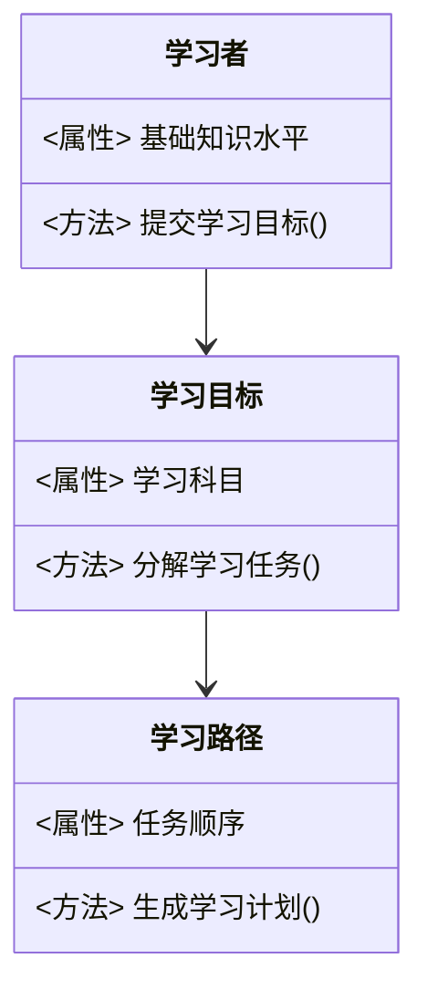
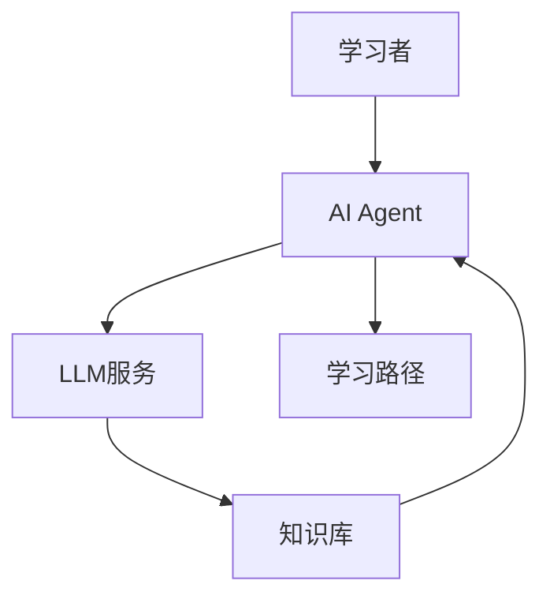

                 


# 智能学习路径规划 AI Agent：LLM 辅助个性化学习

---

## 关键词

AI Agent，LLM，个性化学习，路径规划，教育科技

---

## 摘要

本文探讨如何利用AI Agent与大语言模型（LLM）结合，实现个性化学习路径规划。通过背景分析、核心概念解析、算法原理、系统架构设计和项目实战，深入讲解AI Agent如何利用LLM的优势，解决个性化学习中的痛点，为教育科技提供新思路。

---

## 第一部分：背景介绍

### 第1章：智能学习路径规划的背景与挑战

#### 1.1 问题背景

在当前教育体系中，学生的学习需求和能力差异显著，传统的统一教学模式难以满足个性化需求。学习者在选择学习路径时，往往面临信息过载和决策困难。AI Agent和LLM的引入，为个性化学习提供了新可能。

#### 1.2 问题描述

个性化学习路径规划需要考虑学生的知识水平、学习目标、时间安排等多个因素。传统方法依赖人工经验，效率低且难以大规模应用。AI Agent结合LLM，能够实时分析数据，提供动态调整的学习建议。

#### 1.3 问题解决思路

AI Agent通过收集学习者数据，利用LLM的强大语言处理能力，生成个性化的学习建议和路径规划。这不仅提高了学习效率，还优化了学习体验。

#### 1.4 边界与外延

AI Agent的应用边界包括数据隐私和模型精度问题，而LLM的应用外延则涉及更多教育场景，如教学辅助和知识管理。

---

## 第二部分：核心概念与联系

### 第2章：AI Agent与LLM的核心原理

#### 2.1 AI Agent的基本原理

AI Agent通过感知环境、分析数据并采取行动，帮助学习者优化学习路径。其核心算法包括强化学习和决策树等。

#### 2.2 LLM的基本原理

LLM基于大规模数据训练，擅长处理自然语言，能生成多样化的学习建议。

#### 2.3 AI Agent与LLM的关系

AI Agent利用LLM的生成能力，增强自身的决策和执行能力，实现更智能的学习路径规划。

---

### 第3章：核心概念的属性特征对比

| **属性**       | **AI Agent**                | **LLM**                  |
|-----------------|-----------------------------|--------------------------|
| **智能性**       | 强，依赖算法                 | 弱，依赖数据和模型       |
| **适应性**       | 高，能动态调整策略           | 中，需预训练数据支持     |
| **可解释性**       | 高，算法逻辑清晰             | 低，黑箱模型难以解释     |
| **数据需求**       | 中，依赖结构化数据           | 高，依赖大量文本数据     |
| **计算资源**       | 中，依赖算法复杂度           | 高，依赖算力和存储资源   |

---

## 第三部分：算法原理讲解

### 第4章：AI Agent的算法原理

#### 4.1 AI Agent的核心算法

AI Agent的强化学习流程包括状态感知、动作选择和奖励反馈三个阶段。通过不断试错，优化学习路径。

#### 4.2 基于LLM的强化学习

使用mermaid流程图展示强化学习过程：


#### 4.3 数学模型与公式

强化学习的目标是最大化累积奖励，数学表达式为：

$$ J(\theta) = \sum_{t} \gamma^t r_t $$

其中，$\theta$表示模型参数，$\gamma$是折扣因子，$r_t$是第t步的奖励。

---

## 第四部分：系统分析与架构设计

### 第6章：系统功能设计

#### 6.1 领域模型设计

使用mermaid类图展示系统模型：



---

### 第7章：系统架构设计

#### 7.1 系统架构图



---

## 第五部分：项目实战

### 第8章：环境安装与代码实现

#### 8.1 环境安装

安装Python和相关库：

```bash
pip install python-mermaid jieba transformers
```

#### 8.2 核心代码实现

```python
def plan_learning_path(student_data):
    # 使用LLM生成学习建议
    llm.generate(student_data)
    # 返回优化后的路径
    return optimized_path

# 示例调用
student_input = "学习Python编程"
result = plan_learning_path(student_input)
print(result)
```

#### 8.3 案例分析

以“学习Python编程”为例，AI Agent首先分析学生的基础，推荐从基础语法开始，逐步深入到高级主题。

---

## 第六部分：总结与展望

### 第9章：总结与展望

#### 9.1 最佳实践

确保数据质量和模型迭代，定期更新训练数据，提升推荐精度。

#### 9.2 小结

通过AI Agent和LLM的结合，个性化学习路径规划变得高效且智能，为教育科技带来了新的可能性。

#### 9.3 注意事项

保护数据隐私，避免模型偏见，确保学习体验的公平性。

#### 9.4 拓展阅读

推荐阅读《Effective Python》和《深度学习入门》。

---

## 作者

作者：AI天才研究院/AI Genius Institute  
禅与计算机程序设计艺术 /Zen And The Art of Computer Programming

