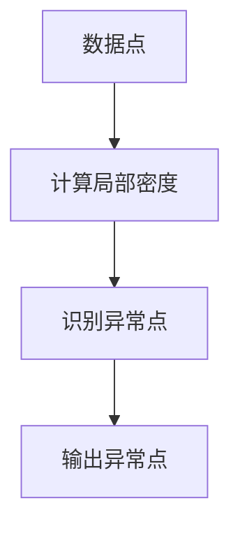
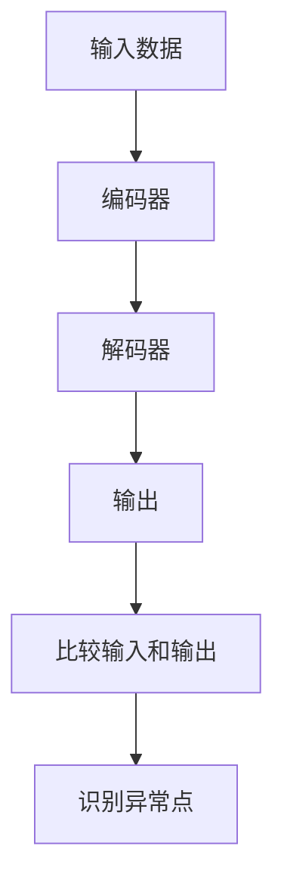
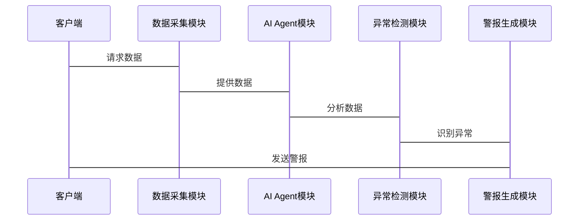

                 


# 智能安防：AI Agent的异常行为检测

---

## 关键词：
- AI Agent
- 异常行为检测
- 智能安防
- 行为分析
- 深度学习

---

## 摘要：
智能安防是现代安全防护体系的重要组成部分，而异常行为检测是其中的关键技术。本文将探讨AI Agent在异常行为检测中的应用，分析其核心原理、算法实现、系统架构及实际案例，帮助读者深入了解如何利用AI技术提升安防效率和准确性。

---

## 目录：
1. [背景介绍](#背景介绍)
   1.1 异常行为检测的背景与意义
   1.2 AI Agent的基本概念
2. [核心概念与原理](#核心概念与原理)
   2.1 异常行为检测的基本原理
   2.2 AI Agent的异常行为检测机制
   2.3 异常行为检测与AI Agent的结合
3. [算法原理](#算法原理)
   3.1 基于统计的异常检测算法
   3.2 基于深度学习的异常检测算法
4. [系统分析与架构设计](#系统分析与架构设计)
   4.1 问题场景介绍
   4.2 系统功能设计
   4.3 系统架构设计
   4.4 系统接口设计
5. [项目实战](#项目实战)
   5.1 环境安装与配置
   5.2 核心实现代码
   5.3 案例分析与解读
6. [总结与展望](#总结与展望)
   6.1 最佳实践与小结
   6.2 注意事项与建议
   6.3 未来展望与拓展阅读

---

## 1. 背景介绍

### 1.1 异常行为检测的背景与意义
异常行为检测是智能安防领域的核心技术，旨在通过分析用户行为模式，识别潜在的安全威胁。随着社会对安全需求的增加，传统的人工监控方式逐渐被智能化的AI技术取代。AI Agent（智能代理）通过实时学习和分析数据，能够快速识别异常行为，从而提升安防效率和准确性。

#### 1.1.1 问题背景
传统的安防系统依赖于人工监控，存在效率低、误报率高、漏报率高等问题。随着物联网和AI技术的发展，智能安防逐渐成为主流，而AI Agent的引入进一步提升了系统的智能化水平。

#### 1.1.2 问题描述
异常行为检测需要实时分析大量数据，包括视频流、日志、传感器数据等。传统的方法难以处理复杂场景下的异常行为，而AI Agent通过学习用户行为模式，能够更精准地识别异常。

#### 1.1.3 问题解决
AI Agent通过实时数据处理和学习，能够快速识别异常行为，从而实现预防性安全措施，减少潜在的安全威胁。

### 1.2 AI Agent的基本概念
AI Agent是一种智能代理，能够根据环境信息自主决策并执行任务。在智能安防中，AI Agent主要用于数据采集、分析和异常检测。

#### 1.2.1 定义
AI Agent是指具有感知环境、自主决策和执行任务能力的智能系统。

#### 1.2.2 特点与优势
- **自主性**：能够自主决策，无需人工干预。
- **反应性**：能够实时感知环境变化并做出反应。
- **学习能力**：通过机器学习不断优化检测算法。

#### 1.2.3 应用场景
- **视频监控**：实时分析视频流，识别异常行为。
- **入侵检测**：检测未经授权的入侵行为。
- **日志分析**：分析系统日志，识别异常操作。

---

## 2. 核心概念与原理

### 2.1 异常行为检测的基本原理
异常行为检测是通过分析行为数据，识别与正常行为模式不符的异常行为。

#### 2.1.1 异常行为的定义
异常行为是指与正常行为模式显著不同的行为，可能是恶意或误操作。

#### 2.1.2 异常行为的分类
- **突发行为**：短时间内发生异常动作。
- **模式偏离**：与正常行为模式明显不符。
- **持续异常**：长时间保持异常状态。

#### 2.1.3 异常行为检测的指标体系
- **时间维度**：行为发生的时间是否异常。
- **频率维度**：行为的频率是否偏离正常范围。
- **特征维度**：行为的特征是否与正常行为一致。

### 2.2 AI Agent的异常行为检测机制
AI Agent通过学习用户行为模式，实时检测异常行为。

#### 2.2.1 基于规则的检测
通过预定义的规则，检测是否符合特定条件的异常行为。

#### 2.2.2 基于统计的检测
基于统计学方法，识别偏离正常分布的行为。

#### 2.2.3 基于机器学习的检测
使用机器学习算法，学习正常行为模式，识别异常行为。

### 2.3 异常行为检测与AI Agent的结合
AI Agent通过实时数据处理和学习，优化异常行为检测的准确性。

#### 2.3.1 AI Agent的角色
- 数据采集：实时采集行为数据。
- 行为分析：分析数据，识别异常行为。
- 警报生成：当检测到异常行为时，触发警报。

#### 2.3.2 检测流程
1. 数据采集：通过传感器、摄像头等设备采集行为数据。
2. 数据预处理：清洗数据，提取特征。
3. 行为分析：使用AI算法分析数据，识别异常行为。
4. 警报生成：当检测到异常行为时，触发警报并采取相应措施。

---

## 3. 算法原理

### 3.1 基于统计的异常检测算法

#### 3.1.1 LOF算法
LOF（Local Outlier Factor）是一种基于密度的异常检测算法，通过计算数据点的局部密度差异来识别异常点。

$$ LOF = \frac{\sum_{j} d(x, y)}{\sum_{i} d(x, i)} $$

其中，$d(x, y)$表示点$x$和$y$之间的距离，$d(x, i)$表示点$x$和其$k$近邻点之间的距离。

#### 3.1.2 Isolation Forest算法
Isolation Forest是一种基于树结构的异常检测算法，通过构建隔离树将数据点隔离出来，从而识别异常点。

#### 3.1.3 使用Mermaid展示LOF算法流程图


### 3.2 基于深度学习的异常检测算法

#### 3.2.1 使用Autoencoder进行异常检测
Autoencoder是一种无监督学习算法，通过构建一个自动编码器模型，学习数据的正常特征，识别异常点。

$$ \text{输入} \rightarrow \text{编码器} \rightarrow \text{解码器} \rightarrow \text{输出} $$

#### 3.2.2 使用RNN进行序列异常检测
RNN（循环神经网络）可以处理序列数据，用于时间序列的异常检测。

#### 3.2.3 使用Mermaid展示Autoencoder流程图


---

## 4. 系统分析与架构设计

### 4.1 问题场景介绍
智能安防系统需要实时监控多个摄像头和传感器，检测异常行为并及时报警。

### 4.2 系统功能设计
系统功能包括数据采集、行为分析、警报生成和可视化展示。

#### 4.2.1 数据采集模块
- 采集视频流、传感器数据等。
- 使用Mermaid类图展示模块结构：
  ```mermaid
  classDiagram
      class 数据采集模块 {
          输入视频流
          输入传感器数据
      }
  ```

#### 4.2.2 行为分析模块
- 使用AI算法分析数据，识别异常行为。
- 使用Mermaid序列图展示模块交互：
  ```mermaid
  sequenceDiagram
      数据采集模块 -> 行为分析模块: 传输数据
      行为分析模块 -> 异常检测模块: 分析数据
      异常检测模块 -> 警报生成模块: 识别异常行为
  ```

### 4.3 系统架构设计
系统架构采用分层设计，包括数据采集层、算法层和应用层。

#### 4.3.1 使用Mermaid架构图展示系统架构


### 4.4 系统接口设计
系统接口包括数据采集接口、算法接口和警报接口。

#### 4.4.1 使用Mermaid序列图展示系统交互


---

## 5. 项目实战

### 5.1 环境安装与配置
安装Python、TensorFlow、OpenCV等依赖库，配置开发环境。

### 5.2 核心实现代码

#### 5.2.1 异常检测算法实现
使用Python实现基于LOF算法的异常检测：

```python
from sklearn.neighbors import LocalOutlierFactor

# 示例数据
X = [[1, 2], [1, 3], [2, 5], [100, 100], [100, 90]]

# 初始化LOF模型
lof = LocalOutlierFactor(n_neighbors=2)

# 预测异常点
y_pred = lof.fit_predict(X)

# 打印异常点索引
print("异常点索引：", [i for i, outlier in enumerate(y_pred) if outlier == -1])
```

#### 5.2.2 AI Agent实现
使用简单的AI Agent实现异常检测：

```python
class AI_Agent:
    def __init__(self):
        self.model = self.build_model()

    def build_model(self):
        # 初始化模型
        pass

    def detect_anomaly(self, data):
        # 使用模型检测异常
        pass

# 初始化AI Agent
agent = AI_Agent()

# 检测异常
data = [[1, 2], [1, 3], [2, 5], [100, 100], [100, 90]]
print("检测到的异常行为：", agent.detect_anomaly(data))
```

### 5.3 案例分析与解读
分析一个典型场景，如商场监控中的异常行为检测，解释AI Agent如何识别潜在的入侵行为。

---

## 6. 总结与展望

### 6.1 最佳实践与小结
- 确保数据质量，提升检测准确性。
- 定期更新模型，适应新场景。
- 结合多模态数据，提高检测效果。

### 6.2 注意事项与建议
- 数据隐私保护：确保用户数据的安全性。
- 模型可解释性：便于调试和优化。
- 系统稳定性：确保在高负载下正常运行。

### 6.3 未来展望与拓展阅读
- **多模态检测**：结合视频、声音等多种数据源，提升检测准确性。
- **实时性优化**：优化算法，提升检测速度。
- **自适应学习**：实现模型的自适应更新，应对动态环境。

---

## 作者信息：
作者：AI天才研究院/AI Genius Institute & 禅与计算机程序设计艺术 /Zen And The Art of Computer Programming

--- 

通过本文，读者可以深入了解AI Agent在异常行为检测中的应用，掌握相关算法原理和系统设计方法，并通过实际案例理解如何在智能安防中实现高效的异常行为检测。

