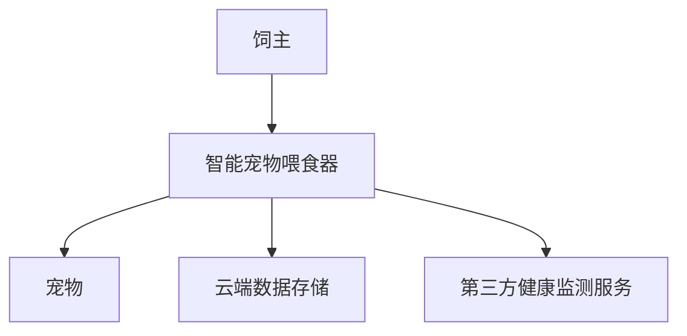
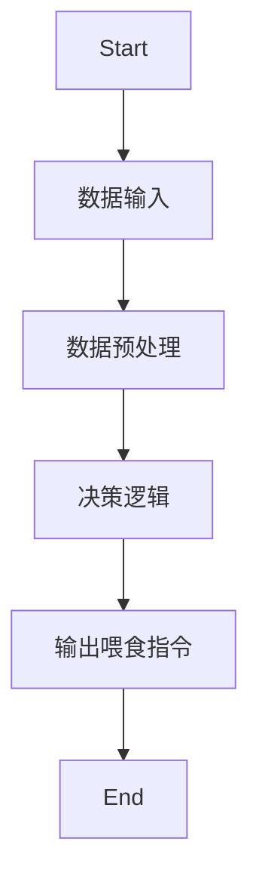
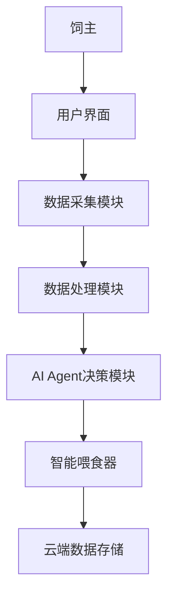

                 


# 智能宠物喂食器：AI Agent的宠物饮食管理

---

## 关键词

- 智能宠物喂食器
- AI Agent
- 宠物饮食管理
- 物联网
- 智能家居

---

## 摘要

随着宠物数量的增加和人们对宠物健康的关注，智能宠物喂食器逐渐成为宠物管理的重要工具。本文将探讨如何利用AI Agent技术实现智能宠物喂食器的功能，从背景分析、核心算法、系统设计到项目实战，全面解析智能宠物喂食器的实现过程。文章还将讨论AI Agent在宠物饮食管理中的应用前景，为读者提供深刻的见解和实用的技术指导。

---

## 目录大纲

### 第一部分：背景与概述

#### 第1章：智能宠物喂食器的背景与问题背景

##### 1.1 问题背景

- 1.1.1 宠物喂食管理的痛点
  - 手动喂食的不便性
  - 饲主不在家时的喂食问题
  - 宠物饮食健康管理的需求

- 1.1.2 智能宠物喂食器的出现
  - 智能家居的发展背景
  - AI Agent技术的成熟与应用

##### 1.2 问题描述

- 1.2.1 宠物喂食管理的复杂性
  - 不同宠物的饮食需求差异
  - 喂食时间的精准控制
  - 饲主对宠物健康的关注

- 1.2.2 现有解决方案的不足
  - 传统喂食器的功能局限性
  - 人工管理的低效性
  - 饲主对智能化管理的需求

##### 1.3 问题解决：智能宠物喂食器

- 1.3.1 AI Agent在宠物喂食管理中的应用
  - AI Agent的基本概念
  - AI Agent的核心功能
  - AI Agent与智能宠物喂食器的结合

##### 1.4 系统的边界与外延

- 1.4.1 系统边界
  - 宠物喂食管理的核心功能
  - 系统的输入与输出
  - 系统的交互方式

- 1.4.2 系统外延
  - 与智能家居的集成
  - 数据的云端存储与分析
  - 第三方服务的接入

---

### 第二部分：核心概念与联系

#### 第2章：AI Agent的核心原理

##### 2.1 AI Agent的基本原理

- 2.1.1 AI Agent的定义
  - 自主决策的智能体
  - 多智能体系统
  - 人机协作的AI Agent

- 2.1.2 AI Agent的核心特征
  - 感知能力
  - 决策能力
  - 执行能力
  - 学习能力

##### 2.2 AI Agent与智能宠物喂食器的结合

- 2.2.1 AI Agent在宠物喂食器中的角色
  - 数据采集与分析
  - 喂食时间的智能决策
  - 宠物健康状态的监测

- 2.2.2 系统架构与核心功能
  - 中央控制模块
  - 数据采集模块
  - 人机交互模块
  - 学习优化模块

##### 2.3 系统核心要素对比

| 核心要素         | 描述                                         |
|------------------|--------------------------------------------|
| 数据采集模块     | 负责收集宠物的饮食数据、健康数据             |
| 中央控制模块     | 处理数据并生成喂食指令                       |
| AI Agent         | 执行决策，优化喂食策略                     |
| 人机交互模块     | 提供用户界面，支持饲主与系统的互动           |

##### 2.4 系统实体关系图



---

### 第三部分：算法原理与实现

#### 第3章：AI Agent的算法实现

##### 3.1 算法原理

- 3.1.1 算法概述
  - 基于时间序列的喂食决策
  - 基于宠物健康数据的喂食调整

- 3.1.2 算法流程
  - 数据采集与预处理
  - 喂食时间预测
  - 喂食量计算
  - 决策优化

##### 3.2 算法流程图



##### 3.3 算法数学模型

- 喂食时间预测公式：
  $$ t_{feed} = t_{previous} + \Delta t $$
  其中，$$ t_{previous} $$ 是上一次喂食时间，$$ \Delta t $$ 是预设喂食间隔。

- 喂食量计算公式：
  $$ q_{feed} = q_{base} \times (1 + \alpha \times s_{health}) $$
  其中，$$ q_{base} $$ 是基础喂食量，$$ \alpha $$ 是健康状态调整系数，$$ s_{health} $$ 是宠物健康评分。

##### 3.4 Python实现示例

```python
def predict_feed_time(previous_time, interval):
    return previous_time + interval

def calculate_feed_quantity(base_quantity, health_score):
    alpha = 0.1
    return base_quantity * (1 + alpha * health_score)
```

---

### 第四部分：系统分析与架构设计

#### 第4章：系统分析与架构设计

##### 4.1 问题场景介绍

- 系统需要解决的主要问题：
  - 实时监测宠物的健康状态
  - 自动调整喂食时间和喂食量
  - 提供饲主的便捷管理

##### 4.2 项目介绍

- 项目目标：
  - 实现智能宠物喂食器的核心功能
  - 开发AI Agent算法
  - 提供用户友好的管理界面

##### 4.3 系统功能设计

- 功能模块：
  - 数据采集模块
  - 数据处理模块
  - AI Agent决策模块
  - 用户界面模块

##### 4.4 系统架构设计



##### 4.5 接口设计与交互流程

- 接口设计：
  - 数据采集接口：传感器数据采集
  - 系统控制接口：AI Agent指令输出
  - 用户交互接口：喂食时间和量的设置

- 交互流程图：

```mermaid
graph TD
    User[饲主] --> UI[用户界面]
    UI --> Agent[A

