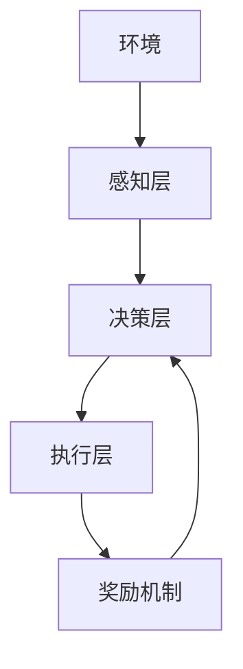
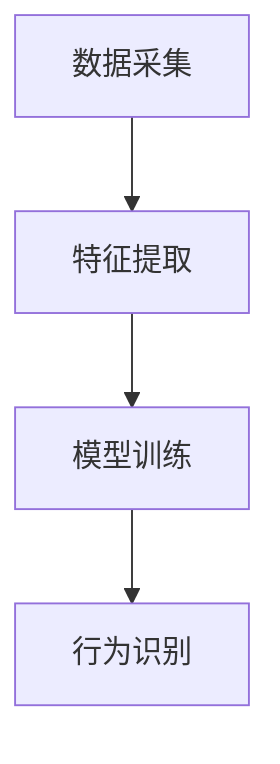
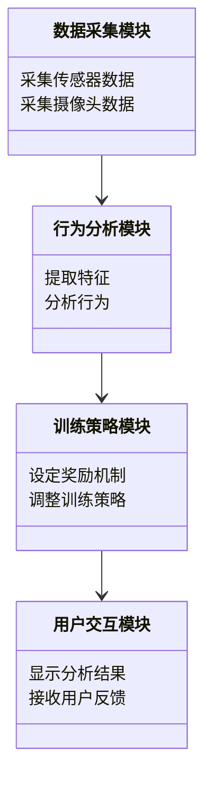
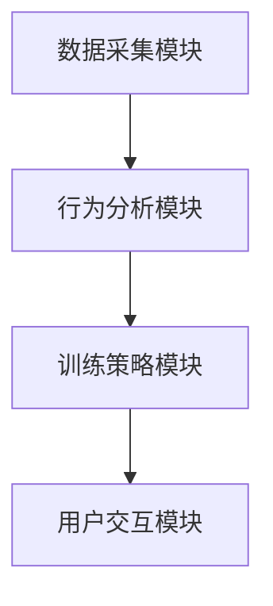
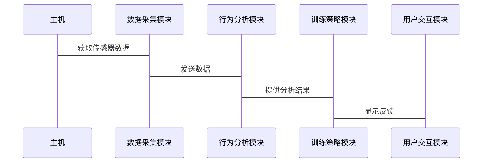

                 


# 智能宠物屋：AI Agent的宠物行为分析与训练

## 关键词
智能宠物屋, AI Agent, 宠物行为分析, 强化学习, 系统架构设计, 项目实战

## 摘要
本文深入探讨了AI Agent在宠物行为分析与训练中的应用，结合实际案例和系统设计，详细分析了AI Agent的核心原理、算法实现、系统架构以及项目实战。通过本文，读者可以全面了解智能宠物屋的设计与实现过程，掌握AI技术在宠物行为分析中的具体应用。

---

## 第1章：背景介绍

### 1.1 问题背景
#### 1.1.1 宠物行为分析的现状与挑战
宠物行为分析是一个复杂的领域，传统的基于规则的方法难以应对宠物行为的多样性和动态变化。随着AI技术的发展，尤其是深度学习和强化学习的兴起，为宠物行为分析提供了新的可能性。

#### 1.1.2 智能宠物屋的概念与目标
智能宠物屋旨在通过AI Agent实时分析和理解宠物行为，提供个性化的训练方案，改善宠物行为，提升宠物与主人的互动体验。

#### 1.1.3 AI Agent在宠物行为分析中的作用
AI Agent通过实时数据采集、行为识别、决策反馈，帮助宠物主人更好地理解和训练宠物行为。

### 1.2 问题描述
#### 1.2.1 宠物行为分析的需求
宠物主人希望了解宠物的行为模式，及时发现异常行为，并通过科学的方法进行训练。

#### 1.2.2 智能宠物屋的功能与目标
智能宠物屋通过传感器和摄像头采集宠物数据，利用AI技术分析行为，提供训练建议。

#### 1.2.3 AI Agent在行为分析中的具体任务
AI Agent需要实时处理数据，识别行为，提供反馈，并根据行为结果调整训练策略。

### 1.3 问题解决
#### 1.3.1 AI Agent的核心技术
AI Agent利用强化学习和监督学习算法，结合实时数据，实现行为分析和训练。

#### 1.3.2 数据采集与处理方法
通过传感器和摄像头采集宠物的行为数据，进行预处理和特征提取，为后续分析提供基础。

#### 1.3.3 行为分析与训练的实现
基于强化学习的训练方法，AI Agent通过奖励机制引导宠物形成良好的行为习惯。

### 1.4 边界与外延
#### 1.4.1 智能宠物屋的适用范围
适用于家庭宠物训练，特别是狗和猫的行为分析与训练。

#### 1.4.2 AI Agent的局限性
目前AI Agent主要依赖于传感器数据，难以完全理解宠物的复杂情感和行为动机。

#### 1.4.3 相关技术的扩展
结合计算机视觉、语音识别等技术，进一步提升宠物行为分析的准确性。

### 1.5 核心要素与组成
#### 1.5.1 系统组成部分
包括数据采集模块、行为分析模块、训练策略模块和用户交互模块。

#### 1.5.2 关键技术要素
传感器数据采集、行为识别算法、强化学习算法和用户反馈机制。

#### 1.5.3 系统架构的核心模块
数据采集、行为分析、训练策略和用户交互模块的协同工作。

---

## 第2章：核心概念与联系

### 2.1 AI Agent的核心原理
#### 2.1.1 定义与分类
AI Agent是一种智能体，能够感知环境并采取行动以实现目标。在宠物行为分析中，AI Agent主要负责数据处理和行为反馈。

#### 2.1.2 AI Agent的感知与决策机制
AI Agent通过传感器和摄像头感知宠物行为，利用强化学习算法进行决策和反馈。

#### 2.1.3 基于强化学习的训练方法
强化学习通过奖励机制，引导宠物形成良好的行为习惯。

### 2.2 宠物行为分析模型
#### 2.2.1 数据采集与预处理
通过传感器和摄像头采集宠物的行为数据，进行清洗和特征提取。

#### 2.2.2 行为识别算法
基于深度学习的模型，识别宠物的具体行为，如坐、卧、跳跃等。

#### 2.2.3 行为分析模型的构建
构建行为分析模型，分析宠物行为的模式和趋势，提供训练建议。

### 2.3 AI Agent与宠物行为分析的关系
#### 2.3.1 系统整体架构
AI Agent与宠物行为分析模型协同工作，实现行为识别、分析和反馈。

#### 2.3.2 各模块之间的关系
数据采集模块提供输入，行为分析模块进行处理，AI Agent根据分析结果提供反馈。

#### 2.3.3 系统功能与
系统功能包括数据采集、行为识别、训练反馈和用户交互。

---

## 第3章：算法原理

### 3.1 强化学习算法
#### 3.1.1 算法原理
强化学习通过奖励机制，引导宠物采取正确的行动。

#### 3.1.2 算法流程图


#### 3.1.3 数学模型
强化学习的目标是最大化累积奖励，数学模型如下：
$$ R = \sum_{t=1}^{T} r_t $$
其中，$r_t$ 是第$t$步的奖励。

### 3.2 监督学习算法
#### 3.2.1 算法原理
监督学习通过标记数据，训练模型识别宠物行为。

#### 3.2.2 算法流程图


#### 3.2.3 数学模型
监督学习的目标是最小化预测误差，数学模型如下：
$$ \text{损失函数} = \sum_{i=1}^{n} (y_i - \hat{y}_i)^2 $$

---

## 第4章：系统分析与架构设计

### 4.1 问题场景介绍
智能宠物屋需要实时分析宠物行为，提供训练反馈，改善宠物行为。

### 4.2 项目介绍
智能宠物屋是一个基于AI的系统，用于分析和训练宠物行为。

### 4.3 系统功能设计
#### 4.3.1 领域模型


### 4.4 系统架构设计
#### 4.4.1 系统架构图


### 4.5 系统接口设计
#### 4.5.1 接口设计
数据采集模块提供API接口，供行为分析模块调用。

#### 4.5.2 交互序列图


---

## 第5章：项目实战

### 5.1 环境安装
安装Python、TensorFlow和OpenCV等依赖库。

### 5.2 系统核心实现
#### 5.2.1 数据采集代码
```python
import numpy as np
import cv2

cap = cv2.VideoCapture(0)
while cap.isOpened():
    ret, frame = cap.read()
    if not ret:
        break
    cv2.imshow('Pet Behavior Analysis', frame)
    if cv2.waitKey(1) == ord('q'):
        break
cap.release()
cv2.destroyAllWindows()
```

#### 5.2.2 行为识别代码
```python
import tensorflow as tf
model = tf.keras.models.load_model('behavior_model.h5')
def predict_behavior(frame):
    prediction = model.predict(frame)
    return np.argmax(prediction)
```

### 5.3 案例分析
分析宠物坐、卧、跳跃等行为，提供训练反馈。

### 5.4 项目小结
通过项目实战，验证了AI Agent在宠物行为分析中的有效性。

---

## 第6章：最佳实践

### 6.1 小结
AI Agent在宠物行为分析中具有广阔的应用前景。

### 6.2 注意事项
确保数据隐私和系统的稳定性，避免误判和过度训练。

### 6.3 拓展阅读
推荐阅读相关AI技术和宠物行为分析的书籍和论文。

---

## 作者：AI天才研究院 & 禅与计算机程序设计艺术

---

通过本文的详细分析和系统设计，读者可以全面了解智能宠物屋的实现过程，掌握AI技术在宠物行为分析中的应用。希望本文能够为相关领域的研究和实践提供有价值的参考。

