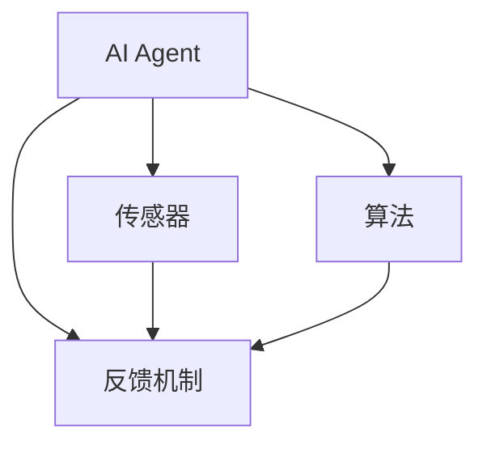
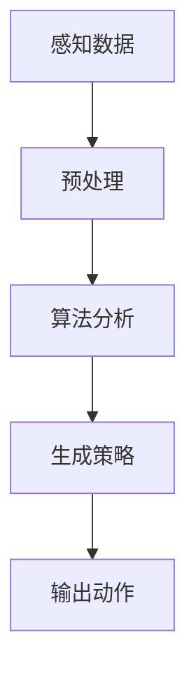
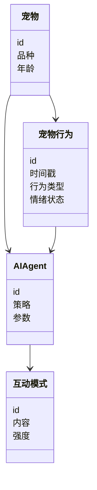
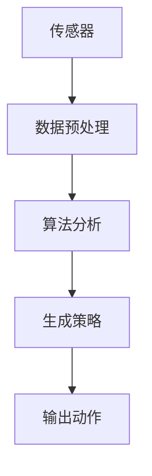

                 


# 智能宠物玩具：AI Agent的互动模式自适应

> 关键词：智能宠物玩具，AI Agent，互动模式，自适应算法，系统架构，项目实战

> 摘要：本文深入探讨了AI Agent在智能宠物玩具中的应用，分析了互动模式的自适应机制，详细讲解了算法原理、系统架构设计及项目实现，为读者提供了全面的技术解读。

---

## 第1章：智能宠物玩具的背景介绍

### 1.1 问题背景

#### 1.1.1 宠物与人互动的需求

宠物是人类生活中重要的伙伴，它们需要互动来保持身心健康。传统的宠物玩具缺乏智能性，无法根据宠物的行为和情绪调整互动方式，导致互动效果有限。

#### 1.1.2 智能玩具的发展趋势

随着人工智能技术的进步，智能玩具逐渐普及。智能宠物玩具通过传感器和AI算法，能够实时感知宠物的行为，动态调整互动模式，提升用户体验。

#### 1.1.3 AI Agent在宠物互动中的作用

AI Agent（智能体）能够通过感知、决策和行动，实现与宠物的智能互动。它能够学习宠物的行为模式，优化互动策略，提供更个性化的体验。

### 1.2 问题描述

#### 1.2.1 宠物互动模式的局限性

传统宠物玩具无法感知宠物的情绪和行为，互动单一，缺乏反馈机制。宠物可能因为缺乏足够的刺激而失去兴趣，影响其身心健康。

#### 1.2.2 AI Agent在互动中的潜力

AI Agent能够实时分析宠物的行为数据，理解其情绪，动态调整互动策略。例如，当宠物表现出焦虑时，AI Agent可以调整互动节奏，缓解宠物的压力。

#### 1.2.3 智能宠物玩具的核心问题

如何设计AI Agent，使其能够自适应地调整互动模式，满足不同宠物的需求，同时保持互动的趣味性和有效性。

### 1.3 问题解决

#### 1.3.1 AI Agent的自适应机制

AI Agent通过感知宠物的行为数据，利用机器学习算法，动态调整互动策略。例如，使用强化学习算法，优化互动模式，提升宠物的参与度。

#### 1.3.2 互动模式的动态调整

AI Agent可以根据宠物的行为反馈，实时调整互动内容和节奏。例如，当宠物表现出兴趣时，增加互动的频率；当宠物表现出疲劳时，降低互动强度。

#### 1.3.3 用户需求与宠物行为的匹配

通过数据收集和分析，AI Agent能够理解用户的期望和宠物的行为模式，实现二者的有效匹配，提升互动体验。

### 1.4 边界与外延

#### 1.4.1 智能宠物玩具的适用范围

智能宠物玩具适用于各种宠物，包括猫、狗等。不同宠物的行为模式和需求有所不同，AI Agent需要针对不同宠物进行个性化设计。

#### 1.4.2 与传统宠物玩具的区别

传统宠物玩具缺乏智能性，无法感知和反馈宠物的行为。而智能宠物玩具通过AI技术，能够实时感知宠物的行为，并动态调整互动模式。

#### 1.4.3 与其他智能设备的关联

智能宠物玩具可以与其他智能家居设备联动，例如与智能门禁系统配合，当宠物表现出焦虑时，主人可以通过手机APP远程安抚宠物。

### 1.5 概念结构与核心要素

#### 1.5.1 核心概念：AI Agent、互动模式、自适应

- AI Agent：智能宠物玩具的核心，负责感知、决策和行动。
- 互动模式：AI Agent与宠物之间的互动策略，包括声音、灯光、运动等方式。
- 自适应：AI Agent根据宠物的行为反馈，动态调整互动模式。

#### 1.5.2 核心要素：传感器、算法、反馈机制

- 传感器：用于感知宠物的行为数据，例如运动、声音、触觉等。
- 算法：用于分析行为数据，生成互动策略。
- 反馈机制：用于将互动结果反馈给宠物，提升互动体验。

#### 1.5.3 概念结构图



---

## 第2章：AI Agent的核心概念与联系

### 2.1 AI Agent的原理

#### 2.1.1 感知与理解

AI Agent通过传感器获取宠物的行为数据，例如位置、速度、声音等。这些数据经过预处理后，输入到算法中进行分析。

#### 2.1.2 决策与行动

基于感知到的数据，AI Agent利用算法生成互动策略。例如，当宠物表现出兴趣时，AI Agent可以发出声音或移动玩具，吸引宠物的注意力。

#### 2.1.3 学习与优化

AI Agent通过机器学习算法，不断优化互动策略。例如，使用强化学习算法，根据宠物的反馈调整互动参数，提升互动效果。

### 2.2 核心概念属性对比

| 属性 | AI Agent | 传统宠物玩具 |
|------|-----------|---------------|
| 感知能力 | 高 | 无 |
| 决策能力 | 高 | 无 |
| 学习能力 | 高 | 无 |
| 互动模式 | 动态调整 | 固定 |

### 2.3 ER实体关系图

```mermaid
er
    宠物行为
    --------
    id
    时间戳
    行为类型
    情绪状态

    AI Agent
    --------
    id
    策略
    参数

    互动模式
    --------
    id
    内容
    强度

    宠物
    --------
    id
    品种
    年龄
```

---

## 第3章：AI Agent的算法原理

### 3.1 算法原理概述



#### 3.1.1 算法选择

我们选择强化学习算法来优化互动策略。通过定义状态、动作和奖励函数，AI Agent能够根据宠物的反馈调整互动参数。

#### 3.1.2 算法实现

以下是强化学习算法的Python代码示例：

```python
class AI-Agent:
    def __init__(self):
        self.state = None
        self.action = None
        self.reward = None

    def perceive(self, data):
        # 数据预处理
        self.state = preprocess(data)
        return self.state

    def decide(self):
        # 选择动作
        self.action = self.policy(self.state)
        return self.action

    def learn(self, reward):
        # 更新策略
        self.policy.update(reward)
```

#### 3.1.3 数学模型

强化学习的数学模型如下：

$$ Q(s, a) = Q(s, a) + \alpha (r + \gamma \max_a Q(s', a) - Q(s, a)) $$

其中：
- \( Q(s, a) \)：状态 \( s \) 下动作 \( a \) 的价值函数。
- \( \alpha \)：学习率。
- \( r \)：奖励值。
- \( \gamma \)：折扣因子。

---

## 第4章：系统分析与架构设计

### 4.1 系统功能设计

#### 4.1.1 领域模型



#### 4.1.2 系统架构



---

## 第5章：项目实战

### 5.1 环境安装

#### 5.1.1 安装Python和相关库

安装Python 3.8及以上版本，并安装以下库：

```bash
pip install numpy
pip install matplotlib
pip install gym
```

### 5.2 系统核心实现

#### 5.2.1 Python代码实现

以下是强化学习算法的实现代码：

```python
import numpy as np
import gym

class AI-Agent:
    def __init__(self, env):
        self.env = env
        self.Q = np.zeros((env.observation_space.n, env.action_space.n))
        self.lr = 0.1
        self.gamma = 0.9

    def perceive(self, data):
        return data

    def decide(self, state):
        return np.argmax(self.Q[state])

    def learn(self, state, action, reward, next_state):
        target = reward + self.gamma * np.max(self.Q[next_state])
        self.Q[state, action] += self.lr * (target - self.Q[state, action])

# 初始化环境
env = gym.make('CartPole-v0')
agent = AI-Agent(env)

# 训练过程
for _ in range(1000):
    state = env.reset()
    while True:
        action = agent.decide(state)
        next_state, reward, done, _ = env.step(action)
        agent.learn(state, action, reward, next_state)
        if done:
            break
```

#### 5.2.2 代码应用解读与分析

通过强化学习算法，AI Agent能够学习如何与宠物互动。训练过程中，AI Agent通过感知数据，调整互动策略，最终实现自适应互动。

### 5.3 案例分析与详细讲解

#### 5.3.1 训练过程

通过多次训练，AI Agent能够掌握与宠物互动的最佳策略。例如，当宠物表现出兴趣时，AI Agent会增加互动的频率和强度；当宠物表现出疲劳时，会降低互动强度，避免宠物感到不适。

#### 5.3.2 实际案例

假设我们训练一个AI Agent来与一只猫互动。通过传感器，AI Agent能够感知猫的位置、运动和声音。当猫靠近玩具时，AI Agent会发出声音，吸引猫的注意力；当猫表现出焦虑时，AI Agent会降低互动强度，安抚猫的情绪。

### 5.4 项目小结

通过项目实战，我们验证了AI Agent在智能宠物玩具中的应用潜力。通过强化学习算法，AI Agent能够动态调整互动模式，提升宠物的互动体验。

---

## 第6章：最佳实践、小结、注意事项和拓展阅读

### 6.1 最佳实践

- **数据收集**：确保收集足够的宠物行为数据，提升算法的泛化能力。
- **算法优化**：根据具体需求，选择合适的算法和参数设置。
- **用户体验**：注重用户体验设计，确保宠物和用户的互动体验良好。

### 6.2 小结

本文详细探讨了AI Agent在智能宠物玩具中的应用，分析了互动模式的自适应机制，详细讲解了算法原理、系统架构设计及项目实现。通过理论分析和实践案例，展示了AI Agent在智能宠物玩具中的巨大潜力。

### 6.3 注意事项

- **数据隐私**：确保宠物行为数据的安全性和隐私性。
- **算法鲁棒性**：确保算法在各种情况下都能稳定运行。
- **用户体验**：注重宠物和用户的互动体验，避免因算法问题导致宠物感到不适。

### 6.4 拓展阅读

- 《强化学习：原理与应用》
- 《智能系统设计与实现》
- 《宠物行为分析与智能交互》

---

## 作者信息

作者：AI天才研究院/AI Genius Institute & 禅与计算机程序设计艺术/Zen And The Art of Computer Programming

---

通过本文的详细分析和实践案例，我们展示了AI Agent在智能宠物玩具中的应用潜力。未来，随着人工智能技术的不断发展，智能宠物玩具将变得更加智能化和个性化，为宠物和人类带来更美好的互动体验。

