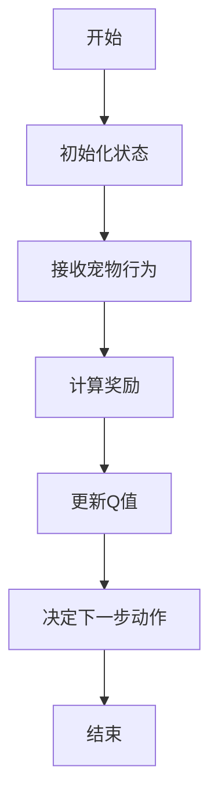
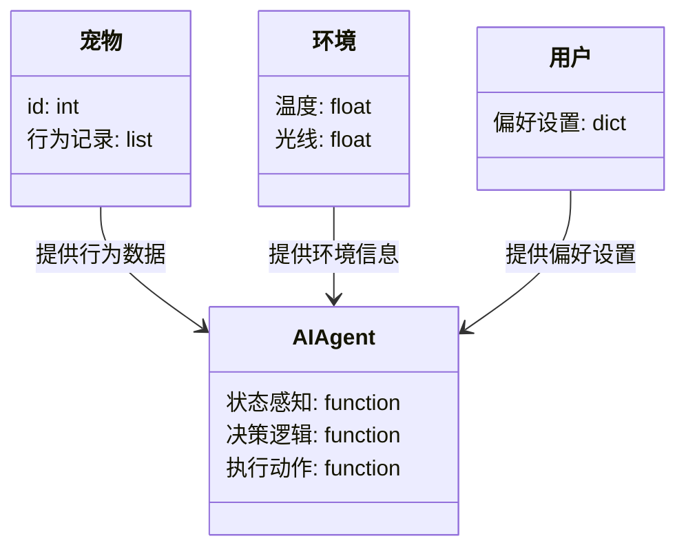
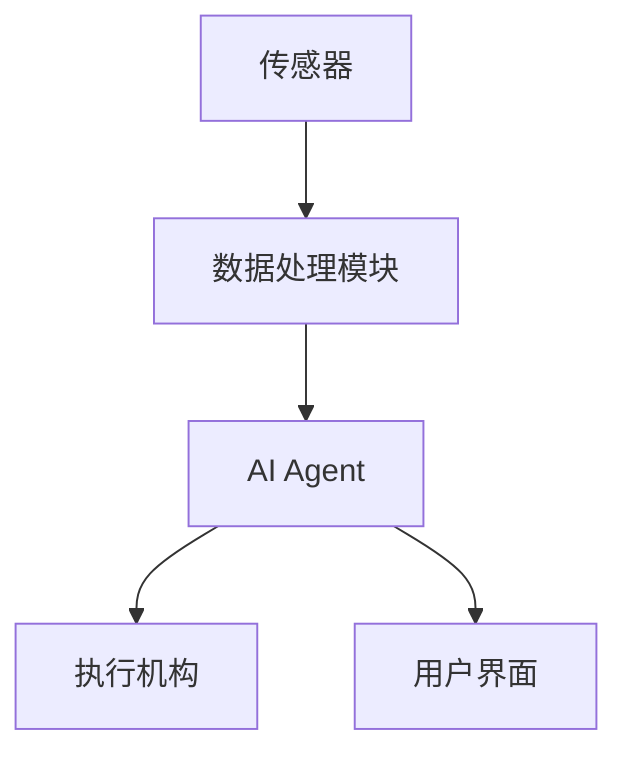
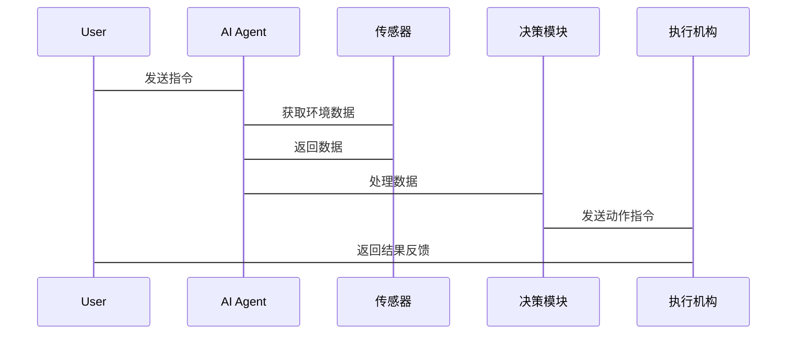

                 


# 智能宠物玩具：AI Agent的互动模式调整

---

> 关键词：AI Agent，智能宠物玩具，互动模式，强化学习，系统架构

> 摘要：本文探讨了AI Agent在智能宠物玩具中的应用，详细分析了其核心概念、算法原理、系统架构及实际案例，展示了如何通过AI技术提升宠物玩具的互动性和智能化。

---

## 第一部分：背景介绍

### 第1章：AI Agent与智能宠物玩具概述

#### 1.1 AI Agent的基本概念
- **1.1.1 AI Agent的定义**  
  AI Agent（人工智能代理）是指能够感知环境、自主决策并执行任务的智能体。它通过传感器获取信息，利用算法处理数据，执行动作以达到目标。

- **1.1.2 AI Agent的核心特征**  
  - 自主性：无需外部干预，自主决策。  
  - 反应性：实时感知环境并做出反应。  
  - 学习能力：通过经验优化行为策略。  

- **1.1.3 AI Agent在智能宠物玩具中的应用**  
  AI Agent可以用于分析宠物行为，调整互动模式，提升用户体验。

#### 1.2 智能宠物玩具的发展现状
- **1.2.1 智能宠物玩具的分类**  
  - 基于传感器的互动玩具（如自动喂食器、智能球）。  
  - 基于AI的智能玩具（如语音互动玩具）。  

- **1.2.2 当前市场的主要产品**  
  - 知名品牌：例如Furbo智能逗猫棒、Happypops智能狗玩具。  
  - 技术特点：传感器、语音识别、移动应用控制。  

- **1.2.3 智能宠物玩具的技术趋势**  
  - 结合AI技术，提供个性化互动体验。  
  - 增强现实（AR）技术的应用，提升用户体验。  

---

## 第二部分：AI Agent的核心概念与原理

### 第2章：AI Agent的核心概念与联系

#### 2.1 AI Agent的工作原理
- **感知模块**：通过传感器获取环境数据，如宠物的行为、位置。  
- **决策模块**：基于感知数据，利用算法生成互动策略。  
- **执行模块**：驱动执行机构，如机械臂或发声装置，与宠物互动。  

#### 2.2 概念属性特征对比表格

| 比较项           | 基于规则的AI Agent | 基于强化学习的AI Agent | 基于机器学习的AI Agent |
|------------------|---------------------|--------------------------|-------------------------|
| 决策方式         | 预定义规则         | 奖励驱动学习             | 数据驱动模式识别       |
| 适应性           | 低                 | 高                       | 中                     |
| 开发复杂度       | 低                 | 高                       | 中                     |
| 适用场景         | 简单任务           | 复杂任务                 | 多样化任务             |

#### 2.3 ER实体关系图
```mermaid
er
  entity: 宠物
  entity: 环境
  entity: 用户
  entity: AI Agent
  relation: 实体关系
  relationship: 宠物与AI Agent (互动)
  relationship: 环境与AI Agent (感知)
  relationship: 用户与AI Agent (控制)
```

---

## 第三部分：算法原理讲解

### 第3章：算法选择与实现

#### 3.1 算法选择与流程图
- **选择算法**：基于强化学习的Q-learning算法，适用于动态环境下的策略优化。  
- **流程图**：


#### 3.2 Python代码实现
```python
import numpy as np

class AI-Agent:
    def __init__(self, state_space, action_space):
        self.state_space = state_space
        self.action_space = action_space
        self.Q = np.zeros((state_space, action_space))

    def act(self, state):
        return np.argmax(self.Q[state, :])

    def reward(self, state, action, reward):
        self.Q[state, action] = reward + np.max(self.Q[state, :])

# 示例用法
states = 5
actions = 3
agent = AI-Agent(states, actions)
state = 0
action = agent.act(state)
agent.reward(state, action, 1)
```

#### 3.3 数学模型与公式
- **Q-learning公式**：$$ Q(s, a) = r + \gamma \max Q(s', a') $$  
  其中，\( s \) 是当前状态，\( a \) 是动作，\( r \) 是奖励，\( \gamma \) 是折扣因子，\( s' \) 是下一步状态。  

---

## 第四部分：系统分析与架构设计

### 第4章：系统架构设计

#### 4.1 领域模型类图


#### 4.2 系统架构图


#### 4.3 系统接口与交互流程图


---

## 第五部分：项目实战

### 第5章：环境安装与核心实现

#### 5.1 环境安装
- **安装Python**：确保安装最新版本的Python和pip。  
- **安装依赖**：使用pip安装numpy、tensorflow等库。  

#### 5.2 核心代码实现
```python
import numpy as np

def train_agent(env, num_episodes=1000):
    Q = np.zeros(env.observation_space, dtype=np.int32)
    for episode in range(num_episodes):
        state = env.reset()
        for _ in range(env.max_steps):
            action = np.argmax(Q[state])
            next_state, reward, done = env.step(action)
            Q[state][action] = reward + env.gamma * np.max(Q[next_state])
            state = next_state
            if done:
                break
    return Q

# 示例环境
class Environment:
    def __init__(self):
        self.observation_space = 5
        self.action_space = 3
        self.gamma = 0.9

    def reset(self):
        return 0

    def step(self, action):
        return 1, 1, False

trained_Q = train_agent(Environment())
```

#### 5.3 实际案例分析
- **案例**：训练AI Agent调整逗猫棒的速度和方向，根据宠物的反应优化互动策略。  
- **分析**：通过记录宠物的行为数据，AI Agent学习最佳互动模式，提升用户体验。  

---

## 第六部分：最佳实践、小结与注意事项

### 第6章：开发经验与注意事项

#### 6.1 开发经验分享
- **数据收集**：确保收集足够多的宠物行为数据，以提高AI Agent的学习效果。  
- **算法调优**：根据具体场景调整算法参数，如学习率和折扣因子。  

#### 6.2 注意事项
- **数据隐私**：处理宠物数据时需遵守相关隐私法规。  
- **硬件性能**：确保硬件能够支持实时数据处理和算法运行。  

#### 6.3 拓展阅读
- 推荐阅读相关论文和博客，深入学习强化学习和系统架构设计。

---

## 作者信息

作者：AI天才研究院/AI Genius Institute & 禅与计算机程序设计艺术/Zen And The Art of Computer Programming

---

通过以上结构，文章详细探讨了AI Agent在智能宠物玩具中的应用，从理论到实践，为读者提供了全面而深入的指导。

