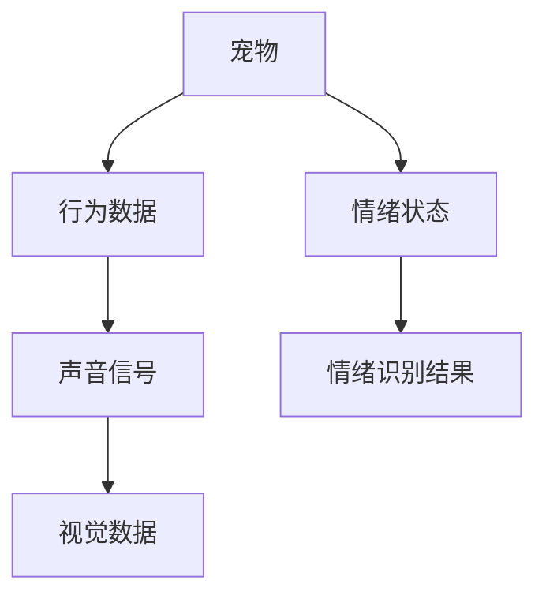

                 


# 智能宠物玩具：AI Agent的宠物情绪识别

> 关键词：智能宠物玩具，AI Agent，宠物情绪识别，机器学习，情感计算，行为数据

> 摘要：本文探讨了AI Agent在宠物情绪识别中的应用，分析了宠物情绪识别的核心概念、算法原理、系统架构及项目实现。通过详细的技术分析和实际案例，展示了如何利用AI技术提升宠物与人之间的互动体验。

---

## 第1章 智能宠物玩具与宠物情绪识别概述

### 1.1 智能宠物玩具的背景与意义

#### 1.1.1 宠物与人的情感纽带
宠物不仅是家庭的一部分，还能为人类提供情感支持和陪伴。理解宠物的情绪状态，有助于更好地照顾它们，提升宠物的幸福感。

#### 1.1.2 智能玩具在宠物互动中的作用
传统宠物玩具功能单一，而智能宠物玩具通过AI技术，能够与宠物互动，提供更有趣和个性化的体验。

#### 1.1.3 AI Agent在宠物情绪识别中的应用价值
AI Agent（智能代理）能够实时分析宠物的行为和生理数据，识别情绪状态，并做出相应的反馈，如调整玩具互动方式或发出安抚指令。

---

### 1.2 宠物情绪识别的核心概念

#### 1.2.1 宠物情绪的基本分类
宠物情绪可以分为快乐、焦虑、愤怒、悲伤、好奇等。每种情绪对应不同的行为和生理特征。

#### 1.2.2 情绪识别的定义与目标
情绪识别是通过分析宠物的行为、声音和生理数据，推断其情绪状态的过程。目标是实现精准的情绪识别，提升人宠互动体验。

#### 1.2.3 情绪识别的边界与外延
情绪识别不等于行为识别，也不等同于情感分析。它关注的是宠物的情绪状态，而非具体的情感内容。

---

## 第2章 宠物情绪识别的核心概念与联系

### 2.1 情绪识别的核心原理

#### 2.1.1 基于行为数据的分析
宠物的行为数据包括活动频率、运动模式、停留时间等。通过分析这些数据，可以识别宠物的情绪状态。

#### 2.1.2 基于声音信号的分析
宠物的声音（如叫声、呼噜声）是情绪表达的重要方式。通过声音信号分析，可以识别宠物的快乐、焦虑等情绪。

#### 2.1.3 基于视觉数据的分析
通过摄像头捕捉宠物的表情、肢体动作等视觉信息，结合计算机视觉技术，可以识别宠物的情绪。

---

### 2.2 核心概念对比分析

#### 2.2.1 不同情绪识别方法的特征对比

| 方法       | 优点                               | 缺点                               |
|------------|------------------------------------|------------------------------------|
| 行为数据分析 | 实时性高，易于获取                 | 对情绪的理解较浅层               |
| 声音信号分析 | 情感表达丰富，适合情绪分类         | 数据获取复杂，受环境干扰大         |
| 视觉数据分析 | 能捕捉表情和动作细节               | 计算复杂度高，需要高性能硬件       |

#### 2.2.2 情绪识别与行为识别的联系与区别
情绪识别关注宠物的内在情绪状态，而行为识别关注外在行为模式。情绪识别是行为识别的高级阶段。

#### 2.2.3 情绪识别与其他AI任务的关联
情绪识别与语音识别、图像识别等技术密切相关，能够为宠物健康管理、智能玩具设计提供技术支持。

---

### 2.3 实体关系图



---

## 第3章 宠物情绪识别的算法原理

### 3.1 基于机器学习的情绪识别算法

#### 3.1.1 算法流程
1. 数据采集：收集宠物的行为、声音、视觉数据。
2. 数据预处理：清洗、归一化、特征提取。
3. 模型训练：使用分类算法（如SVM、随机森林）或深度学习模型（如CNN、RNN）进行训练。
4. 模型优化：通过交叉验证、超参数调优提升模型性能。
5. 模型部署：将模型集成到智能宠物玩具中，实时识别宠物情绪。

#### 3.1.2 算法实现

##### (a) 数据预处理
```python
import numpy as np
from sklearn.preprocessing import StandardScaler

# 假设X为原始数据，y为标签
scaler = StandardScaler()
X_scaled = scaler.fit_transform(X)
```

##### (b) 模型训练
```python
from sklearn.svm import SVC

model = SVC(kernel='rb

