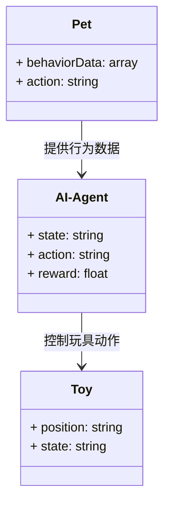
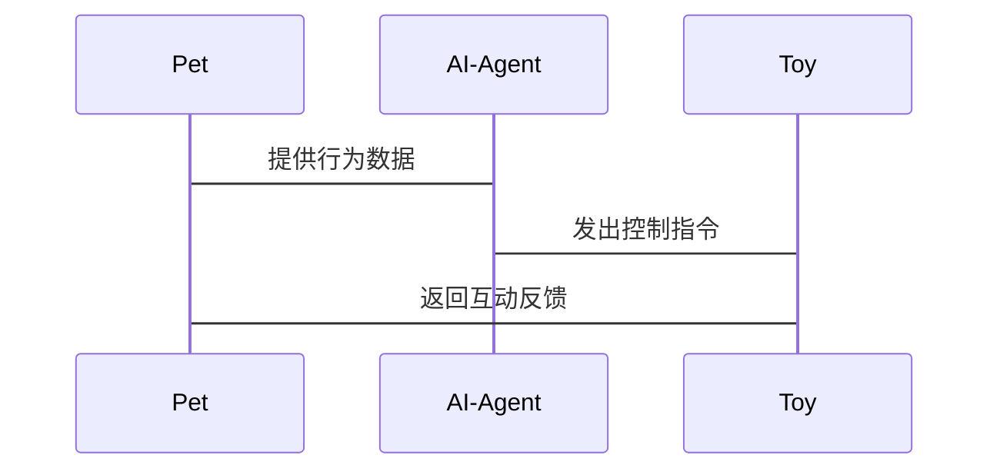

                 


# 智能宠物玩具：AI Agent的宠物智力开发

## 关键词
智能宠物玩具，AI Agent，宠物智力开发，强化学习，Q-learning算法，宠物行为分析

## 摘要
随着人工智能技术的快速发展，宠物智能化成为了一个新兴的研究领域。智能宠物玩具通过集成AI Agent技术，能够实时分析宠物行为并进行互动，从而有效提升宠物的智力水平。本文从AI Agent的基本原理出发，详细探讨了智能宠物玩具的设计与实现，结合强化学习算法和数学模型，分析了其在宠物智力开发中的应用。通过实际案例和项目实战，本文展示了如何利用AI技术为宠物创造更智能、更有趣的互动体验。

---

# 第一部分: 智能宠物玩具与AI Agent概述

## 第1章: 智能宠物玩具的背景与意义

### 1.1 智能宠物玩具的背景介绍

#### 1.1.1 宠物智能化的背景
随着人们生活水平的提高，宠物在家庭中的地位越来越重要。宠物不仅仅是家庭的一员，更是主人情感的重要寄托。然而，宠物的行为习惯和智力水平却一直受到限制。传统的宠物玩具只能提供简单的物理刺激，无法根据宠物的行为做出智能反馈。近年来，人工智能技术的快速发展为宠物玩具的智能化提供了新的可能性。

#### 1.1.2 AI技术在宠物产品中的应用
AI技术在宠物产品中的应用主要集中在以下几个方面：
1. **宠物行为分析**：通过摄像头和传感器，实时监测宠物的行为，如动作、声音、情绪等。
2. **智能互动**：根据宠物的行为，自动调整玩具的互动方式，如自动摇动、发声、移动等。
3. **宠物训练**：通过AI算法，设计训练方案，帮助宠物主人更好地训练宠物。

#### 1.1.3 智能宠物玩具的定义与分类
智能宠物玩具是指集成了AI技术的宠物玩具，能够根据宠物的行为和需求，自动调整互动方式。常见的智能宠物玩具包括：
- **智能猫逗棒**：通过AI算法自动摇动逗棒，激发猫咪的互动兴趣。
- **智能狗玩具**：通过声音和动作吸引狗狗的注意力，帮助其进行训练。

### 1.2 宠物智力开发的核心概念

#### 1.2.1 宠物智力的定义与特点
宠物智力是指宠物对外界刺激的感知、理解和反应能力。与人类不同，宠物的智力主要体现在感知能力、记忆能力、学习能力和问题解决能力等方面。

#### 1.2.2 智能玩具在宠物智力开发中的作用
智能玩具通过与宠物的互动，刺激宠物的大脑活动，帮助其提高感知能力和学习能力。例如，智能猫逗棒可以通过不同的摇动方式，激发猫咪的好奇心和探索欲。

#### 1.2.3 智能宠物玩具的市场现状与发展趋势
目前，智能宠物玩具市场正在快速发展，越来越多的企业开始进入这一领域。未来，随着AI技术的进一步发展，智能宠物玩具将更加智能化、个性化，能够根据宠物的个体需求提供定制化的互动体验。

---

## 第2章: AI Agent的基本原理与应用

### 2.1 AI Agent的定义与特点

#### 2.1.1 AI Agent的基本概念
AI Agent（人工智能代理）是指能够感知环境并采取行动以实现目标的智能体。在智能宠物玩具中，AI Agent主要用于分析宠物的行为，并根据行为反馈调整互动方式。

#### 2.1.2 AI Agent的核心属性与特征
1. **自主性**：AI Agent能够自主决策，无需人工干预。
2. **反应性**：能够实时感知环境并做出反应。
3. **学习能力**：通过学习不断提升互动效果。

#### 2.1.3 AI Agent与传统AI的区别
与传统AI不同，AI Agent具有更强的自主性和适应性。传统AI通常需要明确的规则和数据支持，而AI Agent能够根据环境动态调整行为。

### 2.2 AI Agent在宠物玩具中的应用

#### 2.2.1 AI Agent在宠物行为分析中的作用
AI Agent通过传感器和摄像头收集宠物的行为数据，分析其情绪、动作和兴趣点。

#### 2.2.2 AI Agent在宠物互动中的实现
AI Agent能够根据宠物的行为，实时调整互动方式。例如，当宠物表现出兴趣时，AI Agent会增加互动的频率；当宠物表现出厌烦时，会调整互动方式。

#### 2.2.3 AI Agent在宠物训练中的应用
AI Agent可以设计训练方案，帮助宠物主人更好地训练宠物。例如，通过设定奖励机制，激励宠物完成特定动作。

---

## 第3章: 智能宠物玩具的核心技术

### 3.1 AI Agent的感知与决策机制

#### 3.1.1 感知模块的功能与实现
感知模块负责收集宠物的行为数据，包括动作、声音、情绪等。常用的传感器包括摄像头、麦克风、加速度计等。

#### 3.1.2 决策模块的算法与流程
决策模块基于感知数据，通过算法生成互动策略。常用的算法包括强化学习和监督学习。

#### 3.1.3 执行模块的实现与优化
执行模块负责根据决策结果，驱动玩具的运动。例如，智能猫逗棒的电机控制。

### 3.2 智能玩具的硬件与软件架构

#### 3.2.1 硬件部分的组成与功能
硬件部分包括传感器、电机、控制器等。传感器用于感知宠物行为，电机用于驱动玩具运动，控制器用于协调各部分工作。

#### 3.2.2 软件部分的架构与实现
软件部分包括数据采集、算法处理和用户界面。数据采集模块负责收集宠物行为数据，算法处理模块负责分析数据并生成互动策略，用户界面模块负责展示互动结果。

#### 3.2.3 硬件与软件的协同工作原理
硬件和软件协同工作，硬件负责感知和执行，软件负责数据处理和决策。两者通过通信协议进行交互，确保玩具的正常运行。

---

## 第4章: AI Agent的算法与数学模型

### 4.1 强化学习算法

#### 4.1.1 强化学习的基本概念与原理
强化学习是一种通过试错学习的算法，宠物通过与环境的互动获得奖励或惩罚，从而学习最优策略。

#### 4.1.2 Q-learning算法的实现与流程
Q-learning是一种常用的强化学习算法，通过状态-动作-奖励-状态（SARSA）的循环更新Q值表。

#### 4.1.3 算法的数学模型与公式推导
Q-learning的数学模型如下：
$$ Q(s, a) = Q(s, a) + \alpha [r + \gamma \max Q(s', a') - Q(s, a)] $$
其中，$\alpha$是学习率，$\gamma$是折扣因子。

### 4.2 监督学习算法

#### 4.2.1 监督学习的基本概念与原理
监督学习是一种基于标签数据的算法，通过训练数据预测目标值。

#### 4.2.2 线性回归与分类算法的实现
线性回归用于预测连续值，分类算法用于分类问题。

#### 4.2.3 算法的数学模型与公式推导
线性回归的数学模型如下：
$$ y = \beta_0 + \beta_1 x + \epsilon $$

---

## 第5章: 智能宠物玩具的系统分析与架构设计

### 5.1 系统功能设计

#### 5.1.1 问题场景介绍
智能宠物玩具需要解决的主要问题包括宠物行为分析、互动策略生成和玩具控制。

#### 5.1.2 系统功能设计
系统功能包括数据采集、行为分析、互动策略生成和玩具控制。

#### 5.1.3 领域模型（Mermaid类图）


### 5.2 系统架构设计

#### 5.2.1 系统架构（Mermaid架构图）


#### 5.2.2 系统接口设计
系统接口包括传感器接口、AI-Agent接口和玩具控制接口。

#### 5.2.3 系统交互流程图（Mermaid序列图）


---

## 第6章: 项目实战

### 6.1 环境安装

#### 6.1.1 安装Python与相关库
安装Python 3.8及以上版本，安装库包括numpy、scikit-learn、OpenCV等。

### 6.2 系统核心实现

#### 6.2.1 强化学习算法实现
```python
import numpy as np

class QLearningAgent:
    def __init__(self, state_size, action_size, learning_rate=0.1, gamma=0.9):
        self.q_table = np.zeros((state_size, action_size))
        self.learning_rate = learning_rate
        self.gamma = gamma

    def choose_action(self, state, epsilon=0.1):
        if np.random.random() < epsilon:
            return np.random.randint(0, action_size)
        return np.argmax(self.q_table[state])

    def update_q_table(self, state, action, reward, next_state):
        self.q_table[state][action] = self.q_table[state][action] + self.learning_rate * (reward + self.gamma * np.max(self.q_table[next_state]) - self.q_table[state][action])
```

#### 6.2.2 算法实现解读
上述代码实现了一个Q-learning算法，用于控制智能宠物玩具的互动策略。

### 6.3 实际案例分析

#### 6.3.1 案例分析
通过实际案例分析，展示智能宠物玩具在宠物智力开发中的应用效果。

### 6.4 项目小结
总结项目实现的关键点和成功经验。

---

## 第7章: 最佳实践与注意事项

### 7.1 小结

### 7.2 注意事项

### 7.3 拓展阅读

---

# 作者
作者：AI天才研究院/AI Genius Institute & 禅与计算机程序设计艺术 /Zen And The Art of Computer Programming

---

以上是《智能宠物玩具：AI Agent的宠物智力开发》的完整目录大纲和文章内容，希望对您有所帮助！

