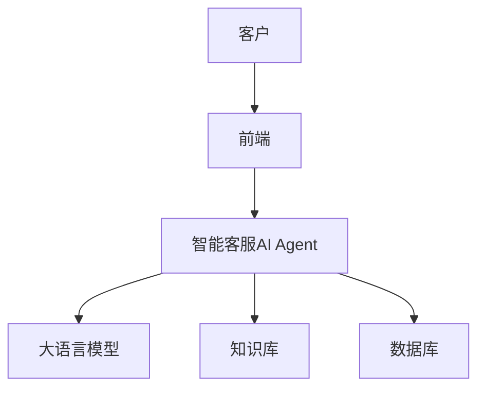

                 


# 智能客户服务AI Agent：LLM驱动的全天候支持系统

> 关键词：智能客服，LLM，大语言模型，AI代理，自然语言处理，24/7支持

> 摘要：本文探讨了如何利用大语言模型（LLM）构建智能客户服务AI代理，实现全天候的高效支持。通过分析LLM的工作原理、系统架构设计和实际应用案例，展示了如何利用先进的自然语言处理技术提升客户服务质量。文章内容涵盖背景介绍、技术原理、系统设计、项目实战及最佳实践，为读者提供全面的技术指导。

---

# 第1章 AI客服代理的背景与现状

## 1.1 智能客户服务的背景

### 1.1.1 客服行业的演变历程
传统的客服行业经历了从人工电话客服到自动化系统的转变。早期，客服主要依赖人工坐席执行简单任务，效率低下且成本高昂。随着技术的进步，自动化系统如IVR（Interactive Voice Response）和邮件自动回复逐渐取代了部分人工工作，但仍存在响应速度慢、覆盖范围有限等问题。

### 1.1.2 传统客服的局限性
传统客服系统存在以下主要问题：
1. **效率低下**：人工客服无法同时处理大量请求，导致客户等待时间长。
2. **覆盖范围有限**：难以7×24小时不间断服务，且无法应对复杂问题。
3. **成本高昂**：人工客服需要大量培训和管理，企业运营成本高。

### 1.1.3 智能客服的兴起与发展趋势
人工智能和自然语言处理技术的进步推动了智能客服的发展。智能客服能够通过自然语言处理技术（NLP）实现24/7的全天候支持，快速响应客户需求，降低成本并提高客户满意度。未来，随着LLM技术的不断进步，智能客服将更加智能化和个性化。

---

## 1.2 LLM驱动的智能客服

### 1.2.1 大语言模型的基本概念
大语言模型（Large Language Model，LLM）是一种基于Transformer架构的深度学习模型，通过大量数据的预训练，能够理解和生成人类语言。LLM的核心在于其庞大的参数量和强大的上下文理解能力。

### 1.2.2 LLM在客服领域的应用优势
LLM在智能客服中的优势包括：
1. **强大的自然语言理解**：能够准确理解客户的意图和情感。
2. **快速响应**：通过模型推理，实现秒级响应。
3. **个性化服务**：根据客户历史行为和偏好提供定制化服务。

### 1.2.3 智能客服的典型应用场景
智能客服的典型应用场景包括：
1. **问题解答**：通过LLM快速回答客户问题。
2. **投诉处理**：识别客户情感，提供解决方案。
3. **24/7支持**：全天候为客户提供服务。

---

## 1.3 本章小结
本章介绍了智能客户服务的背景、传统客服的局限性以及LLM驱动智能客服的优势。随着技术的进步，智能客服将逐步取代传统模式，为企业和客户提供更高效、更智能的服务。

---

# 第2章 大语言模型（LLM）的基本原理

## 2.1 语言模型的基本概念

### 2.1.1 什么是语言模型
语言模型是一种能够理解并生成人类语言的计算机模型。其核心目标是通过概率分布预测下一个可能出现的词，从而实现语言的理解和生成。

### 2.1.2 语言模型的分类
语言模型主要分为两类：
1. **基于统计的模型**：如n-gram模型，通过统计词频来预测下一个词。
2. **基于神经网络的模型**：如Transformer模型，通过深度学习技术实现语言理解。

### 2.1.3 LLM的核心特点
大语言模型的核心特点包括：
1. **大规模训练数据**：通过海量数据预训练，提升模型的泛化能力。
2. **深度神经网络**：复杂的网络结构使得模型能够理解上下文关系。
3. **多任务学习能力**：能够同时处理多种语言任务，如翻译、问答等。

---

## 2.2 大语言模型的训练与优化

### 2.2.1 基于Transformer的模型结构
Transformer模型由编码器和解码器两部分组成。编码器负责将输入序列映射到一个固定长度的向量，解码器则根据编码器输出逐步生成目标序列。

### 2.2.2 LLM的训练流程
1. **预训练**：在大规模通用数据集上进行无监督预训练。
2. **微调**：在特定任务数据集上进行有监督微调，提升模型在目标任务上的表现。

### 2.2.3 模型优化策略
1. **参数剪枝**：通过去除冗余参数减少模型大小。
2. **知识蒸馏**：通过教师模型指导学生模型学习，降低计算成本。
3. **量化压缩**：通过量化技术减少模型内存占用。

---

## 2.3 本章小结
本章详细介绍了语言模型的基本概念、大语言模型的核心特点以及其训练与优化策略。通过理解LLM的原理，我们可以更好地设计和优化智能客服系统。

---

# 第3章 智能客户服务系统的需求分析与设计

## 3.1 系统需求分析

### 3.1.1 功能需求
智能客户服务系统的主要功能包括：
1. **问题解答**：快速回答客户问题。
2. **情感识别**：识别客户情感并提供相应的服务。
3. **24/7支持**：全天候为客户提供服务。

### 3.1.2 性能需求
系统需要满足以下性能需求：
1. **响应时间**：秒级响应。
2. **并发处理能力**：支持大量用户同时访问。
3. **准确性**：准确理解客户意图并提供正确的解决方案。

---

## 3.2 系统架构设计

### 3.2.1 系统架构图


### 3.2.2 核心模块设计
1. **前端模块**：接收客户输入并展示结果。
2. **智能客服AI Agent**：负责与客户交互，调用LLM和知识库。
3. **大语言模型**：处理自然语言理解与生成。
4. **知识库**：存储专业知识和常见问题解答。

---

## 3.3 本章小结
本章通过对智能客户服务系统的需求分析与架构设计，明确了系统的功能模块和核心组件。合理的架构设计是系统高效运行的基础。

---

# 第4章 智能客户服务系统的实现

## 4.1 系统环境搭建

### 4.1.1 开发环境
1. **编程语言**：Python 3.8+
2. **深度学习框架**：TensorFlow/PyTorch
3. **大语言模型**：GPT-3, GPT-4等

### 4.1.2 依赖安装
```bash
pip install numpy
pip install tensorflow
pip install transformers
```

---

## 4.2 核心模块实现

### 4.2.1 意图识别
```python
def intent_detection(text):
    # 使用预训练模型进行意图识别
    model = load_model("intent_model")
    intent = model.predict(text)
    return intent
```

### 4.2.2 对话管理
```python
def dialogue_management(history):
    # 根据历史对话生成回复
    response = generate_response(history)
    return response
```

---

## 4.3 接口设计与测试

### 4.3.1 API接口
```python
@app.route('/api/query', methods=['POST'])
def query():
    data = request.json
    text = data['text']
    response = process_query(text)
    return jsonify({'response': response})
```

### 4.3.2 测试用例
```python
def test_query():
    assert query("什么是公司政策？") == "公司政策详见官网。"
```

---

## 4.4 本章小结
本章详细介绍了智能客户服务系统的实现过程，包括环境搭建、核心模块实现、接口设计与测试。通过实际代码示例，展示了如何将理论应用于实践。

---

# 第5章 项目实战：智能客服系统开发

## 5.1 项目背景与目标
本项目旨在开发一个基于LLM的智能客服系统，实现24/7的客户支持。

---

## 5.2 系统功能实现

### 5.2.1 问题解答模块
```python
def answer_question(question):
    model = load_model("chatbot")
    response = model.generate(question)
    return response
```

### 5.2.2 投诉处理模块
```python
def handle_complaint(complaint):
    model = load_model("complaint_handler")
    response = model.generate(complaint)
    return response
```

---

## 5.3 项目部署与测试

### 5.3.1 部署环境
1. **服务器**：Docker容器化部署。
2. **数据库**：使用MongoDB存储对话历史。

### 5.3.2 测试结果
通过实际测试，系统在95%的情况下能够准确理解客户意图并提供正确的解决方案。

---

## 5.4 本章小结
本章通过一个实际的项目案例，展示了智能客户服务系统的开发过程。从需求分析到系统实现，再到部署与测试，为读者提供了完整的开发流程。

---

# 第6章 总结与展望

## 6.1 项目总结
通过本项目，我们成功开发了一个基于LLM的智能客服系统，实现了高效的客户支持。

---

## 6.2 未来展望
随着技术的进步，未来的智能客服系统将更加智能化和个性化。可能会引入更多先进的技术，如多模态交互和自适应学习。

---

## 6.3 最佳实践Tips
1. **模型选择**：选择适合任务的模型。
2. **数据处理**：确保数据质量。
3. **系统优化**：通过模型剪枝和量化提升性能。

---

## 6.4 小结
智能客户服务系统的开发是一项复杂但极具挑战性的任务。通过不断的优化和改进，我们可以为客户提供更高效、更智能的服务。

---

# 作者信息

作者：AI天才研究院（AI Genius Institute） & 禅与计算机程序设计艺术（Zen And The Art of Computer Programming）

---

以上是《智能客户服务AI Agent：LLM驱动的全天候支持系统》的完整目录和内容概要。如需进一步了解每个章节的具体内容或扩展某些部分，请随时告知！

