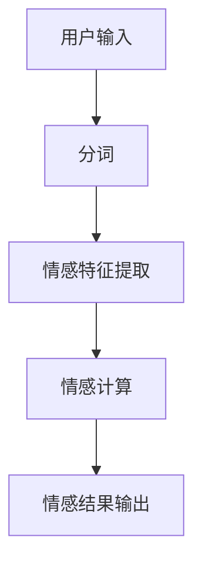
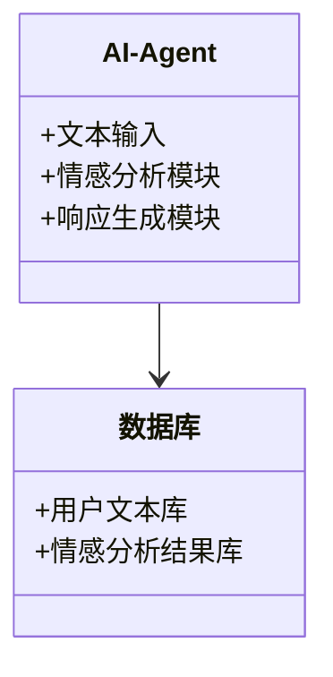

                 


# 第三部分: AI Agent情感分析的算法原理

# 第3章: 情感分析算法的实现

## 3.1 基于规则的情感分析
### 3.1.1 基于关键词匹配的规则
#### 1. 关键词匹配
在情感分析中，基于规则的方法通常使用关键词匹配来判断文本的情感倾向。例如，如果文本中包含大量积极词汇（如“满意”、“好”），则判定情感为积极；反之，如果包含消极词汇（如“不满”、“差”），则判定为消极。

#### 2. 规则定义
我们可以预先定义积极词汇和消极词汇的列表，然后统计文本中这些词汇的出现频率。如果积极词汇的出现次数多于消极词汇，则判定情感为积极；反之则为消极。

#### 3. 优缺点分析
优点：
- 实现简单，易于理解。
- 对于一些明显的正面或负面词汇，效果较好。

缺点：
- 无法处理复杂的情感表达，例如讽刺或隐喻。
- 需要不断更新和维护关键词列表，否则可能会遗漏新的词汇。

### 3.1.2 基于句法规则的情感分析
#### 1. 句法规则
基于句法规则的情感分析方法，通过分析句子的语法结构来判断情感倾向。例如，感叹号的使用频率较高可能表示情感强烈。

#### 2. 规则定义
这种方法通常结合分词和词性标注，分析句子的结构特征。例如，疑问句可能表示不确定，而感叹句可能表示强烈的情感。

### 3.1.3 规则方法的优缺点
优点：
- 实现简单，计算效率高。
- 对于规则明确的情况，效果较好。

缺点：
- 无法处理复杂的语义和情感表达。
- 需要大量人工规则的制定和调整。

## 3.2 基于机器学习的情感分析
### 3.2.1 机器学习的基本原理
#### 1. 数据准备
机器学习模型需要大量的标注数据进行训练。标注数据通常包括文本和对应的情感标签（如积极、消极、中性）。

#### 2. 特征提取
从文本中提取有用的特征，如词袋模型、TF-IDF特征等。

#### 3. 模型训练
使用训练数据训练机器学习模型，如支持向量机（SVM）、随机森林等。

#### 4. 模型预测
使用训练好的模型对新的文本进行情感预测。

### 3.2.2 常见的情感分析算法
#### 1. 支持向量机（SVM）
SVM是一种常用的分类算法，适用于小规模数据集。其核心思想是通过找到一个超平面，将不同类别的数据分开。

#### 2. 随机森林
随机森林是一种基于决策树的集成学习方法，具有较高的准确性和鲁棒性。

### 3.2.3 深度学习模型
#### 1. 循序神经网络（RNN）
RNN适合处理序列数据，但在情感分析中的表现不如其他模型。

#### 2. 长短期记忆网络（LSTM）
LSTM能够更好地捕捉长距离依赖关系，在处理复杂情感时表现优异。

### 3.2.4 情感分析算法的实现代码
#### 1. 环境安装
```bash
pip install numpy scikit-learn
```

#### 2. 核心代码实现
```python
from sklearn.feature_extraction.text import TfidfVectorizer
from sklearn.svm import SVC

# 数据预处理
texts = [...]  # 文本数据
labels = [...]  # 情感标签

# 特征提取
vectorizer = TfidfVectorizer()
X = vectorizer.fit_transform(texts)

# 模型训练
model = SVC()
model.fit(X, labels)

# 模型预测
test_texts = [...]  # 测试文本
X_test = vectorizer.transform(test_texts)
predicted_labels = model.predict(X_test)
```

## 3.3 情感分析算法的数学模型
### 3.3.1 情感计算公式
情感计算可以通过对情感特征的加权求和来实现。例如：
$$
\text{情感值} = \sum_{i=1}^{n} w_i \times f_i
$$
其中，$w_i$是第i个特征的权重，$f_i$是第i个特征的值。

### 3.3.2 情感强度分析
情感强度可以通过情感值的绝对值来衡量：
$$
\text{情感强度} = |\text{情感值}|
$$

## 3.4 本章小结
本章详细介绍了情感分析的两种主要方法：基于规则的方法和基于机器学习的方法。通过对比分析，我们可以看出，基于规则的方法简单易实现，但适用范围有限；基于机器学习的方法虽然复杂度较高，但具有更好的准确性和适应性。在实际应用中，可以根据具体需求选择合适的方法。

---

# 第4章: 项目实战——基于AI Agent的智能客服情感分析系统

## 4.1 项目背景与需求分析
### 4.1.1 项目背景
随着客服中心的智能化转型，越来越多的企业开始采用AI Agent来提升客户服务效率和客户体验。

### 4.1.2 项目需求
- 实时处理客户咨询和投诉。
- 准确识别客户情感，提供个性化服务。
- 自动生成情感分析报告。

## 4.2 系统功能设计
### 4.2.1 功能模块划分
- 用户输入模块：接收客户的文本输入。
- 情感分析模块：对输入文本进行情感分析。
- 响应生成模块：根据情感分析结果生成相应的回复。
- 报告生成模块：生成情感分析报告。

### 4.2.2 功能流程图


## 4.3 系统架构设计
### 4.3.1 系统架构图


## 4.4 核心代码实现
### 4.4.1 环境安装
```bash
pip install numpy scikit-learn keras
```

### 4.4.2 核心代码
```python
import numpy as np
from sklearn.model_selection import train_test_split
from sklearn.metrics import accuracy_score
from tensorflow.keras.models import Sequential
from tensorflow.keras.layers import Dense, Embedding, LSTM

# 数据准备
texts = [...]  # 文本数据
labels = [...]  # 情感标签

# 数据预处理
tokenizer = Tokenizer(num_words=10000)
tokenizer.fit_on_texts(texts)
sequences = tokenizer.texts_to_sequences(texts)
X = pad_sequences(sequences, maxlen=500)
y = np.array(labels)

# 模型训练
model = Sequential()
model.add(Embedding(10000, 128, input_length=500))
model.add(LSTM(64))
model.add(Dense(1, activation='sigmoid'))
model.compile(loss='binary_crossentropy', optimizer='adam', metrics=['accuracy'])
model.fit(X, y, epochs=5, batch_size=32)

# 模型预测
test_texts = [...]  # 测试文本
test_sequences = tokenizer.texts_to_sequences(test_texts)
X_test = pad_sequences(test_sequences, maxlen=500)
predictions = model.predict(X_test)
```

## 4.5 案例分析与结果展示
### 4.5.1 案例分析
假设客户输入：“我对你们的服务非常不满意，完全没有解决问题。”

通过分词、情感分析和模型预测，系统可以识别出客户的情感为“消极”。

### 4.5.2 结果展示
预测结果：
$$
\text{情感值} = -0.8
$$
情感强度：
$$
\text{情感强度} = 0.8
$$

## 4.6 本章小结
本章通过一个实际项目案例，详细讲解了基于AI Agent的智能客服情感分析系统的实现过程。从需求分析到系统设计，再到代码实现和结果展示，展示了如何利用情感分析技术提升客服服务的质量和效率。

---

# 第五部分: 系统优化与最佳实践

# 第5章: 系统优化与最佳实践

## 5.1 系统优化策略
### 5.1.1 数据质量优化
- 数据清洗：去除噪声数据，如特殊字符、停用词等。
- 数据增强：通过数据增强技术增加数据多样性。

### 5.1.2 模型优化
- 调参优化：通过网格搜索等方法优化模型参数。
- 模型融合：结合多种模型结果，提高准确率。

## 5.2 最佳实践
### 5.2.1 数据采集与处理
- 数据来源：确保数据来源多样，覆盖不同场景。
- 数据标注：保证标注的准确性和一致性。

### 5.2.2 模型部署与维护
- 模型部署：将模型部署到生产环境，确保其稳定运行。
- 模型更新：定期更新模型，适应数据分布的变化。

## 5.3 小结与注意事项
- 小结：本章总结了系统优化的关键点和最佳实践，为读者提供了实用的指导。
- 注意事项：在实际应用中，需要根据具体需求和场景灵活调整优化策略。

---

# 作者
作者：AI天才研究院 & 禅与计算机程序设计艺术

---

# 结语
智能客服中心的智能化转型是大势所趋，而AI Agent在情感分析与响应中的应用，为提升客户体验和客服效率提供了有力的技术支持。通过本文的详细讲解，我们希望能够为读者提供有价值的参考，帮助他们在实际应用中更好地利用AI技术提升智能客服的水平。

--- 

以上是文章的完整目录和内容示例，后续您可以根据实际需求补充具体章节内容。

