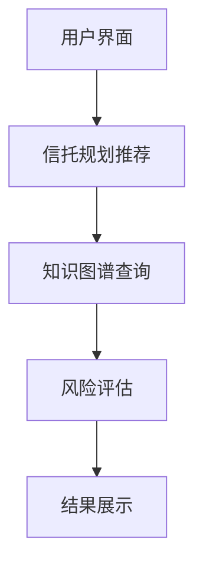
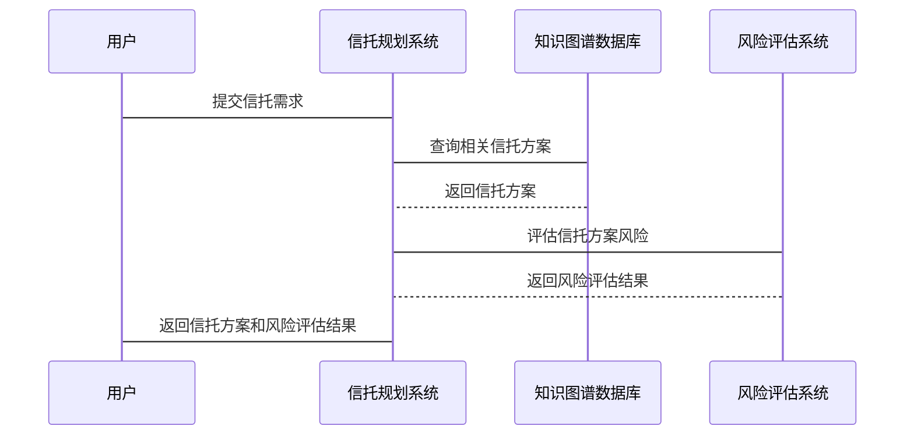

                 


# 智能家族信托规划助手

> 关键词：智能家族信托、人工智能、信托规划、知识图谱、机器学习

> 摘要：本文深入探讨智能家族信托的概念、核心技术、系统架构及实现方法。通过结合人工智能技术，提出一种基于知识图谱和推荐算法的智能信托规划方案，解决传统信托规划中的效率与精准度问题，为用户提供智能化的信托规划服务。

---

## 第1章：家族信托的基本概念

### 1.1 家族信托的定义与特点

#### 1.1.1 信托的基本概念
信托是指委托人将财产委托给受托人，由受托人按照信托合同的约定，为受益人的利益或特定目的进行管理或处分的行为。信托的基本特征包括财产独立性、风险隔离和专业管理。

#### 1.1.2 家族信托的定义
家族信托是一种特殊的信托形式，通常由家族成员设立，用于管理和分配家族财富，实现财富传承、资产保护和税务优化等目标。家族信托的核心在于将家族资产与个人资产隔离，避免家族成员的债务风险对家族资产的影响。

#### 1.1.3 家族信托的特点与优势
- **资产保护**：通过信托结构，家族资产与个人资产分离，有效隔离债务风险。
- **财富传承**：避免遗产税，实现财富的有序传承。
- **税务优化**：通过合理的信托结构设计，降低税务负担。
- **隐私保护**：信托文件通常不公开，保护家族隐私。
- **专业化管理**：由专业机构管理信托资产，确保资产保值增值。

### 1.2 智能家族信托的背景与意义

#### 1.2.1 智能家族信托的背景
随着人工智能技术的快速发展，传统家族信托的规划和管理方式逐渐显现出效率低下、成本高昂的问题。传统的信托规划依赖人工经验，难以快速响应客户需求，且缺乏个性化和智能化的解决方案。

#### 1.2.2 智能家族信托的意义
智能家族信托通过引入人工智能技术，能够实现信托规划的自动化、个性化和高效化。通过机器学习、自然语言处理和知识图谱等技术，智能家族信托助手能够快速分析客户需求，提供最优的信托规划方案，并实时监控信托运行状态。

#### 1.2.3 智能家族信托的优势
- **高效性**：通过智能化技术，快速分析客户需求并生成信托方案。
- **个性化**：根据客户需求和市场变化，提供定制化的信托规划。
- **实时性**：实时监控信托运行状态，及时发现和解决问题。
- **降低成本**：通过自动化技术，降低信托规划和管理的成本。

### 1.3 家族信托的法律与税务知识

#### 1.3.1 信托的法律框架
信托的法律框架包括信托法、公司法、税法等相关法律法规。不同国家和地区的信托法律体系存在差异，但在核心原则上具有相似性。

#### 1.3.2 税务优化策略
信托可以通过合理的结构设计，降低遗产税、所得税和资本利得税等税务负担。例如，通过设立离岸信托或利用税收优惠地区的法律，实现税务优化。

#### 1.3.3 风险与防范
信托规划中的主要风险包括受益人道德风险、信托文件的合规性风险以及市场波动带来的投资风险。通过严格的信托合同设计和专业化的风险管理，可以有效防范这些风险。

---

## 第2章：智能家族信托的核心技术

### 2.1 人工智能在信托规划中的应用

#### 2.1.1 机器学习在风险评估中的应用
机器学习可以通过历史数据和市场信息，预测信托投资的风险和收益。例如，使用回归分析和分类算法，评估信托资产的信用风险和市场风险。

#### 2.1.2 自然语言处理在文档分析中的应用
自然语言处理技术可以自动解析信托合同和法律文件，提取关键信息并生成结构化的数据。例如，使用NLP技术识别合同中的受益人条款和信托期限。

#### 2.1.3 知识图谱在信托关系中的应用
知识图谱可以将信托相关的实体（如委托人、受益人、信托公司）及其关系进行建模，帮助用户快速理解复杂的信托结构。

---

### 2.2 智能家族信托的知识图谱构建

#### 2.2.1 知识图谱的定义与构建方法
知识图谱是一种以图结构表示知识的数据库，由节点（实体）和边（关系）组成。构建知识图谱的方法包括数据抽取、实体识别和关系抽取。

#### 2.2.2 家族信托相关实体的识别与关联
在家族信托场景中，需要识别的主要实体包括委托人、受益人、信托公司、信托资产和信托合同。通过关系抽取技术，可以建立这些实体之间的关联关系，例如“委托人设立信托”、“信托公司管理资产”等。

#### 2.2.3 知识图谱的可视化与应用
知识图谱可以通过图数据库（如Neo4j）进行存储，并通过可视化工具（如Gephi）进行展示。知识图谱的应用包括信托结构分析、风险评估和合规性检查。

---

## 第3章：智能家族信托的算法实现

### 3.1 基于机器学习的信托规划推荐算法

#### 3.1.1 数据预处理与特征提取
数据预处理包括数据清洗、特征工程和数据标准化。特征提取需要从信托合同、市场数据和客户需求中提取关键特征，例如资产规模、风险偏好和税务需求。

#### 3.1.2 基于协同过滤的推荐算法
协同过滤是一种基于用户行为和偏好相似性的推荐算法。在信托规划中，可以将相似的客户需求映射到相似的信托方案。

协同过滤的相似度计算公式如下：
$$
相似度 = \frac{\sum (x_i - \bar{x})(y_i - \bar{y})}{\sqrt{\sum (x_i - \bar{x})^2} \sqrt{\sum (y_i - \bar{y})^2}}
$$

#### 3.1.3 基于深度学习的推荐模型
深度学习模型（如神经网络）可以自动学习信托方案的特征表示，并生成推荐结果。模型训练过程如下：
$$
L = -\sum_{i} y_i \log(p_i) + (1 - y_i) \log(1 - p_i)
$$

---

## 第4章：智能家族信托系统的架构与设计

### 4.1 系统架构设计

#### 4.1.1 系统功能模块划分
智能家族信托系统主要包括以下功能模块：
1. 用户信息管理模块
2. 信托规划推荐模块
3. 风险评估与预警模块
4. 信托管理与监控模块

#### 4.1.2 系统架构的Mermaid图


### 4.2 系统接口与交互设计

#### 4.2.1 系统接口设计
系统接口包括：
- 用户登录与注册接口
- 信托需求提交接口
- 信托方案生成接口
- 信托状态查询接口

#### 4.2.2 系统交互的Mermaid序列图


---

## 第5章：项目实战

### 5.1 环境安装与配置

#### 5.1.1 安装Python环境
使用Anaconda安装Python 3.8及以上版本。

#### 5.1.2 安装依赖库
安装以下依赖库：
- `pandas`：数据处理
- `numpy`：数值计算
- `scikit-learn`：机器学习算法
- `networkx`：图数据处理

---

### 5.2 核心代码实现

#### 5.2.1 数据预处理
```python
import pandas as pd
import numpy as np

# 读取数据
data = pd.read_csv('trust_data.csv')

# 数据清洗
data = data.dropna()
data = data[~data['资产规模'].isnull()]
```

#### 5.2.2 协同过滤算法实现
```python
from sklearn.metrics.pairwise import cosine_similarity

# 特征矩阵
X = data[['资产规模', '风险偏好', '税务需求']].values

# 计算余弦相似度
similarity = cosine_similarity(X)
```

#### 5.2.3 知识图谱构建
```python
import networkx as nx

# 创建知识图谱
G = nx.Graph()
G.add_nodes_from(['委托人', '受益人', '信托公司'])
G.add_edges_from([('委托人', '受益人'), ('受益人', '信托公司')])
```

---

## 第6章：最佳实践与注意事项

### 6.1 最佳实践
- 在实际应用中，建议结合具体业务需求，调整算法参数和模型结构。
- 定期更新知识图谱数据，保持知识图谱的准确性和完整性。

### 6.2 小结
智能家族信托规划助手通过结合人工智能技术，为用户提供了高效、个性化的信托规划服务。本文详细介绍了智能家族信托的核心技术、系统架构和实现方法，并通过实际案例展示了系统的应用价值。

### 6.3 注意事项
- 数据隐私和合规性是智能家族信托系统设计中的重要问题，需严格遵守相关法律法规。
- 系统上线前，建议进行充分的测试和验证，确保系统的稳定性和安全性。

### 6.4 拓展阅读
- 《机器学习实战》
- 《图数据库入门与应用》
- 《信托与财富管理》

---

## 作者：AI天才研究院/AI Genius Institute & 禅与计算机程序设计艺术/Zen And The Art of Computer Programming

---

本文通过结合人工智能技术，深入探讨了智能家族信托的核心概念、算法实现和系统架构，为读者提供了一种高效、个性化的信托规划解决方案。

