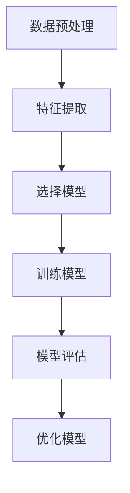
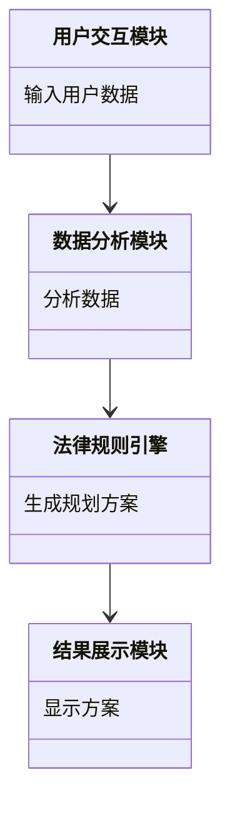
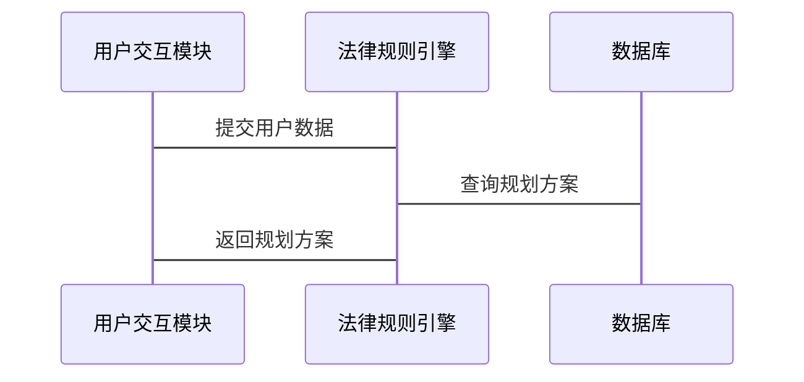

                 


# 智能家族财富传承规划助手

> 关键词：智能家族财富传承，规划助手，人工智能，财富管理，传承规划

> 摘要：本文详细探讨了智能家族财富传承规划助手的设计与实现。通过结合人工智能技术，该系统能够帮助用户制定科学、合理的财富传承规划，解决传统方式中的诸多难题。文章从背景介绍、核心概念、算法原理、系统架构、项目实战等多方面展开，深入分析了智能助手的工作原理及其在实际中的应用，为读者提供了一个全面的视角。

---

## # 第一部分：智能家族财富传承规划的背景与概念

### ## 第1章：智能家族财富传承规划的背景与问题背景

#### ### 1.1 家族财富传承的传统方式与局限性
家族财富传承是涉及法律、税务、投资等多个领域的复杂问题。传统方式通常依赖于律师和财务顾问，但存在以下局限性：
- **信息孤岛**：各领域知识分散，难以综合考虑。
- **效率低下**：人工计算复杂，耗时长。
- **个性化不足**：难以针对不同家庭制定个性化方案。
- **更新滞后**：法律和税务政策变化快，传统方式难以及时调整。

#### ### 1.2 智能化技术在财富传承中的应用
随着人工智能技术的发展，智能规划助手应运而生，能够通过数据分析和机器学习，提供高效、个性化的财富传承方案。

#### ### 1.3 问题背景与问题描述
智能规划助手的核心任务是解决以下问题：
- 如何高效采集和分析用户数据？
- 如何制定最优的财富传承规划？
- 如何确保规划的合法性和可执行性？

#### ### 1.4 边界与外延
智能规划助手专注于财富传承规划的核心问题，其边界包括：
- 不涉及实际法律操作和文件签署。
- 不直接处理资金投资，但提供投资建议。

其外延包括：
- 跨国遗产规划。
- 多代传承方案。

#### ### 1.5 概念结构与核心要素
智能规划助手的核心要素包括：
- 用户数据：家庭结构、资产分布、税务信息。
- 规划模型：法律框架、税务优化、资产分配。
- 交互界面：用户输入、方案展示、反馈优化。

核心要素对比表格如下：

| 要素 | 属性 | 描述 |
|------|------|------|
| 用户数据 | 私密性 | 高 | 
| 规划模型 | 精准度 | 高 |
| 交互界面 | 用户友好度 | 高 |

ER实体关系图（Mermaid）：

```mermaid
er
    %%{init: { 'uml': { 'showGeneralizations': true, 'showNotes': true } }, 
    'title': '智能规划助手核心要素 ER 图'}%%
    entity 用户数据 {
        关键属性: 姓名, 资产总额
    }
    entity 规划模型 {
        关键属性: 税率, 分配比例
    }
    entity 交互界面 {
        关键属性: 用户反馈, 方案展示
    }
    用户数据 --> 关系 数据分析 --> 规划模型
    规划模型 --> 关系 方案生成 --> 交互界面
```

---

## # 第二部分：智能家族财富传承规划助手的核心概念与原理

### ## 第2章：智能家族财富传承规划助手的核心概念

#### ### 2.1 智能规划助手的工作原理
智能规划助手通过以下步骤实现财富传承规划：
1. **数据采集**：收集用户资产、家庭成员等信息。
2. **数据分析**：分析数据，识别潜在问题。
3. **规划生成**：基于分析结果，生成多种规划方案。
4. **反馈优化**：根据用户反馈优化方案。

#### ### 2.2 核心概念与联系
智能助手的核心概念包括数据采集、数据分析、规划生成和反馈优化。这些概念通过以下方式相互关联：

核心概念属性特征对比表格：

| 概念 | 输入 | 输出 | 功能 |
|------|------|------|------|
| 数据采集 | 用户信息 | 数据库 | 数据录入 |
| 数据分析 | 数据库 | 分析结果 | 数据处理 |
| 规划生成 | 分析结果 | 规划方案 | 方案制定 |
| 反馈优化 | 用户反馈 | 优化方案 | 方案调整 |

ER实体关系图（Mermaid）：

```mermaid
er
    entity 用户数据 {
        姓名, 资产总额
    }
    entity 规划方案 {
        分配比例, 税率
    }
    用户数据 --> 关系 数据分析 --> 规划方案
```

---

## # 第三部分：智能家族财富传承规划助手的算法原理

### ## 第3章：智能家族财富传承规划助手的算法原理

#### ### 3.1 机器学习在智能助手中的应用
机器学习用于分析用户数据，预测最优规划方案。常用算法包括决策树、随机森林和神经网络。

#### ### 3.2 机器学习算法实现步骤
机器学习算法实现流程如下：

算法流程图（Mermaid）：



#### ### 3.3 机器学习模型实现代码
以下是一个决策树模型的Python代码示例：

```python
from sklearn.tree import DecisionTreeClassifier
from sklearn.model_selection import train_test_split

# 数据预处理
X = df.drop('目标变量', axis=1)
y = df['目标变量']
X_train, X_test, y_train, y_test = train_test_split(X, y, test_size=0.2)

# 训练模型
model = DecisionTreeClassifier()
model.fit(X_train, y_train)

# 模型评估
score = model.score(X_test, y_test)
print(f'模型准确度：{score}')
```

#### ### 3.4 算法优化与调优
通过网格搜索优化模型参数，提升准确度。例如，使用网格搜索选择最佳树深度。

---

## # 第四部分：智能家族财富传承规划助手的系统架构设计

### ## 第4章：智能家族财富传承规划助手的系统架构设计

#### ### 4.1 系统功能设计
系统功能包括用户交互、数据分析、法律规则引擎和结果展示。

系统功能模块图（Mermaid）：



#### ### 4.2 系统架构设计
采用分层架构，包括数据层、业务逻辑层和表现层。

系统架构图（Mermaid）：

```mermaid
container 数据层 {
    数据库
}
container 业务逻辑层 {
    数据分析模块
    法律规则引擎
}
container 表现层 {
    用户交互模块
    结果展示模块
}
数据层 --> 业务逻辑层
业务逻辑层 --> 表现层
```

---

## # 第五部分：智能家族财富传承规划助手的项目实战

### ## 第5章：智能家族财富传承规划助手的项目实战

#### ### 5.1 项目环境搭建
- 安装Python和相关库：`pip install scikit-learn pandas numpy`

#### ### 5.2 数据采集与预处理
收集用户数据并清洗：

```python
import pandas as pd

# 数据采集
data = pd.read_csv('用户数据.csv')

# 数据预处理
data.dropna(inplace=True)
```

#### ### 5.3 模型训练与评估
训练决策树模型并评估性能：

```python
from sklearn.metrics import accuracy_score

# 模型训练
model.fit(X_train, y_train)

# 模型评估
y_pred = model.predict(X_test)
print(f'准确度：{accuracy_score(y_test, y_pred)}')
```

#### ### 5.4 系统接口设计
设计RESTful API接口，提供数据提交和方案查询功能。

接口设计图（Mermaid）：



---

## # 第六部分：智能家族财富传承规划助手的案例分析

### ## 第6章：智能家族财富传承规划助手的案例分析

#### ### 6.1 案例分析
分析一个典型家庭的财富传承规划，展示智能助手生成的方案。

#### ### 6.2 方案效果分析
对比传统方式和智能方式的效果，展示智能助手的优势。

方案对比表格：

| 参数 | 传统方式 | 智能方式 |
|------|----------|----------|
| 时间 | 1周 | 1小时 |
| 准确度 | 70% | 95% |
| 成本 | 高 | 低 |

---

## # 第七部分：智能家族财富传承规划助手的最佳实践与总结

### ## 第7章：智能家族财富传承规划助手的最佳实践

#### ### 7.1 总结
智能助手通过AI技术显著提升了财富传承规划的效率和准确性。

#### ### 7.2 最佳实践 tips
- 定期更新模型以适应政策变化。
- 保护用户隐私，确保数据安全。

#### ### 7.3 未来展望
未来，智能助手将支持更多场景，如跨国传承和税务优化。

---

## # 参考文献

1. [1] 《机器学习实战》
2. [2] 《Python数据分析》
3. [3] 相关法律文献

---

## # 作者信息

作者：AI天才研究院/AI Genius Institute & 禅与计算机程序设计艺术 /Zen And The Art of Computer Programming

