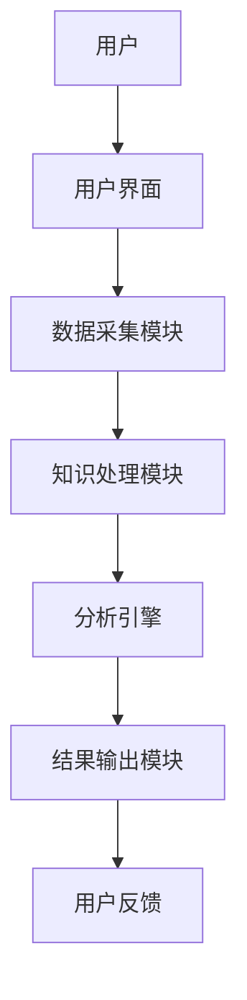
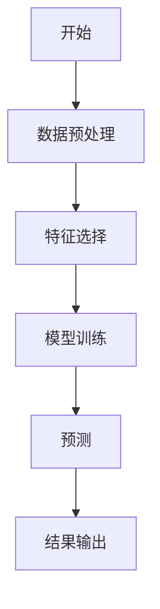
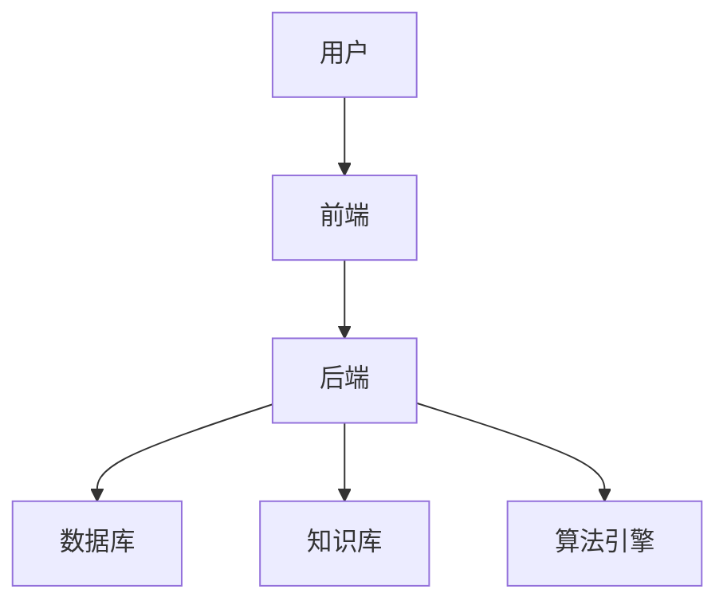

                 


# 智能家族财富传承规划助手

> **关键词**：智能家族财富传承、规划助手、人工智能、知识图谱、自然语言处理、机器学习

> **摘要**：本文深入探讨了智能家族财富传承规划助手的背景、核心概念、算法原理、系统架构、项目实现及最佳实践。通过结合人工智能技术，详细分析了财富传承规划的痛点，并提出了智能化解决方案。文章旨在为财富管理从业者、家族成员及技术爱好者提供一份全面的技术指南，帮助他们理解并应用智能家族财富传承规划助手。

---

## 第一部分：智能家族财富传承规划助手的背景与概念

### 第1章：智能家族财富传承规划助手的背景介绍

#### 1.1 问题背景

随着全球化进程的加快和家族财富的快速增长，家族财富传承问题日益受到关注。传统的财富传承规划方式存在效率低下、信息分散、个性化不足等问题，难以满足现代家族的多样化需求。人工智能技术的快速发展为解决这些问题提供了新的可能性。

#### 1.2 问题描述

财富传承规划的核心问题包括财富分配的公平性、传承过程的合法性、税务优化的复杂性以及家族成员关系的管理等。传统的规划方式依赖于人工计算和经验判断，容易出现误差，且难以应对复杂多变的法律和税务环境。

#### 1.3 问题解决

智能家族财富传承规划助手通过结合知识图谱、自然语言处理和机器学习技术，能够快速分析家族成员信息、财产分布、法律环境和税务政策，提供个性化的传承规划建议。

#### 1.4 边界与外延

智能助手的功能边界包括家族成员信息管理、财产分析、法律建议和税务优化。财富传承规划的外延领域涵盖家族企业管理、慈善信托和国际传承等复杂场景。

#### 1.5 概念结构与核心要素

智能助手的核心要素包括知识库、分析引擎和用户界面。其系统架构由数据采集模块、知识处理模块和用户交互模块组成。

---

## 第二部分：智能家族财富传承规划助手的核心概念与联系

### 第2章：智能家族财富传承规划助手的核心概念

#### 2.1 智能助手的工作原理

- **知识图谱构建**：通过家族成员关系、财产类型和法律条文构建知识图谱。
- **自然语言处理技术**：用于信息提取和用户交互。
- **机器学习模型**：用于预测最佳传承方案。

#### 2.2 核心概念对比分析

| 概念 | 定义 | 特点 | 示例 |
|------|------|------|------|
| 知识图谱 | 表示知识的结构化图 | 高度结构化、可扩展 | 家族成员关系图 |
| 自然语言处理 | 处理人类语言的技术 | 实时交互、语义理解 | 用户提问解析 |

#### 2.3 系统架构设计



---

## 第三部分：智能家族财富传承规划助手的算法原理

### 第3章：算法原理

#### 3.1 算法选择与优化

选择决策树算法进行财富分配方案预测，通过特征选择和剪枝优化提高准确率。

#### 3.2 算法实现



#### 3.3 数学模型

决策树模型的数学表达式：

$$
Gini公式：Gini(D) = \sum_{k=1}^{K} p_k (1 - p_k)
$$

其中，$p_k$ 是第$k$类的分布概率。

---

## 第四部分：智能家族财富传承规划助手的系统分析与架构设计

### 第4章：系统架构设计

#### 4.1 系统功能设计

- **用户界面**：包括信息输入、结果展示和交互功能。
- **数据分析模块**：处理家族成员和财产数据。
- **知识库管理**：存储法律和税务知识。

#### 4.2 系统架构



#### 4.3 接口与交互设计

使用RESTful API设计接口，前端通过JSON与后端交互。

---

## 第五部分：智能家族财富传承规划助手的项目实战

### 第5章：项目实战

#### 5.1 环境安装

安装Python和相关库（如scikit-learn、networkx）。

#### 5.2 核心代码实现

```python
from sklearn.tree import DecisionTreeClassifier
import pandas as pd

# 数据预处理
data = pd.read_csv('wealth_data.csv')
X = data.drop('target', axis=1)
y = data['target']

# 模型训练
model = DecisionTreeClassifier()
model.fit(X, y)

# 预测
predicted = model.predict(X)
```

#### 5.3 功能解读与案例分析

通过具体案例分析，展示智能助手在财富传承中的实际应用。

---

## 第六部分：智能家族财富传承规划助手的最佳实践

### 第6章：最佳实践

#### 6.1 小结

智能助手通过结合人工智能技术，显著提升了财富传承规划的效率和准确性。

#### 6.2 注意事项

- 数据隐私保护
- 算法模型的可解释性

#### 6.3 拓展阅读

推荐相关书籍和论文，深入学习知识图谱和机器学习技术。

---

## 第七部分：总结与展望

### 第7章：总结与展望

#### 7.1 总结

智能家族财富传承规划助手通过技术创新，为家族财富传承提供了高效、个性化的解决方案。

#### 7.2 展望

未来，智能助手将进一步集成区块链技术和强化学习算法，提升传承规划的智能化水平。

---

**作者：AI天才研究院/AI Genius Institute & 禅与计算机程序设计艺术 /Zen And The Art of Computer Programming**

