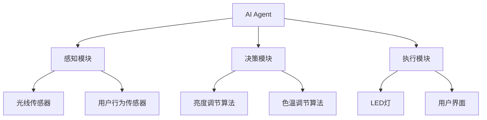

                 


# 智能工作台灯：AI Agent的照明优化与护眼模式

## 关键词：AI Agent，智能台灯，照明优化，护眼模式，光线调节，环境感知

## 摘要

智能工作台灯通过集成AI Agent技术，能够实时感知环境光线和用户需求，自动调节照明参数以优化用户体验。本文详细探讨了AI Agent在智能台灯中的应用，包括其感知、决策和执行机制，数学模型与算法原理，系统架构设计，项目实现与优化，以及实际案例分析。文章旨在为开发者和用户提供全面的技术视角，展示AI技术如何提升照明设备的功能与体验。

---

## 正文

### 第1章：AI Agent与智能工作台灯的背景

#### 1.1 传统台灯的局限性

传统台灯主要依赖手动调节亮度和色温，难以满足动态变化的环境需求。用户在不同场景下（如阅读、工作、放松）需要手动调整，既不便也不智能。

#### 1.2 AI Agent的核心概念

AI Agent是一种能够感知环境、自主决策并执行任务的智能实体。在智能台灯中，AI Agent负责实时感知环境光线、用户行为，并根据这些信息调整台灯的照明参数。

---

### 第2章：AI Agent的感知与决策机制

#### 2.1 感知模块

##### 2.1.1 光线传感器

光线传感器用于监测环境中的光照强度和色温。例如，光强度传感器可以测量环境亮度，而色温传感器则检测光线的冷暖程度。

##### 2.1.2 用户行为识别

AI Agent通过分析用户的活动模式（如长时间阅读或工作）来调整光线参数，以提供更舒适的视觉体验。

#### 2.2 决策模块

##### 2.2.1 照明优化算法

基于感知到的环境信息，AI Agent通过算法计算出最佳的亮度和色温。例如，当环境光线较暗时，台灯会自动调高亮度以提供足够的照明。

##### 2.2.2 护眼模式

AI Agent根据用户需求和环境光线动态调整光线参数，避免蓝光危害，减少眼睛疲劳。

---

### 第3章：数学模型与算法原理

#### 3.1 光线调节算法

##### 3.1.1 亮度调节模型

亮度调节公式如下：

$$
L = L_{\text{base}} + k \cdot (I - I_{\text{threshold}})
$$

其中，$L$ 是台灯亮度，$L_{\text{base}}$ 是基础亮度，$I$ 是环境亮度，$I_{\text{threshold}}$ 是亮度阈值，$k$ 是调节系数。

##### 3.1.2 色温调节模型

色温调节公式如下：

$$
T = T_{\text{base}} + m \cdot (T_{\text{env}} - T_{\text{opt}})
$$

其中，$T$ 是色温，$T_{\text{base}}$ 是基础色温，$T_{\text{env}}$ 是环境色温，$T_{\text{opt}}$ 是优化目标色温，$m$ 是调节系数。

---

### 第4章：系统架构设计

#### 4.1 系统模块划分

##### 4.1.1 硬件模块

- 光线传感器：用于采集环境光线数据。
- LED灯：用于输出调节后的光线。
- 控制电路：用于处理传感器信号并控制LED灯。

##### 4.1.2 软件模块

- AI Agent：负责感知、决策和执行。
- 用户界面：用于用户与台灯的交互。
- 数据存储：用于记录用户偏好和环境数据。

#### 4.2 系统架构图



---

### 第5章：项目实战

#### 5.1 环境搭建

安装Python和必要的库（如NumPy、Matplotlib）。

#### 5.2 代码实现

##### 5.2.1 光线调节算法实现

```python
import numpy as np

def adjust_brightness(current_light, threshold, k=0.5):
    if current_light > threshold:
        return current_light * (1 + k)
    else:
        return current_light

# 示例
current_light = 100
threshold = 80
brightness = adjust_brightness(current_light, threshold)
print(f"Adjusted Brightness: {brightness}")
```

##### 5.2.2 护眼模式实现

```python
def eye_care_mode(current_light, target_color_temp):
    # 调整色温
    if current_light < target_color_temp:
        return current_light + 10
    else:
        return current_light - 10

# 示例
current_light = 4000
target_color_temp = 5000
color_temp = eye_care_mode(current_light, target_color_temp)
print(f"Adjusted Color Temperature: {color_temp}")
```

---

### 第6章：总结与展望

#### 6.1 总结

本文详细介绍了AI Agent在智能工作台灯中的应用，从感知、决策到执行的全过程，并通过数学模型和算法展示了其实现方式。通过项目实战，读者可以掌握AI技术在照明设备中的实际应用。

#### 6.2 展望

未来，智能工作台灯可以通过集成更多传感器和算法，进一步提升用户体验，如动态调整色温和亮度，实现更个性化的护眼模式。

---

## 作者

作者：AI天才研究院/AI Genius Institute & 禅与计算机程序设计艺术 /Zen And The Art of Computer Programming

