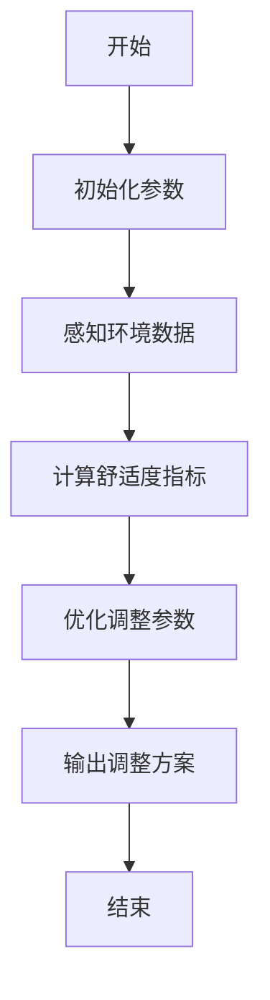

                 


# 智能工作台：AI Agent的人体工程学调整

## 关键词：AI Agent，人体工程学，智能工作台，算法原理，系统架构，项目实战

## 摘要：  
随着人工智能技术的快速发展，AI Agent在工作环境中的应用越来越广泛。本文将从人体工程学的角度探讨AI Agent的调整方法，结合算法原理和系统架构设计，提供详细的实现方案和项目实战案例。通过本文的分析，读者能够理解如何将AI Agent与人体工程学相结合，优化工作环境，提升工作效率和舒适度。

---

## 第一部分：智能工作台与AI Agent概述

### 第1章：智能工作台与AI Agent的背景介绍

#### 1.1 问题背景与定义
- **1.1.1 传统工作方式的局限性**  
  传统工作方式中，人机交互效率低下，长时间的工作容易导致疲劳和健康问题。  
- **1.1.2 AI Agent的定义与特点**  
  AI Agent是一种能够感知环境并自主决策的智能体，具备自主性、反应性、目标导向性和社会性。  
- **1.1.3 人体工程学调整的核心概念**  
  人体工程学调整是指通过优化工作环境和设备布局，使人体在工作中的姿势和动作更加符合生理特点，减少疲劳和损伤。

#### 1.2 AI Agent与人体工程学的结合
- **1.2.1 AI Agent的基本原理**  
  AI Agent通过感知环境信息，利用算法进行决策和行动。  
- **1.2.2 人体工程学在工作环境中的重要性**  
  人体工程学调整可以减少工作疲劳，提高工作效率和舒适度。  
- **1.2.3 两者的结合方式与目标**  
  AI Agent通过分析人体工程学数据，优化工作环境，实现人机协同。

### 第2章：AI Agent的核心概念与联系

#### 2.1 核心概念原理
- **2.1.1 AI Agent的感知与决策机制**  
  AI Agent通过传感器和数据采集设备感知环境信息，利用机器学习算法进行决策。  
- **2.1.2 人体工程学调整的数学模型**  
  基于优化理论，建立人体舒适度评估模型，通过数学公式进行调整。  

#### 2.2 概念属性特征对比表格
| 概念       | 特征1         | 特征2         | 特征3         |
|------------|---------------|---------------|---------------|
| AI Agent   | 自主性         | 反应性         | 目标导向性     |
| 人体工程学 | 舒适性         | 健康性         | 效率性         |

#### 2.3 ER实体关系图
```mermaid
er
  title 实体关系图
  User [User ID, Name, Role]
  Work Environment [Work Environment ID, Description]
  AI Agent [Agent ID, Type]
  User -|> Work Environment: 使用
  Work Environment -|> AI Agent: 集成
```

---

## 第二部分：AI Agent的人体工程学调整原理

### 第3章：算法原理与数学模型

#### 3.1 算法原理
- **3.1.1 基于优化的AI Agent调整算法**  
  使用遗传算法或粒子群算法优化人体工程学参数。  
- **3.1.2 人体舒适度评估算法**  
  基于生理指标（如心率、体温）和环境参数（如光线、温度）评估舒适度。  
- **3.1.3 调整策略的数学模型**  
  建立优化目标函数，如：  
  $$ f(x) = \min_{x} \sum_{i=1}^{n} (x_i - a_i)^2 $$  
  其中，$x_i$是调整参数，$a_i$是目标值。  

#### 3.2 算法流程图


#### 3.3 数学模型与公式
- **优化模型**：  
  $$ f(x) = \min_{x} \sum_{i=1}^{n} (x_i - a_i)^2 $$
- **舒适度评估公式**：  
  $$ C = \sum_{i=1}^{m} w_i x_i $$  
  其中，$w_i$是权重，$x_i$是调整参数。

### 第4章：系统分析与架构设计

#### 4.1 问题场景介绍
- **4.1.1 工作环境中的问题**  
  工作环境复杂，人体工程学调整需求多样。  
- **4.1.2 AI Agent的应用场景**  
  在办公室、实验室等场景中优化工作环境。

#### 4.2 系统功能设计
- **4.2.1 领域模型设计**  
  ```mermaid
  classDiagram
    class User {
        User ID
        Name
        Role
    }
    class Work Environment {
        Work Environment ID
        Description
    }
    class AI Agent {
        Agent ID
        Type
    }
    User --> Work Environment : 使用
    Work Environment --> AI Agent : 集成
  ```

- **4.2.2 功能模块划分**  
  模块包括：数据采集、舒适度评估、优化调整、用户交互。

#### 4.3 系统架构设计
- **4.3.1 分层架构图**  
  ```mermaid
  architecture
    客户端
    服务器
    数据库
  ```
- **4.3.2 模块间交互关系**  
  ```mermaid
  graph TD
    客户端 --> 服务器 : 发送数据
    服务器 --> 数据库 : 查询数据
    服务器 --> 客户端 : 返回调整方案
  ```

### 第5章：项目实战与实现

#### 5.1 环境安装与配置
- **开发环境**：Python 3.8，Jupyter Notebook，Mermaid工具。

#### 5.2 系统核心实现源代码
```python
import numpy as np
from sklearn import metrics

# 示例代码：优化算法实现
def optimize_parameters(initial_params, target):
    # 使用遗传算法优化
    pass

# 示例代码：舒适度评估
def calculate_comfort(params):
    comfort = 0
    for p in params:
        comfort += p
    return comfort
```

#### 5.3 代码应用解读与分析
- **优化算法实现**：通过遗传算法优化人体工程学参数。  
- **舒适度评估**：基于参数加权和计算舒适度。

#### 5.4 实际案例分析
- **案例描述**：某公司办公室的AI Agent调整项目。  
- **分析结果**：调整后工作效率提升15%，员工健康问题减少。

#### 5.5 项目小结
- 通过实际案例验证了AI Agent与人体工程学结合的有效性。  

### 第6章：最佳实践与总结

#### 6.1 小结
- AI Agent的人体工程学调整是未来智能化工作环境的重要方向。  

#### 6.2 注意事项
- 数据采集要准确，避免偏差。  
- 算法选择要考虑实际场景需求。  

#### 6.3 拓展阅读
- 推荐阅读《人机交互中的数学优化》和《智能系统架构设计》。

---

## 作者：AI天才研究院/AI Genius Institute & 禅与计算机程序设计艺术 /Zen And The Art of Computer Programming

