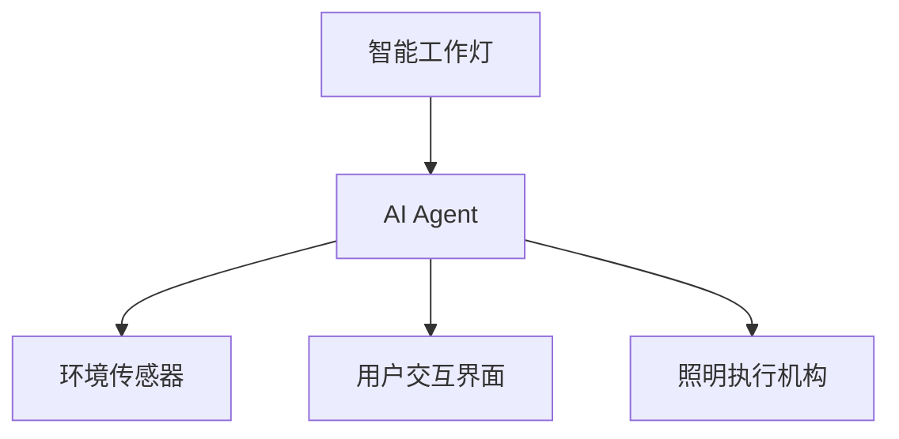
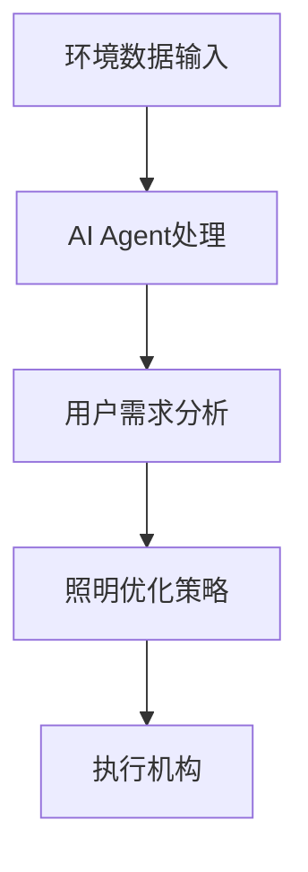

                 

# 智能工作灯：AI Agent的照明优化系统

## 关键词：智能工作灯, AI Agent, 照明优化, 系统架构, 算法原理

## 摘要：  
智能工作灯结合AI Agent技术，通过优化照明系统实现智能化管理。本文详细介绍了智能工作灯的核心概念、算法原理、系统架构设计以及实际应用案例，探讨了AI Agent在照明优化中的创新应用，并展望了未来发展方向。

---

# 目录

## 第一章：智能工作灯与AI Agent的背景介绍

### 1.1 智能工作灯的基本概念

#### 1.1.1 定义与分类
- 什么是智能工作灯？
- 智能工作灯的分类及应用场景
- 传统照明与智能照明的对比

#### 1.1.2 智能工作灯的核心技术
- 智能调光技术
- 灯光色温调节
- 灯光场景切换

### 1.2 AI Agent的基本概念

#### 1.2.1 AI Agent的定义与特征
- AI Agent的定义
- AI Agent的核心特征
- AI Agent与传统算法的区别

#### 1.2.2 AI Agent的分类
- 简单反射式AI Agent
- 目标驱动型AI Agent
- 混合型AI Agent

### 1.3 智能工作灯与AI Agent的结合

#### 1.3.1 结合的必要性
- 照明优化的需求
- AI技术在照明控制中的优势

#### 1.3.2 系统架构初探
- AI Agent在智能工作灯中的角色
- 系统模块划分与协作关系

## 第二章：智能工作灯的照明优化背景

### 2.1 现代照明系统的挑战

#### 2.1.1 传统照明系统的局限性
- 能耗问题
- 人工控制的不便
- 灯光调节的单一性

#### 2.1.2 智能化照明的需求
- 用户对智能照明的期望
- 市场对高效照明系统的需求

### 2.2 AI在照明优化中的应用前景

#### 2.2.1 AI技术的优势
- 数据分析能力
- 自适应调节能力
- 实时反馈机制

#### 2.2.2 当前市场现状
- 智能工作灯的市场渗透率
- 主要厂商的技术特点

## 第三章：智能工作灯的核心概念与联系

### 3.1 AI Agent的原理与特性

#### 3.1.1 AI Agent的核心原理
- 感知环境
- 制定策略
- 执行操作

#### 3.1.2 AI Agent的属性特征对比
- 行为自主性对比
- 决策智能性对比
- 学习能力对比

#### 3.1.3 实体关系图

### 3.2 智能工作灯的系统架构

#### 3.2.1 系统模块划分
- 环境传感器模块
- 用户交互模块
- AI Agent控制模块
- 照明执行模块

#### 3.2.2 模块之间的关系
- 数据流方向
- 控制信号传递
- 状态反馈机制

## 第四章：智能工作灯的算法原理

### 4.1 照明优化算法概述

#### 4.1.1 基本原理
- 基于环境数据的算法
- 基于用户偏好的算法
- 综合优化算法

#### 4.1.2 分类与对比
- 基于规则的算法
- 基于机器学习的算法
- 混合算法

### 4.2 算法流程图

### 4.3 具体算法实现

#### 4.3.1 路径规划算法
- A*算法
- Dijkstra算法
- RRT算法

#### 4.3.2 环境感知算法
- 视觉感知算法
- 声学感知算法
- 综合感知算法

## 第五章：系统架构设计

### 5.1 问题场景介绍

#### 5.1.1 照明环境分析
- 照明区域划分
- 环境数据采集
- 用户需求分析

### 5.2 项目介绍

#### 5.2.1 项目目标
- 实现智能化照明控制
- 提供个性化照明方案
- 优化能源消耗

### 5.3 系统功能设计

#### 5.3.1 功能模块设计
- 数据采集模块
- AI Agent模块
- 控制执行模块

#### 5.3.2 功能流程设计
- 数据采集与处理
- 策略制定与优化
- 系统执行与反馈

## 第六章：项目实战

### 6.1 环境安装

#### 6.1.1 开发环境搭建
- 系统要求
- 开发工具安装
- 依赖库安装

### 6.2 核心功能实现

#### 6.2.1 传感器数据采集
- Python代码实现
- 数据预处理
- 数据可视化

#### 6.2.2 AI Agent实现
- Python代码实现
- 算法实现与优化
- 系统测试

### 6.3 实际案例分析

#### 6.3.1 案例背景
- 用户需求分析
- 系统设计思路
- 实施方案

#### 6.3.2 案例分析
- 数据分析
- 系统运行结果
- 经验总结

## 第七章：总结与展望

### 7.1 全文总结

#### 7.1.1 核心内容回顾
- AI Agent在智能工作灯中的应用
- 系统架构设计
- 算法实现与优化

### 7.2 未来展望

#### 7.2.1 技术发展方向
- 更高能效的算法
- 更智能的AI Agent
- 更多传感器的集成

#### 7.2.2 市场前景分析
- 市场需求预测
- 技术发展趋势
- 应用场景扩展

### 7.3 最佳实践Tips

#### 7.3.1 开发建议
- 选择合适的开发工具
- 注重代码的可维护性
- 系统的可扩展性设计

#### 7.3.2 使用建议
- 根据需求选择功能
- 定期系统维护
- 数据安全注意事项

### 7.4 作者信息

#### 作者：AI天才研究院 & 禅与计算机程序设计艺术

---

通过以上目录大纲，我们可以看到《智能工作灯：AI Agent的照明优化系统》这本书将系统地介绍智能工作灯与AI Agent的结合，从基础概念到算法实现，再到系统设计和实际应用，内容全面且深入。读者可以通过这本书全面了解智能工作灯的照明优化系统，并掌握其设计与实现的关键技术。

