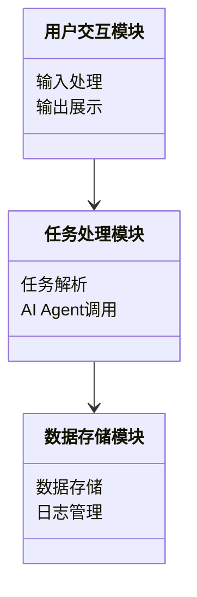
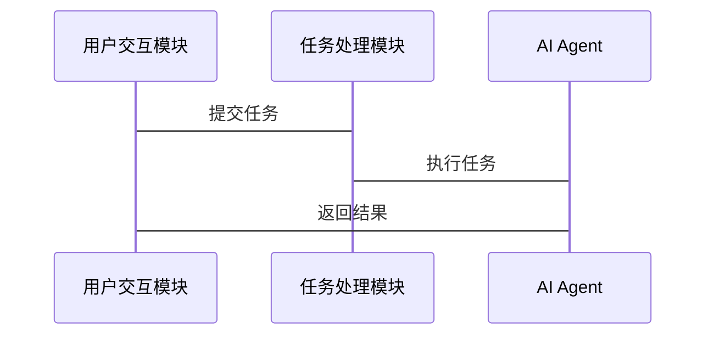

                 


# 智能工作站：AI Agent的效率优化助手

> 关键词：AI Agent, 智能工作站, 效率优化, 人工智能, 自动化工具

> 摘要：本文深入探讨了AI Agent在智能工作站中的应用，分析了其技术原理、系统架构、项目实战及优化策略，旨在为读者提供全面的理论与实践指导，帮助提升工作效率。

---

# 第一部分: 智能工作站与AI Agent的背景与概念

## 第1章: AI Agent与智能工作站概述

### 1.1 AI Agent的基本概念

#### 1.1.1 什么是AI Agent
AI Agent（人工智能代理）是指能够感知环境、自主决策并执行任务的智能实体。它通过算法和数据处理，帮助用户完成复杂任务，提升效率。

#### 1.1.2 AI Agent的类型与特点
- **基于规则的AI Agent**：通过预定义规则进行决策，适用于简单任务。
- **基于机器学习的AI Agent**：利用数据训练模型，适用于复杂场景。
- **基于强化学习的AI Agent**：通过试错优化策略，适用于动态环境。

#### 1.1.3 AI Agent与传统效率工具的区别
传统工具依赖手动配置，AI Agent具备自主学习和适应能力，能够处理复杂场景，提供更高效的解决方案。

### 1.2 智能工作站的定义与作用
智能工作站是结合AI Agent的高效工作平台，整合多种工具和资源，提供智能化支持，帮助用户完成从任务处理到结果输出的全链条。

### 1.3 AI Agent在效率优化中的优势
AI Agent能够自动化处理任务，提供个性化建议，并在动态环境中快速调整策略，显著提升工作效率。

---

# 第二部分: AI Agent的技术原理与实现

## 第2章: AI Agent的核心技术原理

### 2.1 AI Agent的感知与决策机制

#### 2.1.1 感知模块的工作原理
AI Agent通过传感器或API获取环境数据，识别任务需求，分析用户意图。

#### 2.1.2 决策模块的算法选择
根据任务类型选择合适算法，如监督学习或强化学习，生成最优决策。

#### 2.1.3 执行模块的实现方式
通过API调用或用户反馈，执行决策并输出结果。

### 2.2 常见AI Agent模型与算法

#### 2.2.1 基于规则的AI Agent
简单任务中，通过预设规则快速响应，无需复杂计算。

#### 2.2.2 基于机器学习的AI Agent
利用训练数据生成模型，处理复杂问题，如自然语言处理。

#### 2.2.3 基于强化学习的AI Agent
通过试错优化策略，适用于动态环境，如游戏AI。

### 2.3 AI Agent的数学模型与公式

#### 2.3.1 决策树模型
决策树通过条件判断进行分类，公式表示为：
$$
\text{决策树} = \sum_{i=1}^{n} \text{条件} \times \text{结果}
$$

#### 2.3.2 马尔可夫决策过程
状态、动作、奖励的循环过程，公式：
$$
V(s) = \max_{a} \mathbb{E}[R + V(s') | s, a]
$$

#### 2.3.3 Q-learning算法公式
$$
Q(s, a) = Q(s, a) + \alpha \left( r + \max Q(s', a') - Q(s, a) \right)
$$

### 2.4 本章小结
AI Agent的技术原理涵盖感知、决策和执行，不同算法适用于不同场景。

---

# 第三部分: 智能工作站的系统架构与设计

## 第3章: 智能工作站的系统架构设计

### 3.1 系统模块划分

#### 3.1.1 用户交互模块
负责接收输入和输出结果，提供直观界面。

#### 3.1.2 任务处理模块
解析任务需求，调用AI Agent执行处理。

#### 3.1.3 数据存储模块
管理任务数据和运行日志，便于后续分析。

### 3.2 系统功能设计

#### 3.2.1 领域模型设计
使用Mermaid类图展示模块关系，如下：



### 3.3 系统架构设计

#### 3.3.1 系统架构图
使用Mermaid架构图展示整体结构：


### 3.4 系统接口设计

#### 3.4.1 API接口定义
JSON格式的API文档，定义输入、输出和错误处理。

### 3.5 系统交互流程

#### 3.5.1 交互流程图
Mermaid序列图展示交互过程：



### 3.6 本章小结
系统架构清晰，模块化设计便于扩展和维护。

---

# 第四部分: 项目实战

## 第4章: 项目实战

### 4.1 环境安装

#### 4.1.1 安装Python
使用Anaconda安装Python 3.8以上版本。

#### 4.1.2 安装依赖库
安装TensorFlow、Keras、Scikit-learn等库。

### 4.2 核心实现

#### 4.2.1 AI Agent代码
```python
import numpy as np
from tensorflow.keras import models

class AIAssistant:
    def __init__(self, model_path):
        self.model = models.load_model(model_path)
    
    def process_task(self, input_data):
        prediction = self.model.predict(input_data)
        return prediction
```

#### 4.2.2 任务处理代码
```python
def main():
    agent = AIAssistant('model.h5')
    input = np.array([1, 2, 3])
    result = agent.process_task(input)
    print(result)

if __name__ == "__main__":
    main()
```

### 4.3 案例分析

#### 4.3.1 应用场景
优化资源配置，提升任务处理速度。

#### 4.3.2 案例解读
通过AI Agent处理数据分析任务，显著提升效率。

### 4.4 本章小结
实战项目展示了AI Agent的实际应用，代码和流程清晰易懂。

---

# 第五部分: 优化与调优

## 第5章: 优化与调优

### 5.1 算法优化

#### 5.1.1 参数调整
优化学习率和批量大小，提升模型性能。

#### 5.1.2 模型选择
比较不同模型在任务中的表现，选择最优方案。

### 5.2 性能监控

#### 5.2.1 资源使用监控
监控内存和CPU使用情况，确保系统稳定。

#### 5.2.2 日志分析
通过日志分析任务执行情况，发现潜在问题。

### 5.3 本章小结
通过优化和监控，提升AI Agent的效率和稳定性。

---

# 第六部分: 总结与展望

## 第6章: 总结与展望

### 6.1 本章总结
本文全面介绍了AI Agent在智能工作站中的应用，从原理到实战，为读者提供了详尽的指导。

### 6.2 未来展望
未来，AI Agent将向多模态和人机协作方向发展，提供更多可能性。

---

# 作者：AI天才研究院/AI Genius Institute & 禅与计算机程序设计艺术 /Zen And The Art of Computer Programming

---

这篇文章系统地介绍了AI Agent在智能工作站中的应用，从理论到实践，为读者提供了深入的指导，帮助提升工作效率。

