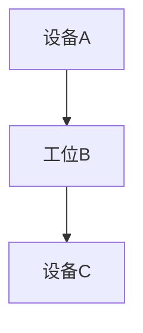

                 


# 智能工厂：AI Agent的生产线优化

## 关键词：智能工厂, AI Agent, 生产线优化, 强化学习, 图神经网络, 系统架构设计

## 摘要：  
随着人工智能技术的快速发展，智能工厂正逐步成为制造业的未来趋势。AI Agent（人工智能代理）作为一种能够自主决策和优化的智能体，正在被广泛应用于生产线的优化过程中。本文将从AI Agent的核心概念出发，结合强化学习和图神经网络等算法，详细探讨其在智能工厂中的应用价值，并通过实际案例分析展示其优化效果。同时，本文还将介绍AI Agent的系统架构设计和实际部署中的注意事项，为读者提供全面的视角。

---

# 第一部分：智能工厂与AI Agent的背景介绍

## 第1章：智能工厂的发展与AI Agent的引入

### 1.1 智能工厂的定义与特点  
智能工厂是指通过物联网、大数据、人工智能等技术，实现生产过程的智能化、自动化和高效化。其核心目标是通过数据驱动的决策，优化生产效率、降低成本，并提高产品质量。

### 1.2 AI Agent的基本概念  
AI Agent是一种能够感知环境、自主决策并执行任务的智能体。它能够根据环境输入的信息，通过算法进行推理和决策，并输出相应的动作或指令。

### 1.3 AI Agent在智能工厂中的应用价值  
AI Agent可以应用于生产调度优化、设备维护预测、质量检测等多个场景，显著提高生产效率和资源利用率。

### 1.4 当前的挑战与未来趋势  
尽管AI Agent在智能工厂中展现出巨大潜力，但其应用仍面临数据隐私、系统集成和模型泛化性等挑战。

---

# 第二部分：AI Agent的核心概念与技术原理

## 第2章：AI Agent的核心概念与联系

### 2.1 AI Agent的核心要素  
AI Agent主要由感知模块、决策模块和执行模块组成。感知模块负责数据采集，决策模块基于数据进行推理和优化，执行模块则将决策转化为实际操作。

### 2.2 AI Agent的ER实体关系图  
```mermaid
er
actor(AI Agent) --> action(决策)
actor(AI Agent) --> data(输入数据)
data --> model(训练模型)
model --> result(输出结果)
```

## 第3章：AI Agent的算法原理与数学模型

### 3.1 强化学习算法  
强化学习是一种通过试错机制优化决策的算法。其核心在于定义状态空间、动作空间和奖励函数。

#### 3.1.1 状态空间  
$$ S = \{s_1, s_2, ..., s_n\} $$  
状态空间表示系统可能处于的所有状态。

#### 3.1.2 动作空间  
$$ A = \{a_1, a_2, ..., a_m\} $$  
动作空间表示系统可以执行的所有动作。

#### 3.1.3 奖励函数  
$$ R(s, a) = r $$  
奖励函数定义了在状态 $s$ 下执行动作 $a$ 所获得的奖励 $r$。

### 3.2 图神经网络算法  
图神经网络适用于处理具有复杂关系的实体，例如生产线上的设备和工位之间的依赖关系。

#### 3.2.1 图的表示  
使用图结构表示生产线中的设备和工位关系：



---

# 第三部分：AI Agent在智能工厂中的应用实践

## 第4章：智能工厂中的AI Agent应用实践

### 4.1 生产调度优化  
通过AI Agent优化生产订单的调度，减少生产瓶颈，提高设备利用率。

#### 4.1.1 系统功能设计  
- **需求分析**：实时监控生产订单和设备状态。
- **功能模块**：订单管理、设备监控、调度优化。

#### 4.1.2 实际案例分析  
某汽车制造厂通过AI Agent优化生产调度，生产周期缩短了20%。

### 4.2 设备维护预测  
AI Agent可以根据设备的历史数据和实时状态，预测设备故障并安排维护。

#### 4.2.1 数据采集与预处理  
- 数据来源：设备传感器、生产记录。
- 数据清洗：去除噪声数据，填补缺失值。

#### 4.2.2 模型训练与部署  
使用强化学习模型训练设备维护策略，并部署到生产系统中。

---

# 第四部分：系统架构设计与实现

## 第5章：AI Agent的系统架构设计

### 5.1 系统功能设计  
- **感知层**：数据采集与处理。
- **决策层**：算法实现与优化。
- **执行层**：指令执行与反馈。

### 5.2 系统架构图  


### 5.3 接口设计  
- **输入接口**：传感器数据接口。
- **输出接口**：设备控制接口。

---

# 第五部分：项目实战与总结

## 第6章：AI Agent的项目实战

### 6.1 环境安装  
安装必要的开发工具和库，例如Python、TensorFlow、Keras。

### 6.2 核心代码实现  
实现AI Agent的核心算法，例如强化学习的训练和预测。

### 6.3 案例分析  
分析实际案例，总结AI Agent的应用效果和优化空间。

---

# 第六部分：总结与展望

## 第7章：总结与展望

### 7.1 总结  
AI Agent在智能工厂中的应用显著提高了生产效率和资源利用率。

### 7.2 展望  
未来，AI Agent将更加智能化和自适应，推动智能工厂向更高层次发展。

---

# 作者：AI天才研究院 & 禅与计算机程序设计艺术

---

**本文版权归作者所有，转载请注明出处。**

