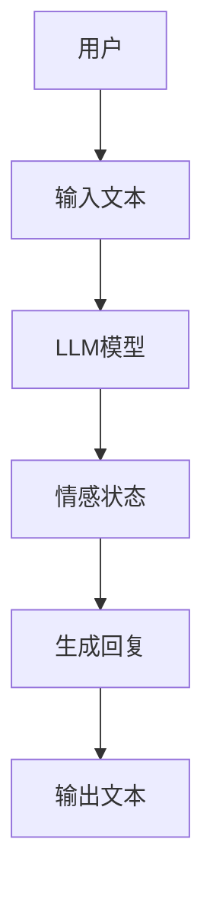
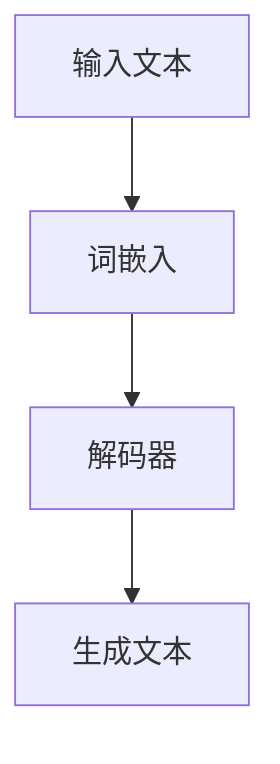
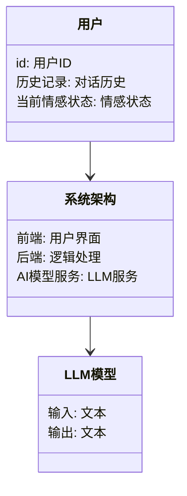
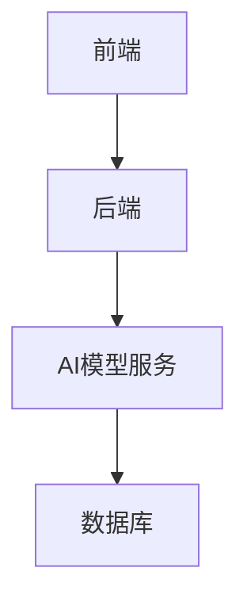

                 


# 智能情感陪伴 AI Agent：LLM 在心理健康领域的深度应用

## 关键词：智能情感陪伴, AI Agent, LLM, 心理健康, 人工智能, 自然语言处理

## 摘要：  
随着人工智能技术的飞速发展，大语言模型（LLM）在心理健康领域的应用逐渐成为研究热点。本文将深入探讨如何利用LLM构建智能情感陪伴AI Agent，分析其技术原理、系统架构，并通过实际案例展示其在心理健康服务中的应用潜力。文章内容涵盖核心概念、算法原理、系统设计及项目实战，旨在为读者提供全面的技术解读和实践指导。

---

## 第一部分：核心概念与联系

### 第1章：AI情感陪伴的核心概念

#### 1.1 情感陪伴AI Agent的定义与功能
- **定义**：AI情感陪伴Agent是一种基于LLM的智能系统，旨在通过自然语言对话提供情感支持和陪伴。
- **功能**：情感支持、情绪识别、个性化建议、心理健康评估。

#### 1.2 LLM在情感陪伴中的角色
- **语言生成**：LLM能够生成自然流畅的对话内容。
- **情感分析**：通过分析用户输入，识别情绪状态。

#### 1.3 情感陪伴服务的边界与外延
- **边界**：专注于情感支持，不替代专业心理咨询。
- **外延**：可集成其他功能，如情绪日记、放松训练。

### 第2章：核心概念之间的关系

#### 2.1 情感陪伴AI Agent的概念结构
- **用户**：与AI Agent互动，表达情感需求。
- **LLM**：负责生成回复，提供情感支持。
- **系统架构**：整合用户输入、LLM输出，实现交互。

#### 2.2 概念属性对比表格

| 概念 | 输入 | 输出 | 功能 |
|------|------|------|------|
| 情感分析 | 文本 | 情感状态 | 分析用户情绪 |
| 对话生成 | 情感状态 | 对话回复 | 生成支持性语言 |

#### 2.3 ER实体关系图


---

## 第二部分：算法原理讲解

### 第3章：LLM的训练与推理机制

#### 3.1 LLM的训练流程
- **数据准备**：收集和预处理心理健康领域的对话数据。
- **模型训练**：使用大规模数据训练LLM，优化损失函数。

#### 3.2 情感分析算法
- **情感分类**：利用预训练模型对用户输入进行情感分类。
- **置信度评估**：计算模型对情感状态的置信度。

#### 3.3 对话生成算法
- **基于LLM的生成**：利用LLM生成回复，调整温度参数以控制生成内容的创造性。

### 第4章：数学模型与公式

#### 4.1 损失函数
$$ \text{Loss} = -\sum_{i=1}^{n} \text{log}P(y_i|x_i) $$

#### 4.2 优化算法
$$ \text{参数更新} = \text{学习率} \times \text{梯度} $$

#### 4.3 对话生成过程


---

## 第三部分：系统分析与架构设计

### 第5章：系统功能设计

#### 5.1 领域模型设计


#### 5.2 系统架构设计


#### 5.3 接口设计
- **用户输入接口**：文本框输入。
- **AI回复接口**：显示生成回复。

---

## 第四部分：项目实战

### 第6章：环境安装与代码实现

#### 6.1 环境安装
```bash
pip install transformers
```

#### 6.2 核心代码
```python
from transformers import GPT2LMHeadModel, GPT2Tokenizer

tokenizer = GPT2Tokenizer.from_pretrained('gpt2')
model = GPT2LMHeadModel.from_pretrained('gpt2')

def generate_response(input_text):
    inputs = tokenizer(input_text, return_tensors='pt')
    outputs = model.generate(**inputs, max_length=50)
    return tokenizer.decode(outputs[0], skip_special_tokens=True)
```

### 第7章：案例分析与总结

#### 7.1 实际案例
- **用户输入**：表达焦虑情绪。
- **系统回复**：生成支持性语言，如“你可以尝试深呼吸来放松。”

#### 7.2 项目小结
- **优势**：提供即时支持，覆盖广泛用户群体。
- **挑战**：需结合专业心理咨询师的指导。

---

## 第五部分：最佳实践

### 第8章：总结与展望

#### 8.1 内容总结
- 本文详细探讨了LLM在心理健康中的应用，分析了系统架构和实现细节。

#### 8.2 注意事项
- 需结合专业指导，避免替代心理咨询。
- 保护用户隐私，确保数据安全。

#### 8.3 拓展阅读
- 建议阅读相关学术论文和最新技术报告。

---

## 作者：AI天才研究院/AI Genius Institute & 禅与计算机程序设计艺术/Zen And The Art of Computer Programming

---

这篇文章详细探讨了智能情感陪伴AI Agent在心理健康领域的应用，从核心概念到算法原理，再到系统设计和实际案例，为读者提供了全面的技术解读和实践指导。

