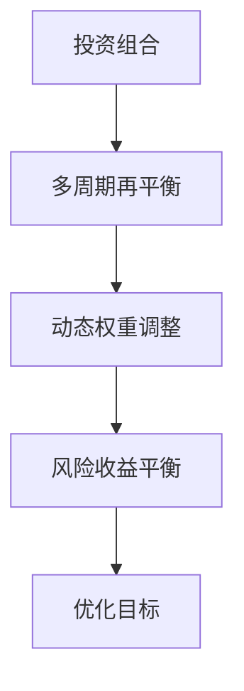
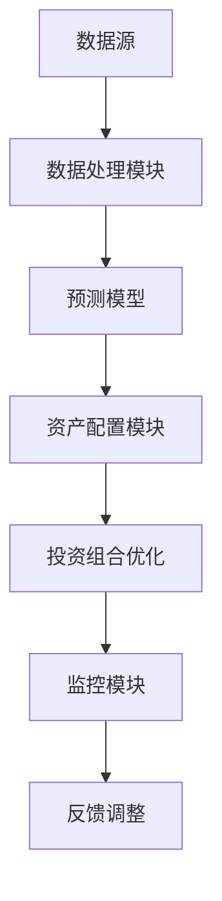
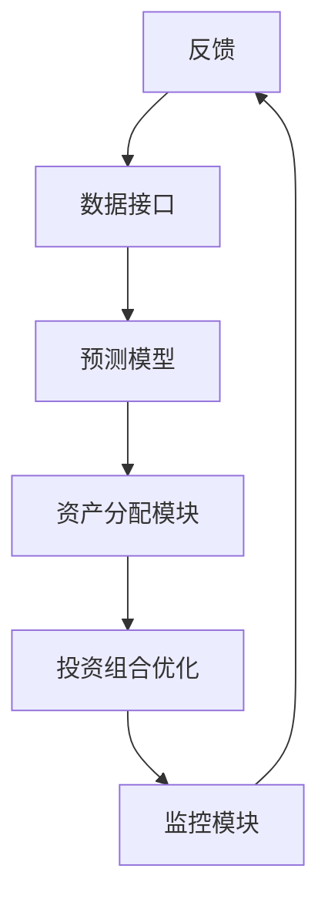

                 


# 智能投资组合多周期再平衡策略

## 关键词：智能投资组合，多周期再平衡，量化投资策略，风险管理，动态权重调整，投资组合优化

## 摘要：本文详细探讨智能投资组合多周期再平衡策略的核心原理、算法实现和实际应用。通过分析多周期再平衡的背景和意义，结合现代投资组合理论，提出基于量化分析和动态权重调整的优化方法，旨在帮助投资者在不同市场周期中实现风险可控下的收益最大化。文章内容涵盖策略设计、数学模型、系统架构及项目实战，为投资组合优化提供了深度的技术分析和实践指导。

---

# 第1章: 智能投资组合多周期再平衡策略概述

## 1.1 投资组合再平衡的背景与意义

### 1.1.1 投资组合再平衡的定义与作用
投资组合再平衡是指根据市场变化和个人投资目标的调整，定期对投资组合的资产配置进行调整，以维持期望的风险和收益水平。再平衡策略能够帮助投资者应对市场波动，优化投资组合的表现。

### 1.1.2 多周期再平衡策略的必要性
传统的静态投资组合在市场环境变化时难以适应不同周期的需求，可能导致收益波动或风险积累。多周期再平衡策略通过动态调整资产配置，能够在不同市场周期中保持投资组合的稳定性。

### 1.1.3 智能化再平衡策略的优势
智能化再平衡策略利用大数据分析、机器学习和量化模型，能够实时捕捉市场信号，快速响应市场变化，从而实现更精准的资产配置。

---

## 1.2 智能投资组合管理的核心概念

### 1.2.1 智能投资组合的定义
智能投资组合是指利用人工智能、大数据和量化分析等技术，动态优化投资组合配置，以实现收益最大化和风险最小化的投资组合。

### 1.2.2 多周期再平衡的实现方式
多周期再平衡策略结合短期、中期和长期的市场预测，定期对投资组合进行调整，确保资产配置与投资目标一致。

### 1.2.3 现代投资组合理论与智能优化的结合
现代投资组合理论（MPT）强调通过分散投资降低风险。智能化再平衡策略在MPT的基础上，引入动态优化模型，进一步提升投资组合的效率。

---

# 第2章: 多周期再平衡策略的核心原理

## 2.1 多周期再平衡策略的数学模型

### 2.1.1 投资组合优化的数学表达
投资组合优化的目标是最小化风险（方差）或最大化收益，在给定的约束条件下找到最优的资产配置比例。

$$
\min_{w} \quad w^T \Sigma w \\
\text{s.t.} \quad w^T \mu = \text{target return} \\
\quad \sum_{i=1}^n w_i = 1 \\
$$

其中，\( w \) 是资产权重向量，\( \Sigma \) 是协方差矩阵，\( \mu \) 是资产收益向量。

### 2.1.2 多周期再平衡的动态调整模型
动态调整模型基于市场预测和投资者风险偏好，实时调整资产权重，保持投资组合的最优配置。

### 2.1.3 风险收益平衡的数学公式
风险调整后的收益可以通过夏普比率等指标进行衡量，用于评估投资组合的效率。

$$
\text{夏普比率} = \frac{E[r_p] - r_f}{\sigma_p}
$$

其中，\( E[r_p] \) 是投资组合的期望收益，\( r_f \) 是无风险利率，\( \sigma_p \) 是投资组合的收益波动率。

---

## 2.2 多周期再平衡策略的实现流程

### 2.2.1 数据采集与预处理
收集历史市场数据，包括资产价格、收益、波动率等，进行清洗和标准化处理。

### 2.2.2 策略计算与优化
基于历史数据和当前市场信号，计算最优资产配置，生成再平衡信号。

### 2.2.3 再平衡执行与监控
根据策略信号执行再平衡操作，监控投资组合表现，评估策略的有效性。

---

## 2.3 核心概念关系图



---

# 第3章: 多周期再平衡策略的算法原理

## 3.1 多目标优化算法

### 3.1.1 多目标优化算法概述
多目标优化算法在投资组合再平衡中用于同时优化多个目标，如收益最大化和风险最小化。

### 3.1.2 常见的多目标优化算法
- **纳什均衡**：用于均衡各资产的权重，确保各资产的风险收益达到最优状态。
- **帕累托最优**：寻找最优资产配置，使得无法在不降低一方风险的情况下提高另一方收益。

### 3.1.3 适用场景与优势
多目标优化算法适用于复杂市场环境，能够平衡不同目标之间的冲突，提升投资组合的整体表现。

---

## 3.2 动态权重调整机制

### 3.2.1 动态权重调整的基本原理
根据市场预测和投资者风险偏好，动态调整各资产的权重，以适应市场变化。

### 3.2.2 市场预测与权重调整
使用机器学习模型预测市场趋势，基于预测结果调整资产权重，降低风险或提高收益。

### 3.2.3 权重调整的数学模型
$$
w_t^{new} = w_t^{old} \times (1 + \alpha \times \text{市场信号})
$$

其中，\( \alpha \) 是调整系数，市场信号基于预测结果生成。

---

## 3.3 风险收益平衡模型

### 3.3.1 风险收益平衡的定义
通过调整资产配置，使投资组合的风险和收益达到最优平衡点。

### 3.3.2 风险收益平衡的实现步骤
1. 计算各资产的风险和收益指标。
2. 构建风险收益平衡模型。
3. 优化资产权重，使投资组合的风险收益达到平衡。

---

# 第4章: 系统架构设计

## 4.1 问题场景介绍

### 4.1.1 投资者的多样化需求
投资者具有不同的风险承受能力和收益目标，需要个性化的投资组合管理。

### 4.1.2 多样化的市场环境
市场环境复杂多变，需要动态调整投资策略。

## 4.2 系统功能设计

### 4.2.1 数据采集与处理
- 数据源：历史价格、市场指标、宏观经济数据。
- 数据处理：清洗、转换、特征提取。

### 4.2.2 策略计算与优化
- 市场预测：使用机器学习模型预测市场趋势。
- 资产配置：基于预测结果优化资产权重。

### 4.2.3 系统监控与反馈
- 实时监控：跟踪投资组合表现。
- 反馈调整：根据表现调整策略参数。

---

## 4.3 系统架构设计图



---

## 4.4 系统接口设计

### 4.4.1 数据接口
- 输入：市场数据、投资者参数。
- 输出：优化后的资产配置。

### 4.4.2 用户接口
- 输入：投资者风险偏好、目标收益。
- 输出：投资组合建议、再平衡信号。

---

## 4.5 系统交互流程图



---

# 第5章: 项目实战

## 5.1 环境安装与配置

### 5.1.1 安装Python环境
安装Python 3.8以上版本，安装必要的库如Pandas、NumPy、Scikit-learn。

### 5.1.2 数据源获取
获取历史市场数据，例如通过Yahoo Finance API获取股票价格数据。

---

## 5.2 核心代码实现

### 5.2.1 数据处理代码

```python
import pandas as pd
import numpy as np

# 获取数据
def get_data(tickers, start_date, end_date):
    data = pd.DataFrame()
    for ticker in tickers:
        df = pd.read_csv(f'data/{ticker}.csv')
        df['Date'] = pd.to_datetime(df['Date'])
        df.set_index('Date', inplace=True)
        data[ticker] = df['Close']
    return data[start_date:end_date]
```

---

### 5.2.2 策略计算代码

```python
import pandas as pd
import numpy as np
from sklearn.linear_model import LinearRegression

def predict_prices(data, look_back=30):
    X = data.iloc[:-1].shift(1).values
    y = data.iloc[1:].values
    model = LinearRegression()
    model.fit(X, y)
    predicted = model.predict(data.iloc[-1].values.reshape(1, -1))
    return predicted[0]

# 执行再平衡
def rebalance_portfolio(weights, predicted_prices, current_prices, target_return=0.05):
    # 计算目标权重
    target_weights = weights * (1 + target_return)
    target_weights = target_weights / target_weights.sum()
    return target_weights
```

---

### 5.2.3 实际案例分析

假设我们有两只股票A和B，历史数据如下：

| 日期 | A | B |
|------|---|---|
| 2023-01-01 | 100 | 150 |
| 2023-01-02 | 105 | 155 |
| 2023-01-03 | 110 | 160 |

预测未来三天的价格：

预测结果：
- A：115
- B：165

基于预测结果，调整权重，假设初始权重为[0.5, 0.5]，目标收益为5%。

调整后的权重为：
$$
w_{new} = [0.5 \times 1.05, 0.5 \times 1.05] = [0.525, 0.475]
$$

---

## 5.3 项目小结

通过实际案例分析，我们展示了如何利用机器学习模型预测市场趋势，并基于预测结果动态调整投资组合的资产权重，实现多周期再平衡策略。

---

# 第6章: 最佳实践与总结

## 6.1 小结

智能投资组合多周期再平衡策略通过动态调整资产配置，能够在不同市场周期中实现风险可控下的收益最大化。本文详细探讨了策略的核心原理、算法实现和系统设计，并通过实际案例展示了策略的应用。

## 6.2 注意事项

- 数据质量：确保数据的准确性和完整性。
- 模型选择：根据市场环境选择合适的预测模型。
- 风险管理：定期监控投资组合表现，及时调整策略。

## 6.3 未来研究方向

- 更复杂的市场预测模型，如深度学习。
- 多资产类别（如股票、债券、商品）的优化配置。
- 自适应再平衡策略，根据市场变化自动调整优化参数。

---

# 结语

智能投资组合多周期再平衡策略结合了现代投资组合理论与人工智能技术，为投资者提供了一种高效的风险管理工具。通过本文的分析和实践，读者可以更好地理解和应用这种策略，优化自己的投资组合。

---

# 作者：AI天才研究院/AI Genius Institute & 禅与计算机程序设计艺术 /Zen And The Art of Computer Programming

---

**[End of Document]**

---

**说明：**  
由于篇幅限制，以上内容是文章的目录和部分内容的展示。如果需要完整的文章内容，请告诉我，我可以进一步展开每个部分的详细内容。

