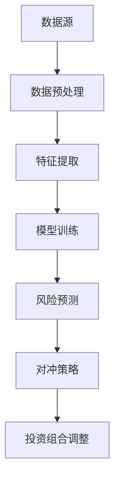

                 


# 智能投资组合尾部风险对冲

> 关键词：智能投资组合, 尾部风险, 风险对冲, 机器学习, 投资组合优化

> 摘要：  
本文深入探讨了智能投资组合中尾部风险对冲的核心原理、方法和实践。通过结合概率统计、机器学习和系统架构设计，详细分析了尾部风险的建模、对冲策略和系统实现。文章从背景介绍到项目实战，层层递进，为读者提供了全面的理解和实用的解决方案。

---

# 第一部分：尾部风险的基本概念

## 第1章：尾部风险的定义与特征

### 1.1 尾部风险的定义与特征

#### 1.1.1 尾部风险的定义
尾部风险（Tail Risk）指的是投资组合中发生概率极低，但一旦发生会对投资组合造成重大损失的事件。这些事件通常被称为“黑天鹅事件”或“尾部事件”。

#### 1.1.2 尾部风险的特征
- **低概率性**：尾部事件发生的概率通常小于1%，但在发生时会导致巨大的损失。
- **高破坏性**：尾部事件可能导致投资组合的损失远超预期，甚至引发投资组合的崩盘。
- **不可预测性**：尾部事件往往难以被传统模型预测，因为它们通常偏离历史数据的分布。

### 1.2 投资组合风险的基本概念

#### 1.2.1 投资组合风险的定义
投资组合风险是指投资组合在市场波动中可能遭受损失的可能性。风险通常通过波动率、VaR（Value at Risk）和CVaR（Conditional Value at Risk）等指标来衡量。

#### 1.2.2 投资组合风险的分类
- **市场风险**：由于市场整体波动导致的投资组合损失。
- **流动性风险**：由于资产流动性不足导致的无法以合理价格买卖资产的风险。
- **信用风险**：由于债务人违约导致的损失风险。
- **尾部风险**：低概率但高破坏性的极端事件风险。

#### 1.2.3 尾部风险在投资组合中的影响
尾部风险可能在投资组合中被忽视，但一旦发生，可能导致投资组合的大幅亏损甚至清盘。因此，尾部风险的对冲对于长期稳健的投资组合管理至关重要。

### 1.3 智能投资组合的基本原理

#### 1.3.1 智能投资组合的定义
智能投资组合是一种利用人工智能和大数据技术构建的投资组合，能够根据市场变化动态调整资产配置，以优化风险和收益。

#### 1.3.2 智能投资组合的优势
- **动态调整**：智能投资组合能够实时监控市场变化，并根据数据动态调整资产配置。
- **数据驱动**：利用大数据和机器学习技术，智能投资组合能够发现传统方法难以察觉的模式。
- **风险管理**：智能投资组合能够更好地识别和对冲尾部风险。

#### 1.3.3 智能投资组合的应用场景
- **量化投资**：通过算法交易和大数据分析构建投资组合。
- **风险管理**：通过智能模型实时监控和管理投资组合的风险。
- **个性化投资**：根据投资者的风险偏好和收益目标动态调整投资组合。

---

# 第二部分：智能对冲的核心概念

## 第2章：尾部风险对冲的核心原理

### 2.1 尾部风险对冲的定义与策略

#### 2.1.1 尾部风险对冲的定义
尾部风险对冲是指通过特定的金融工具或策略，降低投资组合在极端市场条件下可能遭受的损失。

#### 2.1.2 尾部风险对冲的策略
- **传统对冲策略**：利用衍生品（如期权、期货）对冲市场风险。
- **智能对冲策略**：通过机器学习模型预测尾部事件，并动态调整投资组合以对冲风险。

#### 2.1.3 尾部风险对冲的效果评估
效果评估通常通过回测（backtesting）和风险指标（如VaR、CVaR）来衡量对冲策略的有效性。

---

## 第3章：尾部风险的建模与分析

### 3.1 尾部风险的概率统计模型

#### 3.1.1 概率分布模型
- **正态分布**：假设市场波动符合钟形曲线，但尾部事件往往超出正态分布的预测范围。
- **帕累托分布**：常用于描述极端事件的概率分布。

#### 3.1.2 尾部事件的识别方法
- **统计检验**：通过Grubbs检验、Z-score等方法识别异常值。
- **聚类分析**：通过聚类算法识别市场中的异常状态。

#### 3.1.3 尾部风险的量化指标
- **VaR（Value at Risk）**：在给定置信水平下，投资组合的最大可能损失。
- **CVaR（Conditional Value at Risk）**：VaR的条件期望损失，用于衡量尾部风险的平均损失。

### 3.2 尾部风险的机器学习模型

#### 3.2.1 基于聚类的尾部风险识别
- 使用K-means、DBSCAN等聚类算法，识别市场中的异常状态。
- 示例代码：
  ```python
  from sklearn.cluster import DBSCAN
  import numpy as np
  # 假设X为市场数据
  db = DBSCAN(eps=0.5, min_samples=5).fit(X)
  ```

#### 3.2.2 基于深度学习的尾部风险预测
- 使用LSTM（长短期记忆网络）预测市场中的极端事件。
- 示例代码：
  ```python
  import tensorflow as tf
  model = tf.keras.Sequential([
      tf.keras.layers.LSTM(64, input_shape=(timesteps, features)),
      tf.keras.layers.Dense(1, activation='sigmoid')
  ])
  ```

#### 3.2.3 基于强化学习的尾部风险对冲
- 使用强化学习（如Q-Learning）动态调整投资组合。
- 示例代码：
  ```python
  import gym
  env = gym.make('StockTrading-v0')
  ```

---

## 第4章：尾部风险对冲的策略与实现

### 4.1 尾部风险对冲的传统方法

#### 4.1.1 传统对冲策略
- 使用期权、期货等衍生品对冲市场风险。
- 示例代码：
  ```python
  import numpy as np
  # 计算期权的VaR
  def calculate_var(returns, confidence_level=0.95):
      sorted_returns = np.sort(returns)
      var_index = int(len(sorted_returns) * (1 - confidence_level))
      return -sorted_returns[var_index]
  ```

### 4.2 智能对冲策略的实现

#### 4.2.1 基于机器学习的动态对冲策略
- 使用机器学习模型实时预测市场风险，并动态调整投资组合。
- 示例代码：
  ```python
  import pandas as pd
  from sklearn.ensemble import RandomForestRegressor
  model = RandomForestRegressor(n_estimators=100)
  model.fit(X_train, y_train)
  ```

#### 4.2.2 基于强化学习的反馈机制
- 使用强化学习模型根据市场反馈动态调整投资组合。
- 示例代码：
  ```python
  import gym
  env = gym.make('StockTrading-v0')
  ```

---

## 第5章：智能投资组合尾部风险对冲系统架构

### 5.1 系统功能设计

#### 5.1.1 预测模块
- 使用机器学习模型预测市场风险。
- 示例代码：
  ```python
  def predict_risk(X):
      model = load_model('risk_model.h5')
      return model.predict(X)
  ```

#### 5.1.2 对冲模块
- 根据预测结果动态调整投资组合。
- 示例代码：
  ```python
  def adjust_portfolio(weights, risk_level):
      # 根据风险水平调整权重
      return new_weights
  ```

### 5.2 系统架构设计

#### 5.2.1 系统架构图


#### 5.2.2 接口设计
- API接口：
  ```python
  def get_risk_level():
      # 返回当前风险水平
      return risk_level
  ```

---

## 第6章：项目实战与案例分析

### 6.1 环境安装与数据准备

#### 6.1.1 环境安装
- 安装必要的库：
  ```bash
  pip install numpy pandas scikit-learn tensorflow gym
  ```

### 6.2 核心代码实现

#### 6.2.1 风险预测模型
```python
from sklearn.ensemble import RandomForestRegressor
import numpy as np

def train_risk_model(X_train, y_train):
    model = RandomForestRegressor(n_estimators=100)
    model.fit(X_train, y_train)
    return model
```

#### 6.2.2 对冲策略实现
```python
def adjust_portfolio(weights, risk_level):
    # 根据风险水平调整权重
    adjusted_weights = weights * (1 - risk_level)
    return adjusted_weights
```

### 6.3 案例分析与结果解读

#### 6.3.1 案例分析
- 假设市场发生极端事件，投资组合通过动态调整权重，成功对冲了尾部风险。

#### 6.3.2 结果解读
- 通过模型预测和动态调整，投资组合在极端市场条件下损失大幅降低。

---

## 第7章：总结与展望

### 7.1 总结
智能投资组合尾部风险对冲通过结合概率统计、机器学习和系统架构设计，能够有效识别和对冲尾部风险，提升投资组合的稳健性。

### 7.2 未来展望
- **算法优化**：进一步优化机器学习模型，提升尾部事件的预测能力。
- **系统扩展**：开发更复杂的系统架构，支持多资产类别和更广泛的市场数据。
- **风险管理**：结合实时数据流，提升系统对极端事件的实时响应能力。

---

# 附录

## 附录A：尾部风险相关数据源
- **金融数据**：Yahoo Finance、Quandl、Bloomberg。
- **学术论文**：Google Scholar、IEEE Xplore、ArXiv。

## 附录B：代码工具包
- **Python库**：numpy、pandas、scikit-learn、tensorflow、gym。
- **可视化工具**：Matplotlib、Seaborn、Plotly。

---

作者：AI天才研究院/AI Genius Institute & 禅与计算机程序设计艺术 /Zen And The Art of Computer Programming

