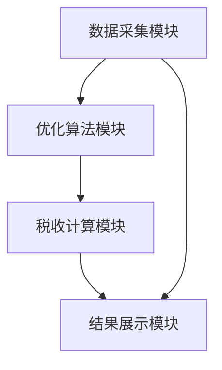
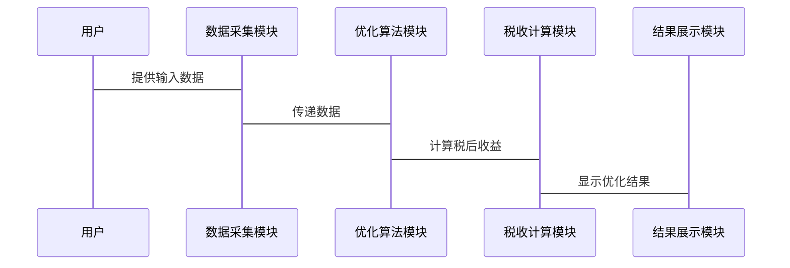

                 


# 智能投资组合税收优化策略

## 关键词：智能投资组合, 税收优化, 优化算法, 投资组合管理, 金融优化

## 摘要：本文详细探讨了如何利用智能算法优化投资组合的税收问题。通过数学建模和算法设计，结合实际案例分析，介绍了多种优化策略，帮助读者理解如何在投资组合中实现税收优化。

---

## 第一部分: 智能投资组合与税收优化概述

### 第1章: 智能投资组合与税收优化概述

#### 1.1 智能投资组合的基本概念
##### 1.1.1 投资组合的定义与特点
投资组合是指将一定资金分配到不同资产（如股票、债券、基金等）上的配置方式。其特点包括分散风险、优化收益、动态调整等。

##### 1.1.2 智能投资组合的核心理念
智能投资组合利用人工智能和大数据技术，通过算法优化资产配置，实现风险可控下的最大收益。

##### 1.1.3 税收优化在投资组合中的重要性
税收优化是影响投资收益的关键因素。通过合理配置资产和优化税务结构，可以显著提高投资组合的净收益。

#### 1.2 税收优化的基本原理
##### 1.2.1 税收在投资组合中的影响
不同资产类别和投资行为的税务处理不同，影响整体收益。

##### 1.2.2 税收优化的目标与原则
目标是最大化税后收益，原则包括合法性、最大化收益、风险控制等。

##### 1.2.3 税收优化与投资收益的关系
税收优化是投资收益的重要组成部分，合理的税务规划可以显著提升整体收益。

---

## 第二部分: 智能投资组合优化的核心概念

### 第2章: 智能投资组合优化的核心概念

#### 2.1 投资组合优化的数学模型
##### 2.1.1 优化目标的定义
目标函数通常为最大化收益或最小化风险，例如：  
$$ \text{收益} = \sum_{i=1}^{n} w_i r_i $$  
其中，\( w_i \) 是资产 \( i \) 的权重，\( r_i \) 是资产 \( i \) 的收益率。

##### 2.1.2 约束条件的建立
常见的约束条件包括：  
1. 资产权重之和为1：$$ \sum_{i=1}^{n} w_i = 1 $$  
2. 投资组合的风险限制：$$ \text{风险} \leq \text{预设风险水平} $$  
3. 税收相关约束：$$ \text{税后收益} \geq \text{最低收益要求} $$  

##### 2.1.3 数学模型的构建
综合目标函数和约束条件，构建如下的优化模型：  
$$ \max \sum_{i=1}^{n} w_i r_i - \lambda \sum_{i=1}^{n} w_i^2 \sigma_i^2 $$  
其中，\( \lambda \) 是风险惩罚系数，\( \sigma_i \) 是资产 \( i \) 的波动率。

#### 2.2 税收优化的原理与方法
##### 2.2.1 税收优化的基本原理
通过合理配置资产类别和投资策略，降低税务负担。例如，利用税收递延账户或税收优惠政策。

##### 2.2.2 常见的税收优化方法
1. 利用税收损失抵扣  
2. 优化资本利得与普通收入的比例  
3. 合理配置免税和低税率资产  

##### 2.2.3 税收优化的边界与限制
税收优化需要在合法合规的前提下进行，避免因不当税务操作带来的法律风险。

---

## 第三部分: 智能投资组合优化的算法原理

### 第3章: 智能投资组合优化的算法原理

#### 3.1 常见优化算法概述
##### 3.1.1 遗传算法
遗传算法是一种模拟自然选择和遗传机制的优化算法，适用于复杂的非线性优化问题。

##### 3.1.2 粒子群优化算法
粒子群优化算法模拟鸟群觅食行为，适用于连续变量优化问题。

##### 3.1.3 模拟退火算法
模拟退火算法通过逐步降低“温度”来避免陷入局部最优，适用于全局优化问题。

#### 3.2 税收优化的数学模型与公式
##### 3.2.1 投资组合收益与风险的数学表达
收益：  
$$ R = \sum_{i=1}^{n} w_i r_i $$  
风险：  
$$ \sigma^2 = \sum_{i=1}^{n} \sum_{j=1}^{n} w_i w_j \sigma_{ij} $$  

##### 3.2.2 税收影响的数学模型
税后收益：  
$$ R_{\text{税后}} = R - T $$  
其中，\( T \) 是税收部分。

##### 3.2.3 优化目标的数学公式
最大化税后收益：  
$$ \max \left( \sum_{i=1}^{n} w_i r_i - T \right) $$  

---

## 第四部分: 智能投资组合优化的系统架构设计

### 第4章: 智能投资组合优化的系统架构设计

#### 4.1 系统功能模块划分
##### 4.1.1 数据采集模块
负责收集市场数据、资产价格、税率等信息。

##### 4.1.2 优化算法模块
实现遗传算法、粒子群优化等算法，进行投资组合优化。

##### 4.1.3 税收计算模块
计算不同资产配置下的税后收益。

##### 4.1.4 结果展示模块
将优化结果以可视化方式呈现给用户。

#### 4.2 系统架构图


#### 4.3 系统交互图


---

## 第五部分: 项目实战——智能投资组合优化系统实现

### 第5章: 项目实战——智能投资组合优化系统实现

#### 5.1 环境安装与配置
##### 5.1.1 Python环境的安装
安装Python 3.8或更高版本。

##### 5.1.2 相关库的安装
安装numpy、pandas、scipy等库：  
```bash
pip install numpy pandas scipy
```

#### 5.2 系统核心实现
##### 5.2.1 数据采集与预处理
读取市场数据并进行清洗：  
```python
import pandas as pd
data = pd.read_csv('market_data.csv')
data = data.dropna()
```

##### 5.2.2 优化算法的实现
实现遗传算法：  
```python
def genetic_algorithm(objective_function, constraints):
    # 初始化种群
    population = initialize_population()
    while not stopping_condition():
        # 计算适应度
        fitness = calculate_fitness(population)
        # 选择
        selected = selection(population, fitness)
        # 交叉
        offspring = crossover(selected)
        # 变异
        mutated = mutation(offspring)
        population = offspring + mutated
    return best_solution(population)
```

##### 5.2.3 税收计算与优化
计算税后收益并优化：  
```python
def calculate_taxed_return(weights, returns):
    tax_rate = 0.15  # 示例税率
    return sum(weights[i] * (returns[i] * (1 - tax_rate)) for i in range(len(weights)))
```

#### 5.3 实际案例分析
##### 5.3.1 案例背景介绍
假设我们有3种资产，目标是优化其权重以最大化税后收益。

##### 5.3.2 数据分析与处理
分析历史收益和风险数据，计算最优权重。

##### 5.3.3 优化结果展示与解读
输出最优权重和对应的税后收益。

---

## 第六部分: 最佳实践与注意事项

### 第6章: 最佳实践与注意事项

#### 6.1 税收优化策略的实施要点
##### 6.1.1 税收优化的法律与合规性
确保所有优化策略符合当地法律法规。

##### 6.1.2 优化策略的动态调整
根据市场变化和政策调整，及时优化投资组合。

##### 6.1.3 风险控制与收益平衡
在追求高收益的同时，注重风险控制。

#### 6.2 项目实施中的注意事项
##### 6.2.1 数据质量的重要性
确保数据准确性和完整性。

##### 6.2.2 算法的可扩展性
设计可扩展的算法框架，适应未来数据规模的增加。

##### 6.2.3 系统的稳定性与安全性
确保系统稳定运行，防止数据泄露和系统崩溃。

---

## 作者：AI天才研究院/AI Genius Institute & 禅与计算机程序设计艺术 /Zen And The Art of Computer Programming

---

以上是《智能投资组合税收优化策略》的技术博客文章，希望对您有所帮助！

