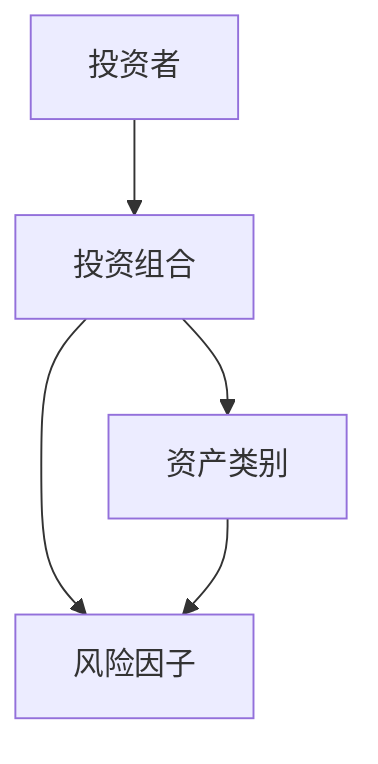
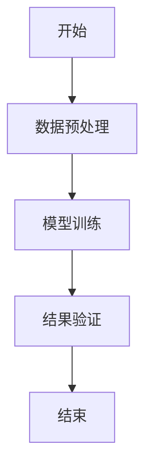
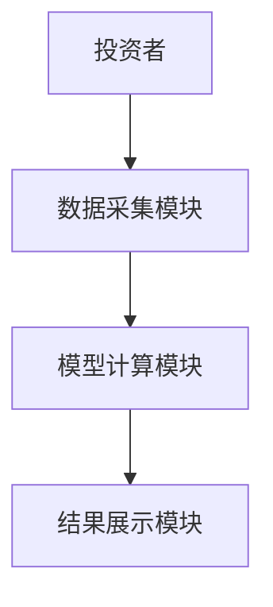
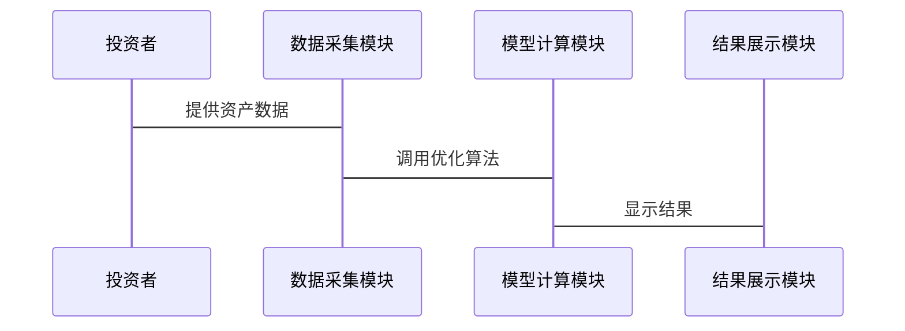

                 


# 智能投资组合风险预算分配模型

> 关键词：投资组合管理、风险预算、智能优化、数学建模、系统架构

> 摘要：本文详细介绍了智能投资组合风险预算分配模型的构建与应用，从背景、核心概念、算法原理到系统架构和项目实战，全面解析如何通过智能优化方法实现风险与收益的动态平衡。

---

# 第1章: 智能投资组合风险预算分配模型的背景与目标

## 1.1 投资组合管理的背景与挑战
### 1.1.1 传统投资组合管理的局限性
传统的投资组合管理方法依赖于历史数据和静态模型，难以适应市场波动和复杂的投资环境。

### 1.1.2 风险管理在投资组合中的重要性
风险管理是投资组合管理的核心，直接影响投资回报和组合稳定性。

### 1.1.3 智能投资组合管理的兴起
随着人工智能和大数据技术的发展，智能投资组合管理逐渐成为主流。

## 1.2 风险预算分配模型的定义与目标
### 1.2.1 风险预算分配的定义
风险预算分配是指在投资组合中，根据风险承受能力和收益目标，合理分配各类资产的风险敞口。

### 1.2.2 风险预算分配模型的目标
通过优化模型，实现风险与收益的动态平衡，最大化投资回报。

### 1.2.3 模型的核心要素与边界条件
- 核心要素：资产类别、风险因子、收益目标、风险承受能力。
- 边界条件：市场波动、监管限制、投资者风险偏好。

## 1.3 智能投资组合管理的优势
### 1.3.1 数据驱动的决策优势
利用大数据和机器学习算法，提高决策的科学性和准确性。

### 1.3.2 自动化与实时性
智能模型能够实时调整投资组合，应对市场变化。

### 1.3.3 风险与收益的动态平衡
通过智能优化，实现风险与收益的最优配比。

## 1.4 本章小结
本章介绍了智能投资组合管理的背景、核心概念和目标，为后续内容奠定了基础。

---

# 第2章: 风险预算分配模型的核心概念与原理

## 2.1 风险预算分配模型的核心概念
### 2.1.1 风险敞口的定义与分类
风险敞口是投资组合对不同风险因素的敏感程度，分为市场风险、信用风险等。

### 2.1.2 风险预算的分配逻辑
根据投资者的风险偏好和收益目标，分配各类资产的风险敞口。

### 2.1.3 模型的输入与输出
- 输入：资产类别、历史收益与风险数据、风险承受能力。
- 输出：最优资产配置、风险预算分配结果。

## 2.2 风险预算分配模型的原理
### 2.2.1 风险与收益的权衡关系
收益与风险呈正相关，需在两者之间找到平衡点。

### 2.2.2 资产类别与风险因子的关联
不同资产类别对风险因子的敏感程度不同，需通过模型进行量化。

### 2.2.3 预算分配的数学模型
$$ \text{目标函数：} \quad \min \sum_{i} w_i^2 \cdot \text{Var}(r_i) $$
$$ \text{约束条件：} \quad \sum_{i} w_i = 1, \sum_{i} w_i \cdot E(r_i) = \text{目标收益} $$

## 2.3 核心概念的ER实体关系图


---

# 第3章: 风险预算分配模型的算法原理

## 3.1 算法原理概述
### 3.1.1 均值-方差优化
通过优化算法，最小化组合风险，实现收益目标。

### 3.1.2 风险因子分解
利用主成分分析等方法，分解资产的风险因子。

## 3.2 算法实现步骤
### 3.2.1 数据预处理
清洗数据，提取特征。

### 3.2.2 模型训练
使用优化算法训练模型，调整参数。

### 3.2.3 结果验证
通过回测验证模型的有效性。

## 3.3 算法实现的Python代码示例
```python
import numpy as np
from scipy.optimize import minimize

def portfolio_variance(weights, covariance_matrix):
    return np.dot(weights.T, np.dot(covariance_matrix, weights))

def optimize_portfolio(risk_free_rate, expected_returns, covariance_matrix):
    n = len(expected_returns)
    initial_guess = np.array([0.0] * n + [1.0])
    result = minimize(
        portfolio_variance,
        initial_guess,
        args=(covariance_matrix,),
        method='SLSQP',
        constraints=[
            {'type': 'eq', 'fun': lambda w: np.sum(w) - 1},
            {'type': 'eq', 'fun': lambda w: np.dot(w, expected_returns) - target_return}
        ]
    )
    return result.x[:n]

# 示例数据
returns = np.array([0.1, 0.2, 0.15])
covariance = np.array([[0.04, 0.02, 0.01],
                       [0.02, 0.035, 0.01],
                       [0.01, 0.01, 0.02]])
target_return = 0.15

weights = optimize_portfolio(0, returns, covariance)
print(weights)
```

## 3.4 算法流程图


---

# 第4章: 风险预算分配模型的数学模型

## 4.1 数学模型的构建
### 4.1.1 优化目标
$$ \text{最小化风险：} \quad \min \sum_{i} \sum_{j} w_i w_j \sigma_{ij} $$
### 4.1.2 约束条件
$$ \sum_{i} w_i = 1 $$
$$ \sum_{i} w_i r_i = R_{\text{target}} $$

## 4.2 数学模型的求解
### 4.2.1 使用拉格朗日乘数法
$$ L = \sum_{i} \sum_{j} w_i w_j \sigma_{ij} + \lambda_1 (\sum_{i} w_i - 1) + \lambda_2 (\sum_{i} w_i r_i - R_{\text{target}}) $$

### 4.2.2 对权重求导并解方程
$$ \frac{\partial L}{\partial w_k} = 2 \sum_{j} w_j \sigma_{kj} + \lambda_1 + \lambda_2 r_k = 0 $$

---

# 第5章: 系统分析与架构设计方案

## 5.1 系统功能设计
### 5.1.1 领域模型


### 5.1.2 系统架构设计


## 5.2 接口设计与交互流程
### 5.2.1 接口设计
- 数据输入接口：接收资产数据和风险因子。
- 计算接口：调用优化算法。
- 输出接口：显示结果。

### 5.2.2 交互流程


---

# 第6章: 项目实战与实现

## 6.1 环境安装与配置
### 6.1.1 安装依赖
- Python 3.8+
- NumPy, SciPy, Pandas
- Mermaid, LaTeX

## 6.2 核心代码实现
### 6.2.1 数据预处理
```python
import pandas as pd
data = pd.read_csv('assets.csv')
```

### 6.2.2 模型实现
```python
from scipy.optimize import minimize
def portfolioOptimizer(risk_free_rate, returns, covariance):
    n = len(returns)
    initial_guess = np.zeros(n) + 0.01
    result = minimize(
        portfolio_variance,
        initial_guess,
        args=(covariance,),
        method='SLSQP',
        constraints=[
            {'type': 'eq', 'fun': lambda w: sum(w) - 1},
            {'type': 'eq', 'fun': lambda w: sum(w * returns) - target_return}
        ]
    )
    return result.x
```

## 6.3 案例分析
### 6.3.1 数据来源与处理
```python
returns = pd.read_csv('returns.csv').values
covariance = pd.read_csv('covariance.csv').values
```

### 6.3.2 优化结果
```python
weights = portfolioOptimizer(0, returns, covariance)
print(weights)
```

---

# 第7章: 最佳实践与总结

## 7.1 最佳实践
### 7.1.1 数据质量的重要性
确保数据的完整性和准确性。

### 7.1.2 模型调优
根据实际情况调整模型参数。

### 7.1.3 定期评估与再平衡
定期评估模型效果，及时调整投资组合。

## 7.2 小结
通过智能投资组合风险预算分配模型，投资者可以在复杂市场环境中实现风险与收益的动态平衡。

## 7.3 注意事项
- 模型的有效性依赖于数据质量和市场假设。
- 需要结合具体市场环境进行调整。

## 7.4 拓展阅读
推荐书籍和论文，深入学习投资组合管理和风险管理。

---

# 作者：AI天才研究院/AI Genius Institute & 禅与计算机程序设计艺术 /Zen And The Art of Computer Programming

