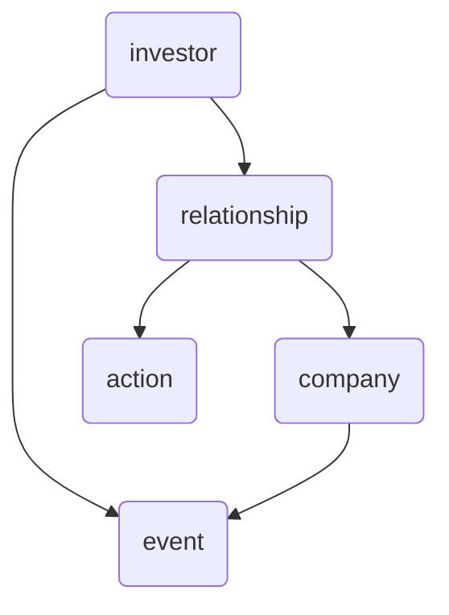
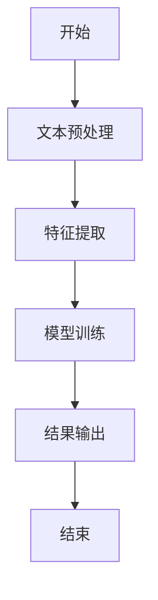
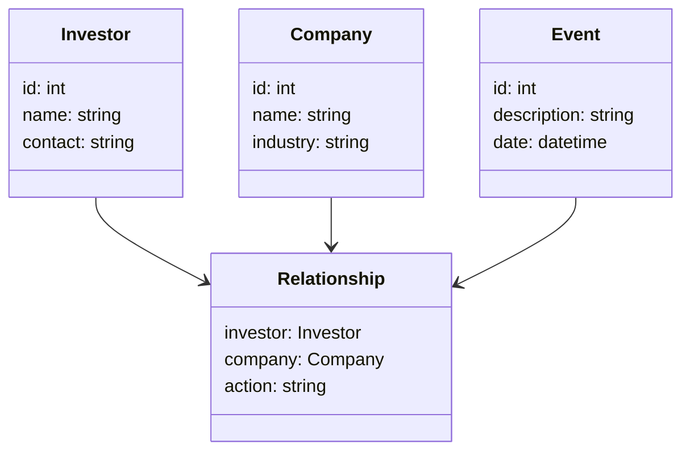
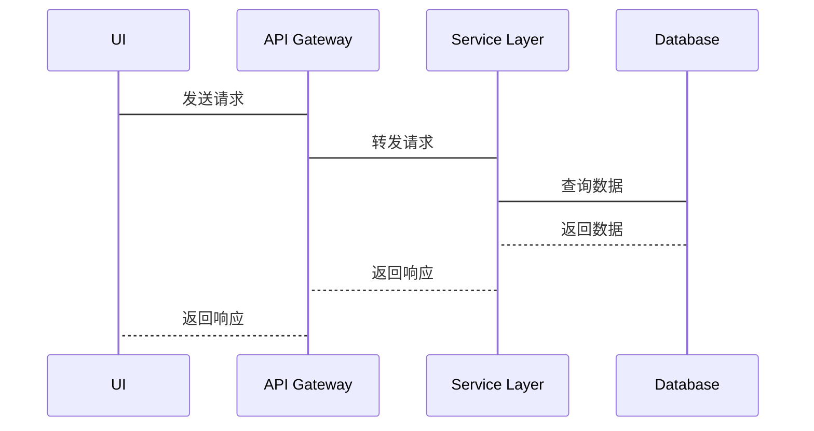

                 


```markdown
# 智能投资者关系管理平台

> 关键词：智能投资者关系管理平台、人工智能、投资者关系管理、自然语言处理、机器学习、数据挖掘、系统架构设计

> 摘要：智能投资者关系管理平台通过整合人工智能、大数据分析和自然语言处理技术，为企业投资者关系管理提供智能化解决方案，提升沟通效率和决策能力。本文将从背景、核心概念、算法原理、系统架构、项目实战等方面全面解析智能投资者关系管理平台的设计与实现。

---

# 第一部分：智能投资者关系管理平台概述

## 第1章：投资者关系管理的现状与挑战

### 1.1 传统投资者关系管理的痛点
- 信息孤岛问题
- 数据处理效率低下
- 沟通渠道单一
- 知识共享不足

### 1.2 智能化转型的必要性
- 数据驱动的决策需求
- 自动化服务的效率提升
- 个性化用户体验的追求
- 全球化背景下的跨平台协作

### 1.3 平台的核心价值
- 提升沟通效率
- 优化决策流程
- 提供个性化服务
- 实现数据驱动的洞察

## 第2章：智能投资者关系管理平台的定义与目标

### 2.1 平台的核心定义
- 采用AI技术，整合投资者关系管理的全生命周期
- 提供智能化的数据分析、自动化沟通工具和个性化服务
- 支持多平台、多语言的跨渠道协作

### 2.2 平台的主要目标
- 提供实时数据分析和预测
- 实现自动化沟通和知识共享
- 支持个性化用户需求匹配
- 优化投资决策流程

### 2.3 平台的边界与外延
- 边界：仅限于投资者关系管理领域，不涉及企业内部管理
- 外延：可与其他管理系统（如CRM）集成，扩展功能

---

# 第二部分：核心概念与技术原理

## 第3章：智能投资者关系管理平台的核心概念

### 3.1 自然语言处理在投资者关系中的应用
- 文本分析：识别投资者情绪、意图和需求
- 实体识别：提取公司名称、事件等关键信息
- 联系人分析：建立投资者与公司高管的关联

### 3.2 机器学习在关系管理中的作用
- 预测模型：预测投资者行为和市场反应
- 分类算法：识别投资者类型和需求
- 聚类分析：发现潜在投资机会和风险

### 3.3 数据挖掘在投资者行为分析中的价值
- 关联规则挖掘：发现投资者行为之间的关联
- 时间序列分析：预测市场趋势和投资动向
- 主成分分析：简化数据维度，提取关键特征

## 第4章：核心概念的属性特征对比

### 4.1 传统投资者关系管理的特征
- 依赖人工操作
- 数据处理效率低
- 信息孤岛现象严重
- 无法进行实时数据分析

### 4.2 智能投资者关系管理的特征
- AI驱动，自动化处理
- 多维度数据分析，实时洞察
- 跨平台协作，全球化支持
- 个性化服务，精准匹配需求

### 4.3 对比分析表

| 特性                 | 传统IR                | 智能IR               |
|----------------------|-----------------------|----------------------|
| 数据处理效率         | 低                    | 高                    |
| 自动化程度           | 低                    | 高                    |
| 信息共享             | 少                    | 多                    |
| 决策支持             | 基于经验              | 数据驱动             |

## 第5章：ER实体关系图架构

### 5.1 实体关系图


---

# 第三部分：算法原理与数学模型

## 第6章：自然语言处理算法原理

### 6.1 算法流程图


### 6.2 算法实现代码
```python
def preprocess(text):
    # 文本预处理代码
    pass
```

### 6.3 数学模型与公式
#### 余弦相似度公式
$
\cos{\theta} = \frac{\vec{A} \cdot \vec{B}}{|\vec{A}| |\vec{B}|}
$

---

# 第四部分：系统分析与架构设计

## 第7章：系统功能设计

### 7.1 问题场景介绍
- 投资者信息管理
- 沟通渠道整合
- 投资者行为分析

### 7.2 系统功能设计
- 投资者信息管理模块
- 沟通管理模块
- 数据分析与预测模块
- 个性化服务模块

### 7.3 领域模型类图


## 第8章：系统架构设计

### 8.1 系统架构图
```mermaid
graph TD
    UI --> API Gateway
    API Gateway --> Service Layer
    Service Layer --> Database
```

### 8.2 接口设计
- RESTful API接口
- 数据格式：JSON

### 8.3 交互流程图


---

# 第五部分：项目实战

## 第9章：环境搭建与核心代码实现

### 9.1 环境安装
- 安装Python和相关库（如NLTK、Scikit-learn）
- 安装Jupyter Notebook

### 9.2 核心代码实现
```python
from sklearn.feature_extraction.text import TfidfVectorizer
from sklearn.metrics.pairwise import cosine_similarity

def get_similar_documents(documents):
    vectorizer = TfidfVectorizer()
    tfidf = vectorizer.fit_transform(documents)
    cosine_sim = cosine_similarity(tfidf)
    return cosine_sim
```

### 9.3 代码解读
- 使用TF-IDF提取文本特征
- 计算余弦相似度矩阵
- 返回相似度结果

## 第10章：案例分析与实际应用

### 10.1 案例分析
- 某公司投资者关系管理平台的实施案例
- 系统功能的实际应用展示

### 10.2 项目小结
- 项目实施的关键点
- 经验总结和改进建议

---

# 第六部分：最佳实践与拓展

## 第11章：最佳实践

### 11.1 小结
- 平台设计的关键要素
- 技术选型的重要考虑因素

### 11.2 注意事项
- 数据隐私保护
- 系统性能优化
- 用户体验设计

### 11.3 拓展阅读
- AI在金融领域的应用
- 大数据分析技术
- 自然语言处理的最新进展

---

# 第七部分：总结与展望

## 第12章：总结与展望

### 12.1 研究总结
- 平台的设计与实现
- 关键技术的应用

### 12.2 未来展望
- 技术的进一步发展
- 应用领域的拓展

---

# 作者

作者：AI天才研究院/AI Genius Institute & 禅与计算机程序设计艺术 /Zen And The Art of Computer Programming
```

